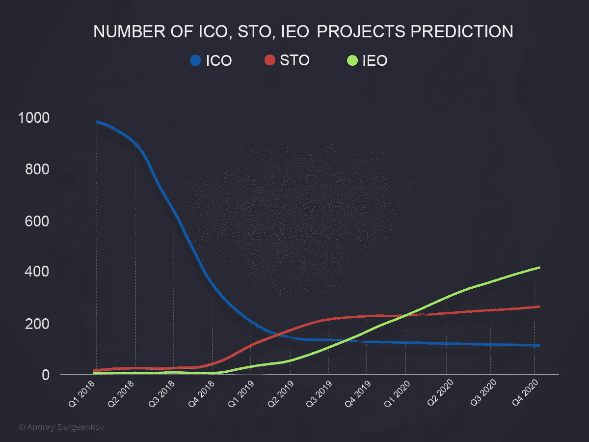
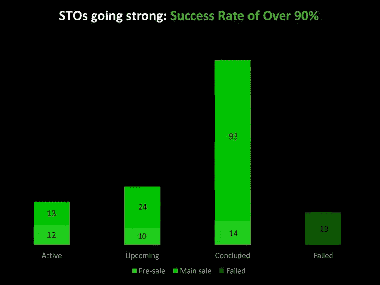
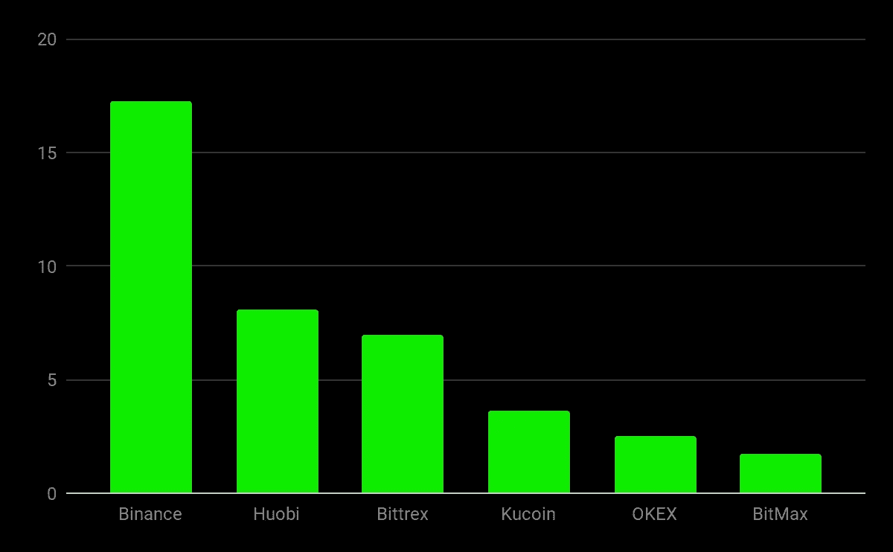

# 到 2019 年第四季度，sto 的数量可能会增加一倍，而 ieo 的数量几乎会增加两倍

> 原文：<https://medium.com/hackernoon/number-of-stos-may-double-while-ieos-will-almost-triple-by-q4-2019-a90a957d7c3f>

随着监管机构打击不受控制的区块链融资，我预计 2018 年 Q1 注册的 ico 数量将下降 90%，从 980 个下降到 2020 年第四季度的 100-110 个左右。与此同时，监管合规将允许 s to 和 ieo 蓬勃发展。提供安全令牌的初创公司**到 2020 年**将翻一番。与此同时，寻求通过 IEO **众筹的项目数量可能在未来 20 个月内激增 730%。**

即便如此，不可否认的是，对于加密初创企业来说，ICO process 是一个革命性的融资渠道，为他们的项目注入了活力。加密货币投资者不需要依赖常规的交易所上市，而是直接向投资者推销他们的想法。尽管如此，这个著名的过程在过去几年中已经获得了一个坏名声，主要是由于 ico 中欺诈的盛行。

最近一段时间，开发商开始寻找替代的融资渠道。这是一个有趣的旅程，见证了这个行业从婴儿期开始成长；经历了高潮和低谷。随着比特币似乎再次崛起，这是讨论这些替代品的好时机。

ICOs 确实创造了一种另类经济，这是我们从未见过的。投资者通过众筹向投资者出售代币，为他们的项目注入流动性。2017 年的 ICO 热潮给这个行业带来了数百万美元。然而，由于各种问题，包括对欺诈和不披露的担忧，以及对行业秩序的需要，迫使各管辖区的监管机构采取繁文缛节的措施。新的程序已经出现，使筹资过程多样化，并保持投资者的信心。这反过来又迫使合规部门在 s to 和 ieo 中创造出替代性筹资选择。

sto 创建了符合法规要求的令牌产品。因此，一个在特定管辖范围内进行 STO 的组织将注册为担保，附加到财产价值或公司股息上。因此，sto 对投资者来说更安全，因为他们可以获得财务收益。这可以是股息、股权、利润分享权和回购权的形式。

因此，sto 正在增加，甚至可能在未来 18 个月内增加一倍。目前有 179 家，但到 2019 年第四季度，这一数字可能会升至 270 家。许多权力下放的支持者认为这些规定是过度的和投降式的。将 STO 上市并满足所有监管要求需要时间，这可能是一个障碍。尽管如此，它们是确保增长的必要过程。

独立评价机构是这个领域相对较新的参与者。本质上是两全其美。你得到了 ico 的替代品，而没有 sto 的过多规定。交易所现在的业务是将 ico 上市，允许它们从一开始就进行交易。收取一定费用后，交易所列出透明且优质的项目，IEO 就此拉开序幕。

Bitmex Research [声明](https://blog.bitmex.com/initial-exchange-offerings/):

> 根据筹集的资金额，Q1 2019 年的 ICO 市场下降了约 97%。在这种相对具有挑战性的融资环境下，一些项目将 ICO 中的“C”改为“E”，或许是为了帮助筹集资金。至少就目前而言，在某种程度上，这似乎是可行的，今年迄今已筹集了近 4000 万美元。

你不会遇到投资者仪表板、路演或处理代币发行等 ico 的常规问题。此外，已建立的交易所通过用户数据库和市场信誉提供市场。因此，ieo 非常优秀，项目在创纪录的时间内实现了硬封顶。这意味着投资者很快就能获得回报。

**Top exchange platforms by IEO funds raised — US$m,** S*ource: BitMEX Research, IEO Launchpad websites, Coinmarketcap*

因此，此类项目正在增加，尽管 2019 年 Q1 有 28 个此类代币销售，但到 2019 年第四季度末，这一数字可能会达到 176 个，增长 620%。然而，到 2020 年第四季度，这一数字将增长 7.3 倍，达到 413 家。ieo 和 sto 的出现导致 ICO 数量下滑，到 2019 年底，它们可能会从 2018 年 Q1 的 980 多个下降到 100 个。

**总结 ieo 和 s to 是 ico 在市场中重要角色的必要替代。**它们都为加密货币的命脉带来了更大的透明度和可信度。sto 的法规遵从性和 ieo 的有效营销是该行业的资产。因此，更多的投资者将加入并留在加密列车上。