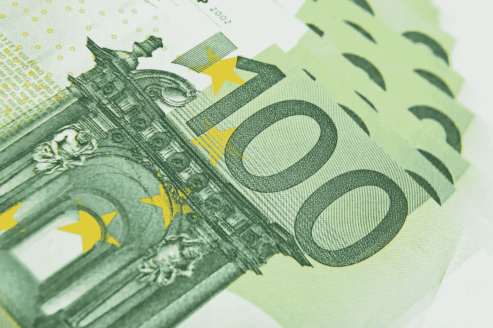
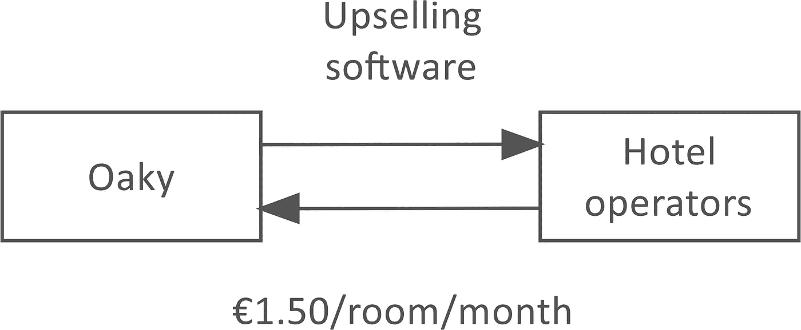
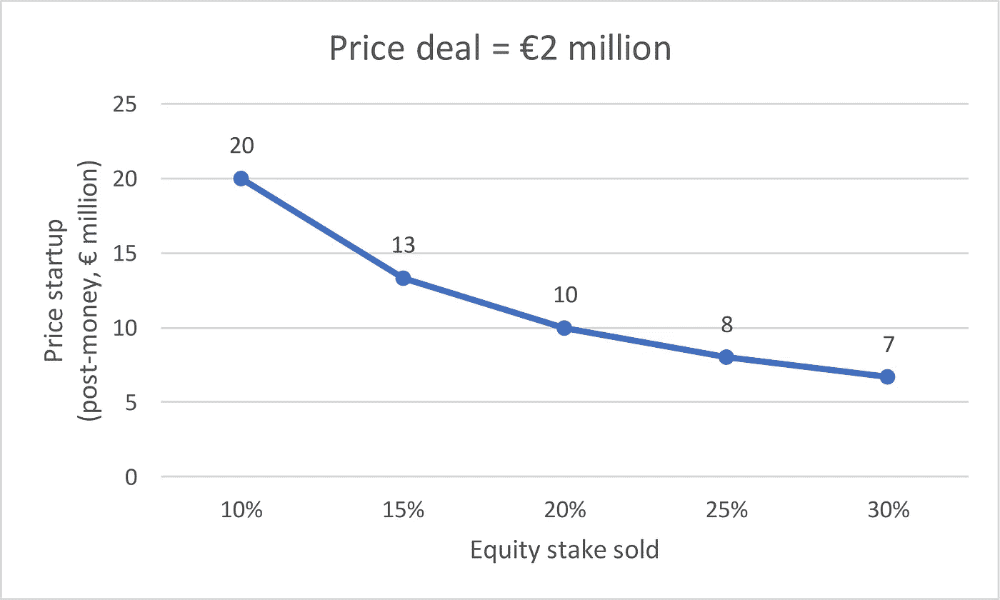
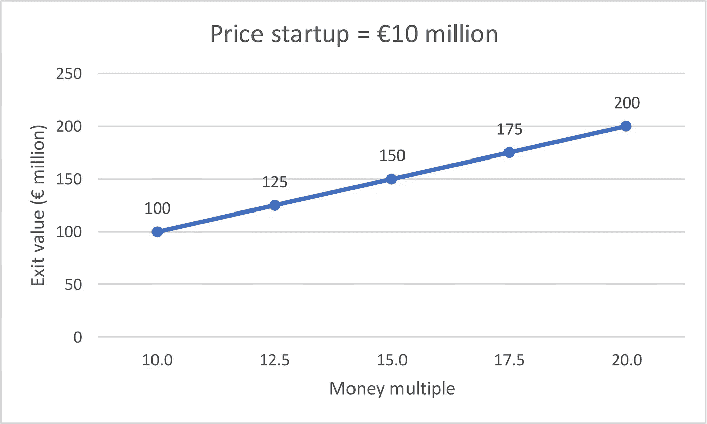
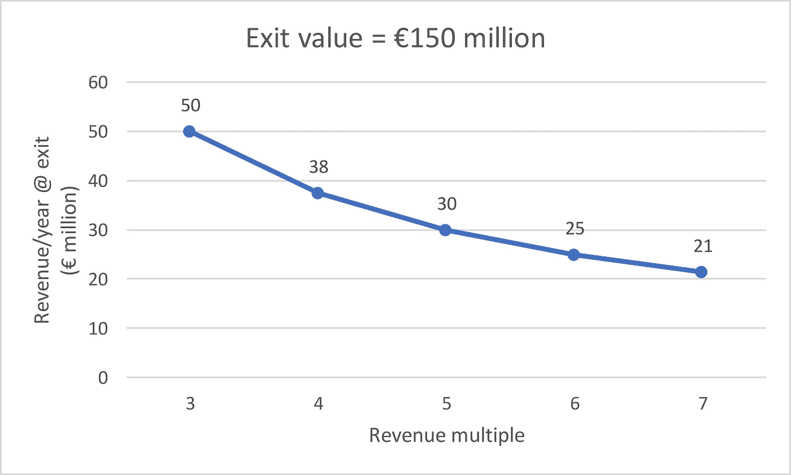
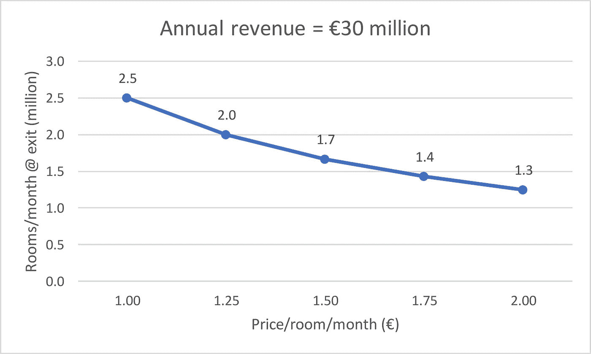

# Oaky 对€1000 万英镑的估值要求他们承包 170 万间酒店客房

> 原文：<https://medium.com/hackernoon/oakys-10m-valuation-requires-them-to-contract-1-7m-hotel-rooms-d9a3e80abb70>

荷兰[初创公司](https://hackernoon.com/tagged/startup) [奥凯](https://oakyapp.com/)向酒店运营商出售促销软件，平均每月每间客房[€](https://oakyapp.com/home/product/pricing/)1.50 英镑。

奥凯刚刚从天使投资人那里筹集了 200 万€。

# 估价

假设，根据可比交易，奥凯向天使投资者出售了他们公司 20%的股权。

启动价格=交易价格/出售的股权。

那么 Oaky 的定价是€200 万/20% =€1000 万后钱。

# 出口

基于可比交易，假设天使投资者希望获得 15 倍的投资回报。

退出价值=价格启动*资金倍数。

那么奥凯的€1000 万价格需要一个€1000 万* 15 =€1.5 亿的出场价值。

# 收入

假设，基于可比较的欧洲企业软件公司，Oaky 在退出时的交易收益是 5 倍。

出口年收入=出口价值/出口收入倍数。

那么奥凯的€1.5 亿退出价值需要€1.5 亿/5 =€3000 万退出时的年收入。

# 房间

奥凯酒店每个房间每月平均收费 1.5€。

出口每月房间数=出口年收入/ 12 /每月每间房间的价格。

那么奥凯的€3000 万出口年收入需要他们[承包](https://hackernoon.com/tagged/contract)€3000 万/ 12 / 1.50 =出口每月 170 万间客房。

背景:阿姆斯特丹目前拥有 35000 英镑的酒店客房。

*原载于 2019 年 2 月 6 日*[*venturevalue.com*](https://venturevalue.com/oakys-e10m-valuation-requires-them-to-contract-1-7m-hotel-rooms/)*。*