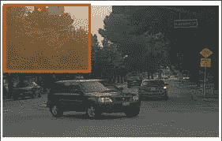
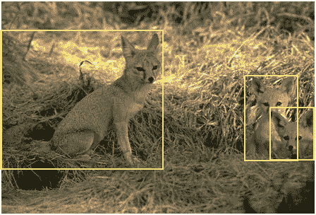
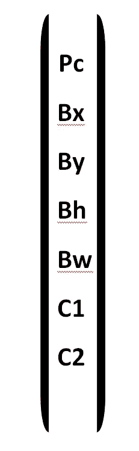
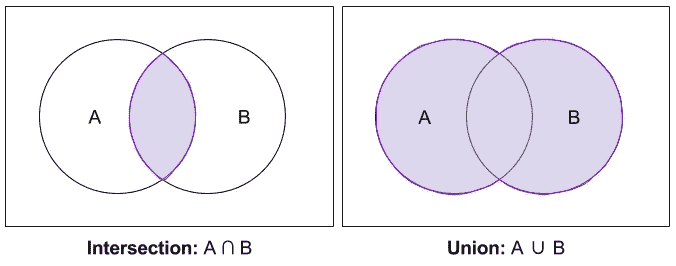
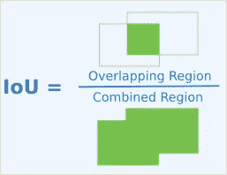
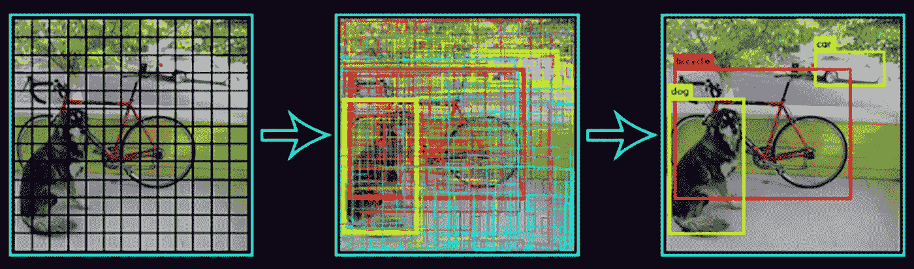
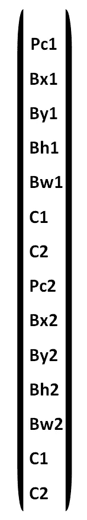
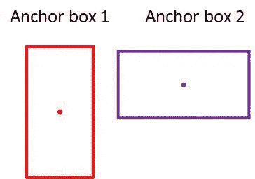

# 物体检测:理论

> 原文：<https://medium.com/hackernoon/object-detection-theory-69a01db5aab4>

## 曾经想检测图像或视频中的物体…可能是的！这就是你在这里的原因！这个故事分为两部分。这一部分涉及目标检测背后的主要理论。在下一部分中，我们将编写我们在这里看到的对象检测组件，并让它们工作(检测图像中的对象)。我们将不使用 Tensorflow 对象检测 API，而是使用 YOLO(你只看一次)算法编写我们自己的对象检测程序。我将分享我从 Coursera 课程学到的东西。现在，这个故事可能会很长(大事情需要更多的努力)。我想这将是介绍部分。

让我们来看看要求:

1.  YOLO v2 型号重量
2.  Tensorflow(当然！)

物体检测顾名思义就是检测图像或视频中的物体等等。我认为谷歌在这方面已经足够了。让我们不要浪费时间，直接进入一些真正重要的组件，让这个东西工作起来！

我们将了解物体检测的一些关键组件:

1.  滑动窗口算法
2.  装订的盒子
3.  并集上的交集
4.  非最大抑制
5.  锚箱

就是这样！最后，我们将使用这些概念来理解为什么 YOLO 算法工作得这么好。我们将研究滑动窗口算法，然后看看 YOLO 如何解决我们在滑动窗口中遇到的问题。

假设我们想要检测图像中的狗。因此，为了这个目的，我们建立了一个紧密裁剪的狗的图像(X)和相应的标签(Y)的训练数据集，标签为 0(没有狗)或 1(是的，一只狗！).

# 滑动窗口算法

现在，假设我们在上述数据集上训练了一个卷积神经网络，如果 dog 检测到，则输出 1，否则输出 0。现在我们想在真实的狗的图像上测试它们。因为我们的训练集有经过精密裁剪的狗的图像，我们的 CNN 从这些图像中学会了辨别是否有狗。这很好，因为我们有紧密裁剪的图像，但现实生活中的图像呢(假设我们从手机上点击一张照片)，这个图像不是紧密裁剪的。那么，我们如何让我们的有线电视新闻网告诉是否有一只狗。这就是滑动窗口发挥作用的地方。

我们定义一个大小为 w 的窗口，并把它放在一个区域上(当然是覆盖区域 w！)上图。然后，将这个输入区域输入到我们训练好的 CNN，并让它输出(0 或 1)。同样，我们在图像的每个区域重复这个过程(以一定的步幅)。因此，称之为滑动窗口。

Sliding Window

现在，一旦完成，我们就选择一个更大的窗口，并将其滑动到整个图像上，希望通过一次又一次地重复这个过程(增加窗口大小)，我们可能会在图像中得到一个狗大小的窗口，并让我们的 CNN 输出 1，这意味着我们在特定区域检测到了一只狗。这都是关于滑动窗口算法。

滑动窗口的缺点之一是计算成本。因为我们在图像中裁剪出如此多的正方形区域，并通过 CNN 独立运行每张图像。我们可以考虑使用更大的窗口，因为这将减少计算量，但以准确性为代价，小窗口将是准确的，但计算量很大。解决这个问题的一种方法是卷积实现滑动窗口。滑动窗口也不能精确定位目标，除非步距和窗口尺寸很小。

让我们看看 YOLO 如何帮助预测准确的边界框。

## 包围盒预测

边界框是包围图像中对象的框。如前所述，滑动窗口输出不太精确的边界框(因为它取决于窗口的大小)。现在，让我们看看另一种预测包围盒的方法。

Bounding Boxes (I know they are not dogs,but I guess fox or something else!)

想法是将图像分成网格(比如 w 乘 w ),然后为每个网格定义我们的 Y 标签，之前是(0 或 1)如下:

Pc:是网格单元内有物体的概率。它或者是 0 表示没有对象，或者是 1 表示有对象。

Bx:如果 Pc 是 1，那么 Bx 是边界框的 x 坐标。

By:如果 Pc 为 1，则 By 是边界框的 y 坐标。

Bh:如果 Pc 是 1，那么 Bh 是边界框的高度。

Bw:如果 Pc 是 1，那么 Bw 是边界框的宽度。

C1 : C1 指的是物体属于 C1 类的概率。

C2 : C2 指的是物体属于 C2 类的概率。

这里需要注意的一点是**类的数量可能会有所不同**，这取决于它是**二元分类**还是**多类分类。**

总的来说，如果一个网格包含一个对象(即 Px =1)，那么我们查看对象的类别，然后查看网格中该对象的边界框。

现在，有几个问题我们应该解决。

1.  要使用的网格大小是多少？
2.  哪个网格负责输出跨越多个网格对象的边界框？

通常，在实践中使用 19 乘 19 的网格，并且负责输出特定对象的边界框的网格是包含对象中点的网格。此外，使用 19 乘 19 网格的另一个优点是，对象的中点出现在两个网格单元中的机会更小。

这都是关于包围盒的预测。现在，让我们来谈谈另一个组件，称为并集上的交集。

## 并集上的交集

现在，早先我们谈论预测包围盒，但是这些预测有多精确。这就是交集大于并集的概念的由来。现在，我们可能想重温一下集合论。让我们快速浏览一下交集和并集:

假设，如果我们有两个集合 A 和 B，A 是一个机构中教师的集合，B 是同一机构中学生的集合。所以，他们的交集将是另一个集合 C，包含作为助教的学生，当然也是学生。他们的联合将是一个新的集合 C，其中包含集合 A 中的所有教师和集合 b 中的所有学生。

Intersection and Union

现在，什么是并集上的**交集？**

假设，我们的算法为某个网格中的对象输出了一个包围盒(比如 A)。所以，交集在并集上告诉我们的是我们的预测有多接近基本事实(比如 B)。我们将 A 和 B 的交集除以 A 和 B 的并集。如果 IOU 大于等于某个阈值(比如 0。5)那么预测被认为是正确的或好的，否则我们需要在我们的算法上做更多的工作。如果 IOU 是 1，那么它意味着我们的预测与地面事实完全相同。

IOU

这里需要注意的一点是，IOU 越大，预测就越准确，另一点是，按照惯例，我们使用 0。5 作为门槛。但是我们可以自由使用大于 0 的阈值。5.

下图描绘了这一想法:

Intersection over Union

恭喜你！我们走了很长的路。在我们准备写我们自己的物体探测程序之前，还有几个话题要谈。

## 非最大抑制

到目前为止，我们已经注意到，对于跨越多个网格的单个对象的预测，每个网格将输出其自己的带有概率分数的预测(我们之前已经看到过 Pc)。现在，这可能会使我们的预测看起来混乱，可能我们只是想看到一个单一的边界框的单一对象与最大概率得分(Pc)。

Non-Max Suppression

我们怎么做？

我们所做的是，在我们的网络输出的所有包围盒中，我们丢弃类别概率小于某个阈值(比如 0。5)在剩余的盒子中，我们选择具有最高分类概率的盒子(例如，假设盒子的名称为 A)。现在，我们用 A 计算剩余盒子的 IOU，并丢弃 IOU 大于或等于 0 的盒子。5(说)。

这里要注意的一点是，如果我们有三个职业，那么正确的做法是对所有三个职业都进行 **NMS** (非最大抑制)。

就是这个！最后，让我们看看什么是锚盒。

## 锚箱

从一开始，我们就遇到了一些问题，我们也确实解决了这些问题。只剩下一个问题需要处理，那就是我们如何在同一个网格单元中检测多个对象？

背后的思想是，我们可以定义两个边界框预测值或者甚至三个或更多的不同形状(因此它们能够检测不同大小的对象)(例如矩形、正方形等)，而不是用一个形状(例如矩形)来定义一个边界框预测值(Pc、bx、by、bh、bw、c1、C2…等)。

2 Anchor Boxes

该图像显示了具有不同边界框值的两个**锚框**的定义，因此具有不同的形状。

现在，我们如何决定哪个锚盒将被用于预测哪种类型的对象？

这里，我们再一次利用了并集上的交集。我们使用与物体形状具有最高 IOU 的盒子来进行预测。

所以，这都是关于锚箱的，我认为很重要。至此，我们大概总结出了目标检测所需的理论。恭喜你！完成一次伟大的旅程。这个故事的最后一个主题是关于 YOLO 算法。我们将总结我们从一开始就学习的所有组成部分，看看这些东西如何使这个算法优于任何其他算法！

在此之前，为了对锚定框有更好的直觉，请考虑这张图片:

Anchor Boxes

## YOLO 算法

对于 YOLO 算法，当准备我们的训练集时，我们将图像分成网格(主要是 19 乘 19)，并且我们为每个网格定义锚框(比方说每个网格 2 个锚框)。例如:19 乘 19 网格中的每个网格将输出两个锚框(两个预测)。Y 标签的大小将是 19 乘 19 乘 2 乘(5 +类的数量),其中 2 对应于锚框的数量，5 对应于边界框(bx，by，bh，bw)和 Pc。一旦我们用这种方法准备好训练数据集，我们就在 CNN 上训练它。这个 CNN 获取大小为(比如 100 乘 110)的输入图像，并输出大小为 19 乘 19 乘 2 乘(5 +类的数量)的图像

**预测**:这个 CNN 在输入新的图像时，会以上面指定的格式输出 Y 标签。这里需要注意一些事情，首先，对于没有发现任何对象的网格，Pc=0(当然！)并将为边界框输出一些随机值，类将为 0。第二，假设对象是矩形的，我们定义了两个定位框(一个是方形的，另一个是矩形的)，那么网络将输出矩形定位框的值，而方形将有一些我们不关心的随机值。

最后但并非最不重要的是，由于每个网格将输出两个边界框(因为锚框是两个，即矩形和正方形)，我们的输出将看起来非常混乱，因此为了处理这一点，我们将实现如上所述的非最大值抑制。

这就是我对这个故事的全部看法。我希望，我能够帮助你，增加你的知识价值。在下一篇文章中，我们将使用 Tensorflow 和 YOLO v2 设计出我们自己的物体探测程序。

**演职员表:[本故事中使用的图片]**

1.  [滑动窗口图像](https://blog.csdn.net/Snoopy_Yuan/article/details/80021504)
2.  [集合论形象](https://kevinbinz.com/2017/10/20/set-theory-intro/)
3.  [非最大抑制](https://www.codemade.io/super-fast-object-detection-computer-vision/)