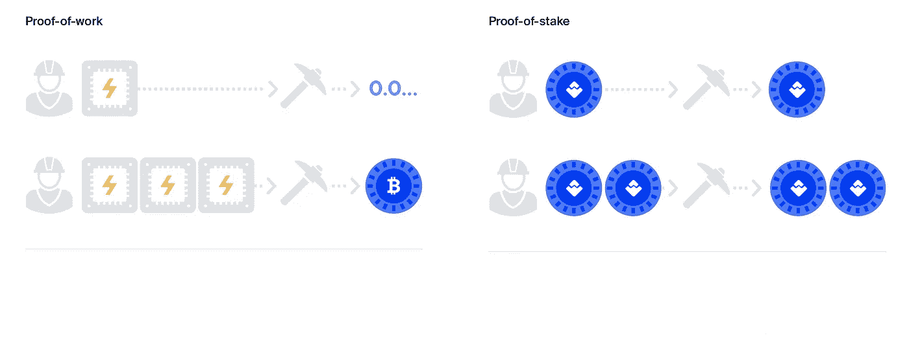
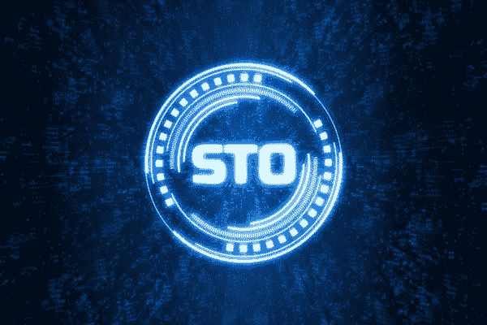
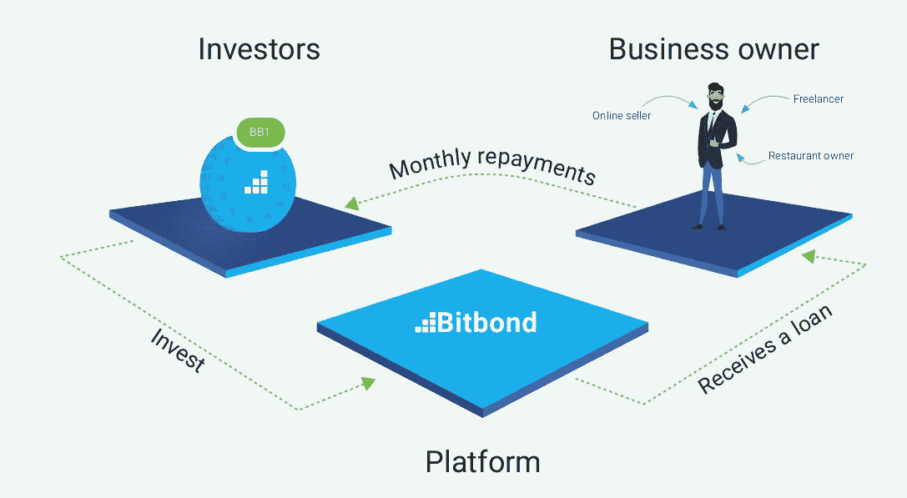

# 利用 PoW、PoS 和 sto 获得被动收入

> 原文：<https://medium.com/hackernoon/obtaining-passive-income-with-pow-pos-and-stos-8cee2d9238>

Photo by Freddie Collins — Pexels

加密货币进入我们的生活，改变的不仅仅是钱，还有太多的东西。加密货币的快速传播不仅改变了个人，也改变了公司的政策。

> 今年，世界上最大的公司，如微软、星巴克、亚马逊和脸书，开始将区块链技术集成到他们的系统中。

在区块链的改编迅速传播的同时，作为其镜像的加密货币的需求也与日俱增。截至本文，比特币的价格在 8000 美元左右。这个价格是牛市的开始，对目前占据 57%市场份额的比特币和其他替代币产生了积极影响。

在过去一段时间里，价格上涨开始满足加密货币投资者的乐趣。在进入牛市的这几天，我们应该如何评价自己的投资？

**区块链世界有哪些制作 crypto 的方法？**

**1)做交易员**:做交易员是一项不同的业务，与区块链科技无关。加密世界中的交易者通常是旨在通过利用价格投机和相应的交易来获利的团体。

这种风险相当大的业务，一般是在价格低、价格高的时候以加密货币的形式出现。就像同一个股票市场一样，它可能会根据关于加密货币的新闻、发展、投资和代币持有者的动向来提高或降低加密货币的价格。这行不是我个人比较喜欢的方法，比如读图，时刻保持警惕，向前看。

**交易时应该避免的 5 条黄金法则。**

1) *考虑将加密货币交易作为您财务问题的解决方案。*

2) *对 Twitter 电话、电报信号、YouTube shills 等盲目信任。*

3) *停止学习过程。*

4) *爱上你的包包。*

5) *变得狂妄自大，过于自信。*

几乎在每个学科中，与第三方分享和比较你的想法是一个好习惯。然而，有必要记住一个关键点:在你可以信任的有限的朋友群中做总是更好。这样你就能减少人群的噪音、不良意图和无知的制图。

**2)** **工作证明(挖矿)(PoW)** :挖矿法是获得加密货币哲学的开始。为批准区块链区块而获得的奖池将分配给那些帮助采矿的人。

在讨论这种方法的细节之前，需要注意的是，挖掘并不是一种简单的加密货币化方法。因为它需要强大的 CPU 和 GPU。还有电费和时间成本。如果你不确定你是否在专业地做你的工作，我不能说这是一种有效的赚钱方式。*那么我们所说的 Pos 背后的基本逻辑是什么呢？*

为了在对等的基础上实现分布式时间戳服务器，我们需要使用类似于 Adam Back 的 Hashcash 的工作证明系统，而不是报纸或新闻组邮报。

工作证明包括扫描一个值，当散列时，例如使用 SHA-256，散列以许多零比特开始。所需的平均工作量是所需零位数的指数，并且可以通过执行单个散列来验证。

对于我们的时间戳网络，我们通过增加块中的 nonce 来实现工作证明，直到找到一个值，该值为块的散列提供所需的零比特。

一旦花费了 CPU 的努力来满足工作证明，如果不重做工作，就不能更改该块。由于后面的块在它之后被链接，改变块的工作将包括重做它之后的所有块。

工作证明还解决了在多数决策中确定代表性的问题。如果多数是基于一个 IP 地址一票制，那么它可能会被任何能够分配多个 IP 地址的人所颠覆。工作证明本质上是一个 CPU 一票制。

多数决策由最长的链表示，它投入了最大的工作证明努力。如果大部分 CPU 能力由诚实节点控制，诚实链将增长最快，超过任何竞争链。

要修改过去的块，攻击者必须重做该块及其后所有块的工作证明，然后赶上并超过诚实节点的工作。我们将在后面展示，随着后续块的增加，速度较慢的攻击者追赶上来的概率呈指数递减。

为了补偿硬件速度的提高和随着时间的推移对运行节点兴趣的变化，工作验证的难度由以每小时平均块数为目标的移动平均值来确定。如果它们产生得太快，难度就会增加。

**总结一下**:

`**How Crypto mining works**`:

1.  一组事务被捆绑到一个内存池(mempool)中。
2.  矿工通过解决一个数学难题来验证 mempool 中的每个事务是合法的。
3.  第一个解决难题的矿工将获得新的加密奖励(区块奖励)和网络交易费。
4.  经过验证的内存池(现在称为块)连接到区块链。

**利益证明(PoS)** :与用户通过执行一定量的计算工作来验证交易并创建新块的工作证明系统不同，利益证明系统要求用户出示一定数量的加密货币单位的所有权。

新区块的创建者以伪随机方式选择，取决于用户的财富，也定义为“赌注”。在标桩证明制度中，区块被称为“伪造”或“铸造”，而不是开采。在该系统中验证交易并创建新区块的用户被称为伪造者。

赌注是一个人拥有多少硬币/代币。例如，如果一个人下注 10 个硬币，而另一个人下注 50 个硬币，下注 50 个硬币的人被选为下一个块验证者的可能性将是 5 倍。

Proof Stake 系统的一个关键优势是更高的能效。由于省去了能源密集型的采矿过程，与工作证明系统相比，利益证明系统可能是一个更加绿色的选择。

**安全令牌(STO)** :在清除安全令牌之前，区分实用令牌和安全令牌非常重要。实用程序令牌也称为用户令牌或应用程序令牌，用于访问公司的产品或服务。

公用事业代币的显著特征是它们不是为投资目的而设计的。如果配置得当，公用令牌不受证券法的约束。以太坊平台的 ERC-20 令牌是服务令牌。

证券由实物资产支持，如有限责任合伙企业的股票或商品。它们也受证券法的约束。证券代币将使公司股票的表现形式发生根本性的变化。此外，还有关于在房地产领域使用安全令牌的深入研究。

公司利用这种方式向投资者提供部分业务，以换取短期现金注入，帮助他们实现最新目标和计划。投资者也有权获得利润、股息和利率。

> *因此，安全令牌是一种加密令牌，它可以授权所有者分享企业利润、企业本身的股份或其他形式的回报，以换取他们自己的钱。*

**一个成功的 STO 例子:Bitbond**

我想给你举一个关于安全令牌的例子。这家总部位于德国的 token 已经是一家公司，并已为市场服务多年。德国监管机构 BaFin 获得的许可可在以下 [**招股说明书**](https://www.bitbondsto.com/files/bitbond-sto-prospectus.pdf) 中查看

Bitbond 成立于 2013 年，总部位于德国柏林，通过风险投资基金和商业天使的股权融资为 80 多个国家的中小企业提供贷款。

该平台已经资助了 3，000 多笔贷款。零售和机构投资者在全球范围内为商业贷款融资。德国第一家受联邦金融监管局监管的区块链公司

Bitbond 通过向借款人收取发起费和向投资者收取还款费来盈利:

该公司将发行 BB1 代币，票面价值为€1，代表一种债务工具(债券)，年利率为 4%，按季度分期支付。

此外，它将支付相当于 Bitbond GmbH 在其业务活动中实现的利润的 60%的可变利息额(如果有)。BB1 代币将在[恒星区块链](https://www.stellar.org/)上发行。债券的期限是 10 年。

`**Token holders receive**`:

投资 BB1 代币的风险高达总投资资本的损失。

1.  投资额的 1%，每年 4 次(每年 4%)
2.  每年支付的可变部分(Bitbond Finance 税前利润的 60%)

*BB1 回报情景*:€50，000 英镑投资的潜在价值，10 年后= €94，432 英镑

**总之**

因此，区块链科技有许多创收的方法。这些方法的一个重要部分是被动创收方法。进行必要的投资后，什么都不用做就能赚钱。

尤其是 PoS 系统是我最喜欢的系统之一。在大多数 PoS 系统中，你只有打开钱包才能获得收入。sto 也是最受欢迎的投资工具之一。不仅是我，全球很多加密货币投资者都把目光投向了 sto。

在我看来，投资来源和投资地点更加透明，更适应日常生活，并得到重要监管机构的支持，这使得这些项目更可靠，更受欢迎。

> **法律免责声明**:本文仅供一般指导，不构成法律建议。
> 
> **披露**:我不是任何加密货币或比特币债券的一部分。我也没有被 Bitbond 支付报酬或雇佣。投资时所有的风险都是你的责任。

更多信息请访问:[https://www.bitbondsto.com/?a=ZLKWCM](https://www.bitbondsto.com/?a=ZLKWCM)

# **来源**

1.  [https://hacker noon . com/consensus-mechanisms-explained-pow-vs-pos-89951 c 66 ae10](https://hackernoon.com/consensus-mechanisms-explained-pow-vs-pos-89951c66ae10)
2.  [https://hackernoon.com/what-is-proof-of-stake-8e0433018256](https://hackernoon.com/what-is-proof-of-stake-8e0433018256)
3.  https://hackernoon.com/top-10-trading-mistakes-942bf8276ee9
4.  [https://hackernoon . com/ico-vs-sto-all-you-need-to-know-the-new-you-need-know-on-the-crypto-world-54 a1a 43 a08d 6](https://hackernoon.com/ico-vs-sto-all-you-need-to-know-about-the-new-fundraising-method-in-the-crypto-world-54a1a43a08d6)
5.  [中本聪——比特币:一种点对点的电子现金系统](https://www.google.com/url?sa=t&rct=j&q=&esrc=s&source=web&cd=1&ved=2ahUKEwjOo8n6lJ7iAhUIAGMBHU-RBqUQFjAAegQIBBAC&url=https%3A%2F%2Fbitcoin.org%2Fbitcoin.pdf&usg=AOvVaw05-4mYD7EyyKjwcHh8i0Vw)
6.  [https://www.bitbondsto.com/](https://www.bitbondsto.com/)
7.  [https://www.bitbondsto.com/files/bitbond-sto-lightpaper.pdf](https://www.bitbondsto.com/files/bitbond-sto-lightpaper.pdf)
8.  [https://uzmancoin.com/utility-security-token-nedir/](https://uzmancoin.com/utility-security-token-nedir/)