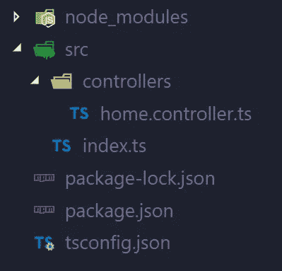
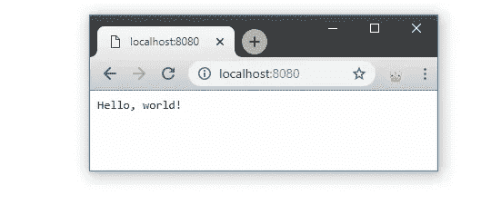
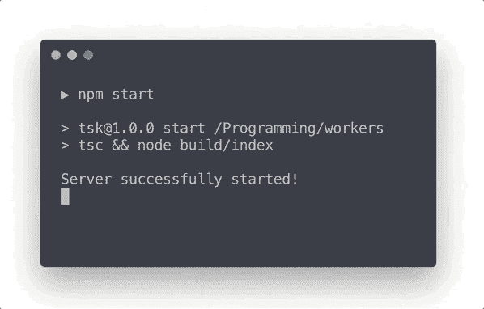

# Odi (Node.js)中没有努力的线程

> 原文：<https://medium.com/hackernoon/odi-threads-8bb9c3c94f6a>


# 介绍

多线程是同时执行两个或更多线程的过程。大多数编程语言都提供了一个 API 来方便地处理线程和并行性。开发人员可以专注于应用程序逻辑，而不是通信通道、同步或架构设置。

**节点 10.5** 增加了对带实验标志的`worker_threads`模块的支持。但是从**节点 11.7** 开始，此功能开箱即可使用。这是 Node 中多线程范例的良好开端。

`worker_threads`有巨大的潜力，所以 Odi 在早期就加入了对这个模块的支持。一如既往，Odi 的目标是提供方便、干净和极简的 API(用神奇的🧙‍♂️)，这样开发者就可以专注于开发，而不是设置。

# 项目设置

从上一篇文章中，Odi 获得了新的 CLI 命令，它初始化项目、定义脚本并安装所有需要的依赖项。

```
odi init
```

目前，只有几种选择:

```
-j, --jsx-templating  add jsx templates
-d, --database        add typeorm integration
```

## 结构

默认情况下，项目将具有以下结构。



在命令执行期间，将根据模板类型安装所有必需的依赖项。此外，如果提供了`-j`标志，那么**视图**文件夹将被添加到项目根目录中。

## 源文件

基本模板中有两个预定义的源文件。

包含基本 Odi 配置的`index.ts`文件。默认情况下，服务器端口设置为`8080`

和带有简单控制器定义的`home.controller.ts`文件。

从 Odi 和开发入手就够了。

## 剧本

目前，唯一的`npm start`脚本是现成的。在下一个版本中，`npm test`命令将可以使用 Mocha 和 Chai。

只需运行以下命令

```
npm start
```

这个脚本包括编译和实际运行，所以完成后，你可以很容易地打开浏览器，检查`http://localhost:8080`网址。



# 线

根据设计，节点是单线程的，具有非阻塞 I/O。这种方法有许多优点和缺点。主要优点是简单。开发者不需要关心线程操作、数据同步等等。但是任何资源密集型任务都会阻塞事件循环。

工作线程可以处理资源密集型操作，因此主线程始终可用。这对服务器端应用程序来说非常重要，因为任何阻塞任务都会延迟接受和处理新的客户端请求。

## 工作

让我们创建一个资源密集型(阻塞)函数，用于基于随机值生成获得答案(*是*或*否*)。

数学运算在大多数情况下是 CPU 密集型的，所以这是我们目标的一个很好的例子。使用`200_000_000`因子运行该功能需要花费 **5 秒**来执行。

## 阻塞

如上所述，任何阻塞操作在完成之前都不允许其他任务执行。

理解阻塞的最好方法是 UI。举个例子，让我们使用`Ora`库将简单的 CLI 加载器添加到我们的应用程序中。

首先，我们需要安装它。

```
npm install ora @types/ora
```

并按以下方式更改控制器方法。当处理程序被触发时，加载程序将出现在终端中，并一直旋转，直到我们的计算完成。此外，还将打印用于请求处理的时间。

让我们从浏览器启动我们的服务器和触发器处理程序。



加载器不旋转，因为我们的计算阻塞了进程。加载器必须有可能每隔`80`毫秒重新渲染一次帧，但是它不能这么做，因为事件循环被`getAnswer`调用阻塞了。

## 结果

让我们想象一下，我们在实际的应用程序中有这样的代码。处理程序将阻止接受和处理新的客户端请求。会严重影响客户端体验。此类操作必须放入其他应用程序或其他线程中。

# 工人

Odi 为多线程提供了方便的 API。开发人员不需要考虑任何类型的设置。

## 定义

在 Odi 应用程序和容器中定义`Worker`真的很容易。与`Service`定义有一些相似之处。我们来包装一下`getAnswer`函数。

定义只需要`Worker`装饰器。现在我们可以将它作为其他依赖项注入到控制器中。

注意，`await`关键字必须在 worker 方法调用之前添加，即使它不是异步的，因为线程之间的通信是以异步方式完成的。

仅此而已！🧙‍♂️该方法将在另一个线程中执行，结果将返回给主线程。

## 回顾

现在，可以测试带有 UI 加载器的示例了。


一切正常。加载器正在旋转，因为代码在另一个线程中运行，所以 UI 可以重新呈现帧。

## 支票

为了确保该方法是在另一个线程中处理的，只需以下面的方式更改`getAnswer`。

关于线程的信息将在控制台中显示。

## 比较

正如您在上面看到的，workes 设置和处理不需要任何配置。不需要像官方[示例](https://nodejs.org/api/worker_threads.html#worker_threads_worker_threads)中那样的事件发射器、事件处理程序、文件名等。Odi 关心初始化、消息传递、方法调用和错误处理。

## 限制

除了基本的，没有其他限制。请记住，worker 类似于另一个应用程序，因此运行时实例不能在不同的线程之间访问。另外，**依赖注入**容器不能通过线程访问，所以每个线程都有自己的容器。

# 用例

基本上，工作线程可以用于下一种方法:

1.  背景和计划任务
2.  资源密集型操作
3.  基于队列的处理

这些方法可以很容易地改进和适应每一个特定的需求，但所有这些方法都可以提高性能和应用程序的灵活性。

# 更大的

你可以在 GitHub 上查看 Odi repo。

[](https://github.com/Odi-ts/odi) [## Odi-ts/odi

### 🌪🌌自以为是的、声明性的、惯用的框架，用于构建可扩展的、可支持的企业应用程序和…

github.com](https://github.com/Odi-ts/odi) 

另外，还有一篇关于 Odi 的有趣文章。

[](https://hackernoon.com/building-chat-with-odi-node-js-e77ecd3891b2) [## 用 Odi 建立聊天(Node.js)

### 实时通信、项目设置、模板等等

hackernoon.com](https://hackernoon.com/building-chat-with-odi-node-js-e77ecd3891b2) 

感谢阅读！欢迎留下任何反馈、想法或问题。

[](https://odi.nolt.io/) [## Nolt 上的 Odi

### 让我们知道如何改进。投票表决现有的想法或提出新的建议。用 Nolt 收集和组织反馈

odi.nolt.io](https://odi.nolt.io/) 

如果你喜欢 Odi，只需在 GitHub 上支持我们的 start。🌟✨

继续阅读，更多有趣的东西将在下一次更新中推出！😉🧙‍♂️