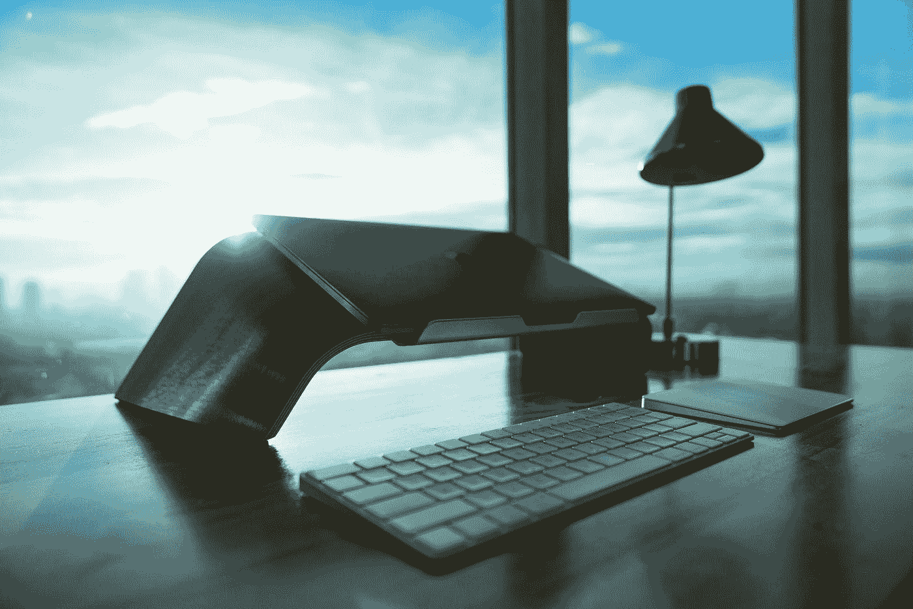

# 办公室效率小贴士:如何摆放一张桌子来更好地集中注意力

> 原文：<https://medium.com/hackernoon/office-productivity-tips-how-to-setup-a-desk-to-create-better-focus-7daa371dfbee>

## 3 个简单的技巧，你可以在办公桌上实施，而不用花一分钱

Photo by [JC Gellidon](https://unsplash.com/@jcgellidon?utm_source=medium&utm_medium=referral) on [Unsplash](https://unsplash.com?utm_source=medium&utm_medium=referral)

## 1.把分心的东西从办公桌上扔掉

我在这里直奔主题——不要把你的智能手机放在你的办公桌上！我在以前的公司学到了这一课，我用放在桌子上的立式手机充电器给我的智能手机充电。每次锁定屏幕上弹出新的通知，我的大脑都会立即将注意力转移到弹出的内容上。专注于完成一件事情是不可能的。

尽管关闭所有通知并将设备调至静音模式可能会消除这些干扰，但将它放在那里会给我的大脑一个潜意识信号，即有人可能在找我。

这同样适用于任何引发注意力的设备，如智能手表和活动追踪器(当我需要完成工作时，我会避免佩戴它们)，或者办公室里其他人可能随时使用的打印机。

我知道有时我们可能需要智能手机来完成特定的任务，但我总是会想到不会引起不必要的分心的替代品。例如，如果我需要在 30 分钟内准时参加一个会议，我会使用一个简单的数字手表来提醒我该走了，而不是使用我的智能手机或智能手表来做这件事。因为每当我打开智能手机时，我都会有查看电子邮件和其他社交媒体的意图。

## 2.保持办公桌简单整洁

这对以前和我一起工作的人来说可能听起来很奇怪，因为我的办公桌上有一大堆东西是出了名的。是的，我已经改变了，我是认真的，保持办公桌的布置尽可能的简单和整洁。

我从许多百万富翁和领导者那里学到了这一点，他们是我的人生导师。我意识到他们都有一个共同的趋势，那就是他们的办公桌上只有很少的几样东西，却有很大的桌面空间。我在我的办公桌上模仿了一下，发现我更加专注和有动力了。**这里的关键是有足够的桌面空间，我可以在上面画画和写东西。**

尽可能保持办公桌的整洁和简单需要自律，但这肯定是值得努力的，也是一个值得拥有的好习惯。

## 3.显示象征当前焦点的事物

我总是问自己:****我如何改变和创造一个工作环境来提高我的生产力？****

*我的答案是把我目前关注的事情放在我面前。我的桌子上通常有几个项目(5 个项目以内)，我称它们为我的焦点触发符号。例如，我把我的水瓶放在我的书桌附近，以提醒我定期喝水，以保持大脑清新健康。我还把现金纸币放在桌子上，提醒自己当前的重点是创造新的现金流。*

*我放在桌子上的所有物品都有特定的意义。每当我看到它们，它都会给我创造一种积极的力量和能量，让我为自己设定的目标而努力。*