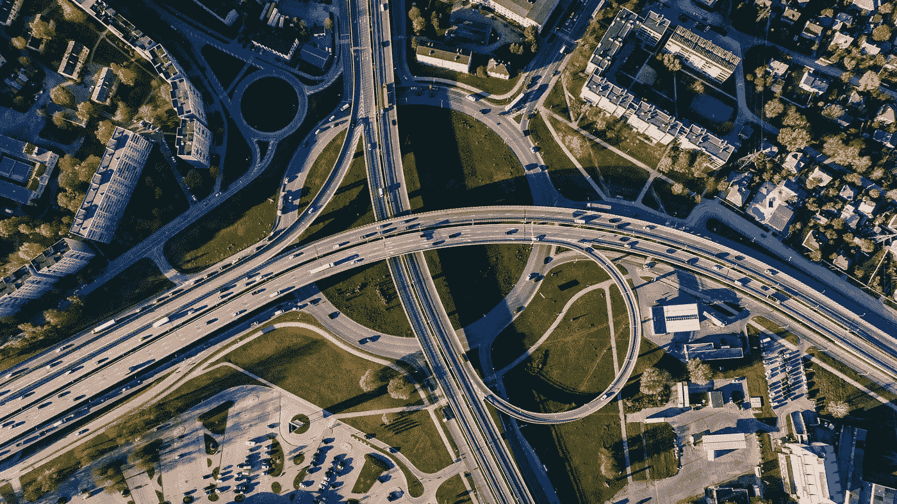
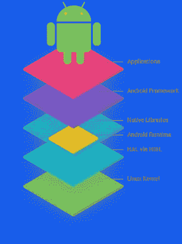
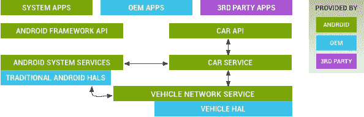

# 关于安卓汽车和为什么安卓会“赢”而苹果赚了全世界所有的钱

> 原文：<https://medium.com/hackernoon/on-android-automotive-and-why-android-will-win-while-apple-makes-all-the-money-in-the-world-538b423c9a7a>

让我们深入到一个每个技术人员都喜欢又爱恨交加的话题:Android vs. iOS。现在这已经被做了一百万次了，所以我还能增加什么呢？关于新 IT 战场之一的一些想法:移动性。

我说*机动性*是因为这是戴姆勒和宝马等巨头使用的术语。在这一点上，每个人都知道，从长远来看，移动的未来一方面是汽车共享，另一方面是自动驾驶以及优步和特斯拉这样的公司。所以，新的游戏是把人们从 A 带到 B，同时不要让他们以任何必要的方式离开你自己的平台。

这就是为什么戴姆勒收购了 MyTaxi，宝马用 Sixt(美国的 ReachNow)推出了 DriveNow，戴姆勒推出了 Car2Go，以及为什么宝马和戴姆勒将所有东西都融合到 ShareNow 中，希望对抗硅谷，并在未来不像空客和波音那样对最终用户保持匿名(你还记得你最后乘坐的是什么飞机吗？没错。)见鬼，只要你继续使用他们的应用程序，他们会很乐意把自行车租给你。想象一下，30 年前，你在斯图加特或慕尼黑对一名董事会成员这么说。

更具体地说，我将谈论 Android 慢慢占据上风的原因，因为它有耐心，并拒绝通过将汽车行业视为 IT 巨头的新超级市场来引入围墙花园体验。

输入苹果和谷歌。而谷歌的自动驾驶业务 Waymo 最近被摩根士丹利(Morgan Stanley)估值为 1750 亿美元。)美元，不只是真实的，我们只是不断听到所谓的苹果汽车的未经证实的谣言。苹果已经让[雇佣](https://www.engadget.com/2019/03/31/apple-hires-tesla-powertrain-lead/)和[解雇](https://venturebeat.com/2019/01/24/apple-cuts-autonomous-car-team-by-200-shifting-some-to-machine-learning-projects/)工程师为其汽车活动奔波了相当一段时间。在这一点上，我不确定“蒂姆·苹果”在做什么。与此同时，我们有 CarPlay 和 Android Auto，让我们面对现实吧——CarPlay 轻而易举地胜出。我爱 iOS，我爱苹果，我再也不会买安卓手机了。我们找到了。对吗？Fanboiii？不。我认为苹果在过去十年销售高利润的玻璃和钢板时忽略了这一点。尽管他们在成为 iPhone 公司方面取得了令人难以置信的成功，但他们并没有意识到，如果不在汽车行业等较新的操作系统市场提供替代产品，他们将失去多大的市场。进入安卓汽车；经常被误认为是 Android Auto——绝对不是一回事。我们一会儿将回到这一点。

目前，苹果制造了相当不错的软件，这让大多数用户感到高兴——没人在乎苹果在他们自己的硬件部门制造惊人的芯片——这让他们不断回到苹果(Mac 也是如此)。问题是，这种软件是专门附在极其昂贵的设备上的，不会很快变得更便宜。事实上，它们变得越来越贵，以至于苹果公司的一位高管杰夫·威廉姆斯(Jeff Williams)首次表示:

“我们不想成为一家精英主义公司[……]我们想成为一家平等主义公司，我们在发展中市场有很多工作要做。”

哇哦。现在想象一辆苹果汽车。没错。好的。但是，关于苹果“需要”购买特斯拉的[谣言](https://www.forbes.com/sites/andrewcave/2018/12/04/will-apple-buy-tesla-in-2019/#2690bb112e24)从未停止过。我也认为这是不现实的。为什么要在没有任何领域知识的情况下接管一个复杂的制造业务，以进入利润较低的市场？2018 年，通用汽车的净收入约为苹果净收入的 1/7。苹果将很快开始从他们的服务中获得比通用汽车更多的利润(如果他们还没有这么做的话),通过每年销售*数百万辆*汽车。

当苹果忙于收购 Beats 和推出 Apple Music，因为它想要 Spotify 的一些馅饼(顺便说一下，这是合理的，因为 iTunes 在这一点上对年轻人口几乎是死的)，谷歌利用其令人难以置信的开源超级力量与 Android 开源项目(AOSP)——这是一个核心的 Android 项目，允许原始设备制造商创建他们自己的 Android 版本——一起推出 Android Automotive。

如果你不熟悉 Android (AOSP)的基本架构，这里有一个简单的概述:

AOSP Architecture

作为汽车的最终用户，你可能不知道，与特斯拉及其 OTA(空中下载)更新相比，为传统汽车制造商构建新软件有多复杂。如果特斯拉从 90 年代就存在，他们的车载信息娱乐系统也会一样糟糕——技术债务是软件开发的一部分。我知道，我每天都在和传统汽车制造商打交道。谷歌明白这一点，知道 AOSP 在手机之外有多强大——它可以转变成任何新的或旧的硬件产品类别，因为谷歌不需要像苹果一样拥有硬件，所以天空是无限的。Android 运行时几乎总是完全相同的，如果我们谈论智能手表或汽车，你最终会改变你的硬件抽象层，这取决于你的设备类型和你的用户界面。

现在，我们又回到了我认为比 Waymo 更有价值的东西——Android Automotive:

Android Automotive architecture based on AOSP

从本质上说，谷歌为所有传统的 T2 T3 汽车制造商提供了一个解决方案——一个完全可定制的操作系统，可以在他们拥有的任何一辆汽车上运行，并能够实现自己的用户界面。如果制造商感兴趣，顾客也可以获得所有的谷歌服务。对谷歌来说是笔好交易。相信我，这对整个行业来说都是巨大的。每个人都在用它做实验。你可以让安卓开发者开始为你无聊的汽车打造应用，取悦全球千禧一代客户；*不需要*回到过去*谋杀*埃隆·马斯克。

这就是为什么 Android 会赢，或者事实上已经赢了:AOSP 不局限于专门的硬件，尽管苹果目前继续收获智能手机市场的利润，但谷歌的软件将吃掉整个世界。苹果不仅正在失去汽车市场，它还表明，如果不拥有整个价值链，它就没有竞争力，这将变得非常困难。对于这些企业巨擘来说，要想以接近过去十年的速度保持增长，他们需要在进入新市场时变得更有创造力，因为企业界的其他人已经意识到软件是一种魔力，可以转化为股东的现金。

**我其实很喜欢苹果的内部芯片团队，我很在乎。继续摇摆。*

来源:

https://source.android.com/devices/automotive, 2019 年 4 月 9 日

https://markets . business insider . com/news/stocks/Google-stock-price-waymo-worth-1000 亿-mor gan-Stanley-2018-8-1027439248，09.04.2019

https://9to5mac.com/2019/02/26/iphone-pricing-3/, 2019 年 4 月 9 日

https://www . CNBC . com/2018/10/31/general-motors-earnings-Q3-2018 . html，09.04.2019

https://ars technica . com/gadgets/2018/11/apple-services-reach-a-whopgible-a-100 亿美元收入-2018 年第 4 季度，2019 年 4 月 9 日

https://www . statista . com/statistics/267728/apple-net-income-since-2005/，2019 年 4 月 9 日

https://phys . org/news/2019-02-GM-strong-profits-good-sales . html，09.04.2019

照片由 [Aleksejs Bergmanis](https://www.pexels.com/@vividcafe?utm_content=attributionCopyText&utm_medium=referral&utm_source=pexels) 从 [Pexels](https://www.pexels.com/photo/aerial-photo-of-buildings-and-roads-681335/?utm_content=attributionCopyText&utm_medium=referral&utm_source=pexels) 拍摄