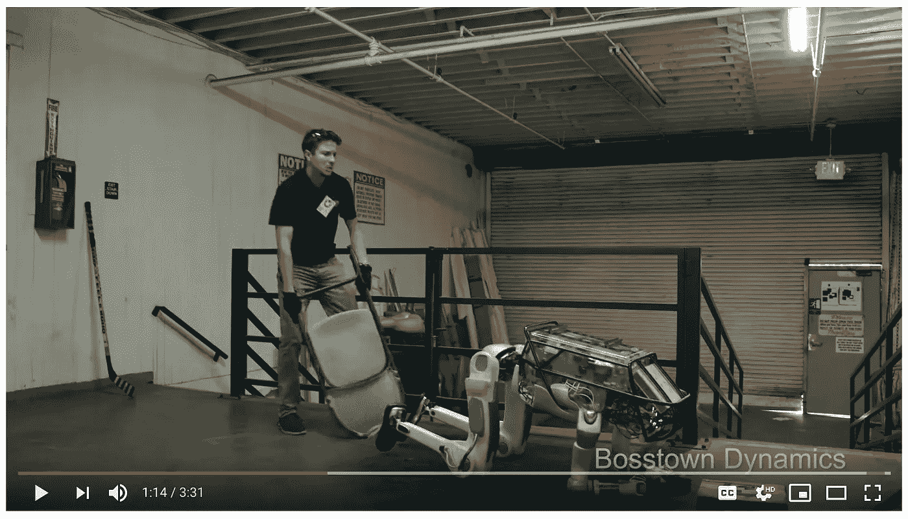
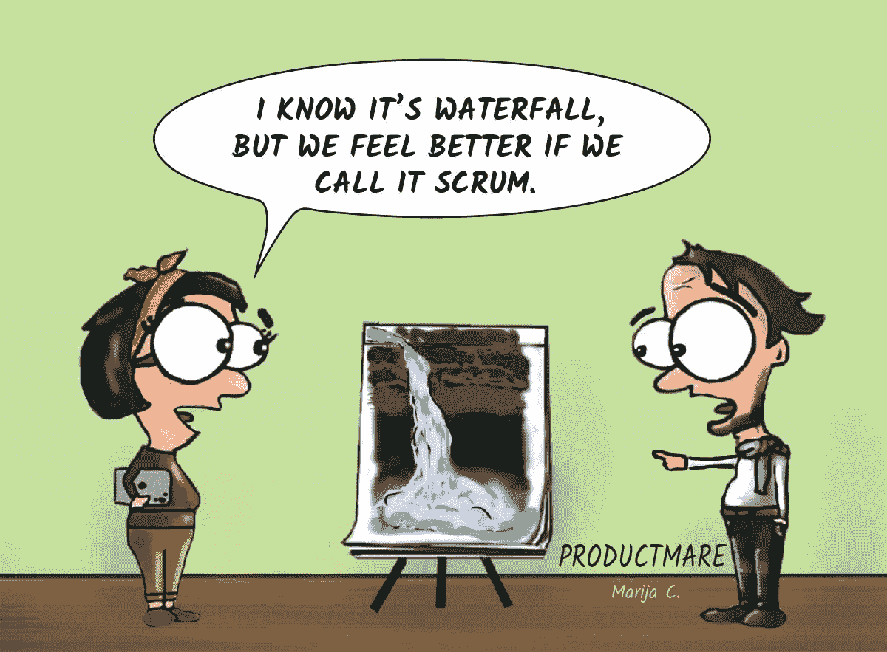

# 关于后稀缺、Scrum 和同情机器人🤖

> 原文：<https://medium.com/hackernoon/on-post-scarcity-scrum-and-feeling-sorry-for-robots-ad80c5e70c2>

## 如果你是一名技术人员，本周应该谈论什么:午餐时你需要听起来像个聪明人的所有自由意见

[human-robot relations making headlines this week](https://community.hackernoon.com/t/did-you-feel-sorry-for-the-robot/3536)

# 你好黑客们，

欢迎来到本周的必读科技读物，从[黑客日](http://hackernoon.com)开始...😺

## [15 部漫画中疯狂的 Scrum】](https://hackernoon.com/scrum-gone-wild-in-15-cartoons-cca23937a183)

**—由** [**玛丽娅**](https://hackernoon.com/@productmare)**(3min**[**读作**](https://hackernoon.com/scrum-gone-wild-in-15-cartoons-cca23937a183) **)**

## [岗位稀缺意味着什么](https://hackernoon.com/what-post-scarcity-means-7c4d653418f4)

**—由** [**琥珀**](https://hackernoon.com/@ambercazzell)**(9 分钟** [**读作**](https://hackernoon.com/what-post-scarcity-means-7c4d653418f4) **)**

> 后稀缺是一种商品生产超过需求的经济状况。

许多人表现得像后稀缺时代是一场白日梦。乌托邦童话和科幻小说的素材。恕我不能苟同。事实上，我认为在很多方面，美国已经有了。我们只是看不到就在我们眼皮底下的富足，因为我们当前的经济范式让它变得不可理解。 [**阅读更多**](https://hackernoon.com/what-post-scarcity-means-7c4d653418f4)**——**

## [PWAs:网络应用的未来](https://hackernoon.com/the-future-of-web-apps-772f5bd14d1c)

**—由** [**帕特丽夏尼尔**](https://hackernoon.com/@theneil248)**(6 分钟** [**读作**](https://hackernoon.com/the-future-of-web-apps-772f5bd14d1c) **)**

## [媒介的付费墙悖论](https://hackernoon.com/the-paywall-paradox-of-medium-3dd0a6a7bde6)

**—由******(9 分钟** [**读作**](https://hackernoon.com/the-paywall-paradox-of-medium-3dd0a6a7bde6) **)****

> **创建启用 Medium 付费墙的内容的作者被同一付费墙阻止阅读 Medium 的内容。 [**阅读更多**](https://hackernoon.com/the-paywall-paradox-of-medium-3dd0a6a7bde6)**——****

## **[如何知道你的账户到目前为止是否安全](https://hackernoon.com/how-to-know-whether-your-account-has-been-safe-till-now-a864b8098ef0)**

****—由**[**Sayinath**](https://hackernoon.com/@sayinath.k)**(4 分钟** [**读作**](https://hackernoon.com/how-to-know-whether-your-account-has-been-safe-till-now-a864b8098ef0) **)****

****

## **[缩小科技领域性别差距的 5 种方法](https://hackernoon.com/5-ways-we-can-work-to-close-the-gender-gap-in-tech-7d2c59f0a212)**

****—由** [**引书**](https://hackernoon.com/@ThePourquoiPas)**(9 分钟** [**读**](https://hackernoon.com/5-ways-we-can-work-to-close-the-gender-gap-in-tech-7d2c59f0a212) **)****

> **多元化并不等同于包容。 [**阅读更多**](https://hackernoon.com/5-ways-we-can-work-to-close-the-gender-gap-in-tech-7d2c59f0a212)**——****

## **为什么我们所知的网站正在步渡渡鸟的后尘**

****—by**[**Alex Partin**](https://hackernoon.com/@AlexPartin)**(5min**[**读作**](https://hackernoon.com/why-websites-as-we-know-them-are-going-the-way-of-the-dodo-19a253a13557) **)****

****

## **[这就是为什么开发者应该多写(文字，而不是代码)](https://hackernoon.com/here-is-why-developers-should-write-more-words-not-code-953e861938e2)**

****—由**[**amina . zilic**](https://hackernoon.com/@amina.zilic)**(4 分钟** [**读作**](https://hackernoon.com/here-is-why-developers-should-write-more-words-not-code-953e861938e2) **)****

> **运行您的代码并帮助一些人。写下来，帮助很多人。 [**多写点**](https://hackernoon.com/here-is-why-developers-should-write-more-words-not-code-953e861938e2)**——****

## **—关于[多写](http://contribute.hackernoon.com)这个话题:**

****

****get published on hackernoon —** [**contribute.hackernoon.com**](http://contribute.hackernoon.com)**

**提交你的科技故事并在 Hackernoon 上发表:[**contribute.hackernoon.com**](https://contribute.hackernoon.com/)**！****

# **哦，你听过我们最新的播客吗？**

****

## **[黑客正午从社区角度与林道斯穆克、首席运营官的黑客正午](https://www.youtube.com/watch?v=BjpGihnicIg&list=PLzeK5ofgBRBHge_HPxa-enbyP0zzY4bQG&index=46)**

# *****最后但同样重要的是:本周最著名的假货*****

**你有没有为那个机器人感到一丝遗憾？你不是一个人。**

****

> **机器真的值得同情吗？我们需要担心人们为机器人争取权利吗？这些大问题只会变得更加相关。**

## **[**讨论**](https://community.hackernoon.com/t/did-you-feel-sorry-for-the-robot/3536) **:****

****

**下次再见，
塔什，又名[黑客正午科技](https://medium.com/u/c7899df0cba0?source=post_page-----ad80c5e70c2--------------------------------)**

****

****join the discourse —** [**community.hackernoon.com**](http://community.hackernoon.com)**