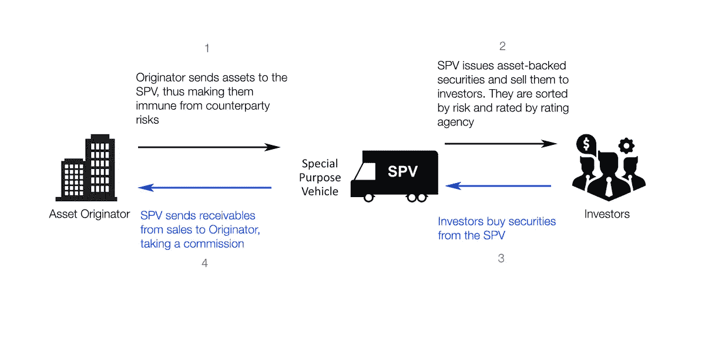
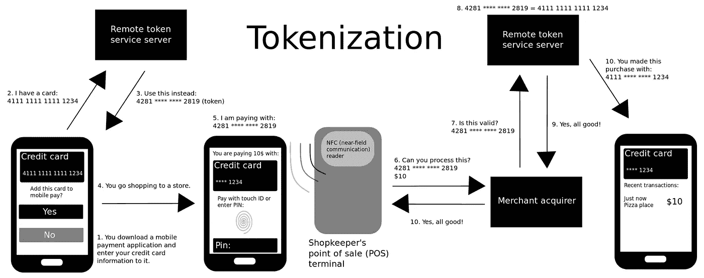

# 证券化和令牌化:一枚硬币的两面？

> 原文：<https://medium.com/hackernoon/on-securitization-and-tokenization-two-sides-of-the-same-coin-a92cc12b4344>

Original art is by [Borbay](https://www.borbay.com/2016/08/26/a-portrait-of-christian-bale-as-dr-michael-burry-aka-the-big-short/). A bit modified to my taste.

有太多的证据表明，历史是各种思想的不停旋转。这就像一个旋转的循环，首先出现，然后被否定，最后以一种全新的辩证方式上升。请原谅我对黑格尔的小小崇拜。

这部短片的出发点是我人生中第 n 次看《大短片》时的那种惊叹。在我看来，导致 2007 年经济危机的主要杠杆(在电影中有所描述)——即资产证券化——以及我每次在“下一代区块链和加密项目”白皮书中看到的资产令牌化，实际上是将流动性注入一切事物的相同过程，从而实现了新自由主义项目。抛开这种类似左派的批评，我设法澄清了两者之间的区别，并找出我的理解中是否缺少了什么。

我们走吧。

**证券化**基本上是将产生单独现金流的不同类型的低流动性资产(如抵押贷款、汽车贷款或信用卡债务)汇集在一起，并将它们的合计现金流(在某些基于评级的部分中)作为证券(即可交易金融资产)出售给第三方投资者的做法。虽然这种做法的历史可以追溯到 18 世纪，但从 70-80 年代开始谈论证券化是很常见的事情，当时这种做法被华尔街交易员复兴并赋予了新的生命。关于这一点，你可以在[迈克尔·刘易斯](https://en.wikipedia.org/wiki/Liar%27s_Poker)的一本巨著中找到更多。

说是一个人创造了证券化可能有点夸张。然而，也有很多人说拉涅利是实践之父。

[*商业周刊*](https://www.bloomberg.com/news/articles/2004-11-28/lewis-s-dot-ranieri-your-mortgage-was-his-bond) 称，随着抵押贷款支持证券的产生，“拉涅利的工作就是出售这些债券——而当时只有 15 个州承认抵押贷款支持证券为合法投资。凭借交易员的勇气和推销员的说服力，他做得更多，创建了 MBS 交易市场，并赢得了华盛顿为消除法律和税收壁垒而进行的游说活动。

总而言之，证券化是对抵押贷款和其他资产进行重新包装，制造流动性和吸引力都很强的金融工具。证券化的过程如下图所示[简化]:

在 2008 年危机之前，对银行来说，组合住房贷款并出售给投资者是一项非常有利可图的业务。危机的原因是许多借款人无力偿还债务(主要是次级抵押贷款，风险非常高)，它破坏了证券化市场，造成了数万亿美元的损失。总的来说，这是贪婪的胜利——贪婪的银行家出售了如此多的高风险抵押贷款，投资银行将它们与低风险抵押贷款混在一起，从而制造出一种“相对”稳定的产品，评级机构假装一切正常，并将这些产品评为 AAA 级，等等。

人性。

在金融危机爆发十一年后的 2018 年，全球结构性金融发行额每年增长约 18%，在 2018 年上半年达到约 5000 亿美元。美国、中国和欧洲都取得了可观的增长，而澳大利亚和拉丁美洲则出现了下滑。[在他们的报告](https://www.spratings.com/documents/20184/0/Global+Securitization+On+Pace+For+%241+Trillion+In+2018/8f1dd609-c3e8-469f-8b81-1175a7fe1bdb)中，专家预测到 2018 年底，全球证券化将继续增长至约 1 万亿美元。

如今，瑞士瑞信银行集团、U.S. Bancorp、Wells Fargo & Co .等许多公司都在测试分布式账本技术和区块链，以此作为促进资产证券化跟踪的方法。德勤[声称](https://www2.deloitte.com/us/en/pages/regulatory/articles/applying-blockchain-in-securitization.html)“区块链，连同智能合约，承诺改变证券化生命周期中的许多活动”。

**一点点 Likbez**

This is a simplified example of how mobile payment tokenization commonly works via a mobile phone application with a credit card. (Wikipedia)

最初，**标记化**用于描述敏感数据元素被不敏感的等价元素(称为标记)替代的过程，该等价元素没有外在的或可利用的意义或价值。也就是说，令牌化是一个类似于加密的过程，尽管不完全是。在某种意义上，它更像公钥和私钥——其中私钥是一个敏感的数据元素，公钥是一个令牌。示例—根据 PCI 委员会(所有信用卡和借记卡提供商必须遵守的信息安全标准)的规定，包含持卡人个人信息的支付卡号(PAN)必须进行令牌化，并替换为称为令牌的替代值。然后在交易等时使用这个令牌。

随着区块链和加密货币的出现，令牌化获得了更广泛的含义。根据[策略&](https://cryptovalley.swiss/4th-ico-and-sto-report-growing-less-but-growing-up/) ，资产令牌化描述了在区块链上将资产转换为数字令牌的过程。在“用于令牌化的潜在资产”下，列表:

*   法定货币(在过去的文章中描述的[)；](/@nickavramov/stablecoins-why-all-the-fuss-about-it-353a4c2f2b8d)
*   商品；
*   房地产；
*   艺术和收藏品等等。

那又怎样？

与过去的令牌化概念的区别是显而易见的:虽然上面例子中的令牌化 PAN 没有内在价值，但它不能交易。相反，用 ERC-20 以太坊兼容的区块链房子，抵押贷款，商业和其他东西可以很容易地在交易所上市交易。是的，确实有一些法律障碍，但是可能性已经产生了。

**美丽新世界**

在这个流动性、可交易性和令牌化的世界中，让我特别感兴趣的是:我们周围的资产甚至我们的时间(想想数字广告和你在脸书和 Instagram 上花费的时间)正在不断被买卖，我相信会出现更多的市场(像 OLX 或 Avito，但功能更广泛)，允许自动交易一切，从事物到与其他人相处的时间，更不用说我无法或不想想象的其他类型的可交易事物(黑市)。

George Michael — Freeek (2002)

我相信代币的可编程性(智能合约使之成为可能)为一个完全流动的世界开辟了一条道路。资产的各种组合(只要一切都变成资产)可以以最有效的方式(纳什均衡)进行排序、分组和出售。这里唯一无法解决的是风险，因此风险管理专家和博弈论毕业生(令牌经济学)在未来将会很受欢迎。

随着各种担忧的出现，我认为必须制定一种基本收入，因为未来的局面旨在刺激全球不平等。如果每个人的基本收入都是由他或她的不动产、储蓄、税收、估计的免费内容消费(你再也不用为网飞付钱了)组成的，那会怎么样呢？)等等，令牌化并组合成一种一般支持证券(GBS)，作为债券卖给一群高收入个人？如果出现数据泄露或人们拖欠债务怎么办？未来 10 年内应该消费的免费内容的债务？

这么多问题，这么少答案。

作者的观点可能与他的观点不一致。

个人咨询请发短信[电报](http://t.me/nickavramov)。