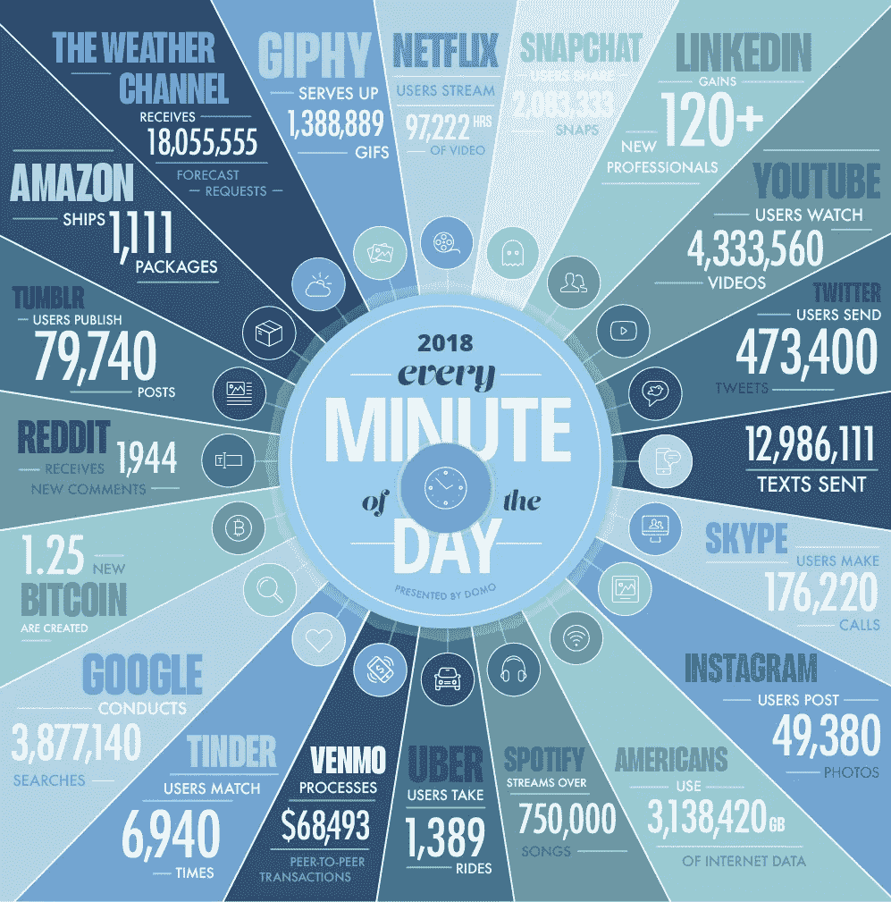
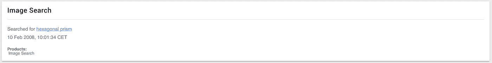
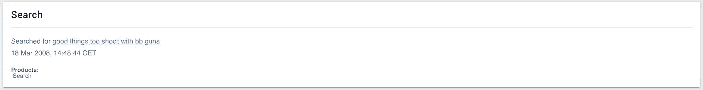
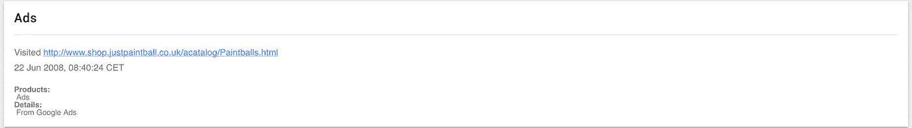
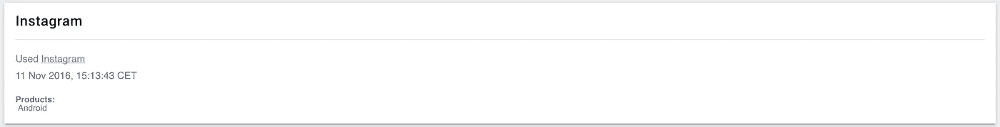
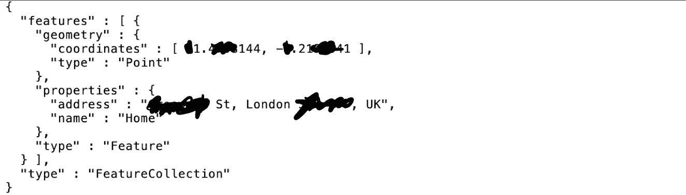
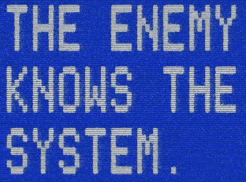

# 论隐私的本质

> 原文：<https://medium.com/hackernoon/on-the-nature-of-privacy-5fc343015d07>

## (秘密的秘密)

> 一首可以听的歌。

> 1 月 28 日是数据隐私日

指数趋势对人类来说难以置信地难以理性化。到目前为止，大多数人或多或少地意识到，我们正在快速接近一个越来越复杂的临界[阈值](https://www.goodreads.com/book/show/36204285-origin-story)，我们不太可能从这个阈值返回。但这意味着什么呢？

人类操纵环境的能力越来越熟练，这让我们以惊人的速度通过了主要的进化关卡。我们储存、专门研究和交流知识的能力是这背后的古腾堡秘籍。我们必须用对数来描绘这些变化率的事实令人震惊。狩猎采集时代持续了几百万年；农业时代，几千年；工业时代，几百年；信息时代已经过去几十年了。我们不知道明天会发生什么，但数据显然是首要因素。

2010 年，世界第一次达到了惊人的 [zettabyte](https://en.wikipedia.org/wiki/Zettabyte) 数据。

> 1 ZB = 10^21 字节= 1 000 000 000 000 000 000 000 字节= 1000 EB = 100 万 Pb = 10 亿 TB = 1 万亿 GB。

2018 年，我们达到了 33 ZB 里程碑。仅在八年内，我们就设法产生了比人类历史记录多 32 倍的数据。更令人担忧的是，到 2020 年，我们每人每秒将产生 1.7 兆字节的数据。**预计到 2025 年** **，地球上的总数据量将达到** [**175 兆字节。**](https://www.seagate.com/files/www-content/our-story/trends/files/idc-seagate-dataage-whitepaper.pdf)

在一个指数级数据生产、[模因战](https://en.wikipedia.org/wiki/Memetic_warfare)、[政府监控](https://www.wired.co.uk/article/china-social-credit-system-explained)以及[我们委托的人对数据的严重错误处理](https://en.wikipedia.org/wiki/Facebook%E2%80%93Cambridge_Analytica_data_scandal)的世界里，我们很少有人真正参与明智的数据实践，这令人深感担忧。为什么我们不够关心去改变我们的行为？在承认奥威尔式的劝诫不仅仅是虚构之前，我们还需要多少警示信号？

我最近决定调查谷歌的数据收集和存储服务到底有多彻底。事实证明，仅仅从一个谷歌账户，他们就拥有超过 100 千兆字节的个人数据。345，081，600 秒，一次又一次，他们记录了我自 2008 年 2 月 10 日以来的 3994 天中的每一个行动。我当时**九**岁！其中一些相对有趣:

其他的就不那么幽默了……比如我发现我访问过的几乎每个页面都包含谷歌或脸书的广告追踪器。

或者你每次打开或关闭手机上的应用程序都会被记录下来。

或者我近 6 年的整个 GPS 定位历史(直到我开始关注这些事情)已经被记录，以及频繁访问的坐标，例如“家”。

大约三年前，我开始认真考虑我在网上提供的数据，并审查所有账户的所有设置，以确保我能更好地控制我的数字踪迹。话虽如此，在上述发现后，我有点担心。那时候我怎么会知道这些事情？谷歌应该让人们更容易知道他们的选择退出跟踪服务吗？责任在哪里？

我个人认为，最终的责任应该在个人这一端。我们生活在一个奇怪的时代，受害者身份似乎得到了积极的鼓励，而责任却变得模糊不清。与其把时间浪费在抱怨和追捕那些可能伤害了你的人上，为什么不向前看，把注意力放在预防措施上呢？我们不能指望那些构建了我们今天使用的服务的特别聪明的年轻技术人员能够预料到事情会以他们现在的方式发展。互联网仍然非常年轻，参与其中的每个人都有责任帮助塑造我们想要的样子。2017 年初，蒂姆·伯纳斯·李爵士在网上写了一封精彩的公开信，概述了我们面临的一些最大挑战。我想礼貌地提醒其他人，大多数跟踪服务往往很容易从退出[。](https://myaccount.google.com/activitycontrols)

> “我们不能指望政府、公司或其他大型匿名组织出于善意给予我们隐私。谈论我们对他们有利，我们应该期待他们会说话。试图阻止他们的言论就是与信息的现实作斗争。信息不仅仅想要免费，它还渴望免费。信息扩展以填满可用的存储空间。信息是谣言更年轻、更强大的表亲；信息比谣言跑得快，眼睛多，知道的多，理解的少。”—埃里克·休斯

我们需要鼓励就如何收集、存储和使用数据进行坦率的讨论。虽然它们经常交织在一起，但我们必须在**安全性**和**隐私**之间做出重要区分，让我们将它们定义如下:

> ***安全性—*** *保护数据免受未经授权的访问。*
> 
> ***隐私—*** *如果 *被访问，从数据* **中导出信息的限制。***
> 
> *我们还可以把隐私定义得更宽泛一点:* [**有选择地向世界揭示自己的力量**](https://www.activism.net/cypherpunk/manifesto.html) ***。***

虽然计算机安全通常是一个高度成熟的领域，有各种精心设计和测试的实践、协议和标准，但隐私领域仍有许多不足之处。我们可以将隐私分为两个概念阵营:身份依赖性和 T2 独立性。我觉得这个框架在对一个人的个人隐私做决定时会非常有用。

在启蒙时代，[社会契约论者探索了关于个人和国家/政治秩序之间关系的观点。人们普遍认为，后者的存在是为了保护前者的自由。有人可能会说，总的来说，在过去的几百年里，这个目标已经实现了。不幸的是，一个新的竞争者进入了拳击场。从历史上看，相关国家无法轻易保护个人自由的敌人很少。然而，现在分隔威胁者和寻求监管者的技术鸿沟并不小。迄今为止，相关现任者似乎打算合作。但是当国会和议会开始提出正确的问题时，我们必须注意他们自己没有得到太多的想法。](https://en.wikipedia.org/wiki/Social_contract)

当然，政府为其公民提供一些身份相关的数字服务，这种情况不太可能改变。另一方面，我们交换这些信息的方式可以。现代密码学的魔力很少被大多数人所欣赏。我们已经从古罗马的凯撒密码走了很长一段路，事实上，到目前为止，我们现在可以验证信息而不透露它是什么。零知识证明是我们在询问关于我们希望隐私在一个约万亿字节的世界中是什么样子的问题时应该开始考虑的技术类型。

除了政府身份相关的数字服务之外，在任何情况下都不可能证明大多数在线服务所要求的窥探水平是合理的。大型数据集是一座金矿，这已经不是什么秘密了。我们必须尽可能减少我们的足迹。365 年 7 月 24 日的地理定位，为同质人物描述绘制认知结构的社交媒体，嵌入整个网络的广告追踪器，隐藏在电子邮件中的[像素追踪器](https://en.ryte.com/wiki/Tracking_Pixel)——这些都不应该成为我们网络体验的一部分。在可能的情况下，我们应该使用假名数据，这样线索就不会直接指向我们。我们的目标应该是 ***在不破坏浏览体验*** 的情况下，尽可能展示最少量的真实数据。事实是，我们的数据足迹都不是我们所理解的短暂的、非物质的东西。它们是现代世界中经久不衰的固定装置。未来是不确定的，但数据持久性是确定的。

## 怎样做才不会矫枉过正？

*   使用不存储日志的 VPN
*   使用 [DuckDuckGo](https://duckduckgo.com/) 作为你的默认搜索引擎
*   在浏览器上使用[子块原点](https://github.com/gorhill/uBlock/)
*   使用 [Firefox Quantum](https://support.mozilla.org/en-US/products/firefox) ，启用 [DNT](https://support.mozilla.org/en-US/kb/how-do-i-turn-do-not-track-feature) 并禁用第三方 cookies
*   手机不使用时禁用 GPS 功能
*   [阻止电子邮件中的像素跟踪](https://www.wikihow.com/Stop-Email-Tracking)
*   [禁用所有谷歌追踪服务](https://myaccount.google.com/activitycontrols)
*   [禁用谷歌广告](https://adssettings.google.com)
*   禁用手机上的脸书定位服务
*   [禁用脸书广告](https://www.facebook.com/ads/preferences)
*   [禁止非关键应用的访问](https://myaccount.google.com/permissions)
*   [下载数据转储并请求删除](https://takeout.google.com/settings/takeout)
*   在网上为所有不需要身份验证的东西建立一个带有虚假信息的假名电子邮件
*   尽可能使用[扔掉电子邮件](https://temp-mail.org/en/)

> **我们在生活中失去的生命在哪里？
> 我们在知识中失去的智慧在哪里？
> 我们在信息中丢失的知识在哪里？**
> 
> — [T.S .埃利奥特](http://rjgeib.com/thoughts/information/information.html)