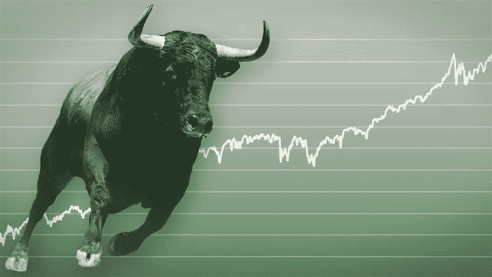
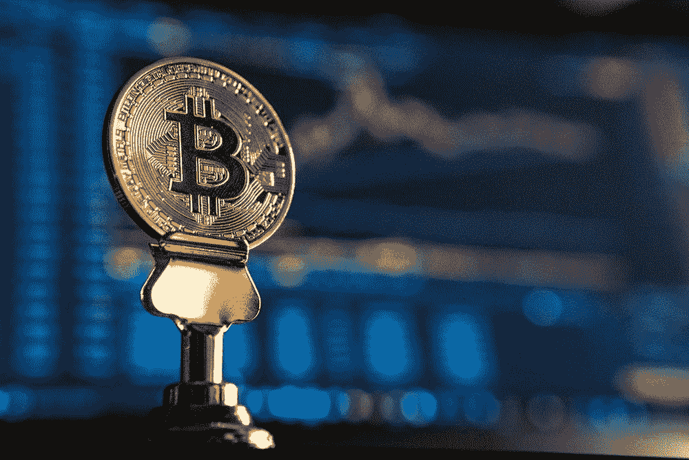
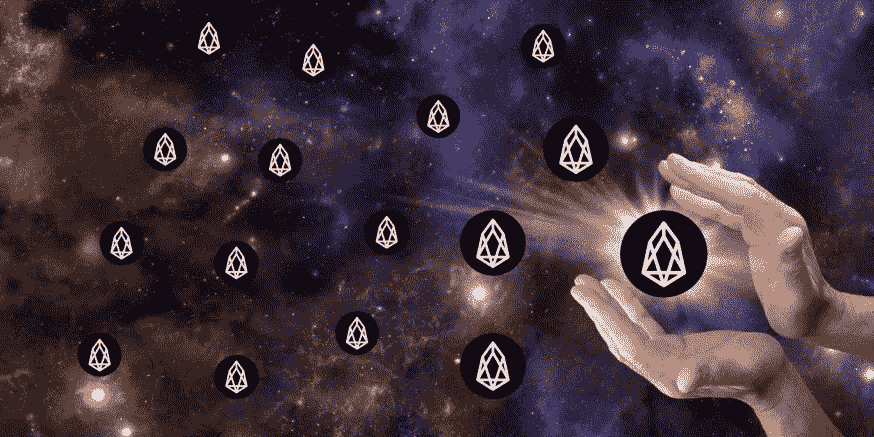
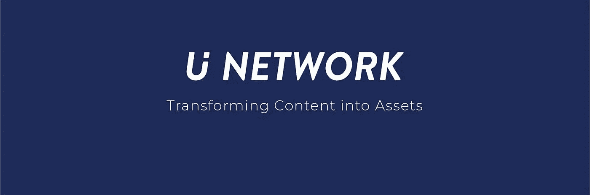

# 代币经济和代币价格:3 个最佳实践

> 原文：<https://medium.com/hackernoon/on-token-economy-and-token-price-3-best-practices-e023f37c5023>

是什么让代币价格持续上涨？我总结了 3 种代币价格上涨的逻辑。

代币价格背后的理性代币经济模式是什么？一些加密货币的价格如何长期保持稳定？

[**维塔利克**](https://vitalik.ca/general/2017/10/17/moe.html) 曾在博客中提到他对基于费雪公式的中间交换权标的估值: **M * V = P * T**

这里:

> — M 是硬币的总数；
> 
> — V 是货币流通速度，即一个普通代币每天转手的次数；
> 
> — P 是价格水平，这是用代币表示的商品和服务的价格，所以它实际上是货币价格的倒数；
> 
> — T 是日交易量，是每天交易的经济价值

简单来说，如果有 M 个代币，每个代币每天转手 N 次，那么就有 M * N 个代币的价值对应的每天的经济交易规模。如果日交易量为 T，那么代币价格为 T / (M * N)，平均价格水平 P 为 T 的倒数:M * N / T。

如果我们简化分析，假设 H = 1 / V，那么 H 代表用户持有令牌的平均时间跨度。设 C = 1 / P，所以 C 代表代币价格。

那么 M * V = P * T 可以简化为 **M / H = T / C 或者 M * C = T * H**

我们可以得出一个简单的结论，纯粹从市场的角度来看，当其他基本条件(M 和 T)保持不变时，**一个代币在用户手中停留的时间越长(H)，代币价格就会涨得越高。**

当然，以上是静态模型。事实上，需求和交易量一直在变化。

事实上，这是美国股市这些年繁荣的一个重要原因。**美股市场大量机构投资者甚至个人投资者长期持有股票。保持时间通常以年计算。**

> 现在我们可以谈谈我们的主要话题:代币价格上涨背后的逻辑。

从高层面来说，我们都知道，创造更多的代币使用场景，增加代币需求，当然有助于推动代币价格的上涨。

从代币工程的角度来看，具有良好代币经济设计的成功区块链项目大致可分为三类:

# **第一类是带有挖掘逻辑的令牌:**

当代币具有良好的基本面时，采矿代币提供了代币价格上升的通道:

代币价格增长的反馈过程:**发现矿币价格为 A - >价格上涨- >更多矿工加入- >采矿成本上升- >采矿成本上升到高水平**

有了良好的基本面，具有挖掘逻辑的代币提供了良好的价格支撑。

价格支撑的反馈过程是这样的:**币价下跌- >价格跌至开采成本- >矿商惜售抛售压力降低，信徒提供支撑- >币价止跌**

矿工越多，系统就越稳定。随着开采成本的持续上升，币价得到了较高的支撑，开采成本的底部开始上升。

长期来看，只要反馈循环继续下去，比特币的价格(无论作为数字黄金还是作为点对点版本的电子现金)都会有越来越高的价格支撑。

当然，挖矿并不是所有代币都要拿的。在某些情况下，一次 51%的攻击可能会毁掉一个项目的全部价值。只有当区块链项目本身的价值持续增长时，挖掘逻辑才是有效的。

**比特币**的完美之处在于，矿工越多，系统越稳定，比特币的网络效应就越明显，这个事实本身就抬高了比特币网络的价值。

# **第二类是委托了利益证明的代币**

从某种程度上来说， **EOS** 的超级节点就像矿工一样，为了获得采矿权，超级节点需要在市场上购买 EOS 令牌来获得采矿权；EOS 会将 EOS 额外发行的一部分分配给这些超级节点。

要知道，由于 EOS 令牌的锁定，参与超节点选举是有资本成本的。此外，超节点的一些 EOS 令牌被借用，上述成本在一定程度上是挖掘成本。硬件成本、运营和营销成本也可视为固定开采成本。

令牌价格上涨的反馈过程:价格上涨->更多的人加入超级节点选举->当选超级节点的成本增加->当选成本从 B 上升到 B1。

价格支撑的反馈过程:代币价格下跌->价格跌至成本 B1->超级节点惜售，抛售压力降低，信徒提供支撑-> DPOS 代币价格止跌。

在此过程中，实时进行超级节点选举更为理想。由于 DPOS 代币将不可避免地需要额外发行，对 DPOS 硬币的需求必须增加。

# **第三类是平台令牌:**

我们所说的平台代币特指来自交易平台的代币，这些交易平台定期向代币用户分配利润。最成功的案例是来自币安交易所的 BNB。

BNB 的好处:币安交易所季度净利润的 20%用于 BNB 回购，被回购的 BNB 代币被烧掉。

代币价格增长的反馈回路是回购行为将直接提高代币价格。有些人会因为想套利而买代币，这样会推高价格。所以每次回购发生时，价格都会被推高，进而推高持有这些平台代币的成本。事实上，带有 token burn 的回购计划与分红计划非常相似。

平台代币的另一个隐藏逻辑是:如果平台代币持有者可以享受代币的使用，他们就会愿意持有更长时间，否则套利者会在购买后很快卖出。同样，平台代币也不适合大规模增发。

平台令牌完全符合两个特征:

第一，所有代币持有者都是代币的保护者，甚至是推广者。

**第二是代币的持有者也是代币的使用者，所以人们会购买平台代币来使用。**

很明显，只有当区块链项目本身的价值具有增长潜力时，平台令牌逻辑才有效。在一个交易所能够持续繁荣的情况下，平台代币的价格会持续上涨。

平台令牌的价格支持底线是由平台本身的价值提供的。如果 exchange 用户耗尽了，平台令牌仍可能降为零。

# **总结一下:**

以上三种模式总结如下:**把投机变成投资，让代币持有者获得稳定回报。**

当然，对于像赌注和铸造-燃烧这样的方法来说，成功地降低代币的流动性并增加代币的持有时间，需要代币背后的项目价值的支持，以便代币被实际使用。

[**U 网的 UUU**](https://u.network/) 代币模型的设计和升级会参考第二和第三类。

上述讨论基于有效市场条件下的长期(以年计)代币设计，其中不讨论恐慌引发的价格波动和价格操纵。