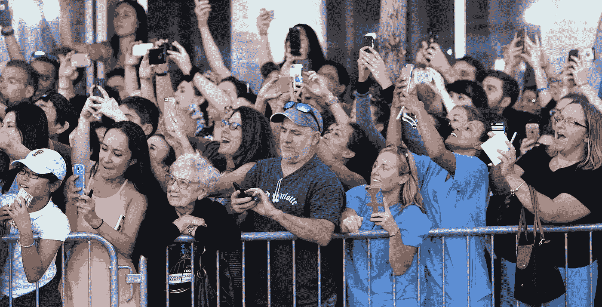
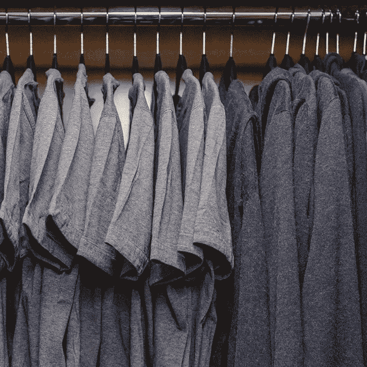
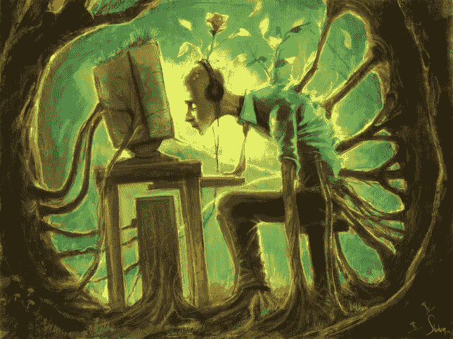

# 一瞬间阻止了科技毁掉我的生活

> 原文：<https://medium.com/hackernoon/one-moment-stopped-technology-ruining-my-life-1096f4412e4>

透过智能手机的顶部，我发现我的女儿正在做一件不可思议但令人心碎的事情。也许不是你想象中的不可思议，她除了年轻时从未做过任何超凡脱俗或早熟的事情。不，这太不可思议了，因为她在争夺我的注意力。她真的敲她的鼓越来越大声，直到我的注意力都被捕获和确保。赢得我的注意后，她微笑着看着我，继续用同样的方式演奏和唱歌，她的听众只有一个。

当我坐在那里享受这一刻时，它立即让我充满了罪恶感，让我质疑她以前做过多少次，但没有像打鼓一样引人注目的东西来将我的注意力从我手机黑屏后越来越诱人的世界中转移开。**我已经错过了多少，有一天，我会透过手机屏幕看着我的女儿，对这些年因全神贯注于充斥在我收件箱或新闻订阅中的无聊琐事而错过的时光感到绝望吗？**

不仅仅是在我的个人生活中，在我的职业生涯中，我越来越多地注意到小的干扰已经渗透到我的日常生活中，并造成了一种不平衡，阻止我实现我所设定的一切。无论是在我的个人生活还是私人生活中，随着科技的应用与日常生活的联系越来越紧密，T4 摆脱科技束缚的斗争变得更加艰难。

**我一直被马克·扎克伯格(Mark Zuckerberg)的一句话所吸引，这句话是关于为什么他的衣柜里放满了相同的衣服:** *“我真的很幸运，每天醒来，我都可以帮助服务超过 10 亿人，而且* ***我觉得如果我把任何精力花在生活中愚蠢或琐碎的事情上，我就没有做好自己的工作*** *，这样我就可以把所有的精力投入到打造最好的产品和服务上。”这让我着迷有两个原因:*

1.  首先，它让我充满钦佩，因为我能够简化世俗的决定，以确保单方面的思考专注于创造性的努力。
2.  其次，也是更重要的一点，这让我着迷，因为他为 10 多亿人服务的方法可能是人类历史上最愚蠢、最轻浮的服务。我向你挑战，找一个更耗费时间的努力。

由于以上原因，我已经采取了几个步骤来逃离这个令人心烦意乱的陷阱。简单地说:从技术上来说，我已经放弃了。为了理清思路，让我的心灵从技术的禁锢中得到宣泄，我已经后退了几步。具有讽刺意味的是，旨在简化我们的生活和提高生产力的技术正是阻止我们充分发挥潜力或享受生活中最重要的事情的东西。

# 电子邮件

我越来越发现电子邮件会适得其反。我没有把事情做完，而是感觉自己陷入了为电子邮件而写电子邮件的深渊。我只是写关于电子邮件的电子邮件，而不是解决讨论的问题。**电子邮件只有一个普遍真理；每封邮件都会带来更多的邮件。**挣脱单调的循环走两步。

1.  **每天只查看一次邮件**。你们中的一些人可能会质疑这是怎么可能的，或者认为这会迫使我一整天都错过重要的信息。事实上，这让我更有效率。这让我能够更清楚地专注于手头的任务，如果有什么事情发生，我开始接到电话，这让我能够更快、更容易地解决问题，而不需要额外的电子邮件。
2.  我不再发送同样多的电子邮件。这听起来简单，因为它是，但我能够大幅减少我每天收到的电子邮件多达 40%。不再发不需要回复的邮件。不再给我可以在十秒钟内打电话得到回复的人发电子邮件。获得的自由确实令人振奋。

# 智能手机

我要坦白的第一件事，也是恢复的第一阶段，是我是一个智能手机上瘾者。我如何解决这种上瘾？我刚买的[这个。](http://www.ebay.co.uk/itm/New-Condition-Nokia-6500-Classic-3G-Black-Unlocked-Camera-Bluetooth-Mobile-Phone-/271688263746?hash=item3f41e1e842:g:rq4AAOSw7aBVC2JG)认真。我还没有完全脱离智能手机，然而，我仍然在白天工作时使用它，但晚上回家时会经常试图把它留在车里。现在，当我在家的时候，我会带着诺基亚，它已经用一个适配器把 sim 卡转移过来了。如果有需要注意的事情发生，有人会打电话来；你不会给消防队发电子邮件，告诉他们你的房子着火了。

我越来越相信，智能手机是人类历史上最糟糕的发明。你的鞋子不需要覆盖你的全身，那么为什么你的手机需要做 18 件装备的工作呢？我看到从网络上拔掉插头的趋势越来越明显。永久连接的想法真的让我害怕，就像给大企业提供数据而对我的隐私控制越来越少一样。我相信在接下来的 5 年里，我们将会看到对今天的技术入侵规范的巨大反击。

> 我们不断被花言巧语轰炸，说你现在口袋里的计算能力比把人送上月球所需的还要强。如果这是真的，我会问，我们究竟为什么需要这种能力？

通过技术转移，我已经能够提高生产率，重新获得与家人在一起的宝贵时光，同时成为一名更好的职业人士、丈夫和父亲。在家时，我仍然能够访问我需要的一切，但我现在选择连接是一个有意识的决定，而不是无聊的无意识反应。两个世界的清晰区分也解放了我的思想，让创造力蓬勃发展。我的心灵开始享受与数字世界的分离，这在新关系的建立和新的更具创造性的追求中得到了体现。

与我进行这个实验时的设想相反，我已经能够在更短的时间内完成更多的事情，同时绝对不会错过任何影响我生活质量的事情。我认为不断滚动你的新闻提要是对害怕错过的一种反应，这是人的天性。事实是我们不会错过任何东西。**通过关闭、脱离网络、脱离闪亮智能手机的数字诱惑，我们看到了应该全神贯注的事物。**归根结底，生产力决定了我们工作和人际关系的质量，无论是在私人生活还是职业生活中。

# 对我来说，这可以归结为一个问题:你更愿意看到学校的老熟人晚餐吃了什么，还是更愿意与你最亲爱的人一起创造回忆？