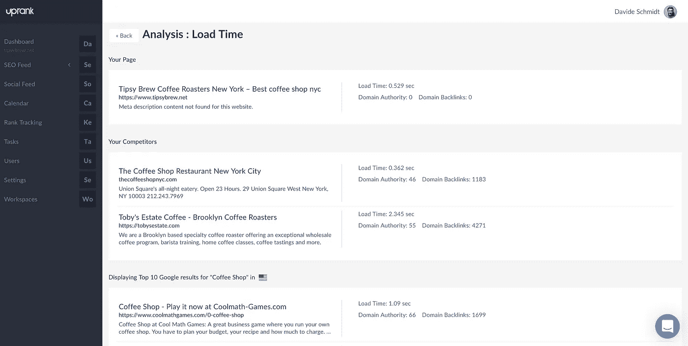

# 一个工具来统治你的搜索引擎优化和社会媒体营销工作

> 原文：<https://medium.com/hackernoon/one-tool-to-rule-your-seo-and-social-media-marketing-efforts-77d319851a73>

Photo by [Carlos Muza](https://unsplash.com/@kmuza?utm_source=medium&utm_medium=referral) on [Unsplash](https://unsplash.com?utm_source=medium&utm_medium=referral)

Uprank 是一个数字营销软件，允许企业主负责 SEO，并管理社交媒体上的参与度——只使用一个可以自动化的工具。这与您的业务相关吗？或者它只是我们的另一个搜索引擎优化工具？我们将简要地看一下这个工具，您将自己看到它是否正是您所寻找的。

很久以前，数字营销领域就有很多关于 SEO 和强大的社交媒体如何为企业主带来稳定的流量和销售的讨论。从所有可以想象的角度来看，这似乎是真的。但问题是，没有多少企业家知道如何利用这一点。更少的人利用了这一现实，因为他们宁愿专注于他们更熟悉的其他事情。

这是否意味着市场上没有足够多的数字营销工具？几乎没有。可能有数百个，如果不是数千个的话；但是在这篇文章中，我们来看看[Uprank](https://uprank.io/)——一位连续创业者 Tanuj Moorjani 和 Altaf Hussain 的创意。它给市场带来了什么？这值得营销人员花费时间吗？

# Uprank 旨在帮助企业最大限度地获得理想的数字营销结果

该软件于 2016 年作为免费的 SEO 工具推出，旨在帮助企业主在更短的时间内获得更高的生产力。在过去的 3 年里，这个搜索引擎优化工具已经被世界上成千上万的营销人员和企业使用。

但是从可观察到的情况来看，这个工具似乎仍在改进。Uprank 的创始人表示，他们将继续开发这款工具，让它比刚开始时更好。对于谷歌算法不断变化的动态和数字营销领域，他们并不陌生，他们坚持认为，仍然需要不断努力，使这一工具更好地服务于目标用户。

用 Uprank 联合创始人 Tanuj Moorjani 的话说，“事实是，我们明白:普通的在线消费者变得越来越难以接触和转化。这就是为什么我们一直非常聪明地(在幕后)工作，用一个高效易用的复杂工具来让用户惊叹。”

他进一步解释说，他很快就把注意力吸引到了软件在过去几年中所经历的积极变化上。“与 2016 年相比，”他继续说道，“Uprank 现在是一家搜索引擎优化和社交媒体巨头；一个理想的一体化数字营销工具，用于监控和管理您的网络和社交媒体流量的有机增长。

# 那么，企业可以用新的 Uprank 做什么呢？

首先，这个工具现在可以被任何想要检查东西的人使用。我花了大约 2 分钟注册，并获得了用户界面的感觉。

然而，Uprank 最受欢迎的功能包括但不限于以下内容:

# 跟踪和提高绩效

企业所有者手中掌握的信息太少，就会降低成功管理企业网站绩效的能力。为了解决这个问题，Uprank 的开发者说他们被激励去创造一个工具来传递详细的洞察力；识别 SEO 问题；并在它们影响网站的健康和发展之前将其扼杀在萌芽状态。

# 通过 SEO 审计进行网页优化

谷歌的排名算法一直在进化。所以，看到你的网站排名毫无征兆的暴跌并不罕见。也就是说，Uprank 被宣传为有一个 SEO 审计方面，这是为一个主要目的而设计的:通过保持用户的网页为搜索引擎优化来帮助用户保持领先地位。

# 竞争对手观察

知识就是力量，对吗？没错。用户似乎可以通过将自己的网页与谷歌上最大竞争对手的网页进行比较，来了解自己网站的真实表现；例如，他们的十大竞争对手。“这一点之所以成为可能，是因为我们可以从用户的仪表板上获得深刻的见解，这些见解可以被研究并用于比竞争对手更高的排名。”创始人说。这抓住了该工具名称的本意——up rank。

# 简单地

这篇关于 SEO 工具的简短报道不可能在这样一篇简单的文章中涵盖。然而，我们注意到这个软件已经存在三年了，并且在撰写本文时大部分都是免费的。我们希望了解您对 Uprank 的看法。但是为了能够提出一个观点，你需要报名参加一个关于搜索引擎优化工具的旅行。