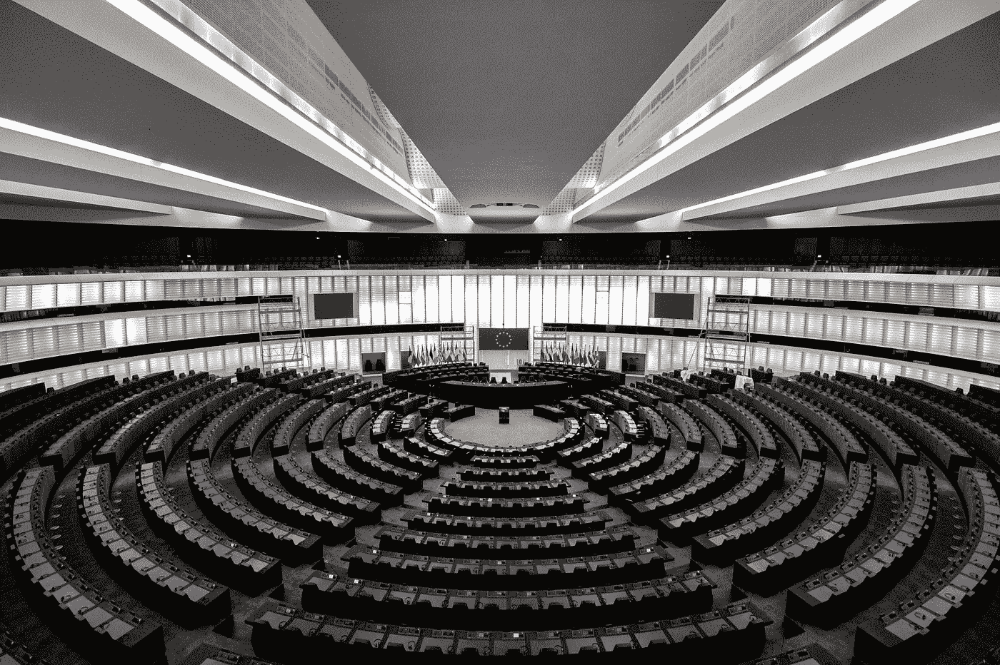

# 数字时代的在线营销和(欧盟)选举——你的选择不是你自己的

> 原文：<https://medium.com/hackernoon/online-marketing-and-eu-elections-in-the-digital-age-your-choices-are-not-your-own-be9321684f89>

## 大数据伦理、说服和自由意志的存在

Photo by [Frederic Köberl](https://unsplash.com/photos/x_0hW-KaCgI?utm_source=unsplash&utm_medium=referral&utm_content=creditCopyText) on [Unsplash](https://unsplash.com/search/photos/european-union?utm_source=unsplash&utm_medium=referral&utm_content=creditCopyText)

在当今世界，我们中有谁能真正坚持认为我们可以自由选择自己想要的东西？什么是不道德操纵，我们如何辨别它或保护自己免受其害？