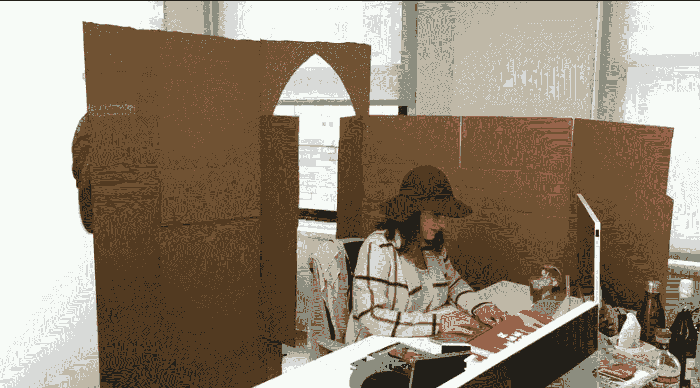

# 开放式办公室最符合高管的利益，而不是公司的利益

> 原文：<https://medium.com/hackernoon/open-offices-are-in-the-best-interest-of-executives-not-companies-1448106e2c0f>

## 生产力和协作应该是唯一的标准。

我们都参与了关于我们是否应该有一个开放式办公室的辩论。一般来说，[高管](https://hackernoon.com/tagged/executives)会提倡开放式办公室，而个人贡献者会说，“请不要！！!"；).高管们不会听，因为他们觉得自己是唯一一个能够看清全局、做出这个决定的人……当然！显然， [70%的办公室](https://www.newyorker.com/business/currency/the-open-office-trap)现在都有开放式平面图…

所以我在想，也许我们可以用一种难以辩驳的方法对此事进行非常理性的分析(尽管我有时会表达我的观点)。然后，或许，我们可以就什么对公司最好达成一致(不幸的是，你永远无法说服一位高管什么对你的开发人员最好)。最后，我们可以讨论一下，如果你被困在开放式办公室里，该怎么办。

这里是方法。我们来谈谈考虑的标准。请在评论中添加任何你认为遗漏的内容。然后我们将检查备选方案，并根据这些标准对它们进行评级。

# 你的办公室的组织标准是什么？

如果有一个标准适用于任何高管，那应该是投资回报率(ROI)，但我们如何将其分解以使其易于理解？

*   **财务标准**:办公是一项成本。你需要的占地面积越大，成本就越高。
*   **生产力标准**:如果你的团队生产力产出直线下降，减少占地面积还有什么意义？生产力是组织的产出，也是办公室的间接产出。
*   **合作标准**:最好的想法和最好的创新来自几个人的合作。如果团队创造了大量的产品，但没有一个是正确的产品，团队的投资回报率为 0。所以协作与产出的质量直接相关。
*   **人才保留标准**:这里实话实说吧。工资比平面图贵多了！如果平面图影响人才保留，这需要成为你关注的一个标准。

乍一看，这似乎是 4 个很好的候选标准。

但从高管的角度来看，可能还有第五个重要因素:**让整个团队都在一个地方，易于接触和监控**。我们可能会认为这个标准是无效的，但我敢打赌，这显然是一个决定因素。为了便于讨论，让我们把这看作第五个标准(特定于管理):**可访问性**。

现在让我们来看看替代方案。

# 实际上，让我们抛开财务和人才保留标准

为什么？因为它们并不重要。让我解释一下。

**在财务方面**，让我们假设对于同样数量的开发人员来说，个人办公桌比开放式办公室多占用 5 倍的空间。对于一个有 100 名开发人员的团队来说，开放式办公室的租金应该是每年 7 万美元。当然，这取决于哪个城市，但你会发现这并不重要。开发人员的平均工资应该在 10 万美元左右，这还是保守的数字。所有这些薪水每年都要花费 1000 万美元！因此，10%的生产率损失意味着砸在墙上的 100 万美元(没有双关语😉).**比办公室租金多 15 倍！**

**在人才保留方面**，您团队的感知生产力和高效协作与您的人才保留直接相关。如果你的团队富有成效且合作良好，在其他条件相同的情况下，留住人才将不是什么大问题。

这就是为什么生产力和协作应该是你的唯一标准，无论你是个人贡献者、经理还是高管。让我们分析这两点上的不同选择。

# 有哪些替代方案？

## 1.开放式办公室

生产力:
开发者讨厌开放式办公室是有原因的。是的，恨可能是一个好词；你自己去 reddit 上看看吧:“[开放式办公室是一个糟糕的、可怕的、不好的、非常糟糕的主意。](https://www.reddit.com/r/programming/comments/8yjiqb/the_openplan_office_is_a_terrible_horrible_no/)“为什么？开发人员更容易受到干扰和压力。如果工作空间被设计成有尽可能多的运动，那不会帮助他们集中注意力！任何中断都很容易占用开发人员 30 分钟以上的工作时间。越多的干扰，越多的挫折，越低质量的工作，越多的错误——如此循环。如果你想了解生产力损失的根源，请查阅这篇文章。
让我们假设你因为这个每天有两次额外的打扰。那就是每天 1 小时:15%的生产力损失！

合作:
关于这个有一个[哈佛的研究](https://www.inc.com/jessica-stillman/new-harvard-study-you-open-plan-office-is-making-your-team-less-collaborative.html)；它实际上是说开放式办公室会让你的团队更不协作。这可能会让高管们大吃一惊。但我向你保证，不是开发商！该研究称，对于开放式办公室，“平均而言，参与员工的面对面时间减少了约 70%，电子邮件的使用增加了 22%至 50%(取决于使用的估计方法)。”
仔细想想，这是显而易见的。人们受不了噪音，因此戴上耳机。

可访问性:(对于高管)
这是让高管们感觉自己是团队一员的最佳配置，让他们都聚集在同一个地方。团队之间的移动也变得更加容易。

当然，有很多方法可以设计一个开放式办公室来抵消一些负面影响。在我们检查替代方案时，我们会考虑这一点。

## 2.隔间农场

小隔间的主要问题是它们过去的样子给人的感觉。但是你可以让他们变得有趣！看看下面 Zappos 隔间的图片就知道了！

生产力:
在小隔间里，你很少分心和不必要的打扰，这要感谢你得到的一点额外的隐私。看不到你同事的脸可能就足以让你不再停下来和他或她开个玩笑。此外，开发人员感觉更少“被监视”,可以更加放松，让他们更加专注。但你确实有同样多的噪音，戴上耳机就可以轻松抵消。

协作:
小隔间可以由团队来安排，以实现最大程度的协作。但这可能意味着，如果你改变团队/小队，你将需要改变隔间，所以开发人员可能不太倾向于个性化他们的隔间，因为他们会理想地想要。即使你需要站起来和你对面的同事交谈，你也有更多的隐私与同事进行更深入的交谈，而不用担心打扰他们的邻居，这是一个很好的合作点

值得一提的另一点是，即使我们不关心财务部分，拥有包括 10 个团队在内的 100 个开发人员的楼层比拥有 20 个开发人员的 5 个楼层(每个楼层 2 个团队)促进了更多的协作。

易接近性:(对高管而言)
小隔间比一张挨着一张摆放的办公桌占用的空间多两倍。因此，高管们可能会觉得他们的团队更难接近，如果他们需要几层楼而不是一层楼，就更难接近了，因为小隔间占据了空间。

## 3.团队分离(团队内部开放，对其他团队关闭)

如果你有非常大的团队，那就像开放式办公室一样。所以在这种情况下，我会考虑 10 人以下的团队。

生产力:
团队越小，专注的环境越好。不过，你的经理是否在这个领域，实际上会有很大的不同，因为开发人员可能会觉得不那么轻松，当然，这取决于管理的风格。这里最大的优势是除了团队之外没有分心的事。你仍然可能被你的队友分散注意力，但是开发人员知道干扰会造成什么。所以，如果他们觉得你在状态中，他们就不会仅仅为了分散注意力而吸引你的注意力。

协作:
这可能是团队内部协作的最佳配置。然而，这可能会降低独立团队之间的协作。抵消这种情况的一个方法是将应该一起协作的团队放在相邻的空间，并拥有公共走廊或会议空间。

易接近性:(对高管而言)这对经理来说再好不过了。他们和自己的团队有自己的空间，不会被其他团队打扰。然而，高管们可能不会有同样的感受。他们不是有一个元团队，而是在可能不同的地方有几个独立的团队。

3 到 8 个人之间感觉是一个很好的妥协，但这是我的观点；不同意也没关系。越多，你就越容易分心。

## 4.个别办公室

生产率:
这是中断最少的选项，因此理论上具有最高的生产率。然而，有一个同事和你在同一个房间专注于他们的工作可以帮助你更容易集中注意力。此外，一个开发人员不可能连续 8 个小时都保持高效，他需要一些时间来进行一些轻松的对话，然后再回到工作状态。这在个别办公室是不容易做到的。你至少要有两个人在里面。

协作:
办公室让对话变得更容易。你关上了门，你可以谈论需要谈论的事情，而不用担心打扰其他人。这适用于讨论复杂的问题，但不适用于可能会在网上讨论的简单问题。这是真的，尤其是在你想交谈的人不在附近的情况下，因为团队将在这一点上分散。

可及性:(对于高管)
个人办公室比团队分隔的开放式楼层多占用 5 倍的空间。您的 100 名开发人员团队可能分布在许多楼层。如果你的公司有办公室，那么高管们的可及性是最差的。

## 5.远程办公室

嗯，我们也需要谈谈这个！

生产率:
中断最少，生产率最高。然而，并不是每个人都适合远程工作。有些团队会在两个任务之间的短暂休息时间里进行虚拟咖啡休息。所有的通信都是异步的，所以开发人员可以随时响应。

协作:
这本身就是一个话题。越来越多的公司采用远程办公室，越来越多的远程协作最佳实践出现。协作与物理办公室中的协作不一样，你的公司需要认真适应这一点。但远程办公室的协作程度甚至可能更高，因为人们担心虚拟参与讨论的程度会降低。

易接近性:(对高管来说)
这对高管来说是最糟糕的。

# 那么哪个是最好的呢？

我认为，不幸的是，可访问性是今天高管们考虑最多的标准，尽管如果你考虑公司的最佳利益，它不应该是这样。但公司不是决策者，而是他们的高管。

如果我们不考虑可访问性，这取决于你是否更喜欢生产力而不是协作。如果你喜欢协作，个人办公室通常是最差的。如果你喜欢生产力和产出，我会把 2-3 个开发人员放在单独的工作区，这样你就可以冷静下来，专注于他们的个人生产力，同时在同一楼层有更多的开发人员。

我个人最喜欢的是远程团队。但是如果你有一个办公室，这将是团队分离，因为它在团队中培养最大的协作和生产力。我个人也喜欢小团队，3 到 5 个人一起做一个项目。但那是不同的话题！

# 如果你有一个开放式办公室，该怎么办…

…而且您想让您的开发人员感觉良好。你可以这样做:

*   在队伍之间增加移动的分隔物，或者至少增加距离——足以抵消运动的干扰
*   提供降噪耳机(最好是你的欢迎包装中他们选择的那种)= >即使这不是最好的合作方式，你也不能阻止开发人员不了解他们的想法！
*   提供隐私屏幕过滤器，让他们感觉有点隐私，而不是他们的经理一直盯着他们的屏幕😛
*   如果你买得起小隔间，和你的团队讨论一下。能获得多大的生产力？我觉得他们会感兴趣的

无论如何，如果有人告诉你“开放式办公室通常会培养一种象征性的组织使命感，让员工感觉自己是一个更悠闲、更创新的企业的一部分”，你知道该怎么告诉他们！

让我知道你的想法。有什么我遗漏的考虑吗？

# 在你走之前…

你觉得这篇文章有趣吗？请按住👏说“谢谢”并帮助别人找到它！
如果您对关于**我们在** [**Airbyte**](http://airbyte.io) **用我们所有的知识**打造世界级组织的旅程的文章感兴趣，请订阅我们的时事通讯！

在 Twitter[上关注我](http://twitter.com/JeanLafleur)保持联系。谢谢大家！

> 这篇文章最初发表在 SD Times 的[这里。](https://sdtimes.com/softwaredev/for-development-teams-its-time-to-throw-out-the-open-office-plan/)