# 开放研究季:阿里巴巴发布 4000 台服务器的集群数据

> 原文：<https://medium.com/hackernoon/open-season-for-research-alibaba-releases-cluster-data-from-4000-servers-12d013bd6b4e>

## *为了帮助学术界和其他领域的研究人员和开发人员，阿里巴巴现已发布其 2018 年集群数据，供所有人探索*

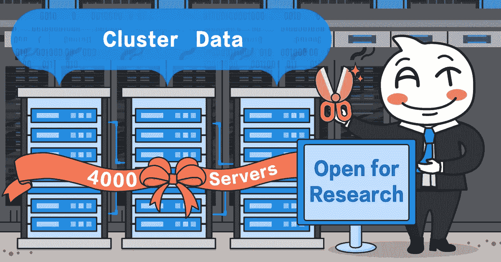

在关于互联网应用的 IT 文章中，你会经常发现“大规模”、“海量请求”等词汇。这些应用程序都运行在大规模的数据中心，读者通常对这些环境有许多疑问。比如数据中心每台机器的运行状态如何？正在运行哪些类型的应用程序？这些应用的特点是什么？除了少数资深专家，学生和企业研究人员很少了解这些细节。

今天阿里巴巴分享一个真实的计算机集群数据集:**阿里巴巴集群数据 V2018** (附在文末)。这个数据集提供了阿里巴巴生产集群中的服务器和运行任务的详细信息的完整记录。随着这些数据的发布，阿里巴巴希望吸引学术界和更广泛行业的同行，并促进行业内的进一步发展。

本文借鉴了阿里系统软件事业部技术专家石琳的见解，对这一独特的数据集进行了深入的介绍，并对前一年的数据进行了学术研究。

# 发布数据集:探索的资源

2015 年，阿里巴巴试图在其数据中心的同一批机器上部署延迟不敏感的批量计算任务和延迟敏感的在线服务，目标是让冗余资源得到充分利用，提高这些机器的整体利用率。

经过三年多的试验论证、结构调整和资源隔离优化，该项目现已进入批量生产阶段。使用主机托管技术(即允许在同一台机器上运行在线服务和批处理工作负载的技术)，集群的平均资源利用率从 10%提高到 45%。此外，通过各种优化方法，现在可以在数据中心运行更多的任务，11.11 全球购物节的平均交易成本每万笔交易降低了 17%。

虽然一些读者会理解这一成就以及它是如何实现的，但许多人可能会有一些疑问，如优化后的计算机集群到底是什么样子，或者主机托管意味着什么以及为什么它很重要。

通过发布阿里巴巴集群数据 V2018 数据集，阿里巴巴希望帮助感兴趣的学生和研究人员回答这些问题，并更好地了解大规模数据中心。使用数据集，个人可以了解阿里巴巴如何通过托管将资源利用率提高到 45%的更多信息；阿里巴巴每天运行多少任务；以及企业的资源需求是什么。个人如何使用这个数据集完全取决于他们的需求。

# 利用这些数据

50 GB 压缩和 270 GB 未压缩的阿里巴巴集群数据 V2018 是一个具有许多不同用途的大型数据集。在六个文件中，它包含 4000 台服务器的数据、相应的在线应用程序容器，以及长达八天的离线计算任务操作。

借助阿里巴巴集群数据 V2018，个人可以进行以下操作:

了解当今高级数据中心中运行任务的服务器和特征。

在调度和运营中尝试各种任务管理和集群优化算法，并撰写相关论文。

使用数据来学习如何进行数据分析，并揭示更多尚未发现的技术和方法。

以下是数据可用于回答的问题示例:

电子商务企业在白天和晚上面临不同的压力。我们如何利用这些高峰和低谷来提高整体资源利用率？

阿里巴巴最长的 DAG 有多少个依赖？

一个容器通常存在多长时间？

计算任务的典型生命周期是多长？

一个任务的多个实例理论上彼此相似，但是它们都同时运行吗？

事实上，学术界已经将阿里巴巴的集群数据用于一系列重要的分析和研究。2017 年和 2018 年，基于阿里巴巴集群数据 V2017 中第一波共享的数据，发表了许多著名的学术论文。以下部分展示了数据集的学术用途示例，其中许多示例已在 OSDI 等学术会议上出现。

## LegoOS:一个分散的、分布式的硬件资源分解操作系统——单以洲，黄宇彤，陈以伦，张以英；普渡大学。(OSDI 18 年最佳论文奖获得者)

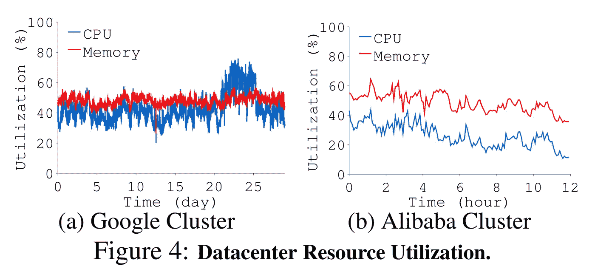

## 云中的不平衡:阿里巴巴集群轨迹分析——陆承志等(BIGDATA 2017)

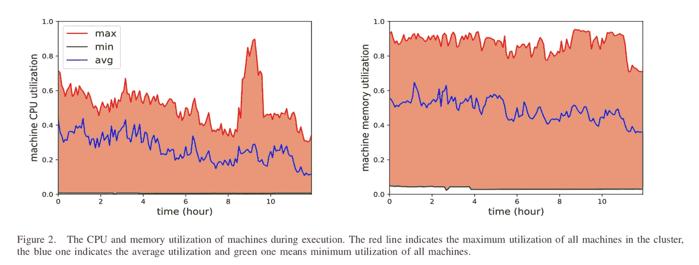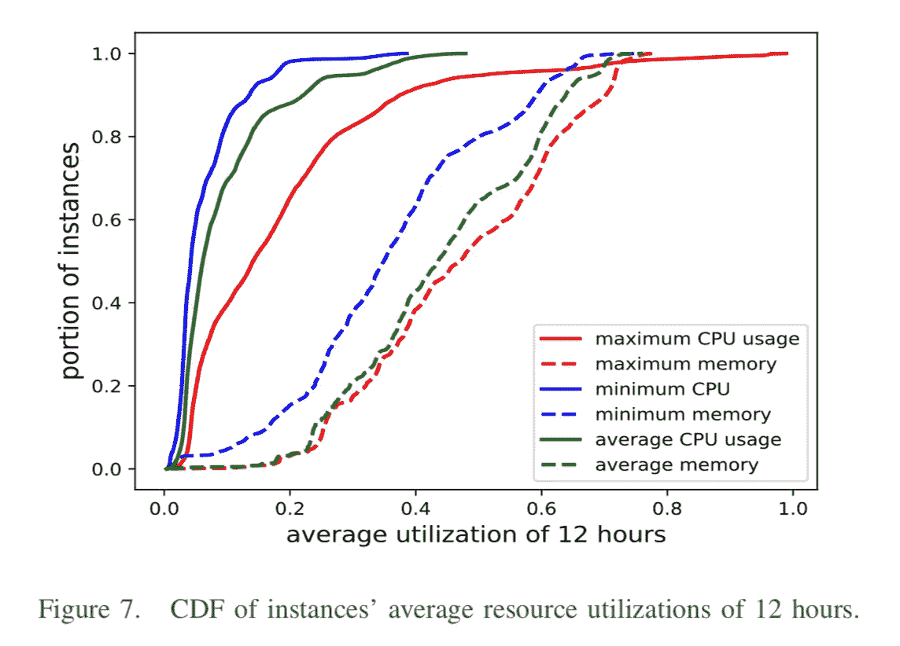

## 表征协同定位的数据中心工作负载:阿里巴巴案例研究。(APSys2018)

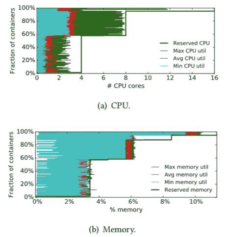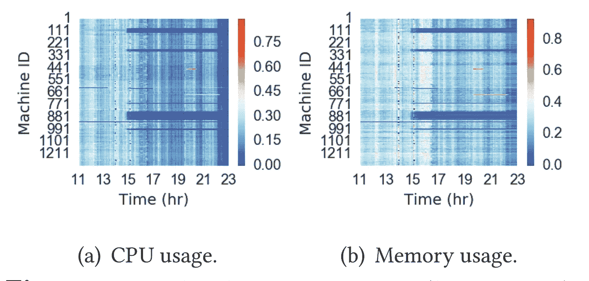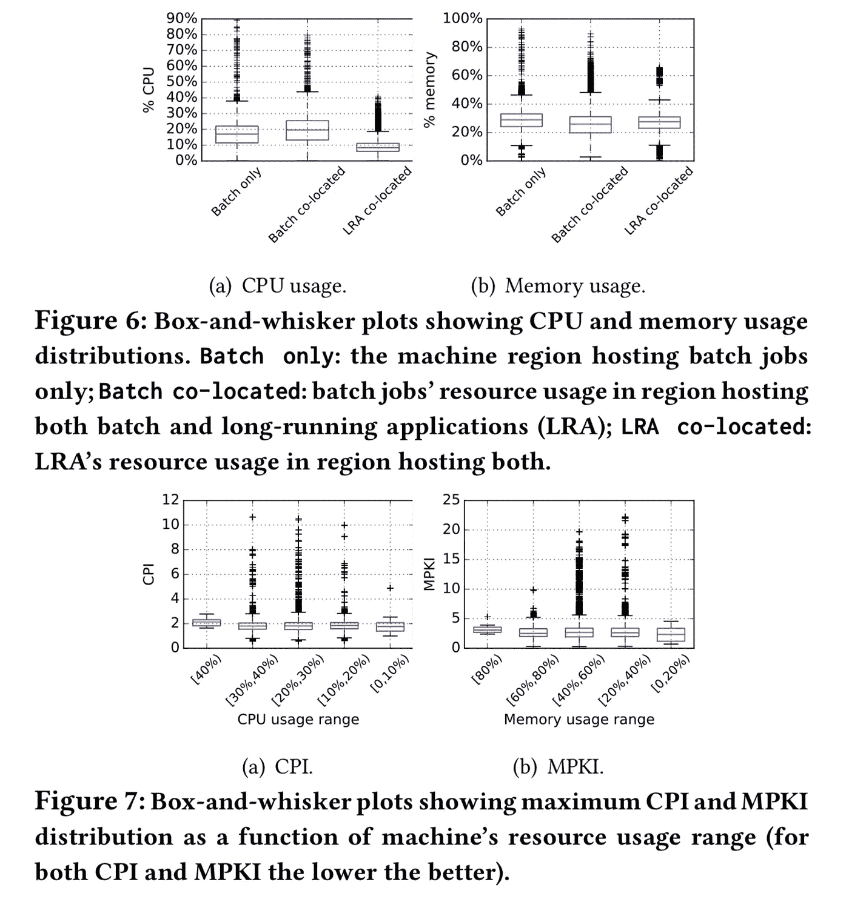

## 半容器化协同定位云工作负载的弹性和可塑性:来自阿里巴巴的观点。(SoCC2018)

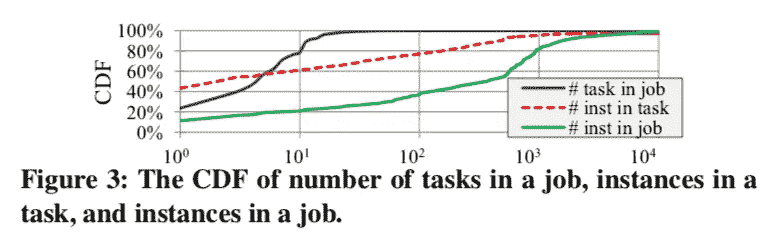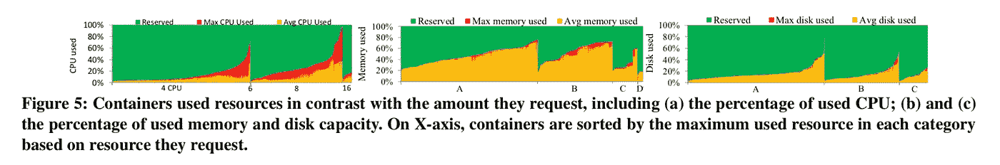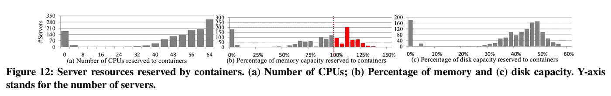

# 展望未来:2018 年的更新

在上述研究中，新的 V2018 数据集与去年的 V2017 数据集有两个主要区别。

首先，V2018 数据集包括我们的一些生产批量工作负载的 DAG 信息。这意味着，像 Map Reduce、Hadoop、Spark 和 Flink 中常用的离线计算任务是以有向无环图(DAG)的形式排列的，它显示了并行性、任务之间的依赖性等等。因此，该数据集现在是实际生产环境中最大的可用 DAG 数据集。

下图显示了一个 DAG 示例:

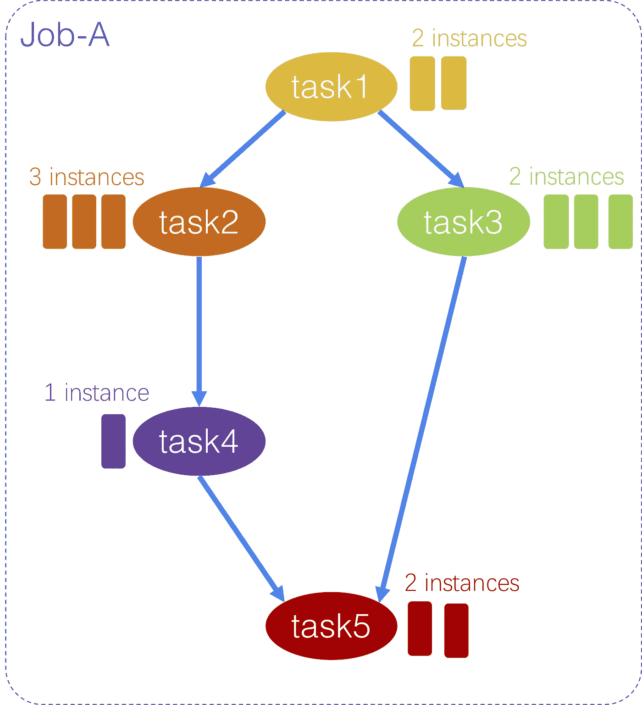

其次，V2018 数据集的规模比上一个数据集大得多，上一个数据集包含 24 小时内大约 1300 台机器的数据。新版本包括 8 天内 4000 台机器的数据。

使用 V2017 数据集已经完成了这么多工作，阿里巴巴期待着研究人员在 2019 年开始使用新数据集时的发展。

***(The original article is written by Ding Haiyang 丁海洋)***

# **阿里巴巴集群数据 V2018**

下载链接:

*   【machine _ meta】([http://cluster data 2018 pubus . OSS-us-west-1 . aliyuncs . com/machine _ meta . tar . gz)](http://clusterdata2018pubus.oss-us-west-1.aliyuncs.com/machine_meta.tar.gz))
*   【machine _ usage】([http://cluster data 2018 pubus . OSS-us-west-1 . aliyuncs . com/machine _ usage . tar . gz)](http://clusterdata2018pubus.oss-us-west-1.aliyuncs.com/machine_usage.tar.gz))
*   [container _ meta]([http://cluster data 2018 pubus . OSS-us-west-1 . aliyuncs . com/container _ meta . tar . gz)](http://clusterdata2018pubus.oss-us-west-1.aliyuncs.com/container_meta.tar.gz))
*   [container _ usage]([http://cluster data 2018 pubus . OSS-us-west-1 . aliyuncs . com/container _ usage . tar . gz)](http://clusterdata2018pubus.oss-us-west-1.aliyuncs.com/container_usage.tar.gz))
*   [batch _ task]([http://cluster data 2018 pubus . OSS-us-west-1 . aliyuncs . com/batch _ task . tar . gz)](http://clusterdata2018pubus.oss-us-west-1.aliyuncs.com/batch_task.tar.gz))
*   [batch _ instance]([http://cluster data 2018 pubus . OSS-us-west-1 . aliyuncs . com/batch _ instance . tar . gz)](http://clusterdata2018pubus.oss-us-west-1.aliyuncs.com/batch_instance.tar.gz))

# 阿里巴巴科技

关于阿里巴巴最新技术的第一手深度资料→脸书: [**《阿里巴巴技术》**](http://www.facebook.com/AlibabaTechnology) 。推特:[**【AlibabaTech】**](https://twitter.com/AliTech2017)。