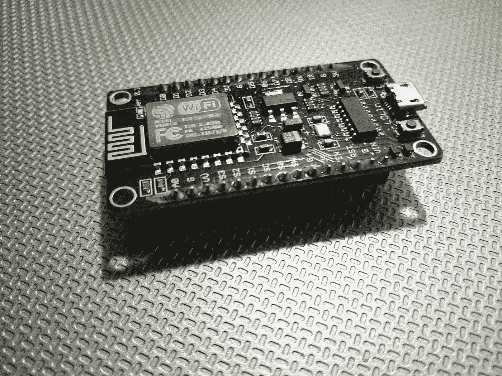
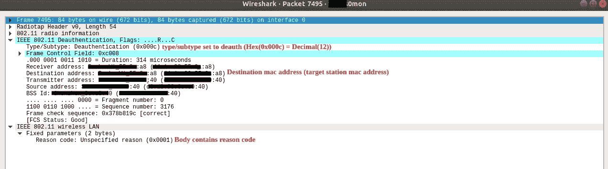
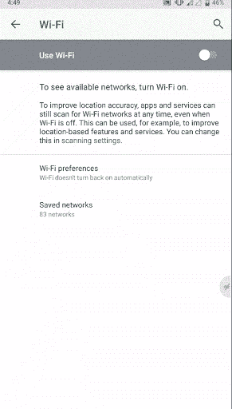

# 开放 WiFi 凭证采集-物联网版

> 原文：<https://medium.com/hackernoon/open-wifi-credential-harvesting-iot-edition-cf541fcefb95>


免费互联网——开放 wifi 连接，听起来很诱人，但它真的是免费的吗？可能你正在用你的身份付出代价！

想象你在机场等待 5 个小时的下一趟航班，无聊又无所事事。你拿起你的智能手机来打发时间，但很快意识到如果没有互联网连接，它就不那么智能了。这提醒你检查周围是否有无线网络连接。然后，商店和机场附近有很多免费的 wifi 连接。你不假思索地在填写了一张不起眼的表格后连接上了 wifi，上面有你的护照号码、姓名、航班信息等。或者可能与您的电子邮件或脸书凭据。恭喜你！！你刚刚用你的身份赌上了价值几兆字节的互联网。

开放的 wifi 连接从一开始就被认为是安全噩梦。但是由于没有简单的替代方案，开放式 wifi 连接仍然广泛应用于几乎所有的公共场所，如咖啡店、机场等。

传统的开放式 wifi 黑客涉及一些手工工作。黑客需要执行 [MITM](https://en.wikipedia.org/wiki/Man-in-the-middle_attack) 攻击，通常带有 [ARP 中毒](http://en.wikipedia.org/wiki/ARP_spoofing)。由于现在的网站都是信道加密的，这涉及到更多的工作，如“SSL 剥离”来充分利用它。这是可行的，但是用这种方法进行[凭证收集](https://redcanary.com/blog/credential-harvesting-attacks/)并不实际。

随着物联网的发展，从公共 wifi 获取[凭证的方法变得异常简单。在本文中，我将解释一个简单的 POC，它概括地证明了这一点。](https://redcanary.com/blog/credential-harvesting-attacks/)

# 用于概念验证的设备:ESP8266



ESP8266 12E NodeMCU module

随着物联网的最新趋势，对具有内置连接功能的低功耗/低成本 SoC(片上系统)有着巨大的需求。esp8266 由“Espressif Systems”在 2013 年制造，以满足这一需求。它很快在物联网爱好者和相关企业中流行起来。

除了其微控制器功能之外，esp8266 还支持 TCP/IP 堆栈。这种微型/廉价芯片的主要优势是它支持 wifi 连接，具有完整的 TCP/IP 协议栈和 IEEE 802.11 b/g/n WLAN 协议。这在物联网领域(以及黑客领域)开辟了无限的可能性。

**ESP8266 功能亮点:**
**MCU:**Tensilica Xtensa L106-80 MHz(默认模式)或 160MHz
**外部闪存:** 512 KB 至 4 MB 通常包含在商业变体中。(最高支持 16MB)
**连接:**WiFi(IEEE 802.11 b/g/n)
**RAM:**32 KB 指令 RAM、32kb 指令缓存 RAM、80 KB 用户数据 RAM

在 [shodan.io](https://www.shodan.io/search?query=esp8266) 上快速搜索将显示通过互联网暴露的 esp8266 设备的数量。随着它在物联网社区中越来越受欢迎，数量也在不断增加。也有各种各样的开发板与这种芯片一起发布。此外，这种芯片通常可以从 ebay 上以 2 美元的价格买到。

在本文中，我将解释如何使用两个 esp8266 设备进行开放式 wifi 凭据收集攻击。

# **步骤 1:从目标接入点取消已连接客户端的身份验证**

首先，攻击者需要取消连接到免费 wifi 接入点的客户端设备的身份验证。(尽管这一步不是强制性的，但它会增加攻击的成功率)

为了实现这一点，攻击者可以在 IEEE 802.11w-2009 修正案之前利用 IEEE 802.11 WLAN 协议中的一个主要缺陷。在早期的 IEEE 802.11 规范(2009 年之前)中，管理帧(负责认证、维护和中断通信)不受底层加密机制的保护。这使得目标站范围内的任何人都能够通过向目标站发送解除认证帧来解除接入点的认证。

如果您对这些帧感兴趣，您可以使用 wireshark 中的以下搜索过滤器来过滤去认证帧。首先，你需要将你的 wifi 适配器在选定的频道上设置为“监控模式”。(有很多关于如何使用 wireshark 监控 wifi 数据包的教程

```
**(wlan.fc.type == 0)&&(wlan.fc.type_subtype == 12)**
```

**(wlan.fc.type==0):** 过滤 802.11 管理帧
**(WLAN . fc . type _ subtype = = 12):**过滤‘去认证’帧([子类型 12](https://community.cisco.com/t5/wireless-mobility-documents/802-11-frames-a-starter-guide-to-learn-wireless-sniffer-traces/ta-p/3110019) )

如果您打开所有频道的“监控模式”,并且在有许多无线设备的拥挤区域，您将很快通过 wireshark 捕获 deauth 帧。



802.11 deauth frame

如果攻击者能够连续向路由器或客户站重播这些解除身份验证帧，他将无法成功建立身份验证。自 2009 年以来，针对受保护接入点的 IEEE 802.11 协议已经修复了该漏洞。但是由于 wifi 接入点需要向后兼容旧的 IEEE 802.11 规范，所以这个漏洞在几乎所有的商用路由器中仍然保持不变。此外，在这种情况下，wifi 流量不会被加密，因为 wifi 连接是开放的。因此，尽管有 IEEE 802.11 2009 修订版，管理帧在开放 wifi 连接中仍将不受保护。

## **基于 ESP8266 的 WiFi 去认证器**

我不打算一步一步地演示如何创建基于 ESP 的身份验证器。因为有一个很好的文档[开源项目](https://github.com/spacehuhn/esp8266_deauther)和许多在线教程如何使用 esp8266 作为基于上述漏洞的 wifi 去认证器。

[](https://github.com/spacehuhn/esp8266_deauther) [## spacehuhn/esp8266_deauther

### 扫描 WiFi 设备，阻止选定的连接，创建几十个网络和混淆 WiFi 扫描仪！…

github.com](https://github.com/spacehuhn/esp8266_deauther) 

与向 wifi 通信频率添加噪声的 wifi 干扰器(禁用范围内的所有 wifi 通信)不同，使用这种方法，攻击者可以根据需要禁用给定的目标接入点(例如:目标开放 wifi 接入点)。

# 第二步:伪装成公共 wifi 强制网络门户

当用户无法成功连接到合法的开放 wifi 接入点时，最终会尝试其他可用的开放 wifi 选项。现在，攻击者只需要用欺骗[强制门户](https://en.wikipedia.org/wiki/Captive_portal)来托管一个开放的 wifi 接入点，就可以从目标受众那里获取凭证。

## 基于 ESP8266 的强制网络门户服务器

esp8266 可以充当完全兼容 REST 的服务器。对于单芯片系统来说，这是相当惊人的。现在只需花 2 美元，你就可以拥有足够强大的设备来托管多种网络服务。通过一些修改，我能够开发支持以下功能的 POC 强制门户服务器:

*   支持多种平台(windows、ubuntu、android)的强制网络门户
*   DNS 服务器欺骗任何入站流量
*   处理 http rest 请求和机制，将资源传输到客户端
*   使用内置 SPIFFS 内存存储网页(支持 js，css)
*   将来自客户端的输入写入 SPIFFS(在来自客户端的 REST post 请求时)
*   远程访问和管理 SPIFFS 存储器。

## 快速演示

1.  **连接到 wifi 接入点时的强制网络门户初始登录页面**



Captive portal popups upon connect

**2。SSO(单点登录)式凭证欺骗**


This can be used to spoof credentials from any identity provider. it’s just a matter of adding convincing UI

这只是一个概念验证，facebook 登录与实际的 facebook 登录用户界面完全不同。添加一个具有适当的 java 脚本验证的令人信服的 UI 真的很容易，因为所有这些都是在客户端设备上完成的。esp8266 只需要在客户端请求时传输 html、css 和 java 脚本资源。

此外，凭证也可以通过身份提供者的实际 sso 实现进行验证。如果提供的凭据无效，则可以实施登录失败流程。

**3。维护设置页面**


Hidden settings page for maintenance and collect credentials

黑客可以像连接另一个客户端一样远程进行所有维护和凭证收集。由于 esp8266 内存有限(4MB)，因此需要在数据文件超出内存限制之前收集并清除数据。
这可以通过对数据文件大小添加简单的监视器来进一步改进，并且如果文件大小超过特定限制，则上传文件。这样，黑客也不会直接接触设备。

esp8266 的另一个主要优势是它可以充当 dns 服务器。因此，它可以模仿任何主机名(例如:www.facebook.poc.com)。为了这个 POC，所有请求都被路由到“192.168.1.1 ”,不管主机名是什么。

我不打算遍历代码库和实现，因为这会使这篇文章变得不必要的冗长。项目文件可以在我的 git 存储库中找到，以供参考。[https://github.com/pumudu88/esp8266](https://github.com/pumudu88/esp8266)

最可怕是，黑客不必点击一个按钮就能进行这种类型的攻击。黑客只需准备好两台 esp8266 设备(步骤 1:解除身份验证和步骤 2:强制网络门户服务器),并将它们安全地放置在目标受众附近。由于 esp8266 低功耗，它将持续数周或数月，无需更换电池。

## 收场白

ESP8266 肯定不是唯一一个能够进行这种攻击的 SoC 设备。但是用最少的成本和努力来做这样的攻击是最容易的。此外，制造商正在开发具有更高性能的新型先进 SOC。比如 2016 年发布的 esp32。它是 esp8266 的继任者，除了 wifi 连接外，还包含蓝牙。

随着物联网设备的发展，一些潜在的安全威胁可能会突然出现。用户不再有特权从安全方面关闭，认为没有人会对他们的身份感兴趣。除非他们希望某个随机黑客在黑暗网络中向某个未知方出售他们的身份以及数以千计的其他收获的凭证。

**免责声明:**本文仅用于教育目的。如果 WIFI 和互联网用户了解如何规避他们的安全，那么他们就有机会防范这种安全漏洞。我对这篇文章中轻率地使用知识不负任何责任。