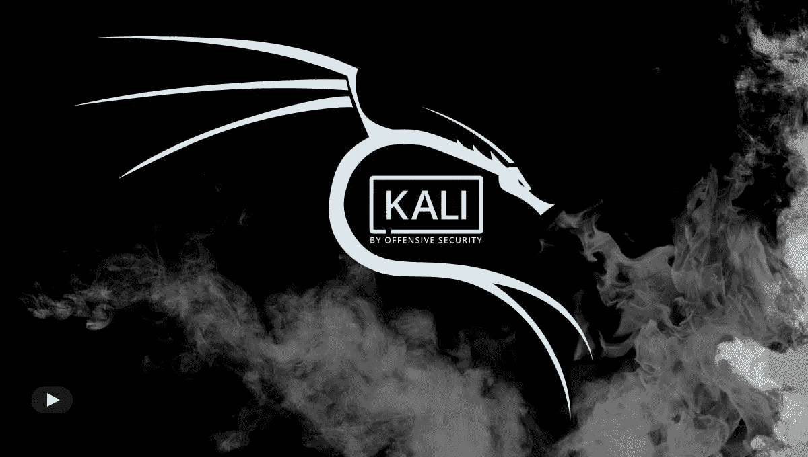
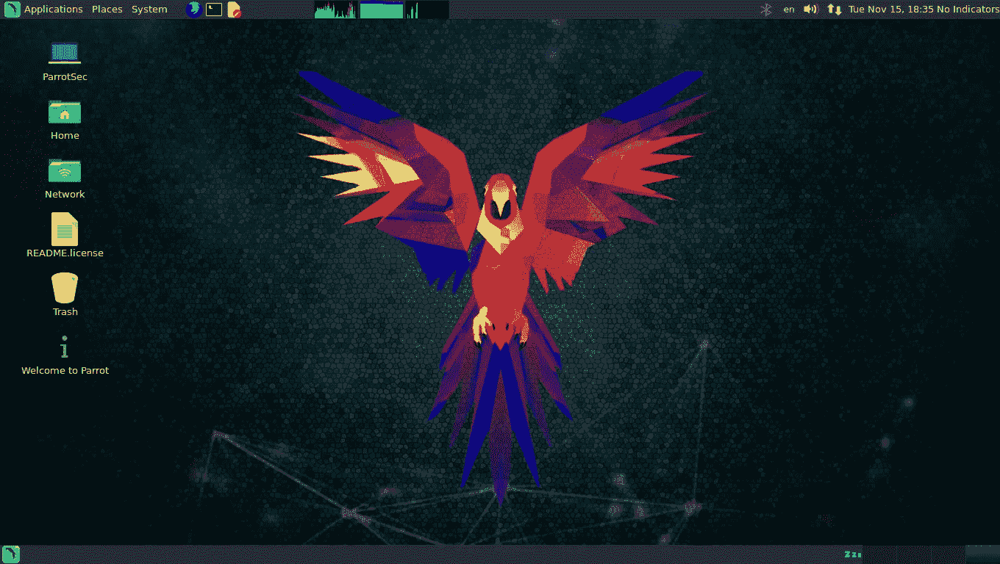
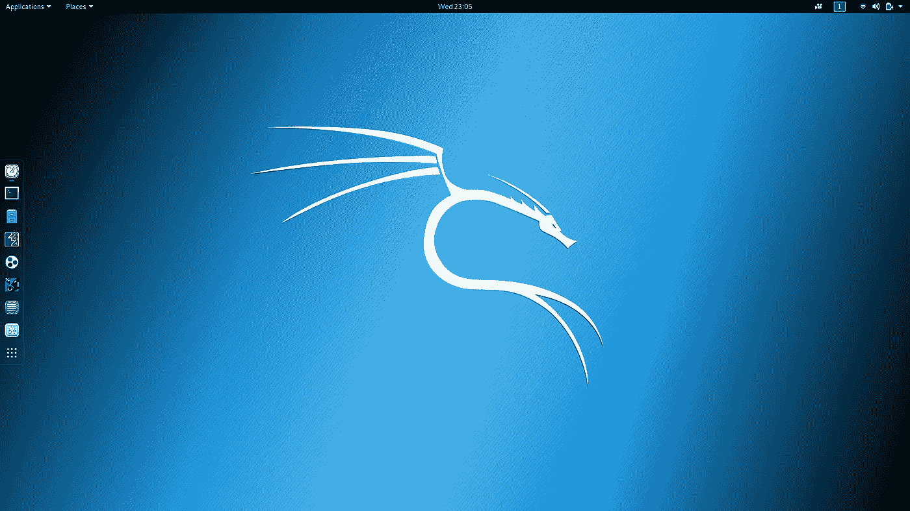

# 概括地说，渗透测试的操作系统；Kali Linux vs Parrot 安全操作系统

> 原文：<https://medium.com/hackernoon/operating-system-for-penetration-testing-in-a-nutshell-kali-linux-vs-parrot-security-os-384809e7b7ae>

## 概述了大多数安全专业人员使用的两种最流行的操作系统。

Photo by [Arget](https://unsplash.com/@arget?utm_source=medium&utm_medium=referral) on [Unsplash](https://unsplash.com?utm_source=medium&utm_medium=referral)

> 如果您是一名黑客、渗透测试人员、bug 赏金猎人或安全研究人员，那么您可能已经听说过各种适用于您的工作流的 Linux 发行版。

在我的研究工作和笔测试工作中，我经常使用这两种操作系统。linux 有一个异构的发行版集合，可以在市场上买到。但是大多数安全研究人员和渗透测试人员使用的最著名的发行版是 Kali Linux。Kali 以更新的形式经历了各种迭代，而另一个渗透测试网络安全相关的发行版也在世界各地开发，在本文中，我们将 Kali 与一个受到关注的发行版进行比较，即 ParrotOS。这种比较解释了两种操作系统的各种优缺点。

## 渗透测试不是关于使用工具，而是关于我们解决问题的技能。

# 什么是 Kali Linux？

Source: Google

Kali Linux 是基于 Debian 的 Linux 发行版，旨在进行高级渗透测试和安全审计。Kali 包含 600 多种预装工具，这些工具适用于各种信息安全任务，如渗透测试、安全研究、计算机取证、Web 应用程序测试和逆向工程。Kali Linux 由领先的信息安全培训公司进攻性安全公司开发和维护。它是作为一个改进的笔测试发行版开发的，将作为回溯操作系统的替代品。它于 2013 年 3 月 13 日发布，是回溯 Linux 的完整、自顶向下的重建，完全遵循 Debian 开发标准。

## 特征

**包含 600 多种渗透测试工具—** 它附带了来自安装本身的各种渗透测试工具，在检查了 BackTrack 中包含的每个工具后，它淘汰了大量工具，这些工具要么根本不起作用，要么与提供相同或相似功能的其他工具重复。

**多语言支持—** 尽管渗透工具倾向于用英语编写，但为了提高非英语母语用户的使用，Kali 包含了真正的多语言支持，允许更多用户使用他们的母语进行操作，并找到他们工作所需的工具。

**完全可定制—**Kali Linux 的初始设计不符合标准，因为外观和感觉都不太好，为了避免这个问题，Kali 已经尽可能方便我们更有冒险精神的用户定制他们喜欢的 Kali Linux，一直到内核。

**广泛的无线设备支持—**Linux 发行版的一个常见问题是支持无线接口。Kali Linux 支持尽可能多的无线设备，允许它在各种各样的硬件上正常运行，并与许多 USB 和其他无线设备兼容。

**定制内核，打了注入补丁—** 作为渗透测试人员，我们经常需要做无线评估和测试，所以我们的内核有最新的注入补丁。

**免费—** Kali Linux，可以像回溯一样免费使用，我们永远不需要为 Kali Linux 付费。

# parrot os 是什么？

Source: Google

Parrot Linux (Parrot Security，parrot OS，Parrot GNU/Linux)是一个基于 Debian 测试的免费开源 GNU/Linux 发行版，专为安全专家、开发人员和注重隐私的人设计。当我说基于 Debian 时，这意味着代码库遵循 Debian 开发标准。它包括一个完整的便携式武器库，用于 It 安全和数字取证操作，还包括您开发自己的程序或在网上冲浪时保护您的隐私所需的一切。该操作系统预装了 MATE 桌面环境，并有多种风格可供选择，以满足您的需求。

> Parrot OS 于 2013 年首次发布，由安全专家、Linux 爱好者和开源开发者组成的团队开发。该团队由洛伦佐·法勒特拉领导。

## 特征

**安全—** 它总是在更新，频繁发布并且完全**沙盒化**！一切都在我们的完全控制之下。

**免费—** 它是免费和开源的，我们可以查看源代码，并根据我们的要求进行定制。

**轻量级—** 这个操作系统已经被证明是极其轻量级的**，即使在非常旧的硬件上或者在资源非常有限的情况下，运行速度也惊人。**

# **Kali Linux vs Parrot Os**

**这两种操作系统的目的相同，即网络安全和渗透测试。在这种情况下，大多数因素都可以归结为个人品味的问题，而不是客观的比较。现在，在我们开始比较 ParrotOS 和 Kali Linux 之前，让我列出两个操作系统之间的相似之处。**

## **类似**

1.  **两个操作系统都针对渗透测试进行了调整。**
2.  **两种操作系统都支持 32 位和 64 位架构。**
3.  **两个操作系统都支持云 VPN。**
4.  **基于 Debian 开发标准。**
5.  **附带预装的黑客工具库。**
6.  **两种操作系统都支持嵌入式和物联网设备。**

****现在，让我们讨论两个操作系统之间的各种差异****

## ****ParrotOS vs Kali Linux:硬件要求****

****Parrot OS —****

1.  **不需要图形加速。**
2.  **最低需要 320 兆内存的**。****
3.  **最低需要 1GHZ 双核 CPU。**
4.  **它也可以在传统和 UEFI 模式下启动。**
5.  **安装操作系统至少需要 **16GB** 的硬盘空间。**

## **Kali Linux —**

1.  **需要图形加速。**
2.  **最少需要 1GB 内存。**
3.  **最低需要 1GHZ 双核 CPU。**
4.  **它也可以在传统和 UEFI 模式下启动。**
5.  **安装操作系统至少需要 **20GB** 的硬盘空间。**

**硬件要求是我们大多数时候忽略的东西，主要是因为我们知道我们的系统比最低硬件要求的计算机更强大。但是与 Kali 相比，Parrot 需要更低规格的硬件，这意味着它可以在低功耗的笔记本电脑和机器上运行。**

**这是我喜欢 Parrot sec 而不是 Kali Linux 的原因之一，但我喜欢并使用这两个系统，因为我说过这与你使用哪个操作系统或工具无关，这完全取决于你的技能。**

## **ParrotOS vs Kali Linux:外观和感觉**

**说到操作系统的外观和感觉，比起 Kali Linux，我更喜欢 parrot os，因为——**

****

**Source: Google**

**Parrot OS 的界面是使用 Ubuntu-Matte-Desktop-Environment 构建的。有两个清晰的部分。在顶部，你会看到一个包含应用程序、位置和系统的面板，这很像 Kali 本身。Parrot OS 还提供了一些关于 CPU 温度的有用信息以及一个使用图表。底部窗格包含菜单管理器和工作站管理器。**

**另一方面，Kali Linux 遵循 GNOME 桌面界面。在我看来，它与 parrot os 具有相同的功能，但没有提供同样干净、精致的外观。**

****

## **ParrotOS vs Kali Linux:黑客工具**

**说到通用工具和功能特性，Parrot OS 完胜 Kali Linux。Parrot OS 拥有 Kali Linux 中所有可用的工具，还添加了自己的工具。您可以在 ParrotOS 上找到一些 Kali Linux 上没有的工具。让我们讨论几个这样的工具—**

## **匿名冲浪**

****对黑客来说匿名是黑系统前的第一步。****

**你已经听过这句话了，每个黑客都会在午夜改变他的夜晚。
我不想过多赘述，但 parrot 已经预装并配置了 Anonsurf，所以如果你正在做一些偷偷摸摸的事情，想要匿名，只需一键即可隐身。**

## **Wifiphisher**

**这是一个流氓接入点框架，用于进行 Wi-Fi 安全测试。使用 Wifiphisher，渗透测试人员可以通过执行有针对性的 Wi-Fi 关联攻击，轻松实现针对无线客户端的中间人位置。Wifiphisher 还可用于对连接的客户端发起受害者定制的网络钓鱼攻击，以获取凭据或使受害者工作站感染恶意软件。**

## **ParrotOS vs Kali Linux:变体**

**这两个操作系统都有各种各样的变化，但 Parrot OS 在多样性方面要多得多。**

****卡莉 Linux —****

1.  **卡利完整版**
2.  **卡利简装版**
3.  **Kali armhf/armel(物联网设备)**
4.  **卡利桌面变体(e17/KDE/Xfce)**

****鹦鹉操作系统—****

1.  **Parrot Sec OS 完整版**
2.  **Parrot Sec 操作系统精简版**
3.  **Parrot Sec OS 工作室版**
4.  **Parrot Sec OS Air 版**

**正如我们所看到的，Parrot 有一些不同的特性，一个版本侧重于无线渗透测试(AIR ),另一个针对多媒体内容创建(studio)进行了调整。除此之外，它还发布了云支持和物联网设备支持。Kali 提供了基本的完整版和精简版以及自定义桌面界面(e17/KDE/Matter/LXDE)。Kali 还支持云和物联网设备。**

## **ParrotOS vs Kali Linux:性能**

**当我们谈到性能时，Kali 有点滞后，当你在低端系统上运行它时，有时当你在后台进行暴力攻击并做其他事情时，这是一个噩梦。但是 Parrot it 非常轻便，不会滞后太多。因为它也运行在低规格的系统上。**

# **结论**

**我希望你对 Parrot security OS 和 Kali Linux 有一个清楚的了解。我详细地讨论了关于这两个操作系统的几乎所有东西。但是选择一个操作系统是基于你的品味和选择，如果你有一个低规格的系统，我会强烈推荐使用 Parrot Sec OS。除此之外，随你喜欢。**

> **大多数人认为 Parrot 比 Kali Linux 有更多的工具，在 Parrot Os 中，我们可以很容易地设置匿名冲浪。但是我相信并且说的是**渗透测试不是关于建立工具，而是关于识别系统中的缺陷。****

**希望这有助于您了解 Kali Linux 和 Parrot 在渗透测试方面的各种差异。**

**如果你喜欢这篇文章，请点击拍手并给我留下你的宝贵反馈。**