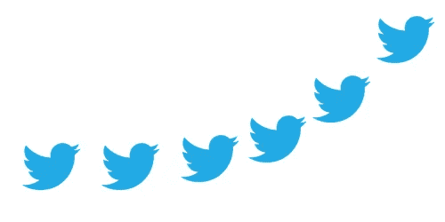

# 有机 Twitter 增长黑客:如何转发病毒视频

> 原文：<https://medium.com/hackernoon/organic-twitter-growth-hack-how-to-repost-viral-videos-761df9e92e67>

你可能有很多理由想要在 Twitter 上成长。也许你想建立你的个人品牌，也许你想在谈判有影响力的交易时获得更多的钱，或者也许你是那种在追随者数量中找到认可的人…我不是来评判的，我是来和你分享一个有助于你成长的技巧。

我关于如何在 Twitter 上发展的建议非常简单，100%合法(没有购买关注者或任何类似的废话)，而且很少被利用。你准备好小费了吗？这是:

# 快速转发病毒视频

快速转发病毒视频将有助于增加你的追随者，因为这是非常吸引人的内容。内容越吸引人，点赞和转发就越多，从而增加了整体覆盖面。你接触的用户越多，你就有越多的机会将人们转化为忠实的追随者。

为了获得最好的效果，在转发一个病毒式视频时，你应该试着做三件事:

1.  **速度**。你越快能够[转发](https://hackernoon.com/tagged/repost)这个病毒式的视频，你将获得越好的结果。这是因为视频播放的时间越长，观看视频的人就越多，用户第二次观看视频时就不太可能参与进来。
2.  **转帖>转发**。这意味着你必须做一点工作，使用像[twittervideodownloader.com](http://twittervideodownloader.com)这样的工具，然后在你发推文的时候上传(推特会注明原始海报，所以不用担心)。
3.  **添加自己的声音。**无论您是转发视频还是转发视频，添加一点文字都很重要，您可以在其中添加一些上下文或视频评论。

是的，就是这么简单。我们来看三个例子。

## 示例 1 —名人/影响者:

这是一个催人泪下、温暖人心的视频，在推特上爆红

这是詹姆斯·柯登两天后重新发布的视频

尽管它没有很快被转发，但惊人的个人评论帮助它成为他最喜欢的推文之一。

## 示例 2 —个人品牌:

原视频贴出

然后一周后(7 天！)它被 [jason](https://medium.com/u/94d84a13781c?source=post_page-----761df9e92e67--------------------------------) 转发，然后它获得了比原始视频更多的参与度，并成为他今年最喜欢的推文(他用英语推文可能有所帮助)。

## 示例 3 —品牌

这是 StockTwits 做了一些不同的事情，并发布了一个来自 2014 年的病毒视频[。这个策略在你转贴视频的时候效果最好，因为这段视频已经像病毒一样传播了很长时间。尽管如此，这条推文仍是 StockTwits 2018 年最受欢迎的推文。](https://knowyourmeme.com/memes/drop-the-cane-old-man-dancing)

希望你现在相信，快速转发病毒视频是制作吸引人的内容的好方法，吸引人的内容会增加你的影响力，从而增加追随者。现在问题变成了:

## 你是怎么找到这些内容的？

有三种方式:

1.  和一个实习生
2.  有了像 xZeitgeist.com[这样的工具](http://xzeitgeist.com)
3.  一个实习生拿着像 xZeitgeist.com* *(最好的方法)这样的工具

这种策略最适合已经拥有少量追随者的客户，但对所有规模的客户都有效。我希望这能有所帮助，并祝你在 Twitter 上一切顺利🎉📈

雅各布
附言:给 jacob@xzeitgeist.com 发邮件寻求折扣😉

*   *我是时代精神的创始人