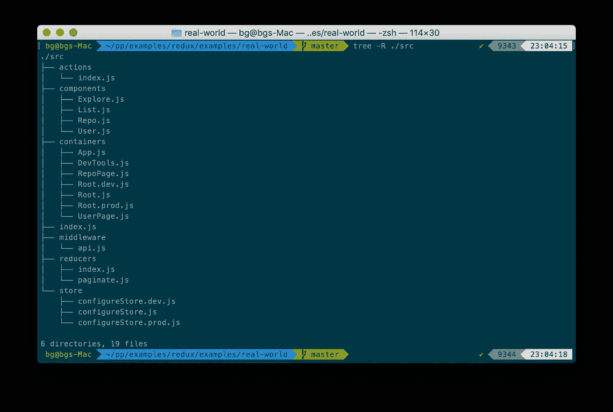
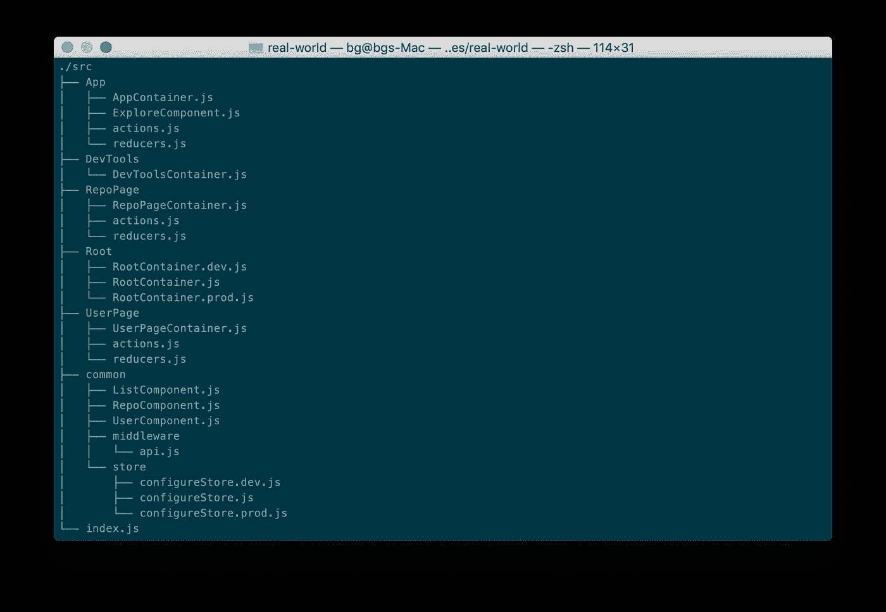
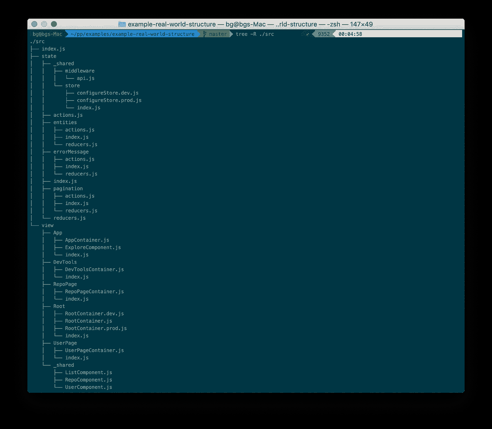

# 组织 React + Redux 应用程序的代码库，以便将来维护和扩展

> 原文：<https://medium.com/hackernoon/organizing-your-react-redux-applications-codebase-for-future-maintainability-and-extensibility-ba66f9ff7d6c>

## 随着 React + Redux 应用程序的范围、大小和特性集的增长，维护它的痛苦也在增加，特别是当您与一个大团队一起工作，并且有多人在您的应用程序中处理每个特性时。在本文中，我们将探讨如何组织您的代码库，以增加可维护性和可扩展性。


当您第一次开始编写新的 React 应用程序时，功能集很小，React API 很简单，但是足够灵活和强大，可以处理状态管理。然而，最终您的应用程序会变得更大，React 的`setState`在处理大型应用程序的状态管理方面的缺点变得很明显，令人痛苦。

因此，您做了一些研究，并发现 [Redux](https://redux.js.org/) 是您处理应用程序不断增长的状态管理需求的最佳选择。Redux 介绍`actions`、`actionCreators`、`reducers`、`middleware`、`stores`。由于这是一个 React 应用程序，您需要将 Redux 连接到 React 组件，因此您还需要使用 [React-Redux](https://react-redux.js.org/) 。将所有这些加起来，你的应用程序很快就会变成一大堆杂乱无章的代码，除非你正确地组织你的应用程序。

确保您的应用程序以易于整个团队理解的方式正确组织，可以在维护和扩展应用程序时为您节省大量时间和资源。在过去的三年多时间里，我一直在编写 React 应用程序，这些应用程序的复杂程度从简单到超复杂不等。

在开发这些应用程序的过程中，我尝试了多种组织 React 应用程序的方法，我认为我最终确定了提供易用性和可维护性最佳平衡的模式。我将这种组织应用程序的模式称为`State-View`模式。但在此之前，我们先来看看`State-View`模式，让我们先来看看我经历过的其他模式，以及为什么我发现它们有所欠缺。

**按功能/文件类型分组**

在 React + Redux 应用程序中，我们可以有多个不同类型的文件，每个文件执行一个特定的功能。例如，我们有从给定状态派生新状态的`reducers`和创建传递给`reducers`的`action`的`action`、`actionCreators`，保存应用程序状态并允许`components`订阅对存储的更改的`store`，创建在屏幕上呈现的视图的`presentational components`，完成大部分繁重工作并提供业务逻辑、持久性等的`container components`。

组织 React + Redux 应用程序的最常见方式是简单地按照文件的类型/功能对文件进行分组。这是绝大多数 React + Redux 应用程序的组织方式。如果你看看来自 Redux Github 库的[真实世界的例子](https://github.com/reduxjs/redux/tree/master/examples/real-world)，你会发现它是这样组织的。



在现实世界的示例项目中:

*   `configureStore.dev.js`、`configureStore.prod.js`是两个`stores`(根据应用的运行环境，只使用其中一个)，这些被分组在`store`目录下。
*   `index.js`和`paginate.js`均输出多个减速器，这些减速器被组合在`reducers`目录下。
*   `api.js`提供一个 Redux 中间件，用于对 Github 的 API 进行 API 调用，并对结果进行归一化。这位于`middleware`目录下。
*   各种`container components`被集中在`containers`目录下。
*   各种各样的`presentational components`被集中在`components`目录下。
*   这些动作都被定义在一个单独的`index.js`中，它位于`actions`目录下。
*   应用程序的入口点`index.js`直接放在了根上。

通过将具有相同功能的文件组合在一起来组织应用程序的优点是，您总是确切地知道特定类型的文件将在哪里。例如:如果您正在调试一个状态转换没有正确发生的问题，您知道状态转换唯一可能发生的地方是在一个`reducer`中，并且所有的`reducers`都位于`reducers`目录中。

只要您的应用程序很小，只有几个组件和相关的`actions`、`reducers`和`middleware`，这就很好。随着您的应用程序变得越来越大，您会发现自己在同一个目录中转储了越来越多的彼此无关的文件，并且检查这些文件以隔离特定的问题将开始消耗您更多的时间和资源。当多个开发人员在同一个代码库上工作，并且都接触同一个目录中的同一个文件以获得他们自己的单独功能时，这种情况只会加剧。

**按应用特性分组**

用“基于功能/类型的分组”方法来组织代码库的主要问题是，为了处理一个单一的特性，你必须处理分布在整个项目中多个不相关的目录中的文件。为了缓解这个问题，您可以通过将与应用程序的特定功能相关的文件分组在一起来组织 React + Redux 应用程序。

将同一个 Redux 真实示例修改为 group by application 特性将使它看起来像这样:



这里，我们将代码分成不同的“特性”:

*   `Root` -执行路由并呈现其他组件的根容器组件。因为它不维护或管理状态，所以它在目录中没有任何`actions`或`reducers`。我们还重命名了容器组件，并在文件后面加上了后缀`Container`，以表明它是一个`container`组件。
*   `App` -主要应用组件。因为它维护了一个状态来指示 API 调用是否出错，所以它在目录中有`actions.js`和`reducers.js`。您可能会注意到我们已经将`Explore`组件重命名为`ExploreComponent`。这是为了表明这是一个表象的组成部分。
*   `DevTools` -负责 DevTools，它记录每个动作转换时的状态。不管理它自己的任何状态，所以这个目录只包含组件。
*   `RepoPage`和`UserPage`——这些目录对应于`RepoPage`功能，列出回购的明星观察者，以及`UserPage`功能，列出用户拥有的回购。这些组件管理它们自己的状态，特别是它们管理应用程序状态对象的`entities`和`pagination`属性。记住，这一点很快会变得重要。
*   `common` -在多个特性之间共享的任何`component`、`middleware`、`reducer`或`action`都在这里。

这已经比“基于功能/类型的分组”好得多了。如果我们想要处理一个特定的特性，所有与该特性相关的文件都在同一个目录中。这包括`actions`、`reducers`、`presentational components`和`container components`。视图和状态相关的代码都位于同一个目录中，因此我们可以很容易地对特定的特性进行修改，而不必去修改五个不同目录中的五个不同的文件。

这种方法通常适用于状态项和视图之间存在一对一映射的应用程序。例如，在待办事项列表中，每个待办事项仅通过单个呈现组件显示在屏幕上的一个位置。因此，我们能够根据利用该状态的特性清楚地分离应用程序的状态，并且我们可以将相关的`actions`和`reducers`与该特性的视图组件组合在一起。

但是当状态项和视图组件之间的映射不是一对一的时候会发生什么呢？这正是我们正在分析的“真实世界 redux 示例”应用程序的情况。在这个应用中，`RepoPage`和`UserPage`功能都独立地使用状态对象的`entities`和`pagination`属性。这两个特征通过在它们之间共享相同的`actions`和`reducers`来读取和写入这些属性。

在这种情况下，我们如何将状态和视图组合在一起？哪些`actions`和`reducers`应该和`RepoPage`分在一组，哪些应该和`UserPage`分在一组？将与状态相关的代码，主要是`actions`和`reducers`用一个特性分组，打破了我们的分组模型，我们不再总是将与特定功能相关的所有代码放在一个目录中。将`actions`和`reducers`放在`common`中也会导致完全相同的问题。

**状态-视图模式**

最近，我一直在开发一个非常复杂的 React + Redux 应用程序，为此我尝试了一种组织应用程序代码库的新模式。这是组织代码的“基于特性的分组”方法的发展。基于特征的分组方法的唯一问题(尽管是主要问题)是状态的不可预测性，当状态与视图没有一一对应时。

为了消除这种不可预测性，我们将代码库分成两个独立的主目录，并且根据每个目录中的不同因素对文件进行分组。您可能已经猜到，这两个目录是`state`和`view`目录。

所有与状态管理相关的代码，包括所有的`actions`、`reducers`、`middleware`和`stores`都放在`state`目录中。所有其他代码都放在`view`目录中。那么这些目录是如何进一步组织的呢？

让我们首先看看当真实世界的 Redux 例子被重写以使用`State-View`模式时，整个应用程序结构是什么样子的:



有两个主目录`state`和`view`。我们先来探索一下`view`目录。

*   `Root` -执行路由和呈现其他组件的根容器组件。此处删除了所有与状态管理相关的代码，仅保留了特定于视图的代码。我们还重命名了容器组件，并在文件后面加上了后缀`Container`,表示它是一个`container`组件。
*   `App` -主要应用组件。你可能会注意到我们已经将组件`Explore`重命名为`ExploreComponent`。这是为了表明这是一个表象的组成部分。
*   `DevTools` -负责 DevTools，它记录每个动作转换时的状态。
*   `RepoPage`和`UserPage`——这些目录对应于`RepoPage`功能，列出回购的星级观察者，以及`UserPage`功能，列出用户拥有的回购。正如您所看到的，这些目录只包含视图组件，所有的`actions`和`reducers`都被删除了。
*   `_shared` -在多个特征之间共享的所有视图组件在这里被组合在一起。

如您所见，`view`目录的组织方式与应用程序在基于特性的分组模式中的组织方式极其相似。原因很简单。在基于特性的分组模式中组织`view`组件的方式没有真正的问题，所以我们只是让它保持原样。

现在我们来看看`state`目录。这是基于特征的分组模式的大部分变化发生的地方。首先，您会注意到`view`目录中子目录的名称与`state`目录中子目录的名称完全不一致。这完全是有意的，这样做是为了强调状态与视图没有一对一的映射。

我们不是按照应用程序特性来组织`state`目录内容，而是按照它们所负责的存储的属性来组织它们。在真实的 redux 示例中，应用程序的状态如下所示:

```
const state = { 
    errorMessage: null, 
    entities: {}, 
    pagination: {}
};
```

如果我们回到`state`目录，子目录对应于状态的属性。每个子目录都包含操作状态特定部分所需的`actions`和`reducers`。任何常用的共享项目，都放在`_shared`目录中。这些`actions`和`reducers`然后通过使用`state`目录中的`actions.js`和`reducers.js`文件被卷起并组合，然后由`index.js`导出。所以现在，如果我们需要在任何视图组件中使用特定的操作，我们可以这样要求它:

```
import { actions } from '../../state'; 
const { loadRepo, loadStargazers } = actions;
```

如果您想看看真实世界 redux 示例应用程序的`state-view`模式的代码，可以在 [Github](https://github.com/asleepysamurai/example-real-world-structure) 上找到源代码。

因此，我们有效地将状态相关代码的组织方式与视图相关代码的组织方式分离开来。由于状态现在不再与视图组合在一起，我们的代码又有了一个非常可预测的模式。任何与视图相关的代码将始终位于`view`目录中相应的特性子目录中。这些视图执行的任何状态操作都将位于子目录中，该子目录具有`state`目录中相应的状态属性名称。因此，只要您知道您的视图在哪里(根据它是特性的一部分，这应该很容易弄清楚)，您就可以很容易地弄清楚它影响什么状态以及相应的状态操作代码驻留在哪里。

万岁。我们已经恢复了 React + Redux 应用程序结构的可预测性，这将使我们能够维护和扩展我们的应用程序，比我们以前做的要容易得多。

我很想听听你对我在这篇文章中所写的东西的看法。所以，请在下面发表你的评论。

*原载于 2019 年 1 月 11 日*[*asleepysamurai.com*](https://asleepysamurai.com/articles/organizing-your-react-redux-codebase?import=medium)*。*