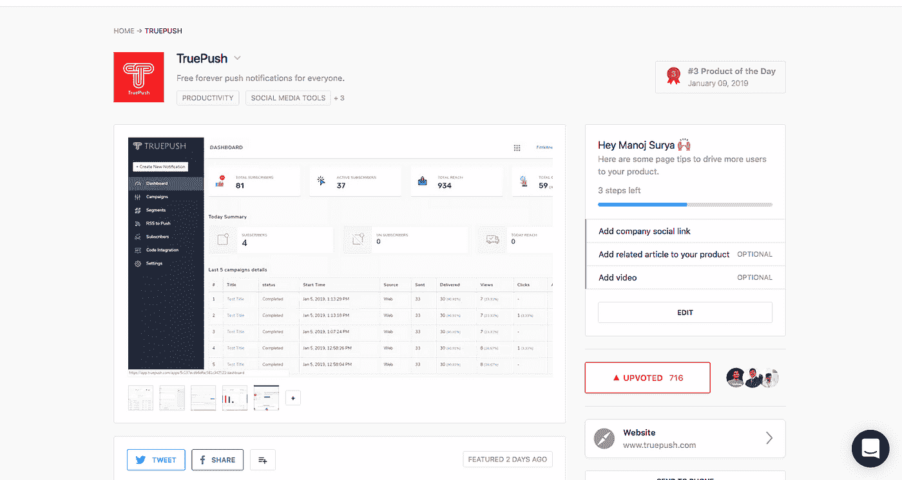
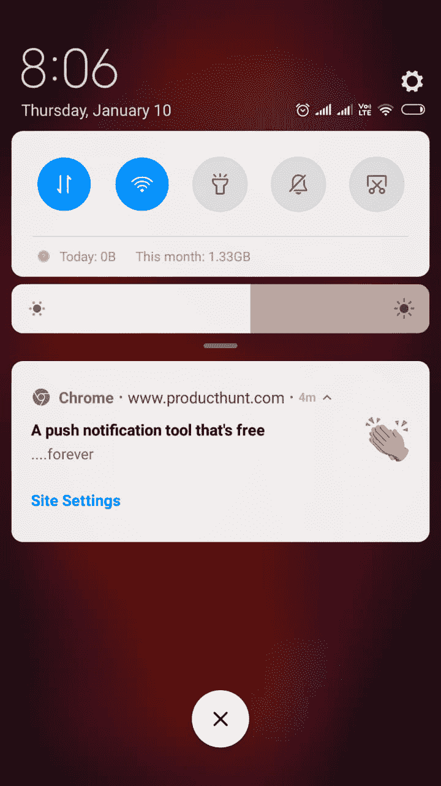
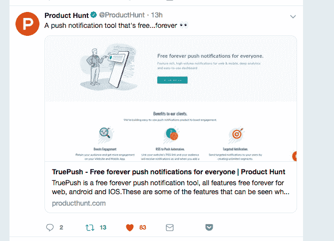
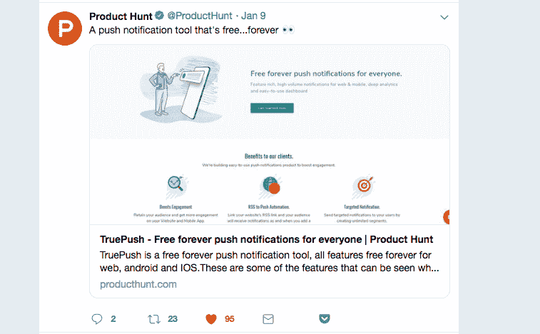
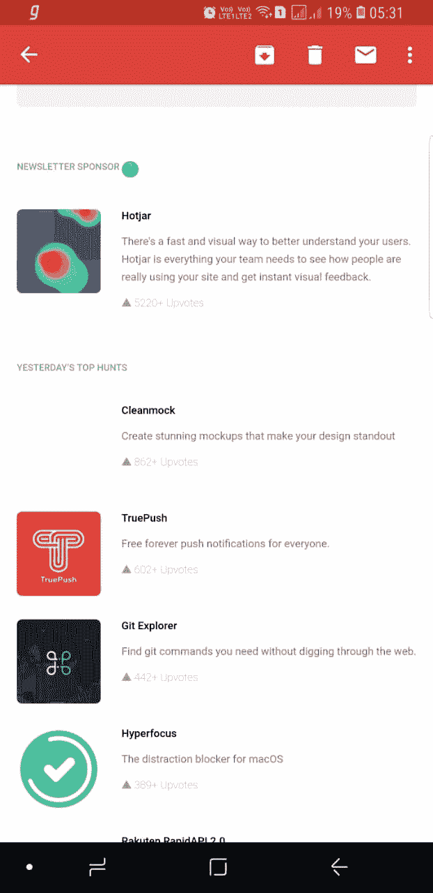

# 我们在 producthunt.com 3 号着陆的意外清单

> 原文：<https://medium.com/hackernoon/our-accidental-checklist-for-landing-on-3-on-producthunt-com-a0df54a7cd6f>

一个月前，我探讨了如何在寻找产品的过程中名列前十。根据我们的研究和一名团队成员的经验，我们最终列出了一个很大的待办事项清单，列在产品搜索的前十名。这似乎是一份详尽的清单，我们决定几个月后再做，因为这需要深思熟虑的计划和努力。你可以在网上找到很多这样的清单。

昨天，我们在产品搜索中获得了来自世界各地的 640 多张赞成票(还在继续),排名第三。尽管所有的清单都是常见的清单，但我们确实有一个对我们有利的不同的清单。在这之前，让我从头告诉你。

[https://www.producthunt.com/posts/truepush](https://www.producthunt.com/posts/truepush)

## 事情是这样的。

1.  我们早上创建了侧写
2.  意识到它在晚上以 73 票进入前 7 名
3.  我和我的同事在我们的小组中推广了这个产品，并获得了 100 多张投票
4.  意识到这是适得其反，然后请人们在产品搜索上搜索我们，并以 130+的票数或其他方式投票
5.  到了晚上，我们在 5 到 6 个位置之间波动，我们认为如果我们能超过 200 票就太好了
6.  到了早上，我们意识到已经到了 249 票，只差几票就能上升几个位置了。
7.  从社区、朋友和同事那里获得了所有的帮助(在这些团体中可能获得了超过 150 张选票)。
8.  ProductHunt 向所有订户发送了一份关于我们的通知，这更是火上浇油。

9.Product hunt 发了两次关于我们的推文(有趣的是，在我们之前和之后发推的其他产品没有多少赞，但我们比他们多 3-4 倍)

10.截止到下午，以 430 多张选票位居前三

11.到了晚上，它仍然继续下去，目前有 640 多票

12.第二天，他们在时事通讯中发了一封关于我们的邮件。

以下是我认为有效的方法，让我称之为我们的意外清单

1.  用好的截图做了一个简介
2.  我们制造了一个健壮的产品(这是对我们开发团队的赞扬)
3.  设计时尚(向我们的设计师 Pramodh 致敬)
4.  外展团队在回复问题和评论方面表现出色(向 Ravi 和团队致敬)
5.  我们有一个人们真正感兴趣的产品，我们意识到免费推送通知产品是全球观众都想尝试的。
6.  我们在时间和日期上很幸运(也许)
7.  产品搜索社区喜欢我们，也喜欢我们自己的海得拉巴社区，Way2 的同事们帮助我们推广它。
8.  向上投票的势头一直保持着，而且还在继续

特别感谢

*   Ravi 在[初创公司 Hyderabad 的一个通知上迅速向 1000 多人发送了关于我们的信息。](http://startuphyderabad.com/)
*   Startupbyte 的 Praveen、Chethan 和 Megha 帮助我们在他们所有的社交媒体手柄和用户群上推广它
*   T.H.E 集团肯定会为我们做出很大贡献，其他集团也值得一提——CIE、SLP、Startup Talks、TSaas
*   对于 Way2 的所有团队和领导团队来说，他们为这种即时获得团队投票的反应做出了很大贡献。
*   首先，也是最后一点，我们的团队非常努力地将产品推出，我认为我们已经开始看到市场对我们产品的病毒效应。由于市场上没有免费的推送通知，我们肯定会获得很大份额。

这是我们自豪的团队成员，打个招呼:) (我们从未点击过正式的图片，放了最好的一批)，感谢来自测试团队、营销团队和 way2 其他团队的支持团队成员。

成员从左至右依次为:普拉德维、吉拉尼、洛克什、马赫什、马诺伊、普拉文、纳加马尼、埃什瓦里、拉维、戴维、普拉莫德

将带着成长过程中发生的事情的详细清单，并在@【https://www.truepush.com/blog/[的详细博客中发布。订阅 truepush 通知以获取我们发布博客的更新。](https://www.truepush.com/blog/)