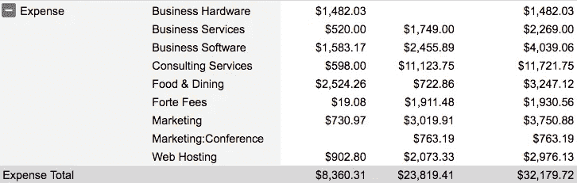
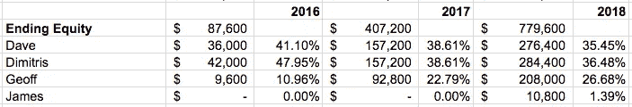
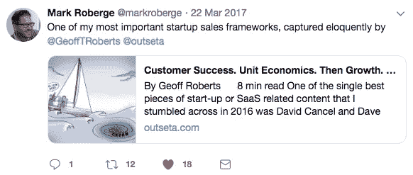
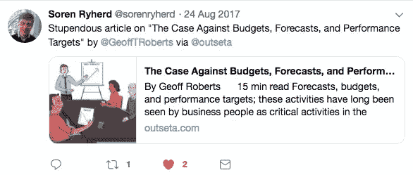
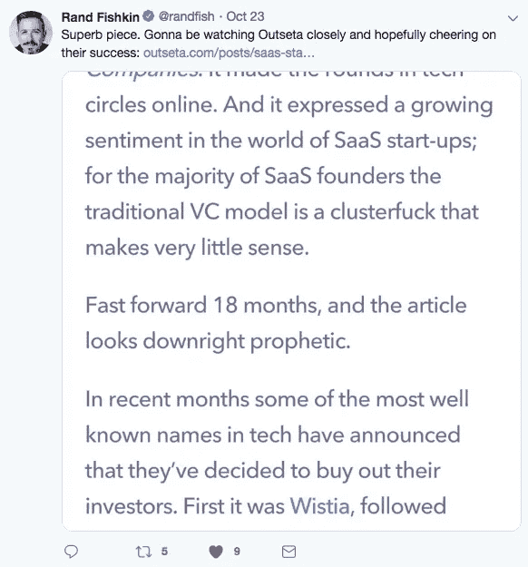
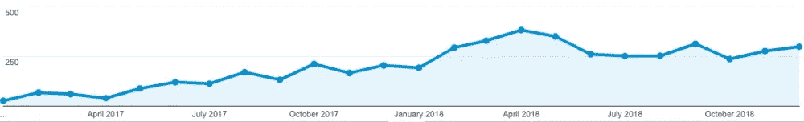
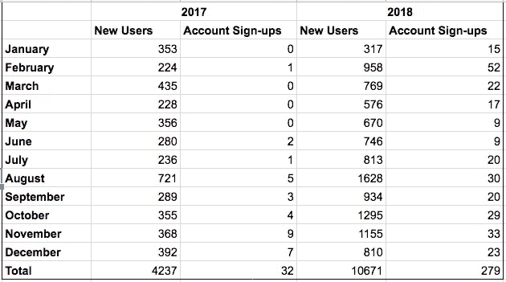

# 我们的 SaaS 初创公司两年后的费用、股权分配和内容营销结果

> 原文：<https://medium.com/hackernoon/our-saas-start-ups-expenses-equity-allocation-and-content-marketing-results-after-two-years-29b27564a793>

今天是我们发布[我们的发布公告](https://www.outseta.com/posts/2017/1/10/meet-our-new-software-start-up-outseta)的两周年纪念日，向全世界公布了我们建造 [Outseta](http://www.outseta.com/) 的计划。虽然我们坚持每月发布更新，让我们的客户和观众了解我们的进展，但两年里程碑是一个很好的机会，让我们更广泛地分享我们做出的一些决定和取得的成就。我希望这是一个有用的晴雨表，显示 SaaS 其他拥有同样雄心勃勃项目的创业公司的进展。

让我们直入主题吧，从我们在这项业务上花了多少钱开始。

# 费用

我们过去曾写过关于我们决定[启动公司](https://www.outseta.com/posts/saas-start-ups-quest-for-independent-growth)的文章，并公开分享了我们的[运营协议](https://www.outseta.com/posts/outseta-saas-operating-agreement)，以便客户和潜在员工都能理解我们如何做出财务决策。Dimitris、Dave 和我自己还没有给自己发工资，而是用我们的时间来换取生意中的汗水。我们已经努力做到极其严格的财务纪律，抵制过早投资增长的冲动。

Expenses for 2017, 2018, then total.

迄今为止，我们已经花费了 32，179.72 美元来建设 Outseta——2017 年大约花费了 8，000 美元，2018 年花费了 24，000 美元。我们在 2017 年的大部分支出都与构建产品所需的软件和开发基础设施有关。食物和餐饮是我们今年最大的项目——我们承认在这方面有点忘乎所以，所以我们回到了 2018 年。值得注意的是，当迪米特里斯侧着身子时，他仍然是看不见的。

在 2018 年，你会注意到一些行项目显著增长。我们花在咨询服务上的 11，123.75 美元主要是与设计相关的费用，因为 [James Lavine](https://www.linkedin.com/in/jameslavine/) 开始与我们合作。我们知道我们需要比我们所能负担的更多的设计带宽，所以詹姆斯一直在为工资和股权的结合而努力(稍后会有更多)。

Forte 费用代表与我们支持的支付网关之一 Forte 支付系统相关的支付处理成本。我们在营销方面投资了大约 3000 美元，其中大部分与我们在 Linkedin、Twitter 和谷歌广告上进行的付费客户获取实验有关。我们还第一次报名参加了[MicroConf](https://www.microconf.com/)——这是 2018 年发生的费用，尽管该活动是在今年 3 月举行的。

# 股权分配

我们能够将开支控制在如此低的水平的原因之一是，戴夫、迪米特里斯和我自己还没有拿过任何薪水。我们在 Outseta 投入的任何时间和金钱都是为了换取公司的股权。当我们在 2018 年初将詹姆斯加入团队时，我们要求他每月帮助我们 20 个小时。我们已经为他每个月 8 小时的工作时间支付了工资，而他每个月已经在生意中赚了价值 12 小时的汗水。以下是 Outseta 今天的股票走势。

Dave 和 Dimitris 在 2016 年底花了一些时间建立我们的开发基础设施，并在 2017 年全年投入更多时间在业务上，因为他们致力于提供我们最基本的可行产品。我们的创始团队在 2018 年全年工作了相同的时间，但戴夫和迪米特里斯也投入了一些现金来支付我们的运营费用，这解释了你在我们每个人之间的股权分配中看到的差异。

戴夫、迪米特里斯和我自己将在 2019 年开始给自己支付名义工资——在我们下一次的公司更新中会有更多的介绍。

# 产品

在产品方面，我们都对取得的进步感到非常兴奋。2017 年我们完全专注于实现我们的 MVP。我们于 2018 年 1 月 1 日开始营销和销售我们的 MVP，同时继续构建产品的核心功能。

Dimitris 主要关注后端开发，而 Dave 同时负责后端和前端工作。詹姆斯的设计工作在 2018 年大幅提升了用户界面的可用性和完善性。到目前为止，我们已经构建了功能性产品，包括…

当我们最初研究 Outseta 时，我们设想 SaaS 指标和报告是平台的关键部分。虽然我们仍然打算构建这些功能，但我们降低了它们的优先级，因为有(并将继续有)许多功能与我们的客户更直接相关。我们已经为报告准备好了基础设施和设计，但在 2019 年，我们将主要关注 CRM 的其他改进。

总的来说，产品的核心功能已经到位。现在，我们将通过添加功能，使我们更接近于与我们竞争的单点解决方案(只要它与 SaaS 的初创企业特别相关)的功能对等，来专注于更深入地了解它们。

# 营销策略和结果

除了大约 2，000 美元用于测试付费在线广告之外，我们在过去两年的营销努力完全集中在“免费”渠道上。这包括:

1.  在产品搜索和测试列表上推出 Outseta
2.  电子邮件潜在客户
3.  内容营销

推出产品搜索和测试列表是值得的——这些渠道提供了网站流量和账户注册的一次性高峰，是激发一些早期用户的好方法。在我们推出产品搜索的那天，我们看到的网站流量超过了过去两年中的任何一天，产品搜索和 BetaList 的推出都导致了 30 多个帐户的注册。

除了这些发布之外，其他主要的流量高峰是另一家公司在 Hackernoon 上发表的[博客帖子的结果，该帖子表现非常好，并链接到我们自己的博客帖子和我们在自己的博客上发表的最成功的文章之一](https://hackernoon.com/8-mistakes-we-made-in-our-companys-first-8-years-3d38422333b) [4 SaaS 初创企业及其对独立增长的追求](https://www.outseta.com/posts/saas-start-ups-quest-for-independent-growth)。

从营销角度来看，电子邮件潜在客户是我们的第二大任务。我的[电子邮件潜在客户方法](https://www.outseta.com/posts/email-prospecting-how-to-achieve-a-40-response-rate-on-cold-emails)非常耗时，但在开始销售对话时很有效。

发送的电子邮件: 452 封

**回复:** 162

演示: 54

虽然电子邮件潜在客户的确开启了我们 2018 年的大部分销售对话，但回想起来，我希望我在这里花的时间少一些。虽然我认为这是一个适合我们所处阶段的策略——我的目标基本上是在不花钱的情况下获得少量早期客户——但如果我可以再做一次，我会将更多时间放在能够带来长期、可持续收益的领域。比如内容营销。

# 内容营销结果

在过去的两年里，内容营销是我花费了大量时间和精力的地方——在我们有任何产品出售之前，我就开始了这些努力。我们的策略非常简单——我们每月发布一次公司动态(除非我们真的有值得观众关注的东西),并且每月发布一篇主要与 SaaS 成长型初创企业相关的帖子。

我们在 2017 年共发布了 27 篇帖子，在 2018 年发布了 16 篇帖子，其中包括来自 Kissmetrics、Crazy Egg 和 Capterra 等公司的博客上的一些客座帖子。这是我们的[内容日历](https://docs.google.com/spreadsheets/u/2/d/1LHxJ-Vl0HJM8pefTJdxFLTQiY8LLzjMMCd7zX4pBY6c/edit#gid=394366456)，上面有我们发布的所有帖子的历史，或者你可以在我们的[博客上查看其中的大部分。](https://www.outseta.com/blog/)我们发布的大部分内容要么突出了我们自己的创业历程，要么是经过深入研究的 2000-3000 字的长篇内容。迄今为止，我们表现最好的帖子有:

我选择投资内容营销有几个原因。

*   我们在写作方面有一些内在的能力。我本科时主修写作，并将写作视为我的强项之一。
*   我们在玩长线游戏——我们开始用一种真正的 10 年以上的心态来打造 Outseta。大约 18 个月后，我们开始感受到我们的内容的影响，因为这种心态，这是可以的。
*   我认为内容营销是对我们品牌的投资。
*   我认为内容营销是建立可持续的有机流量的长期投资。

那么我们的情况如何呢？

简而言之，我对我们的内容营销为我们的品牌所做的一切非常满意。在相对较短的时间内，我们发展了一个人数不多但高度参与的受众群体。我已经从我钦佩的人和我信任的人那里得到了很多关于我们发表的文章的积极反馈。

随着我们的不断发展，将我们的内容营销投资与收入挂钩是最重要的，但作为一家早期公司，我购买了一个名为[主动回复率](http://jayacunzo.com/blog/urr-a-metric-to-save-content-marketing-from-making-more-crap)的指标(向 Jay Acunzo 大声疾呼，推广这一措施)。这只是一个简单的衡量标准，在我发布每一条内容后，有多少人主动给我发来评论或留言。我们都很忙，所以如果有人特意发来一张纸条，上面写着，“嘿，这篇文章很棒，而且/或者帮助了我”，这是一个很好的迹象，表明内容正在引起共鸣，并提供价值。

再加上我们的出版节奏，我很自豪我们在许多人的收件箱中赢得了“这些帖子值得一读”的位置。更重要的是，在衡量投资回报率方面，2018 年第四季度的几乎每个账户注册都是现有用户的推荐，或者是专门提到他们通过我们发表的一篇文章找到我们的人。

虽然积极的反馈很好，但我肯定没有花足够的时间投资于我所谓的“深思熟虑的 SEO”我花了很少的时间在有意识的链接建设推广，进一步优化目标关键字的旧帖子，或者主要为 SEO 利益或潜力而设计的内容项目上。今年早些时候，我问 SEO 专家 Neil Patel [我应该花多少时间在链接建设上，他建议每周 5 小时——我肯定没有这样做。](https://www.outseta.com/posts/seo-experts-on-link-building-and-keyword-research-for-saas-start-ups)

虽然我已经相当积极地推广了我的帖子(没有付费推广)，但我的假设基本上是，“专注于创造令人敬畏的高质量内容和链接，自然流量就会随之而来。”虽然这被证明是真的，我们的有机流量已经增长，outseta.com 仍然是一个低流量的网站——我知道我们可以更快地增长有机流量。

我认为我们正坐在一个黄金机会上，在这个领域多花一点时间，对我们来说大幅增加我们的网站流量应该是相对容易的。随着我们在 2019 年寻求更积极的增长，这是我需要花更多时间的一个领域。

在 SEO 上没有花太多时间，我们的网站流量从 2017 年的大约 4000 个独立访客增加到 2018 年的超过 10000 个独立访客。更重要的是，账户注册从 2017 年的 32 个增长到 2018 年的 279 个。

# 客户和收入

好吧，好吧，我知道你在想什么。所有这些都很棒，但是 Outseta 在客户和收入方面做得怎么样呢？

我们没有公开分享我们的客户数量和收入，只是因为我们还没有真正投资于增长。到目前为止，我们签约的大多数公司都是机会主义者或外来者。我们的数字仍然很小，但我们很高兴[与任何询问](https://www.outseta.com/posts/handling-startup-objections)的潜在客户分享这些数字。

最重要的是，我们非常努力地保持耐心，并遵循 Mark Roberge 的框架:

客户成功。*然后是*单位经济学。*然后*成长。

进入 2019 年，产品和公司正处于我们准备加大投资增长的阶段。我们最近接手了一个项目，主要是提供种子资金来支持这些即将到来的投资，我们将在下一次公司更新中详细介绍这一决定。

我们还承诺在今年晚些时候首次分享客户和收入更新，同时推出 Outseta 的报告功能。敬请关注，你可以让我们对此负责！

# 我们希望我们的现实是有帮助的

我们希望分享这些信息，因为在科技初创企业的世界里，股权分配和费用等话题往往是秘密的。除此之外，我们的社交媒体经常充斥着由名人企业家创立的一小撮成功的、有大量风险投资支持的公司的成果和业绩指标。

虽然我们的衡量标准和费用绝不令人惊讶，但我们认为从产品到营销，我们都在一点一点地削减，朝着正确的方向缓慢而稳步地前进。如果你是一个由“普通”创业者组成的团队，正在把一个兼职项目变成一个全职项目，我们希望这篇文章既能有所帮助，又能反映现实通常是什么样子。欢迎任何问题！

*最初发表于*[*【www.outseta.com】*](https://www.outseta.com/posts/outseta-two-year-update)*。*