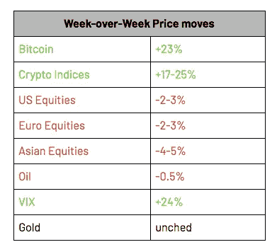

# 我们的两个 Satoshis:为什么加密优于所有其他资产类别

> 原文：<https://medium.com/hackernoon/our-two-satoshis-why-crypto-is-outperforming-every-other-asset-class-f47fb350f50f>

本周密码市场发生了什么？

**那很突然**

在美国宣布将对 2000 亿美元的中国进口商品征收 10%至 25%的关税后，全球股市今年首次陷入困境。因此，很自然地，[比特币](https://hackernoon.com/tagged/bitcoin)和其他加密技术的周环比增长率为… +23%？

***再看看上面的数字。***

我们已经打了一段时间的“*加密与任何其他资产类别*都不相关”的鼓，但即使是我们也对上周的举动感到震惊，尤其是在面对负面的加密特定消息以及股票波动的情况下。

在今年以来的新高中，加密涨势实际上被两次剧烈但短暂的周内抛售所阻止。周二晚上，世界上最大的加密交易所遭受黑客攻击，超过 7000 比特币(约 4200 万美元)从币安的多个客户账户中被盗。自然，加密市场下跌，但在购买恢复之前，这是一个令人惊讶的快速 3%的抛售。本周晚些时候，继周六上午再次大幅上涨后，crypto 在周六晚上再次抛售，这次下跌了近 10%。但再次，下跌被迅速吞噬，市场似乎决心再次挽回这些损失。

**被压抑的需求**

金融媒体一周都在争相解释为什么比特币和其他加密技术的表现优于所有其他资产类别(例如，我们在这里引用了和[这里引用了](https://www.cnbc.com/2019/05/10/bitcoin-tops-6400-up-12percent-in-a-week.html))。但是对于我们这些关注长期的人来说，这些(除了加速的速度)都不应该是一个大惊喜。已经建了几个月了。

回想一下，本轮反弹的核心始于 4 月 1 日，当时 BTC 股市一天上涨了 18%。很简单，买家多于卖家，做市商感受到了不平衡的压力，所以他们抬高了市场，这引发了算法，止损和清算，这只会增加更多的购买压力。在高收益债券或新兴市场股票等其他非流动性资产类别中，这种快速爆发将持续几天，直到市场达到更加平衡的均衡状态。令人惊讶的是，40 多天后，面对许多坏消息(币安黑客、Bitfinex/Tether 偿付能力问题、新的 FinCEN 指南)，我们现在又反弹了 30%，但可能仍然没有找到平衡。

这种反弹持续了几个月，因为围绕 crypto 的积极事件超过了消极风险。更重要的是，负面因素主要是一次性的“黑天鹅”事件，当它们发生时会产生尾部风险，但不会持久(交易所黑客攻击、SEC 的负面裁决、股票市场内爆)，而正面因素是导致持续增长的长期改变游戏规则的事件(改善的基础设施、大型金融机构进入该领域、更好的 UI/UX、通货膨胀的全球货币)。此外，在某些方面，政治不稳定实际上进一步推动了股市上涨。从现代货币理论(MMT)的兴起，到美联储的持续操纵，再到对资本管制和财产没收的日益担忧，一切都预示着一个非主权、供应受限的数字价值存储。

这就是当所有的好消息被忽略一整年并被藏起来时会发生的事情。我们现在处于一个所有坏消息都被忽视和忽略的时期。然而，保持一些观点是很重要的。即使在这次反弹之后，市场也只是回到了 2018 年 11 月的水平。比特币可能在几个月内上涨了 100%，但仍比 ATHs 低 65%(这意味着，100%的上涨几乎没有削弱去年的损失)。

一场健康而激烈的集会

在比特币上涨 23%的一周里，重要的是要认识到仍有许多其他赢家和输家。这不是一次大范围的市场反弹。许多代币在本周结束时大幅走低，并保持在 MTD 的深度负值区域。例如，币安硬币(BNB)上周下跌了 10%(随市场反弹)，这一举动在币安黑客攻击后是有道理的。

作为这种分歧和错位的结果，数字资产之间的相关性已经被打破。这些都是一个健康和成熟市场的迹象，尽管整个市场正在飙升，创造了可能让投资者既害怕又兴奋的高标题数字。

展望未来，本周是[区块链](https://hackernoon.com/tagged/blockchain)周和 Consensus，这是今年最大的加密会议之一。回想 2017 年，当 crypto 只是炒作而没有实质内容时，市场围绕共识反弹。2018 年，共识没有任何实际效果，因为猖獗的恐惧淹没了基本面的改善。我们现在怀着复杂的心情进入 2019 年的活动——这应该有助于区分炒作和实质。

**响当当的大佬**

在这一周，我们带回了 2017 年牛市的不太遥远的记忆，我们再次看到比特币超过了市场的大多数(+24%)。这些连续几周的上涨让比特币再次成为公众关注的焦点，但在更广泛的加密市场中，还有一些规模相当大、不相关的波动相对没有引起人们的注意。

*   币安硬币(BNB)上周下跌 10%，最终在上周反弹上涨 2%，尽管其交易所被[黑客攻击](https://binance.zendesk.com/hc/en-us/articles/360028031711-Binance-Security-Breach-Update)。早期的调查结果表明，黑客攻击来自被网络钓鱼的用户，而不是由于 exchange 软件的严重故障。对于那些觉得 BNB 在负面事件发生后的一周上涨很奇怪的人来说，值得注意的是 BNB 的主要市场是对 BTC(～+45%)，因此尽管它对美元上涨了 2%，但对比特币下跌了 18%。
*   在宣布与海德拉和 IOST 的两项合作后，Chainlink 公司本周表现强劲(+31%)。Chainlink 是一个中间件解决方案，提供分散的 oracle 服务，在区块链和非区块链产品中都有潜在的应用。随着关于他们的主网的谣言在达成共识之前流传，公众情绪最近一直很高。
*   以太坊(ETH)本周表现强劲，上涨了 17%。周一有消息称，CFTC 准备批准以太坊期货，这对整个空间来说是一个积极的信号。这一消息很快被比特币的重大进展所掩盖，但每个人都应该继续关注这一正面消息，为以太坊和蓬勃发展的空间提供更多可信度。

**本周我们要读的内容**

[富达向机构投资者提供交易](https://www.bloomberg.com/news/articles/2019-05-06/fidelity-said-to-offer-cryptocurrency-trading-within-a-few-weeks)

富达投资(Fidelity Investments)上周宣布，除了托管服务，这家财富管理巨头还将为机构投资者提供通过其平台交易比特币的能力。对机构的关注使富达有别于 Etrade 和 Robinhood，后者是向零售客户群提供加密交易的券商。富达暗示，他们提供的服务是基于客户的需求——事实上，这对于正在寻找买卖和持有比特币方法的加密机构来说非常有利。

[CFTC 表示他们将批准 ETH 期货](https://www.coindesk.com/cftc-would-approve-ether-futures-if-asked-insider-says)

来自 CFTC 的消息称，该集团正在认真考虑允许创建以太坊期货合约，类似于目前通过 CBOE 和芝加哥商业交易所提供的 BTC 合约。理论上，增加以太坊合约将允许金融机构获得以太坊的风险敞口，而无需实际购买和存储资产。也有人担心，如果以太坊现货市场获得批准，CFTC 可能会授予他们监管权。

[fin cen 更新的加密指南](https://www.fincen.gov/sites/default/files/2019-05/FinCEN%20CVC%20Guidance%20FINAL.pdf)

金融犯罪执法网络(FinCEN)上周发布了针对可能被视为资金转移企业(msb)的公司、dapps 和个人的指导意见。他们将 msb 描述为那些“接受和传递价值”的组织，这将要求这些组织遵守《银行保密法》并执行反洗钱/KYC。这一指导的含义是深远的，影响钱包，分散交易所，甚至 dapps。

[科技股 IPO 涓滴效应](/vision-hill-blog/2019-tech-ipos-boom-for-crypto-8e59aaf3f67)

2019 年大量科技 IPO 可能对数字资产产生哪些积极影响？Vision Hill 探讨了这样一种可能性，即随着所有新资本分配给这些科技巨头的早期员工和风投——优步、Lyft、Slack、WeWork 等——其中一些资本最终将成为数字资产。只有时间能告诉我们这种新财富的分布会是什么样子，然而，在这样一个年轻的发展中市场，数字资产的再投资是非常可能的。

[区块链颁发的文凭](https://www.channelnewsasia.com/news/singapore/students-graduating-tamper-resistant-digital-certificates-11499166)

结合区块链平台 OpenCerts，新加坡将成为第一个在全国范围内使用区块链在当地学校发放数字证书的国家。该倡议为即将毕业的学生提供了一个加密证明，可用于验证他们的学校证书，而不必在每次申请工作或深造时直接从学校订购经认证的副本。该项目被誉为利用区块链技术的“实用方法”。

[启动数字关闭区块链上的 10 亿美元信用额度](https://www.coindesk.com/mike-cagneys-startup-closes-1-billion-credit-line-on-a-blockchain)

Figure 是由前 SoFi 首席执行官 Mike Cagney 创立的创业公司，该公司在区块链关闭了 10 亿美元的信用额度。Jeffries 发行的信用额度将定期延长，并由 Figure 的房屋净值额度担保。Figure 的平台促进了区块链所有房屋贷款的发放和融资。这一信贷额度是通过区块链技术将这些类型的资产证券化的重要一步，大大降低了成本，提高了效率。

[禁止加密货币？](https://dcebrief.com/u-s-congressman-urges-ban-on-cryptocurrency/)

这是上周来自[的美国国会议员 Brad Sherman](https://twitter.com/coincenter/status/1126574631605997569) 的真实提议。忽略提出这种立法的理由(加密在国际上规避美元的权力)，那些了解加密基础的人知道彻底禁止是荒谬的，如果不是不可能的话。加密是分散的，因此不受包括美国政府在内的政府实体的影响和管辖，对加密的禁令只会扼杀创新。

***这就是我们的两只小智！***

*感谢大家的阅读！问题或意见，请告诉我们。*

**Arca 投资组合管理团队**

*杰夫·多尔曼，CFA——首席投资官* *凯蒂·塔拉蒂——研究主管
哈桑·巴西里，CFA——项目经理/分析师
萨沙·弗莱斯曼——交易员*

*原载于*[*https://www . ar . ca*](https://www.ar.ca/blog/crypto-market-recap-05-13-19)*。*

***免责声明:*** *本评论仅作为一般信息提供，绝不作为投资建议、投资研究、研究报告或建议。对本评论中讨论的证券进行投资或采取任何其他行动的任何决定可能涉及本文未讨论的风险，此类决定不应仅基于本文包含的信息。*

*本沟通中的陈述可能包括前瞻性信息和/或可能基于各种假设。此处表达的前瞻性陈述和其他观点或意见是在本出版物发布之日做出的。实际的未来结果或事件可能与预期的有很大不同，并且不能保证任何特定的结果会发生。本文中的陈述可能会随时更改。Arca Funds 不承担更新或修改此处表达的任何声明或观点的任何义务。*

*在考虑本注释中包含的任何绩效信息时，应注意过去的绩效并不能保证将来的结果，也不能保证将来的结果会实现。此处提供的部分或全部信息可能是或基于观点陈述。此外，此处提供的某些信息可能基于第三方来源，这些信息虽然被认为是准确的，但尚未经过独立验证。Arca 基金和/或其某些分支机构和/或客户持有并且将来可能持有与本评论中讨论的证券相同或基本相似的证券的财务权益。对于此类金融权益的盈利能力，无论是现在、过去还是将来，都不做任何声明，Arca 基金和/或其客户可以随时出售此类金融权益。此处提供的信息无意也不应被解释为出售或购买任何证券的要约。本注释未经任何监管机构审核或批准，且在编制时未考虑可能收到本注释的个人的财务状况或目标。特定投资或策略的适当性将取决于投资者的个人情况和目标。*