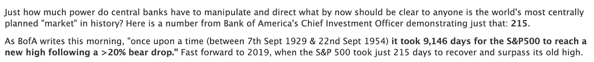
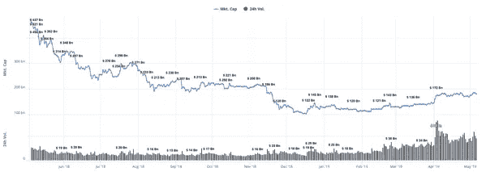
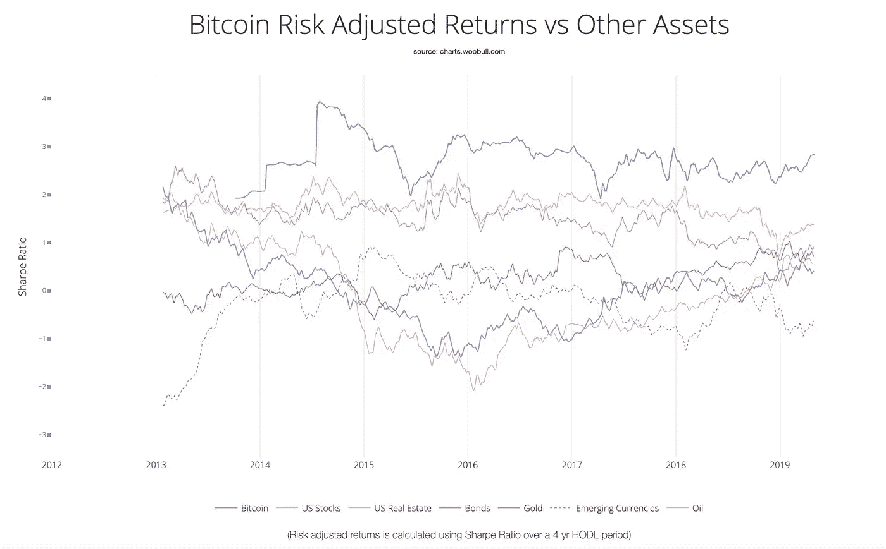
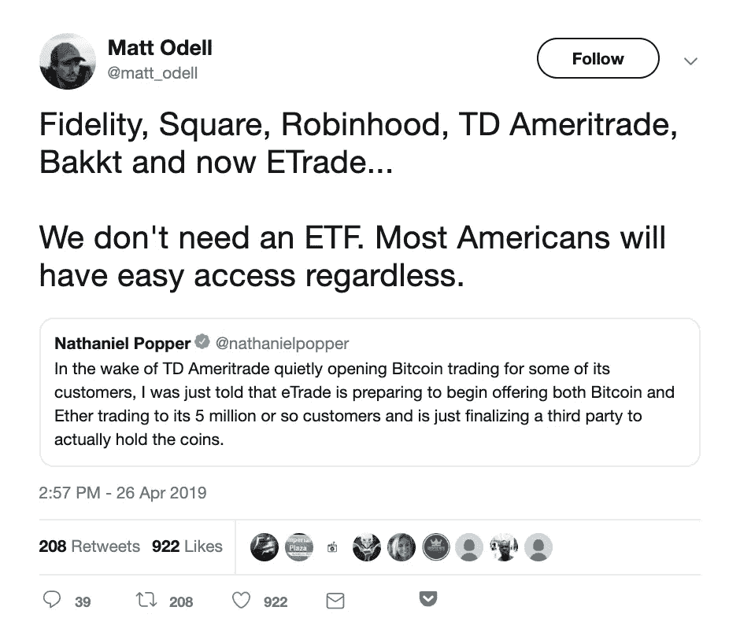
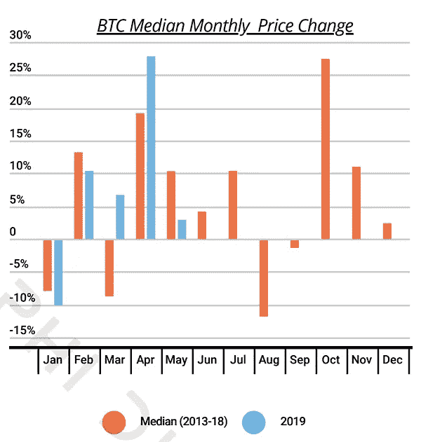
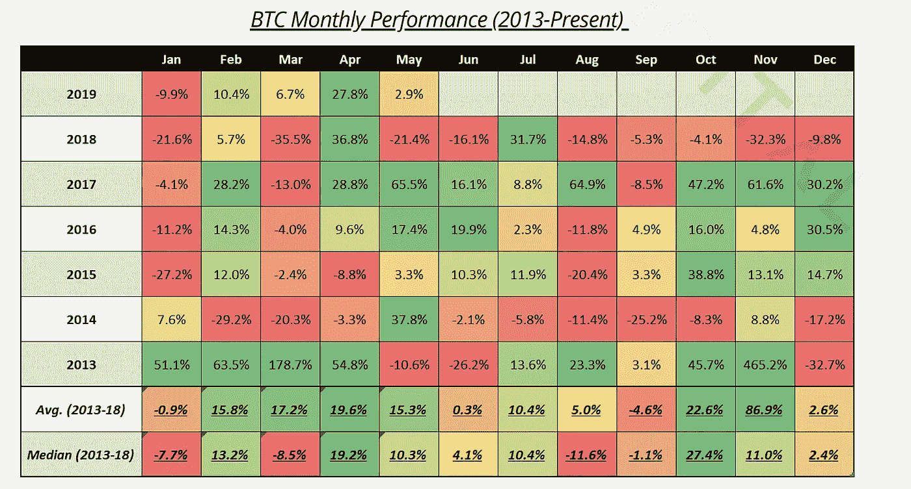
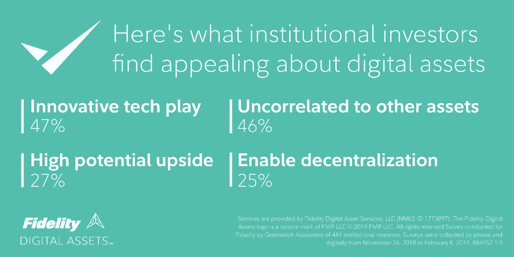

# 我们两个 Satoshis 的价值:Bitfinex 代币销售是辉煌的

> 原文：<https://medium.com/hackernoon/our-two-satoshis-worth-the-bitfinex-token-sale-is-brilliant-c7c544f51922>

最好的防守是有效的进攻

好于预期的经济数据(强劲的就业报告)和美联储决定维持利率不变，直到通胀指标与我们其他人每天的感受相符，这两个因素提振了风险资产。在此背景下，美股继续创新高。美洲银行(和 Zerohedge) [指出这种逆转的速度是多么的荒谬:](https://www.zerohedge.com/news/2019-05-03/bofa-1954-it-took-25-years-now-it-took-just-215-days)

但是 Arca 的大卫·内奇[指出了这次股票反弹是如何制造出来的。今年迄今为止，美国公司已经购买了 2720 亿美元的自己的股票，有望打破 2018 年创下的 1.085 万亿美元的纪录。与此同时，股票基金在 2019 年迄今已流出 40 亿美元，超过了 2018 年全年的 29 亿美元，当时标准普尔 500 指数下跌了 6%。](https://twitter.com/DavidJN79/status/1123919337163776001)

加密价格上周也继续上涨，比特币再次领涨，周环比上涨 8%，推动年初至今回报率超过 50%。但与迅速而异常的股市反弹不同，比特币的反弹是由于新参与者的实际购买压力。[交易量](https://www.bloomberg.com/news/articles/2019-04-09/cme-bitcoin-futures-volume-hits-record-high-as-prices-rebound)暴涨，[比特币交易量也在增加](https://diar.co/volume-3-issue-12/)。

**比特币交易量正在增加**

来源:[共同检查](https://coincheckup.com/global)

此外，尽管我们告诫不要将比特币(BTC)作为整个加密资产类别的代理，但拥有比特币的风险调整后回报已经超过了几十年来持续时间最长、波动性最小的股市反弹。

来源:[伍布尔图表](http://charts.woobull.com/bitcoin-risk-adjusted-return/)

重要的是要记住，加密是一种资产类别，比特币只是这种资产类别的一个组成部分，尽管是一个超大的部分。将整个标准普尔 500 比作比特币并不公平，就像将一个多元化的投资组合比作苹果(AAPL)一样不公平。尽管如此，就目前而言，比特币驱动着整个加密叙事，与其他风险资产面临的逆风不同(特朗普周日晚上的中国关税谈话导致的 2-5%的抛售就是一个例子)，比特币背后有一股强大的力量。只要看看围绕加密市场构建的基础设施就知道了。

紧随 Bakkt 以 7 亿美元的估值筹集资金之后，ErisX 上周宣布在 T2 推出他们的机构级现货交易产品 T3。此外，有人猜测 [Etrade 将推出比特币产品](http://email.mg2.substack.com/c/eJwtUMtuwyAQ_JpwwwL8SHzgUFXNb1gLbBxUDBYsjfz3xWklpB2GHXZ2LBCuKR96T4VYLZgX77SUQl2HiTk9OHkbb8yX5ZERN_BBU67I9mqCt0A-xbdgEJI9tZG9UiPOYz-iw_76MBKMMzM0frjOwM4pC1TnMVrU-IP5SBFZ0E-ivVz6j4u6t_N6vToTUtoM5rWzaWtcxFdpBTJ5G_CESsiZi4GrqV2QUwaH3BdewDtOiRvkNqSCJw5Qo336uHKbj52SrTk3D8db1Wjm9fmdGIWU8zgK1clOTeref0ol5vv0-XWTl0Fsq-pKNYXAfp--WNbOr54gPGp0rQGyhROW9-t7XTp21Kf7gESYGf1l3RJcWs9Wo6djwQgmoPsP95S1VMdezhNr81xqyUf9Zx22X8UplRQ)，而 [TD Ameritrade 也在其中](https://bitcoinist.com/td-ameritrade-bitcoin-trading-nasdaq/)。Bakkt 和 ErisX 专注于机构市场，Etrade 和 TD Ameritrade 专注于庞大且不断增长的零售市场。例如，Etrade 已经拥有 500 万用户，资本超过 100 亿美元。正如我们在 Wave Financial 的朋友所说，“这样的每一步都让资金更容易流入加密货币生态系统，这使得下一轮市场牛市更有可能更强劲、更明显。”

**五月出售，离开…去加密**

在 4 月份股市令人印象深刻地上涨 17%之后，华尔街的流行格言再次获得了支持。在加密方面，人们更有可能在 5 月份购买。以历史为鉴，5 月份是比特币价格历史上最强劲的一个月。

如果这些大型金融机构认为涨势将很快结束，这种关注和投资就不太可能发生。

来源:德尔福数码

**Bitfinex 救市不是救市——它太棒了**

我们已经走了这么远，却没有提到房间里的大象。过去几周，那些已经在加密生态系统中的人无疑一直在关注 Bitfinex / Tether 的传奇。对于那些没有跟随它的人来说，[Block 已经做了一个惊人的工作来覆盖它](https://www.theblockcrypto.com/2019/04/25/ny-attorney-general-sues-bitfinex-and-tether/)，但是这里有一个 30 秒的回顾:

纽约州总检察长(NYSAG)正在起诉 Bitfinex，这是最大和最古老的加密货币交易所之一，以及附属公司 Tether，这是同名 stablecoin(股票代码:USDT)的幕后公司。在这种情况下，你应该拿出你的格拉斯-斯蒂格尔历史书籍，让我们总结一下，8.5 亿美元被挪用，Tether 现在只有 74%由美元支持(而不是 100%)，Bitfinex 有重大资本短缺。为了填补这个资本漏洞，Bitfinex 试图[发行 10 亿美元的新令牌(LEO)](https://www.theblockcrypto.com/2019/05/04/bitfinex-issues-ieo-white-paper-tokens-will-be-bought-back-after-850-million-funds-unfrozen/) 来换取 10 亿美元的系留令牌(USDT)，Bitfinex 将有效地烧毁即将到来的 USDT，以弥补短缺。

*   MF Global 未能筹集到资金；申请破产。
*   杰弗里斯和奈特能够出售股权；公司和股东都得到了回报。

许多秘密市场参与者(请注意，他们没有资本市场经验或历史背景)称这是一种救助。[我们不同意](https://twitter.com/jdorman81/status/1125079558833631232)。贝尔斯登和美林是被救助的，因为纳税人别无选择，银行收购者被迫购买。TARP 计划是政府选择保留不良商业模式的紧急援助。但是 Jefferies 和 Knight Capital 并没有脱离困境——他们是被真正的投资者拯救的，这些投资者相信一旦资金缺口被堵上，公司的未来前景。

回到 Bitfinex:撇开不正当的商业行为不谈，这是 Bitfinex 的一个出色的解决方案，展示了发行代币而不是股票或债务的独特和灵活的特点。这种令牌将具有类似股权的功能(“基于收入增长的股息”)、类似债务的功能(通过 FCF 和收回的资产自动偿还)和实用功能(在广泛使用的平台上降低交易费用)。

救助是一种被迫的交易——这不是被迫的。这是最完美的自由资本市场，在这里，市场可以决定一个加密交易所现在的二元命运。

*   如果 Bitfinex 成功筹集到这笔资金，并且迄今为止所有迹象都表明他们会成功，这些新 LEO 代币的投资者可能会像 Jefferies 和 Knight investors 一样获得回报，因为这些新 LEO 代币的条款对投资者非常有利。随着资金缺口的填补，Bitfinex 和 Tether 可能会继续带着当之无愧的声誉继续运营。
*   如果 Bitfinex 代币发行失败，那么市场已经说话了，要么表明这一甜心交易的条款不够甜，要么表明资金挪用等欺诈行为不能简单地用新资本来消除。

这绝不是 Bitfinex 或 Tether 为自己的行为开脱的理由，就像 Knight 不应为不可原谅的 5 亿美元亏损开脱一样，Jefferies 不应为买入主权信用违约互换(CDS)而将它们视为 AAA 级债务而开脱一样。我们知道，有很多人希望这个失败，以帮助消除一个不受监管的交易所和一个监管松散的稳定局面。但这只是一个现实，人们从丑闻中走出来，而保持偿付能力的公司可以继续运营。撇开 Bitfinex 道德观点不谈，这是加密的胜利，是自由市场的胜利，是令牌结构灵活性的胜利。

**知名大佬**

上周主要是比特币(+8%)——在周环比时间框架内，前 100 个项目中只有 15 个项目的表现优于“数字黄金”。尽管如此，某些项目还是逃脱了比特币长长的阴影:

*   宇宙(ATOM)本周收盘上涨 14%，主要是受 3 月中旬成功(且符合预期)发射以及[在币安上市](https://www.ccn.com/cosmos-surged-27-binance-praise-crypto)的推动。投资者对这个新生项目的信心仍然非常强劲。
*   Horizen (ZEN)是上周前 100 名中表现最好的令牌(+27%)。虽然没有根本性的新闻或更新，但可以假设灰度投资公司的最新电视[商业](https://www.youtube.com/watch?v=_BIDcmh_6Es)将他们的单一资产信托带到了讨论的前沿，其中 Horizen 是其他 8 项数字资产之一。此外，值得注意的是，在上周，gray 向 ZEN Trust 注入了近 50 万美元(从[260 万美元](https://twitter.com/GrayscaleInvest/status/1123329242098540550)到[300 万美元](https://twitter.com/GrayscaleInvest/status/1124415791812755464))。
*   比特币现金(BCH)上周公布了令人印象深刻的涨幅(+13%)，可能是因为预计他们将于 5 月 15 日进行网络升级，其中包含 Schnorr 签名的[实现](https://ambcrypto.com/bitcoin-cash-schnorr-signatures-to-go-live-in-two-weeks-on-mainnet-in-an-effort-to-increase-privacy/)，这是其[区块链](https://hackernoon.com/tagged/blockchain)的隐私增强功能。
*   基本注意力标志(BAT)本周收跌 13%。自 2 月底以来强势上涨后，这种调整是不可避免的。还有待观察的是，这种调整是否只是市场的喘息，或者这是否是对脸书[进入数字资产领域](https://www.wired.com/story/facebooks-cryptocurrency-might-work-like-loyalty-points/)的消息的下意识反应，他们的令牌化模式似乎是 BAT 的竞争对手。

本周我们要读的内容

[脸书硬币的发展:大型企业进入市场](https://www.wsj.com/articles/facebook-building-cryptocurrency-based-payments-system-11556837547)

据《华尔街日报》报道，脸书正在为其基于加密的支付计划寻求高达 10 亿美元的资金。该项目代号为“Libra 项目”，旨在允许用户在脸书平台上发送和消费代币，并有可能在电子商务渠道中进行更广泛的分销。据报道，脸书已经与 Visa，Mastercard 和 First Data Corp .进行了融资谈判。

[比特币是人口统计的大趋势](/blockchain-capital-blog/bitcoin-is-a-demographic-mega-trend-data-analysis-160d2f7731e5)

区块链资本(Blockchain Capital)的斯潘塞·博加特剖析了他的公司最近对美国民众比特币情绪的调查结果。令我们业内人士感到鼓舞的是，调查发现，“尽管经历了熊市，但数据显示，比特币的认知度、熟悉度、认知度、信念、购买倾向和所有权都有显著提高/改善”。不出所料，调查显示年轻一代在所有研究领域都处于领先地位。

[Q1 2019 年反洗钱报告](https://ciphertrace.com/articles/q1-2019-cryptocurrency-anti-money-laundering-report/)

反洗钱报告强调了加密生态系统中仍然存在的负面风险。调查结果得出结论，由于盗窃、诈骗和欺诈，2019 年第一季度损失了 12 亿美元。这一数字包括 QuadrigaCX 和 Bitfinex/Tether 的损失。该报告的结论是，大规模上升的秘密犯罪将带来新一轮的监管，以防止这些犯罪在未来发生。

[富达投资发布投资者情绪调查](/@FidelityDigitalAssets/new-research-institutional-investments-likely-to-increase-over-next-5-years-729fb1ca3c52)

富达投资公司的一项调查发现，机构投资在未来 5 年内可能会增加。虽然调查的确切结果尚未广泛发布，但一些高层次的调查结果包括，十分之七的受访者认为数字资产的某些特征很有吸引力。随着数字资产领域的发展，我们很高兴看到机构投资者兴趣的增加。

[繁华的 Bakkt](https://www.coindesk.com/bakkt-acquires-crypto-custodian-partners-with-bny-mellon-on-key-storage)

Bakkt 上周宣布，它已经收购了加密托管人数字资产托管公司(DACC)，以协助为其物理支持的比特币期货提供冷存储解决方案。此外，Bakkt 还获得了一份价值 1000 亿美元的保险单，并与 BNY 梅隆大学合作，以帮助实现安全的密钥存储。巴克特与 BNY 等现任者的合作进一步支持了数字资产的主导地位。该平台的推出目前仍有待 CFTC。

[滴金！](https://www.coindesk.com/bakkt-acquires-crypto-custodian-partners-with-bny-mellon-on-key-storage)

上周，灰度投资公司发布了“放弃黄金”广告，鼓励个人放弃黄金投资，购买比特币(通过灰度的比特币投资信托——GBTC)。GBTC 是一种上市的交易所产品，但投资者要为比特币的价格支付溢价。世界黄金协会发表了题为“加密货币不能替代黄金”的回应，指出了黄金相对于数字资产的优势。

[作为入口坡道的正方形](https://www.coindesk.com/squares-bitcoin-revenue-jumped-to-65-5-million-in-q1-its-highest-ever)

消费者越来越多地转向像 Square 这样的已知平台，作为加密的入口。该公司报告称，Q1 的比特币收入超过 6500 万美元，比上一季度增长 25%。用户可以通过 Square 的现金应用购买比特币，在美国任何人都可以使用该应用。尽管有所增长，但比特币销售额仅占该公司季度收入的约 10%。

***这就是我们的两只小智！***

*感谢大家的阅读！问题或意见，请告诉我们。*

**Arca 投资组合管理团队**

*杰夫·多尔曼，CFA 首席投资官
凯蒂·塔拉蒂，研究主管
哈桑·巴西里，CFA 项目经理/分析师
萨沙·弗莱斯曼，交易员*

*原发布于*[*https://www . ar . ca*](https://www.ar.ca/blog/crypto-market-recap-05-06-19)*。*

***免责声明:*** *本评论仅作为一般信息提供，绝不作为投资建议、投资研究、研究报告或建议。对本评论中讨论的证券进行投资或采取任何其他行动的任何决定可能涉及本文未讨论的风险，此类决定不应仅基于本文包含的信息。*

*本沟通中的陈述可能包括前瞻性信息和/或可能基于各种假设。此处表达的前瞻性陈述和其他观点或意见是在本出版物发布之日做出的。实际的未来结果或事件可能与预期的有很大不同，并且不能保证任何特定的结果会发生。本文中的陈述可能会随时更改。Arca Funds 不承担更新或修改此处表达的任何声明或观点的任何义务。*

*在考虑本注释中包含的任何绩效信息时，应注意过去的绩效并不能保证将来的结果，也不能保证将来的结果会实现。此处提供的部分或全部信息可能是或基于观点陈述。此外，此处提供的某些信息可能基于第三方来源，这些信息虽然被认为是准确的，但尚未经过独立验证。Arca 基金和/或其某些分支机构和/或客户持有并且将来可能持有与本评论中讨论的证券相同或基本相似的证券的财务权益。对于此类金融权益的盈利能力，无论是现在、过去还是将来，都不做任何声明，Arca 基金和/或其客户可以随时出售此类金融权益。此处提供的信息无意也不应被解释为出售或购买任何证券的要约。本注释未经任何监管机构审核或批准，且在编制时未考虑可能收到本注释的个人的财务状况或目标。特定投资或策略的适当性将取决于投资者的个人情况和目标。*