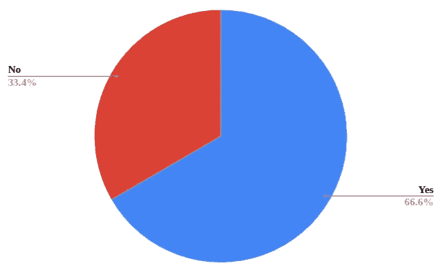

# 外包与内部开发

> 原文：<https://medium.com/hackernoon/outsourcing-vs-in-house-development-a27a1c910d1c>

## 雇佣一个专门的团队或者将开发外包给软件公司——这是个问题。

Photo by [Headway](https://unsplash.com/@headwayio?utm_source=medium&utm_medium=referral) on [Unsplash](https://unsplash.com?utm_source=medium&utm_medium=referral)

在本文中，我们将比较[外包软件开发](https://www.binaryfolks.com/services/solutions/software-outsourcing)和内部软件开发，概述每种方法的优缺点。我们还会建议你什么时候应该雇佣内部开发人员，什么时候应该外包。

## **什么是内部软件开发？**

内部软件开发意味着利用公司资源(内部团队)根据公司特定的需求开发或实现软件。

使用这种方法，您需要投入金钱和时间集合所有不同的人或角色，为开发好的软件创建一个坚实的基础。

内部开发软件时，软件开发需要成为公司的核心竞争力。他们需要有足够的资源和基础设施来支持他们自己的软件开发。

## **什么是外包？**

简单来说，外包就是任务委托。基本上，一项由企业做出的安排，雇用第三方软件承包商来完成软件相关工作，而不是在内部完成。

使用这种方法，最初的时间和成本节省来自于不雇佣内部员工和不投资基础设施。

这通常是由那些核心竞争力不是 IT 的公司，或者当他们的 IT 部门被其他核心流程占满时完成的。

现在我们有了一个概述，让我们来看看这两种方法的优缺点。

## **雇佣内部软件开发团队的好处**

*   更好地理解企业文化和业务。
*   随时可用
*   对项目的完全奉献
*   没有文化差异
*   没有语言障碍
*   面对面的讨论
*   维护、现代化和支持-全部内部

## **雇佣内部软件开发团队的缺点**

*   成本增加(工资、津贴、加薪、保险、差旅费等)
*   基础设施投资
*   缺乏技能
*   放弃，意味着重新开始整个过程

## **外包的好处**

*   成本节约
*   没有雇佣员工的麻烦
*   获得全球技能
*   业务流程的灵活性
*   更快上市
*   更加关注核心业务
*   更好的风险管理

## **外包的弊端**

*   部分失控
*   文化和时间差异
*   沟通和管理
*   信息的保密性

## **让我们进一步细分一下**

没有比内部开发更好的了。这更容易，也更容易管理。如果你需要需求的改变或者更新，你可以走到几个桌子前，叫他们过来喝杯咖啡，聊聊天。太棒了。

但是请记住，内部软件开发的过程是漫长的。

**第一步—** 假设你在一家电子商务公司工作。你的老板告诉你，公司需要库存管理软件来简化库存流程。您接受请求并联系业务分析师。

**步骤 2 —** 业务分析师起草一份业务需求文档，并告知您需要什么样的资源。

**步骤 3 —** 你现在知道了软件是什么，它做什么，所以，下一步是组建一个 it 团队——开发人员、设计人员、项目经理和测试人员。所以，你联系招聘团队。

**步骤 4 —** 职位发布、面试和招聘—几个月过去了！

**步骤 5 —** 一旦你组建了一个团队，开发就开始了，现在你可以点咖啡了；)

> 你知道吗？在美国，雇佣一名软件工程师平均需要 35 天。

但是在内部开发中，你组建的团队将会专注地开发公司的项目，将所有的努力导向公司的成功。不会有其他项目分心。

你公司的所有资源都被限制在你自己的范围内，任何外部组织都无法访问。

由于你雇佣的团队都是本地人，他们会非常了解公司文化，工作时间和公司其他人一样。这将导致更好的合作。

在软件需要支持的时候，你的团队会尽快解决任何一个出现的 bug。

好吧，那好吧！**专门的服务，没有沟通障碍，定期可用——有了内部软件开发，生活变得美好！坚持住…**

雇用整个团队的麻烦需要讨论。适当的筛选，验证，来回面试在这里发挥作用。此外，你需要的技能可能与申请人不匹配。

还有培训他们、管理项目以及员工在项目中途离职的巨大风险。

**现在我们来看看几乎所有企业的关键因素——成本！因为，我从未听任何人说过，无论代价如何，我们都不在乎。当您雇用内部员工时，您会产生以下成本:**

*   津贴和其他费用
*   办公空间
*   IT 架构等。等。

在美国，一个普通的网络开发人员的工资大约是 88，000 美元。

> **寓意——内部团队的雇佣和维护成本高昂。**

## **考虑外包**

在当今这个人人都有永不满足的创新欲望的时代，外包意味着获得竞争优势的巨大机会。你可以接触到全球熟练的开发人员，好消息是你可以挑选和雇佣任何你想要的人。

外包的过程也有麻烦:最初，需要做大量的尽职调查。你需要了解这家公司，他们的文化，他们的经历，寻求推荐等等。除此之外，持续的沟通和管理对于项目的成功至关重要。

但是，一旦你找到了理想的公司，与内部开发相比，你的成本和时间都会大幅下降。

由于发达国家和发展中国家的工资差距很大，成本降低了。此外，员工工资和福利也节省了大量资金。

外包也意味着更快的上市时间，因为你可以根据你的时间表来决定时间表，你的软件公司将有专门的开发人员为你服务。

但是，是的，如果软件公司被错误地选择或者不适合按照确切的要求开发，软件外包也会导致巨大的头痛。一个巨大的风险是潜在的信息丢失，因为你的想法会被一些供应商分享。创建一个 NDA，并确保您的供应商签署它，以避免潜在的信息丢失。

*延伸阅读:* [*软件外包风险*](https://www.binaryfolks.com/blog/5-software-development-outsourcing-risks-and-how-to-mitigate-them?utm_source=hackernoon&utm_medium=social&utm_campaign=outsourcingvinhousehttps://www.binaryfolks.com/blog/5-software-development-outsourcing-risks-and-how-to-mitigate-them?utm_source=hackernoon&utm_medium=social&utm_campaign=outsourcingvinhouse)

此外，这是一个关于软件外包价格质量的大辩论。不要急着雇佣报价最低的人！确保质量需要考虑比成本更多的因素。有了正确的态度，你不仅可以省钱，还可以找到高质量的软件解决方案。

谈到外包，沟通是另一个有争议的话题。但在 21 世纪，几乎 90%的人都拥有智能手机，有很多方法可以跨越这些沟通障碍。

视频通话、电子邮件更新、视频演示、即时消息等。都使外包公司和软件供应商在合作方面更加紧密。

那为什么要外包呢？大多数企业主在定制软件开发方面犹豫不决。它的主要原因是价格。此外，正如所讨论的那样，能力问题仍然是最大的挑战之一，雇用人才进行内部开发和外包似乎是一种快速解决办法。

根据一份关于[软件开发状态](https://codingsans.com/state-of-software-development-2019)的报告，企业和初创公司被问到:**“你曾经全部或部分外包软件开发吗？”**

外包的人中， **57.33%的人将开发外包给了软件开发公司！**

现在我们知道了什么是内部开发和外包，以及它们的优缺点。那么，什么时候外包软件开发是有意义的，什么时候在内部开发软件呢？

两者都很费时间。两者都需要尽职调查。如果你没有雇佣一个有能力的开发人员，你的项目会受到影响，同样，如果你没有雇佣一个有能力的软件外包公司，你的项目也会受到影响！

> 当你需要做出外包还是内部决策时，考虑三件事:预算、时间表和项目范围。

让我用一个例子来解释:假设你决定开发一个出租车共享应用程序，你的整个关注点和业务都围绕着它。这成为你的核心业务活动。你知道在你发布之前你还有一些时间，你也有一些钱来支持开发。在这种情况下，去找一个内部团队是最好的。

这种发展将是持续的，你的业务的每个方面都将围绕这一点。这是你需要全职处理的专门服务吗？所以，雇佣一个内部团队吧！

现在，假设您需要一个库存管理软件来帮助实现业务流程的自动化。但是，您的业务并不围绕这一点，一旦您有了软件，您就不需要日常维护。还有，你需要这个软件快，不想花太多钱。你最好把这个外包给一些有能力的软件外包公司。

# **总之**

外包那些不是你业务核心的活动。如果利用得当，外包可以帮助您更战略性地简化业务运营，并帮助您获得竞争优势。

又念:[如何知道自己的公司是否需要定制软件？](https://www.binaryfolks.com/blog/5-symptoms-your-business-needs-custom-software-development?utm_source=hackernoon&utm_medium=social&utm_campaign=outsourcingvinhouse)

如果你想知道如何[找到一个好的外包公司](https://www.binaryfolks.com/blog/what-to-keep-in-mind-while-choosing-a-software-outsourcing-company?utm_source=hackernoon&utm_medium=social&utm_campaign=outsourcingvinhouse)，查看我们这里的博客。

*最初发表于*[*【https://www.binaryfolks.com】*](https://www.binaryfolks.com/blog/outsourcing-vs-in-house-software-development)*。*