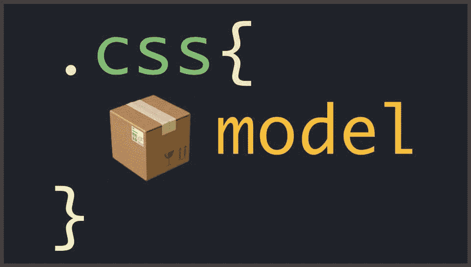
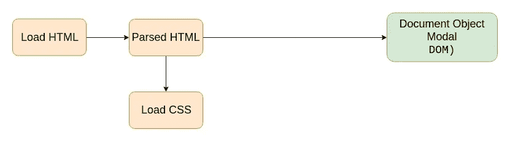
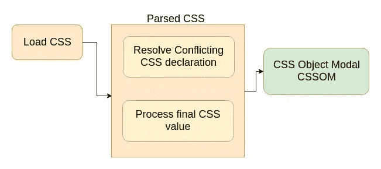
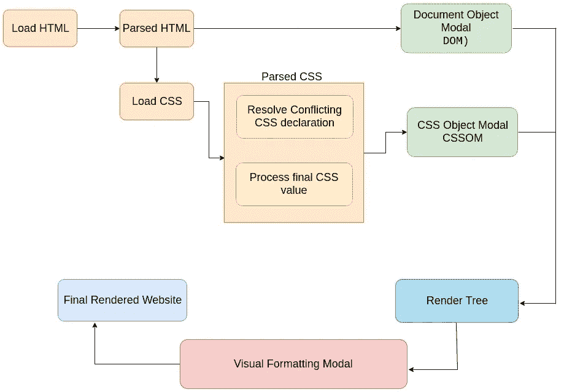

# CSS 如何在幕后工作的概述？

> 原文：<https://medium.com/hackernoon/overview-of-how-does-css-works-behind-the-scenes-498d98b0e404>

Frontamentals

让我们从理解当我们在浏览器中加载一个网页时，我们的 CSS 代码实际上发生了什么开始。

当浏览器开始加载初始 HTML 文件时，它会获取加载的 HTML 代码并解析它，这意味着它将逐行解码代码。通过这一过程，浏览器构建了所谓的 DOM(文档对象模型),它用一个包含父元素、子元素和兄弟元素的树来描述整个 web 文档。

HTML Parsing by Jonas Schmedtmann

当浏览器解析 HTML 时，它也会找到 HTML 头中包含的样式表，就像 HTML 一样，CSS 也会被解析。
但是 CSS 的解析有点复杂。

By Jonas Schmedtmann

在 CSS 解析阶段有两个主要步骤要执行:

> 1.冲突的 CSS 声明被解决(也称为级联)
> 
> 2.处理最终的 CSS 值(例如，将百分比单位定义的边距转换为像素)

解析后的 CSS 也存储在一个名为 CSS Object Modal 的树状结构中，类似于 DOM。

CSS Parsing by Jonas Schmedtmann

解析后的 HTML 和 CSS 一起形成了所谓的渲染树。
这样，我们终于拥有了渲染页面所需的一切。

视觉格式模型是浏览器用来实际呈现页面的东西。该算法为渲染树中的每个元素计算盒子(盒子模型)并确定这些盒子的布局，以便确定页面的最终布局。

所以最后，在视觉格式化模型之后，网站最终被渲染或绘制到屏幕上。

By Jonas Schmedtmann

这是幕后发生的过程的简要描述。
在下一篇文章中，我们将深入这个主题(CSS 解析，可视化格式化模态)，以了解幕后到底发生了什么。

在 [Twitter](https://twitter.com/jscodelover) 、 [LinkedIn](https://www.linkedin.com/in/jscodelover) 或 [GitHub](https://github.com/jscodelover) 上关注我。

*希望这篇文章对你有用。感谢阅读&继续学习！！*