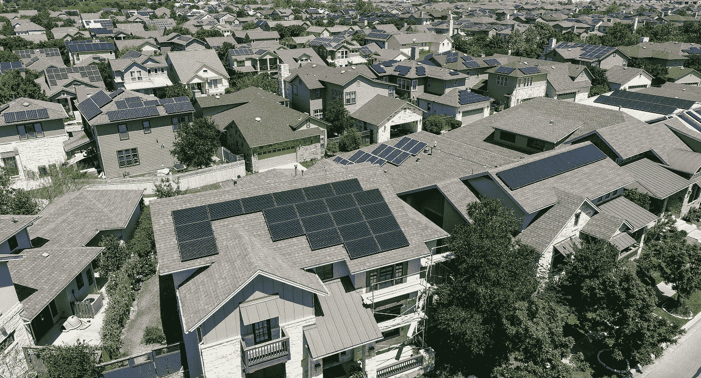
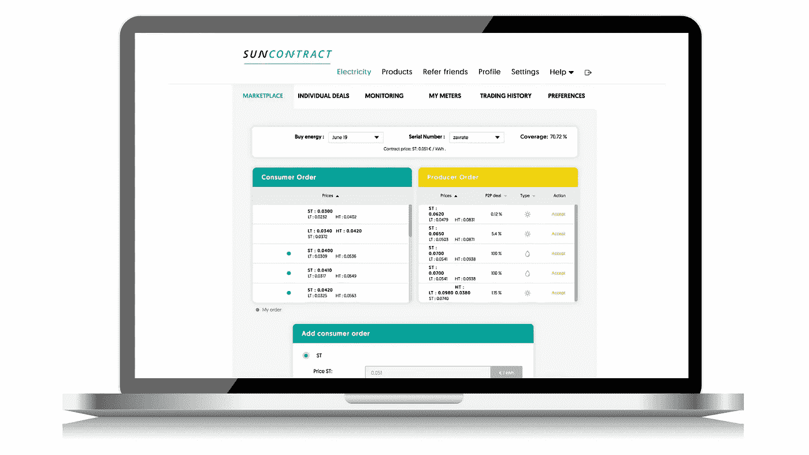
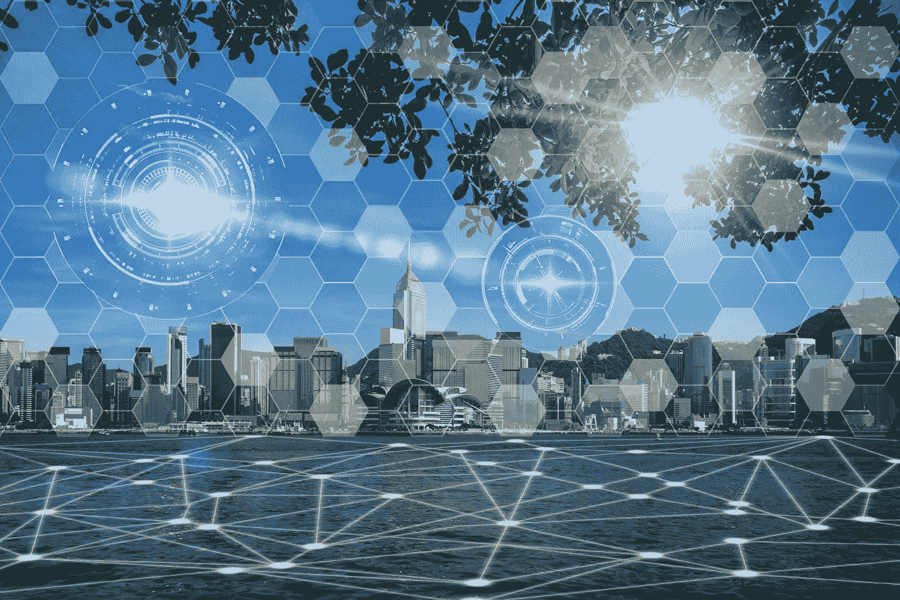

# P2P 能源交易平台——可再生能源的盟友

> 原文：<https://medium.com/hackernoon/p2p-energy-trading-platforms-the-renewables-ally-7eaa1085838f>

## 电力生产商和消费者都将受益

目前，几乎 80%的世界能源仍然由化石燃料提供，而世界所有地区的能源需求都在增加。面对气候变化、环境破坏和化石资源成本上升，社会被迫适应并实现可持续发展。可再生能源和高能效是一种极具吸引力的替代能源。

有许多消费者希望有能力消费可再生能源，但不幸的是买不起生产资产。**消费者可以选择从太阳能供电的邻居那里购买可再生能源，而不是要求电力消费者建立太阳能屋顶。**

不幸的是，目前的系统要求公用事业在消费者和需要可再生能源的消费者之间扮演中间人的角色，即第三方中介。

> **但是为什么消费者不能直接从生产商那里购买能源，而生产商又能直接向消费者出售能源呢？**

区块链使得分布式能源所有者(更具体地说，生产者)能够以 P2P 方式与消费者进行交易。例如，在 SunContract，我们欢迎所有可再生能源生产商进入我们的电力消费者、生产商和消费者市场，使他们能够直接相互交易。

Renewable energy producers on the SunContract Platform

生产者并不是这种 P2P 商业模式的唯一受益者:消费者在选择他们喜欢的能源时也利用了市场上最好的价格。

如上图所示，消费者(在 SunContract 平台上)可以看到能源市场上的可用价格。在他们接受报价之前，他们还可以准确地看到每个生产商提供哪种类型的能源。

消费者还可以根据他们支付(WTP)价格的意愿设定电力订单，当生产商设定与该价格相匹配的报价时，消费者的订单将自动履行，双方将达成 P2P 协议。

## P2P 能源交易——分散能源系统的有效管理

P2P 能源交易技术是一种非常有效的能源交易方式。区块链改善了分散能源系统的管理。通过本地化的 P2P 能源交易实现本地能源市场的采用，将显著增加能源自我生产和[自我消耗](https://www.sciencedirect.com/topics/engineering/self-consumption)，也称为潜在影响收入和关税的电表后活动。

当地能源市场的 P2P 交易也可以提供社会经济激励，促进当地可再生能源发电，因此可能成为潜在消费者的替代激励。由于资本资金或空间有限而无力投资可再生能源发电的消费者可以以可承受的价格购买绿色能源。

P2P 交易平台还处于早期阶段。然而，它们有可能从根本上改变现有能源公司的既定角色，如能源供应商或电网运营商，这些公司在大多数国家都是受监管的垄断企业。

[*Winfred k . Mandela*](https://www.linkedin.com/in/winfred-k-mandela/)*是区块链领域卓有成就的营销人员和业务开发人员。她负责将各公司产品团队的创新与业务部门以客户为中心的运营联系起来，以建立区块链品牌，在实施项目的地区创造消费者意识，并每天通过他们的渠道推动客户对品牌的偏好。Winfred 喜欢在户外骑自行车，喜欢分析市场，并且总是喜欢读一本好书！*