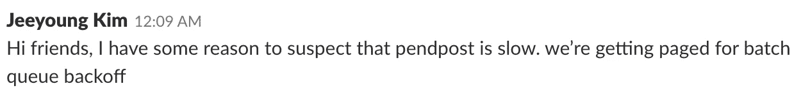
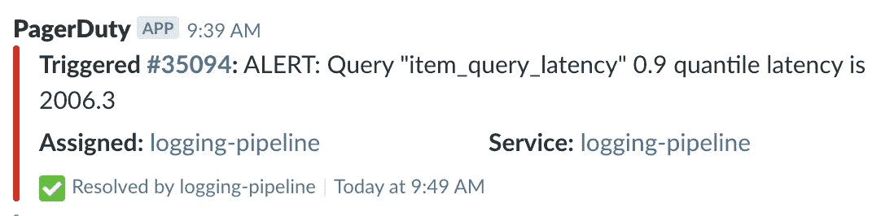
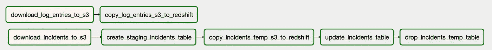
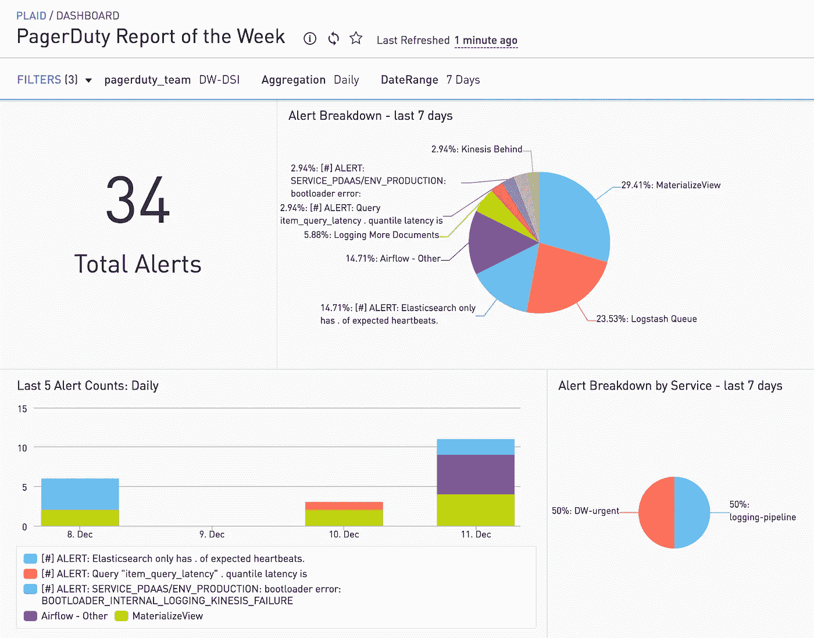
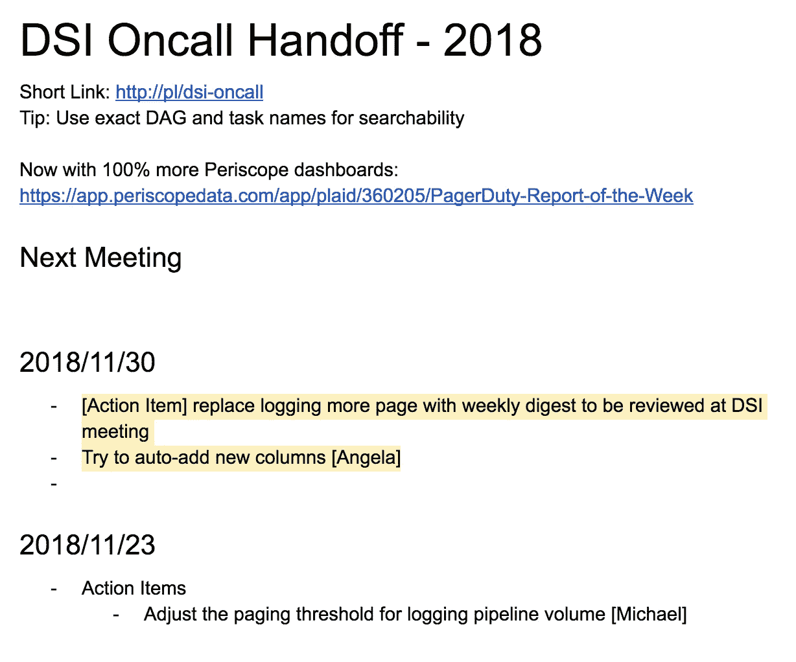
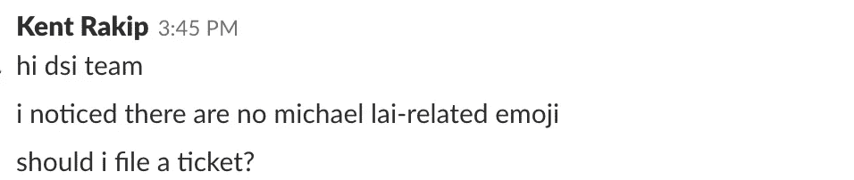

# 使用 Python 和 Periscope 进行页面任务分析

> 原文：<https://medium.com/hackernoon/pagerduty-analytics-with-python-periscope-d47dde9e780e>

## 我们如何用一个自动的每周摘要仪表板取代人工审查寻呼机工作警报。

我是[数据科学](https://hackernoon.com/tagged/data-science) &基础设施团队[格子](https://plaid.com/)的软件工程师。我们为外部客户和内部员工提供各种各样的服务:我们为产品、增长和[工程](https://hackernoon.com/tagged/engineering)团队提供工具，如用于大型分析查询的 Redshift 和用于跨支持 Plaid 的许多服务进行实时调查的 [ELK stack](https://www.elastic.co/products) 。

支持这些分析和监控服务是至关重要的:如果整个公司的数十个工作流中断；重要的是，我们要在服务质量下降成为问题之前发现它。在 2018 年期间，我们为我们支持的服务添加了数十项新功能:新数据集、更快的分析功能和更多自助服务数据门户。我们需要在用户意识到之前发现任何问题:



The failure mode: our internal users complaining before we notice something is wrong.

当服务性能下降时，我们使用[page duty](https://www.pagerduty.com)发送实时警报。我们的团队是随叫随到的:在四名工程师之间，我们轮流作为直接负责人处理任何通过 PagerDuty 生成的服务性能警报。在您值班的那一周，您使用 PagerDuty 应用程序提醒任何实时`DSI-Urgent`警报，并使用 PagerDuty slack 集成向`DSI-Notify` slack 通道发送其他消息。



PagerDuty slackbot — friend to all.

接近年底时，我们意识到，虽然我们在添加新的页面责任警报以支持服务的 SLA 方面做得很好，但我们在对潜在的长期问题进行分类和修复方面不够自律。为了摆脱对症状的处理，努力提高整体服务质量，我们决定在每周的团队会议上增加一份“随叫随到总结和移交”摘要。这有助于促进关于我们为什么被寻呼的讨论，迭代服务以提高可靠性，并改变警报结构以减少错误警报。


Trialing a formalized handoff document, with categories of alerts to facilitate trend analysis and some comments on specific alerts for specific details.

这是一个很好的试点，我们能够更好地发现常见问题，更容易地识别模式，并将解决实时问题的随叫随到的节奏与进行长期实质性变革的需求分离开来。

然而，在随叫随到的轮换中增加人工工作并不是我们的长期愿景。PagerDuty 提供了一些分析视图，但我们希望对我们的数据进行更精细的控制，并能够将其加入到其他分析数据源中。我们开始使用[页面责任 V2 API](https://v2.developer.pagerduty.com/page/api-reference) 来提取数据，这将有助于告知事件的模式，并取代手动跟踪我们的移交文档。

我们使用 [Apache Airflow](https://airflow.apache.org/) 进行大范围的递归数据 ETL，并编写了一个一次性 Airflow DAG，它从 PagerDuty 下载数据的历史，将其写入 S3，然后从 S3 复制到 Redshift。你可以在本概要中看到 python 脚本的净化版本。



Airflow DAG for ingesting PagerDuty data

我们主要关注两个表:`incidents`和`log_entries`，这为我们提供了哪个团队在什么日期收到了什么警报的历史记录。PagerDuty 通过 API 提供一个月的事件历史记录。因为用户可以在警报的原始日期之后很久才修改事件，所以我们会重新收集整个 30 天的事件历史记录，并更新任何修改的数据。相比之下，log_entries 是一个只附加的日志，所以我们更简单地以固定的节奏获取新数据，并将其复制到 redshift 中。

最后，利用 Redshift 中的数据，我们可以创建一个自动化版本的移交文档！以下是我们如何查询最终模式以从事件和通知历史记录中提取洞察力的示例:

```
-- categorize alerts, and count by category + date
-- takes a rolling five day history
select
  date_trunc('day', (created_at)::timestamp)::date
  , case
    when incidents.summary like '%airflow heartbeat%'
      then 'Airflow Heartbeat'
   when incidents.summary like '%mysql_dump%' 
      then 'MysqlDump'
    when incidents.summary like '%TaskInstance: dump_%' 
      then 'MongoDump'
    when incidents.summary like '%ES%not green%' 
      then 'ES not green'
    when incidents.summary like '%queue is building%' 
      then 'Logstash Queue'
    when incidents.summary like '%kinesis%behind%' 
      then 'Kinesis Behind'
    when incidents.summary like '%TaskInstance%'
      then 'Airflow - Other'    
    else
      -- remove numbers to more easily group alerts
      regexp_replace(incidents.summary, '[0-9]', '')
  end as summary
  , count(1)
from
  pagerduty.incidents
where
  abs(datediff('day', getdate(), created_at)) < 5
  and (escalation_policy_summary='DW-DSI')
group by
  1
  , 2
order by
  3 desc
```

这让我们得出了一个伟大的结论:一个潜望镜仪表板，我们可以在这里查看警报的数量，按类别和服务进行细分，并跟踪一段时间内的趋势。



The final dashboard in Periscope, summarizing alerts over the past 7 days.

我们的移交文档现在更简洁了:我们不必手动键入有关单个警报的报告，而是可以从我们的仪表板总结一周的情况，并直接跳转到我们希望采取的集体和单独行动，以构建弹性和可靠的数据基础架构。



New handoff document, which focuses on concrete Action Items

这一新流程帮助我们确定了噪音警报和持续事件的优先级并解决了这些问题。额外的好处是，它可以帮助我们的用户发现和上报那些被随叫随到提醒的节奏所掩盖的遗留问题，关注其他重要问题:



The good case: our internal users attacking the real issues.