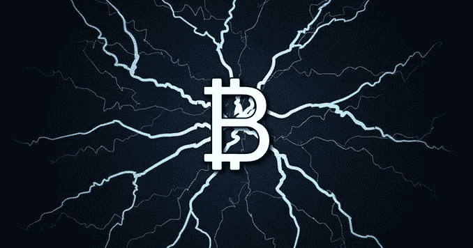
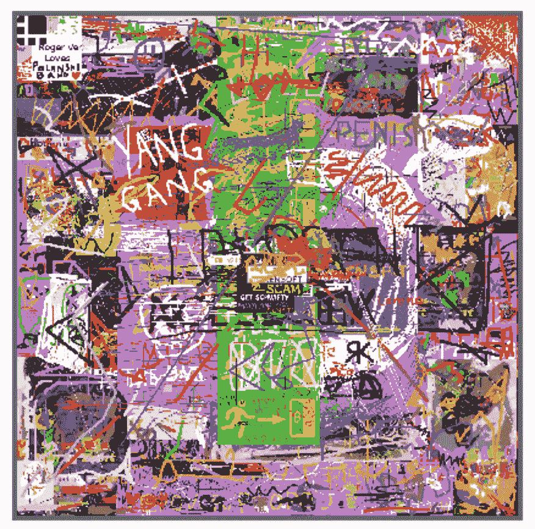
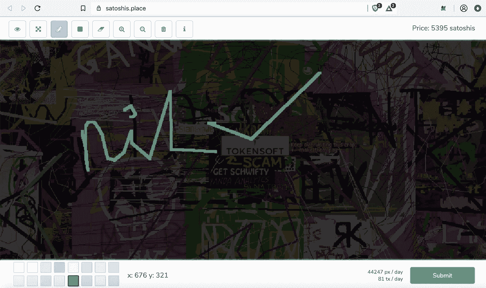
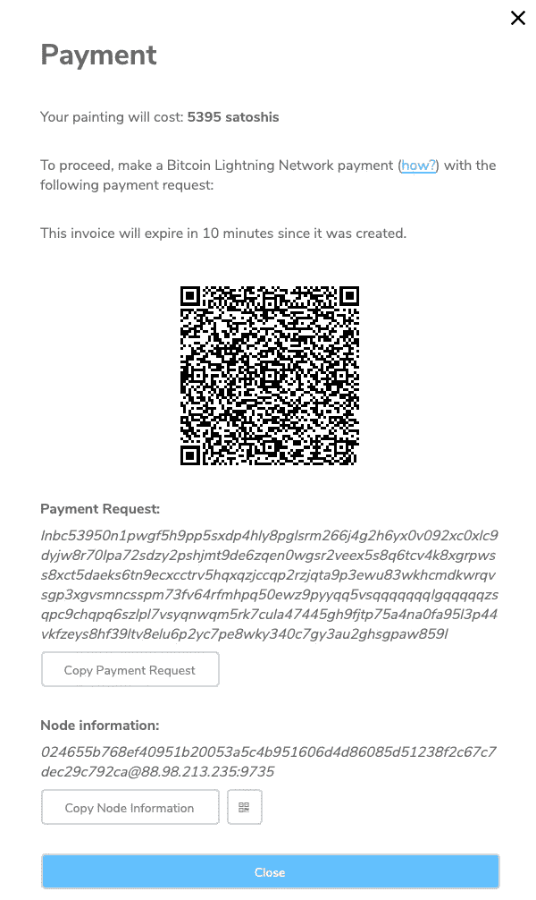

# 画你自己的区块链画！

> 原文：<https://medium.com/hackernoon/paint-your-own-blockchain-painting-1ecbc6a0caa3>

## 是的，你没看错。

Source: [https://coingape.com/](https://coingape.com/buy-coffee-with-bitcoin-instantly-lightning-network-on-coffee-machine/)

想着这到底是什么意思？

Source: [https://satoshis.place/](https://satoshis.place/)

嗯， [satoshis.place](https://satoshis.place/) 让你能够在虚拟的公共画布上一个像素一个像素地购买空间。它是基于[比特币](https://hackernoon.com/tagged/bitcoin) [区块链](https://hackernoon.com/tagged/blockchain)网络之上的应用。

Satoshis.place 实际上是比特币区块链网络的第二层应用。它利用闪电网络协议。闪电网络于 2018 年 1 月推出，此后呈指数级增长。它使人们能够立即发送小额比特币，基本上没有任何费用。

所以基本上如果你去这个网站，你可以画任何你想画的东西，并用比特币支付。一旦你的付款被确认，你在公共画布上的画将是不可改变的；这意味着它将被记录在比特币区块链上！

所以，我画了一些愚蠢的东西，这是我的画:

我用那个无聊的设计覆盖了价值 5395 satoshis 的帆布。然后这个应用程序为我生成了一张发票。

> 5395 只 Satoshis 大约值 0.211 美元。

这张发票将在 10 分钟内有效。

尝试比特币区块链是一种很酷的方式。它强调了区块链圈内的 R&D 正以天文数字的速度发展。直到昨天，人们还说你不能用比特币买咖啡/披萨。然而，今天的现实不同了。感谢闪电网络。