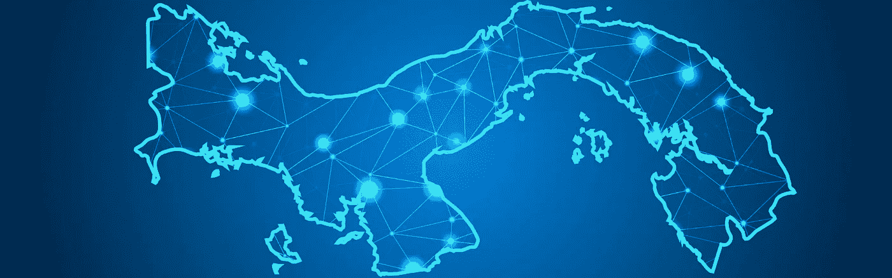

# 巴拿马更新:新总统可能影响加密

> 原文：<https://medium.com/hackernoon/panama-update-new-president-could-impact-crypto-crypto-law-insider-ccd428b9ecf8>

2018 年 10 月，我表示，“我不相信巴拿马会发挥其潜力，成为它应该成为的加密中心”。

当时说这话让我很痛苦。毕竟，我在将近七年前就把巴拿马当成了家，我最希望看到的就是它成为创新和发展的秘密天堂。但是，至少在去年 10 月，我看不到这种情况发生。

嗯，这是新的一年，我们有一个新的政府。现在 [Nito Cortizo 是巴拿马](https://www.reuters.com/article/us-panama-election/panamas-cortizo-wins-close-presidential-race-calls-for-national-unity-idUSKCN1SB04C)的总统，这对密码世界意味着什么？这是每个人都在问我的问题。

# 加密如何与巴拿马政治保持一致

巴拿马的新总统尼托·科尔蒂索是亲商的[。事实上，他是我在巴拿马商界认识的所有人最青睐的候选人。](https://www.ft.com/content/787aaafe-6fc2-11e9-bf5c-6eeb837566c5)

我不是政治活动家，从来都不是。也就是说，当一个政治家支持商业和创新时，好事就会发生。

考虑到这一点，我认为新政府肯定比上届政府有所改进。Nito 提出的政策总的来说让我很受鼓舞。

我甚至可以说，我乐观地认为他会鼓励与密码相关的企业搬到巴拿马。尤其是如果这些项目有助于推动国家前进的话。

但不幸的是，领导层的变化只是*巴拿马真正成为加密中心的必要步骤之一。老总统并不是阻碍巴拿马成为一个对加密友好的司法管辖区的唯一因素。*

# 巴拿马的缺点

让我再次重申:我爱这个巴拿马。这是一个很棒的地方，原因有很多。我甚至没有谈论海滩或全年的热带天气。巴拿马是一个做生意和生活的好地方。

正如我在上一篇巴拿马文章中概述的那样，它有优惠的税收，并支持新的企业。更不用说它的地理位置非常适合运营一个全球中心。

但是和其他地方一样，它也有自己的挑战。说明这一点的最好方法之一就是看看巴拿马的银行业。

巴拿马的银行业拥有一个行业所能要求的一切天然优势。巴拿马是一个避税天堂，这意味着储户的收入不用缴税。巴拿马是拉丁美洲的中心，数百家跨国公司的总部设在这里。得益于运河，它是全球航运中心和物流圣地。它受到美国的军事保护。它的当地货币是美元。

一个行业还需要什么才能成功？

## 世界上有充分的理由说明为什么企业应该把钱存在这里。但是他们没有。为什么？

没有什么好的方式来说这个，所以我就直说了。巴拿马的银行业管理极其糟糕。

在我在这里的时间里，我经历了广泛的银行问题。从令人讨厌的 KYC/反洗钱公司到糟糕的客户服务。我都看过了。巴拿马银行只是没有赶上 2019 年。

举个小例子，我当地的银行家最近给我发了一封邮件，要我签署一份文件。我赶紧上传到 DocuSign，还回去了。提交文件两天后，我的银行家打电话告诉我，签名被拒绝，因为银行不能接受电子签名。

我知道这看起来没什么大不了的，但这是一个更大问题的征兆。**巴拿马采用新技术的速度很慢，创新的速度很慢，意识到自己已经落伍的速度更慢。**

我的银行家没有为造成的不便道歉。对她来说，像大多数巴拿马人一样，缓慢、重复的官僚主义是常态。她并不觉得这有什么不方便，也不认为有创新的必要。

回到本文的主题……考虑到让加密在巴拿马可行所需要的法规和灵活性，我不认为这些部分会很快结合在一起。虽然改善的机会是巨大的，但挑战对巴拿马和巴拿马人来说太大了，难以克服。

最终，我喜欢住在这个国家。但我对巴拿马将成为任何监管突破的前沿并不乐观。人民及其领导人的心态就是不存在。

# 这对密码法律内部人士意味着什么？

巴拿马是一个称之为家的好地方。这就是为什么包括我自己在内的许多密码企业家和投资者搬到这里。但作为一个注册和运营加密项目的司法管辖区，它仍有一些挑战需要解决。

科尔蒂索总统的当选为这一切将会改变注入了新的希望。希望我被证明是错的，巴拿马真的*会成为下一个加密天堂。但是我没有屏住呼吸，内部人士也不应该屏住呼吸。*

迪安·斯坦贝克

迪恩·斯坦贝克(Dean Steinbeck)是加密货币和区块链技术相关法律问题的权威人士。[了解更多信息](https://cryptolawinsider.com/panama-crypto-update/)

*原载于 2019 年 6 月 25 日*[*https://cryptolawinsider.com*](https://cryptolawinsider.com/panama-crypto-update/)*。*