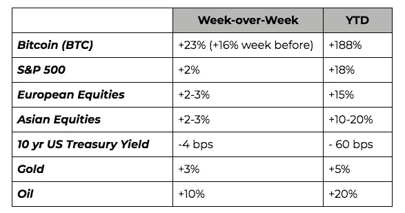
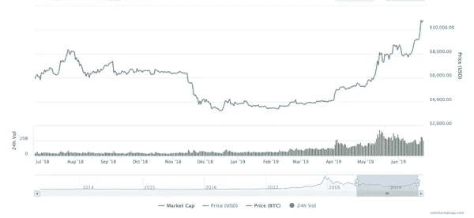
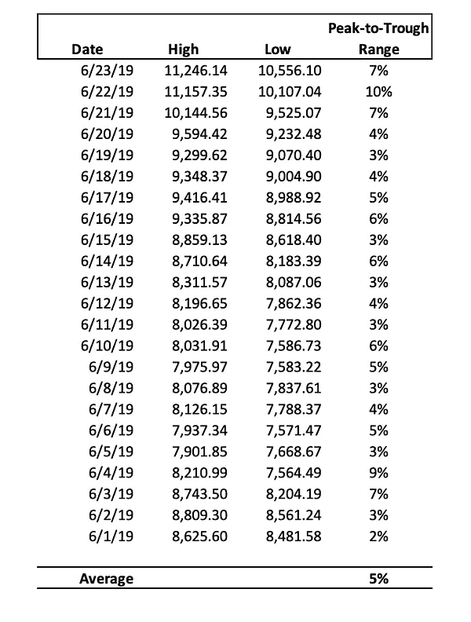
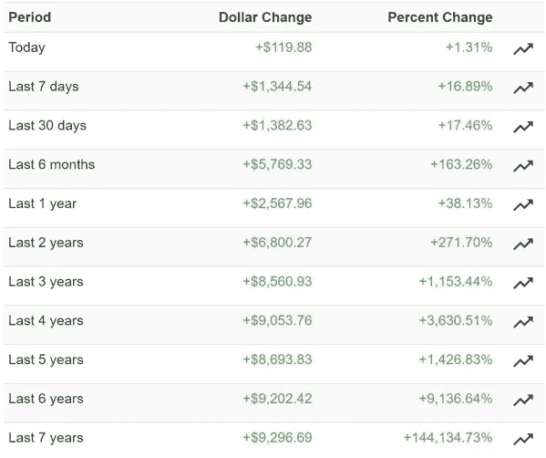

# 密码学的抛物线发展——是好还是坏？

> 原文：<https://medium.com/hackernoon/parabolic-advances-in-crypto-are-they-good-or-bad-3a992700419f>

本周密码市场发生了什么？

**还要什么吗？更多的一切！**

在经典的《宋飞正传》中，杰瑞在头等舱，乘务员问，“*还要什么吗？*”，对此 Jerry 不无得意地回答，“ [*更无所不包！*](https://tv.getyarn.io/yarn-clip/2e8156c6-aaf0-4350-8392-8b85779d8fa7) ”。全球央行和政府正满足这一愿望。

全球资产类别的周环比和年初至今回报率令人震惊。这些都是投资者公开庆祝，而暗地里担心的市场类型。

让我们从非加密市场开始。全球股市完全接受了美联储更为宽松的立场，推动标准普尔 500 指数升至 2019 年的第五个历史高点，并连续第三周上涨(继 5 月份连续四周下跌之后)。在美国-伊朗紧张局势之后，石油价格上涨了 10%，因为能源市场正慢慢变得像加密一样不稳定(根据[通用风险顾问公司的数据:](https://genriskadvisors.com/)石油的 6 个月波动率现在为 1.74%，天然气为 2.55%，而比特币为 3.26%，全球股票为 0.62%)。与此同时，美国国债反弹至 3 年高点，10 年期美国国债收益率再次接近 2.00%。

与加密市场不同，有几十年的数据表明，周期中期降息对全球股市是一个净利空，衰退可能即将到来。从大卫·罗森伯格对股票估值过高的频繁提醒，到杰西·科伦博对全球债务泡沫的危险影响的咆哮，到拉乌尔·帕尔关于降息的数据，肯定有足够的理由表明“不要和美联储作对”可能有点过时了。康托尔·菲茨杰拉德可能说得最好:

> “让我们坦率地说:股票市场已经变得狂躁，依赖于总统或鲍威尔主席的每一句话。鲍威尔主席的交流本应不足为奇，但令人有些沮丧的是，美联储已经开始将自己视为无限扩张的守护者，而不是一个旨在平滑商业周期自然进程的实体。没有商业周期，资本主义就失去了它的身份。我们预计全球股市的巴甫洛夫反应将是任何鸽派的反弹，因为投资者仍然缺乏这种鸽派真正意味着什么的背景。或许，实体经济真的不再重要，到我们的孩子步入中年时，所有资产最终都将归央行所有，这让市场参与者感到欣慰。此外，经济学 101 的一个概念似乎已经被银行家和投资者遗忘了:边际收益递减(更不用说意想不到的后果了)。央行行长们已经变得有点像屈服于同辈压力的青少年——动不动就互相挑战——以实施许多人撰写博士论文时所依据的政策。

过去 10 年，股票和固定收益对冲基金经理的表现几乎普遍逊于被动投资策略，这是有原因的——在大范围上涨期间，坏消息就是好消息，风险会加速，导致更多的下跌保护。但只做多，100%投资的指数不关心不断增长的风险。

**脸书是最后的催化剂，但这场秘密集会有点令人不安**

与此同时，加密市场连续第二周火爆，突破所有阻力位，仅自周四以来就上涨了 15%。在过去的 5 个月里，比特币分别上涨了 12%(2 月)、8%(3 月)、29%(4 月)、62%(5 月)和 24%(6 月 MTD)。

随着比特币的历史性上涨，毫无疑问，你上周听说过数字资产，尤其是在脸书正式发布新数字支付系统白皮书之后。这主导了新闻，远远超出了典型的加密新闻报道。上周，我们甚至被邀请加入[福克斯商业](https://www.youtube.com/watch?v=owWiXZJBhUU)和[雅虎财经](https://twitter.com/YahooFinance/status/1141076962410037249)，当然，我们被迫回答关于脸书新硬币的问题(我们上周写道[脸书是 crypto](https://www.ar.ca/blog/crypto-market-recap-06-17-19) 的引爆点)。

我们也对包括比特币在内的数字资产的长期潜力感到兴奋。但总的来说，当全球市场呈抛物线状时，在短期内谨慎行事通常是明智的。比特币在整个 6 月份的日内波动平均为 6%，这将使任何有纪律和负责任的投资者暂停，并可能减少头寸规模，即使趋势继续走高。

**比特币价格走势图&日内波动**

*资料来源:CoinMarketCap & Arca 专有数据*

在 crypto 中最有趣的可能是，我们几个月来一直在谈论的许多积极因素，这些因素肯定有助于推动市场在年初至今的进步，现在却明显地坐在后视镜中。

*   巴克特、富达和脸书现在都已经正式确定了上市日期，而 FB 的实际产品还有一年的时间
*   人民币已经停止向关键的 7.00 水平贬值，现在正在走强
*   贸易战可能即将结束

当然，这并不意味着价格上涨需要或应该停止，但它肯定会让我们想知道下一个真正的采用催化剂是什么。当然，数字资产的长期前景仍然一如既往地强劲。Drawbridge Lending 的 Mike Creadon 在周末指出了一些惊人的数字:*世界上投资于负收益债券(13 万亿美元)的资金是比特币(2000 亿美元)的 65 倍以上。*每一个降低购买力、增加债务和增加系统风险的全球央行行动，对比特币和其他所有数字资产都是净利好。此外，轻资产经济(AirBNB、优步、谷歌等)告诉你所有你需要知道的关于年轻一代是否会用数字表现代替硬资产的信息(他们会的)。

但当密码市场正在走高成为一个不争的结论，每个出租车司机和祖母都在谈论它时，这就变得有点令人不安了。今年早些时候，看涨情绪被同样持续的怀疑所抵消，但我们现在正进入[一个自 2017 年末以来未见的欣快点](https://alternative.me/crypto/fear-and-greed-index/)。小批量的周末疯狂算法价格飞涨。

**深入了解基本面和技术面**

这个领域仍在发展，但在过去几年中，加密评估技术已经取得了很大进步。虽然一些“类似证券”的数字资产可以使用传统的类似 DCF 的工具进行建模，但其他更传统的“类似货币”的加密货币(如比特币)需要更多的供需类型分析。目前，许多这些指标都在闪烁超买信号。

例如，流行的 [MVRV 比率](https://charts.woobull.com/bitcoin-valuations/)正在以比之前牛市更陡的斜率增加。MVRV 比率没有任何回落，与上次牛市相比，这是不寻常的。虽然尚未超过 3.7 的高估区，但 MVRV 的斜率类似于比特币市场周期后期的斜率。

从技术面来看，比特币第一次冲击 10000 时，比特币连续拉回均线。与比特币最近突破 10，000 美元相比，在整个上涨过程中，我们没有触及或拉回任何重要的移动平均线。

在接下来的几周里，我们将密切关注这些指标以及其他指标。也就是说，我们近期的犹豫丝毫不会影响我们的长期乐观情绪。那些能够承受高水平波动的人应该理直气壮地忽略任何短期波动。那些从事“资本保护”业务的人或许应该留意这些警告。

**从更长的时间来看，比特币很难被击败**

**响当当的大佬**

比特币上周继续占据市场份额，收盘上涨 23%(主导地位高达 59.2%)。上一次比特币的统治地位如此之高，比特币再次达到 11，000 美元(2017 年 12 月 4 日)。随着比特币成为本周数字资产领域的头条新闻，人们很容易忽略 alt 币的一些发展。尽管如此，还是有一些项目脱颖而出:

*   Ripple (XRP) [周一宣布与 MoneyGram 合作，money gram 是一家汇款服务公司，将推出利用 XRP 的跨境支付系统 xRapid。这一消息本身并没有对 XRP 价格(+7.5%)产生重大影响，但值得注意的是，MoneyGram 股票在数小时后上涨了 169%，这可以归因于 Ripple 以每股 4.10 美元的价格收购了该公司 8%至 10%的股份(宣布收购时，MGI 的交易价格为 1.44 美元)。](http://fortune.com/2019/06/17/ripple-moneygram-xrp/)
*   几周以来，阿尔格兰德(ALGO)一直是人们谈论的话题，但在荷兰成功拍卖(2.40 美元)，筹集 6000 万美元(隐含 60 亿美元市值)后，终于在周四上市。这次特别的提价意义重大，因为 Algorand 以拍卖清算价格的 90%(2.16 美元)提供了一年期看跌期权。随着 Algorand 计划在 5 年内每年拍卖 6 亿 ALGO，这一令牌似乎将成为未来几年数字资产领域金融对话的前沿。话虽如此，ALGO 本周收盘下跌 49%(1.66 美元)，与一年内到期的看跌期权相比，跌幅很大。
*   Neo 本周表现强劲(+25%)——他们的分散式交易所 NASH 即将推出测试版。Neo(前 AntShares)是 2017 年的市场宠儿，被称为“中国的以太坊”，受到了广泛的炒作——自那以来，它没有发出太多声音。纳什可能是他们第一次尝试重返秘密舞台。

**本周我们要读的内容**

[天秤座，天秤座，天秤座](https://twitter.com/nlw/status/1142807410710630400)

天秤座是上周所有人都可以谈论的话题，因为加密新闻和主流媒体都对它趋之若鹜(它甚至出现在喜剧中心的“每日秀”中)。需要注意的一件事是天秤座和脸书为了成为他们在白皮书中承诺的全球货币而必须克服的监管障碍。在上周宣布了他们的雄心后，美国国会议员呼吁暂停该项目，直到对其进行更仔细的审查。参议院银行委员会现已与脸书定于下月举行听证会，审查该项目和“数据隐私考虑”。

[用比特币对冲全球流动性风险](https://grayscale.co/wp-content/uploads/2019/06/Grayscale-Hedging-Global-Liquidity-Risk-with-Bitcoin-June-2019.pdf)

提供比特币信托(GBTC)的灰度投资公司(gray Investments)对危机时期比特币会发生什么进行了深入研究。随着全球债务达到历史最高水平(250 万亿美元)，比特币提供了一种有吸引力的对冲货币贬值风险的方法。具体而言，他们触及了五个过去的宏观经济发展和比特币随后的价格走势来支持这一论点:希腊退出(2015 年)、中国的经济担忧(2015 年至 2016 年)、英国退出欧盟(2016 年)、地缘政治风险上升和美国金融条件收紧(2016 年)以及美中贸易紧张(2019 年)。

[Met Life 打造保险追踪“生命链”](https://www.forbes.com/sites/stevenehrlich/2019/06/19/metlife-plans-to-disrupt-2-7-trillion-life-insurance-industry-using-ethereum-blockchain/#4a7690472770)

保险公司大都会人寿上周宣布，将创建一个基于以太坊的人寿保险索赔试点平台。这个被称为“生命链”的平台将为大多数人在失去亲人后提交保险索赔的艰难过程增加透明度和效率。该程序将使用死亡证明上的号码来验证死者是否有人寿保险，并开始索赔过程，避免家庭成员的文书工作。虽然这对于区块链的公众来说是有希望的，但是该程序将只对新加坡的 1，000 名用户可用。

[天然气排放:比特币如何解决 160 年的老问题](https://www.upstreamdata.ca/post/natural-gas-venting-how-bitcoin-solved-a-160-year-old-problem)

石油和天然气生产商有一个共同的问题:当天然气从管道泄漏到大气中时发生的天然气排放是浪费的，并产生额外的温室气体(GHG)排放。到目前为止，生产商还没有一个有效的方法来捕捉这种气体并将其货币化。比特币采矿需要低成本的能源，可以使用多余的天然气为采矿数据中心供电，消除多余的 GHG，并为石油生产商将损失的天然气货币化。Upstream Data 在 2017 年开始为此创建便携式采矿中心——驳斥了“比特币对环境有害”的说法。

[QuadrigaCX 地块变厚](https://www.bloomberg.com/news/articles/2019-06-20/quadriga-s-crypto-ended-up-in-ceo-s-accounts-on-rival-exchanges?srnd=cryptocurrencies&utm_campaign=DAR%20Newsletter%20Campaign&utm_source=hs_email&utm_medium=email&utm_content=73902166&_hsenc=p2ANqtz-_7hzcSXQPxOwJGl9MBx0WQ6bIRGUxnKbsIq50QNFOhGXq9ppVHqmpLbHtx89Fuk0u3rirw5z6J-nOEPH8kq5p11jULCg&_hsmi=73902166)

去年底损失逾 2 亿美元客户资金的加拿大加密交易所 QuadrigaCX 上周重新成为新闻焦点，此前安永(Ernst & Young)的一份新报告披露，这位已故首席执行官管理客户资金不当。该报告详细介绍了 Gerald Cotton 如何在 2016 年至 2019 年期间从笔记本电脑上运行大部分业务，并将客户资金转移到竞争对手的交易所。在这些外部交易所，科顿以个人名义交易数字资产，并遭受了“重大损失”。结论是:该公司很少有运营或财务控制来保护其客户。

***那就是我们的两只聪！***

*感谢大家的阅读！*

*问题或意见，请告诉我们。*

**Arca 投资组合管理团队**

*杰夫·多尔曼，CFA——首席投资官
凯蒂·塔拉蒂——研究主管
哈桑·巴西里，CFA——项目经理/分析师
萨沙·弗莱斯曼——交易员*

**要了解更多信息或与我们讨论投资数字资产和加密货币，请致电****(424)289–8068****联系我们。**

***免责声明:*** *本评论仅作为一般信息提供，绝不作为投资建议、投资研究、研究报告或建议。对本评论中讨论的证券进行投资或采取任何其他行动的任何决定可能涉及本文未讨论的风险，此类决定不应仅基于本文包含的信息。*

*本沟通中的陈述可能包括前瞻性信息和/或可能基于各种假设。此处表达的前瞻性陈述和其他观点或意见是在本出版物发布之日做出的。实际的未来结果或事件可能与预期的有很大不同，并且不能保证任何特定的结果会发生。本文中的陈述可能会随时更改。Arca Funds 不承担更新或修改此处表达的任何声明或观点的任何义务。*

*在考虑本注释中包含的任何绩效信息时，应注意过去的绩效并不能保证未来的结果，也不能保证未来的结果将会实现。此处提供的部分或全部信息可能是或基于观点陈述。此外，此处提供的某些信息可能基于第三方来源，这些信息虽然被认为是准确的，但尚未经过独立验证。Arca 基金和/或其某些分支机构和/或客户持有并且将来可能持有与本评论中讨论的证券相同或基本相似的证券的财务权益。对于此类金融权益的盈利能力，无论是现在、过去还是将来，都不做任何声明，Arca 基金和/或其客户可以随时出售此类金融权益。此处提供的信息无意也不应被解释为出售或购买任何证券的要约。本注释未经任何监管机构审核或批准，且在编制时未考虑可能收到本注释的个人的财务状况或目标。特定投资或策略的适当性将取决于投资者的个人情况和目标。*