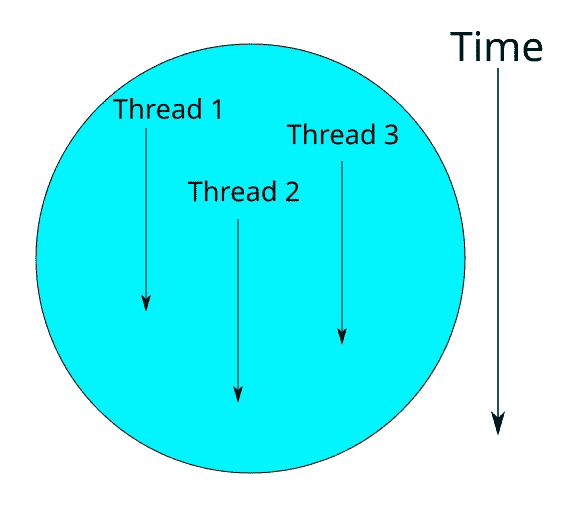
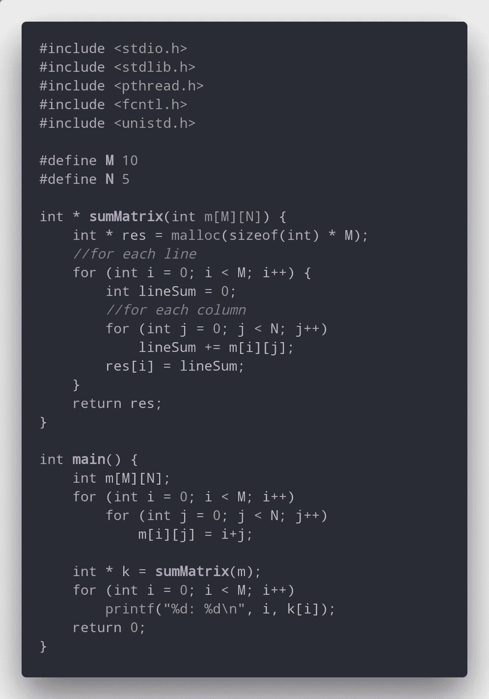
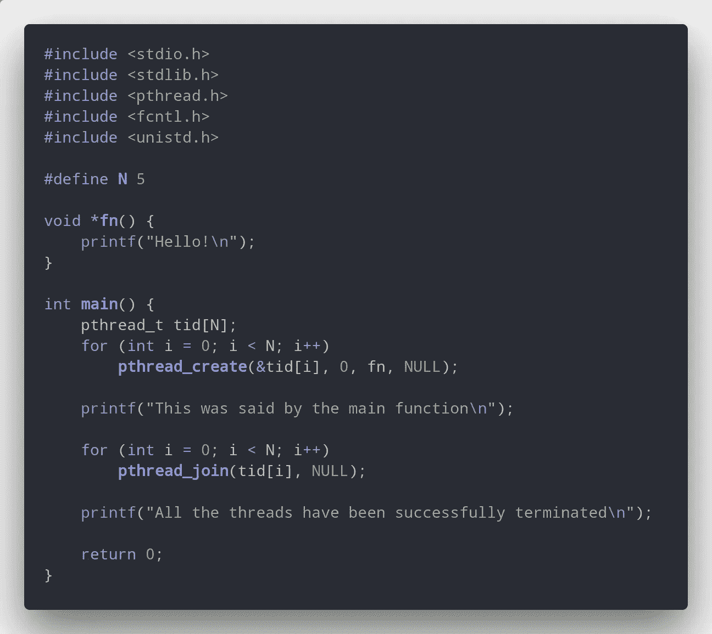
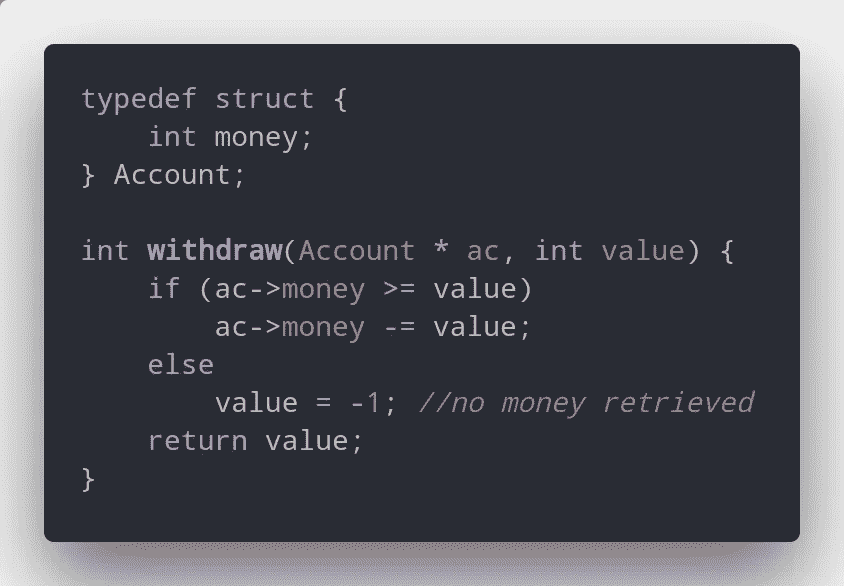
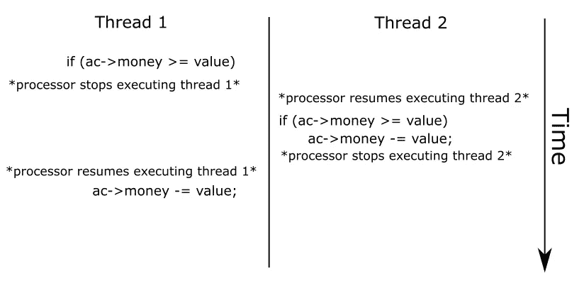
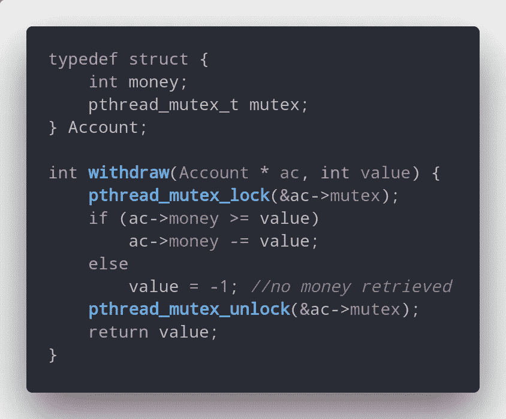

# 并行编程和使用线程为您的慢速程序开发快速解决方案

> 原文：<https://medium.com/hackernoon/parallel-programming-and-developing-fast-solutions-for-your-slow-programs-using-threads-585708c1e533>

如今，我们经常听说多核设备，以及由于它们提供的并行处理能力而变得更好，但是它实际上是如何工作的，以及如何开发利用它的程序呢？

通过允许多件事情同时发生，开发并行程序可以极大地提高程序的性能。但是，有时，它也更加复杂，带来了许多问题，需要一些特殊的技术来避免出现**并发问题**。

我将使用带有 POSIX 命名法的 C 语言，作为解决这个问题的标准和低级方法，让您更好地理解它是如何工作的。

# 基础知识

要开发并行软件，必须了解其核心基础。最重要的是执行线程。线程是按照精确的顺序执行的指令序列，并且独立于其他线程。当你写普通程序时，只有一个执行线程。在一个并行程序中，你想有多少就有多少，这要归功于操作系统的开发方式(它们真的很神奇)。

An example of how threads behave

线程允许你探索用不同的思维方式编程的能力:允许事情同时发生。如果一些操作直到最后才连接起来，那么允许它们同时实现会快得多:想象 4 个带有插槽的块，在插槽中插入数字，你的目标是对每个块中的数字进行排序。如果你是一个人，你会开始单独整理每一块，这需要很长时间。但是，如果你有 3 个以上的朋友，你们每个人都可以单独排序，这样会快得多。

虽然看起来非常简单，但是使用这种类型的编程会产生许多问题。作为开发使用并行编程的系统的人，在处理应用程序的关键部分(例如，共享相同的内存资源)时，必须采取预防措施。

这些问题源于线程的设计方式:它们共存于同一个程序中，因此它们共享相同的代码和堆内存。堆栈内存是不共享的，但在高使用率的情况下可能会重叠(这种情况很少发生)，因为它们属于同一个进程，并且被分配了相同的内存区域。如果你不太了解内存，[你应该先看看这个帖子](https://medium.freecodecamp.org/understand-your-programs-memory-92431fa8c6b)。除了共享整个内存，还有另一个时间上的问题。处理器可以在任何时候将线程从执行中移除，以便它可以执行另一个任务，并在稍后的时间继续该任务。

This program could be optimized so that it uses threads! Try and do it yourself

# 开发您的第一个多线程程序

在 C 语言中使用线程非常简单:有一个数据结构(pthread_t)代表处理器要执行的一个线程，有一组函数对它们进行操作。这里有一个例子:

A very simple program: threads are created and destroyed.

如您所见，这里使用了两个重要的函数: **pthread_create** 和 **pthread_join** 。这允许程序员分别创建和等待线程的结果。

通过多次运行该程序，我们将得到不同的结果。这是并行编程的定律之一:线程执行的顺序无法确定。你能注意到的一件事是所有的“你好！”在“所有线程都已成功终止”之前将显示消息。这是因为那时只有一个线程是活动的:执行主函数的线程。

**fn** 需要返回一个指针，这样编译器就不会返回错误。在 **pthread_join** 中的第二个参数可以用来获取一个线程已经执行的函数的返回值。

# 了解和修复共享内存问题

前面提到的一个问题是共享内存。发生这个问题是因为不可能知道线程将按什么顺序执行。所以，一些以前没有发生的问题，现在也会发生。

假设这个例子中有一个叫做**账户**的结构，你是这个银行的创建者。你制定的规则之一是:客户不能有负资金。因此，您创建以下结构和函数，并且为了提高性能，创建线程来管理客户端发送给您的所有请求。

If two threads try to take money from the same account, will it be okay?

如果没有避免某些情况的知识，你会产生一些以前不会发生的问题。在你把你的银行放在网上一段时间后，你注意到一些人能够利用你的代码，他们的账户开始有负的钱。

问题是，处理器可以在任何时候从执行中移除线程来执行其他任务。这为你不想发生的问题打开了一个机会。

Because there is no safety, the bank account will lose money!

如您所见，两个线程都将从帐户中移除资金，而实际上只有一个线程可以。这将使账户出现负资金，这是你很难避免的。

为了避免这些问题的发生，有一些结构可以使用。每一个都为不同的问题提供了不同的方法。在这篇文章中，我将讨论互斥锁。互斥的工作方式是，它**只为一个任务锁定**一个期望的区域。任何试图访问该区域的其他任务都必须等待该区域中的当前任务释放互斥锁，然后它们可以再次锁定该区域。

一个好的互斥体需要满足某些需求:

*   安全性—一次只有一个线程可以持有互斥锁。
*   避免[死锁](https://pt.wikipedia.org/wiki/Deadlock)——如果多个线程试图锁定互斥体，那么至少其中一个必须能够锁定它。
*   避免饥饿——如果一个线程试图锁定它，它最终会得到它(它不会无限期等待)

死锁和饥饿是开发多线程应用程序时的常见问题。

# 如何使用互斥体

创建一个互斥体就像创建一个线程一样简单——有一个结构和函数可以帮你做到。现在我们可以解决之前的问题:

Very simple!

现在每个帐户都有一个互斥体，允许每个帐户被单独访问:在访问所述帐户之前，每个线程必须首先锁定它。只有在他们访问它之后，才能保证不会出现像以前那样的问题。

现在你的银行是完全安全的，人们不能再利用它，因为你的额外措施来保护它！

# 如果你还想知道更多…

互斥是解决这些问题最简单的方法之一，但是还有其他的解决方案，比如**信号量**和**条件变量**。它们所做的一切都可以用 mutexs 来完成，但是在某些特定的问题上它们更容易使用。

知道如何操作这些结构是非常重要的，这样你就可以创建需要这些方法的大型应用程序。利用多线程优势的语言之一是 **GoLang** 。觉得有动力就去看看吧！

如果你对这个话题有任何疑问，请随时联系我，我会尽我所能帮助你理解！你可以对这个帖子发表评论，我会回答你或者你可以在 [Twitter](https://twitter.com/tm_antunes) 找到我！