# 第 2 部分，共 2 部分:我如何在不到 2 小时的时间里制作出我的第一个 DIY 机械键盘

> 原文：<https://medium.com/hackernoon/part-2-of-2-how-i-built-my-first-diy-mechanical-keyboard-in-less-than-2-hours-c1a50aa5d69>

## 软件配置。也请阅读[第 1 部分](https://hackernoon.com/part-1-of-2-how-i-built-my-first-diy-mechanical-keyboard-in-less-than-2-hours-b2c195885fe8)。

本教程是[第一部分:构建键盘](/@viviennediegoencarnacion/part-1-of-2-how-i-built-my-first-diy-mechanical-keyboard-in-less-than-2-hours-b2c195885fe8)的延续。

我们离开了[第 1 部分](/@viviennediegoencarnacion/part-1-of-2-how-i-built-my-first-diy-mechanical-keyboard-in-less-than-2-hours-b2c195885fe8)，带着半个键盘盒、焊接二极管、开关和 pro-micro。pro-micro 也正在接收电源，因此我们准备在连接底座之前继续进行软件配置。

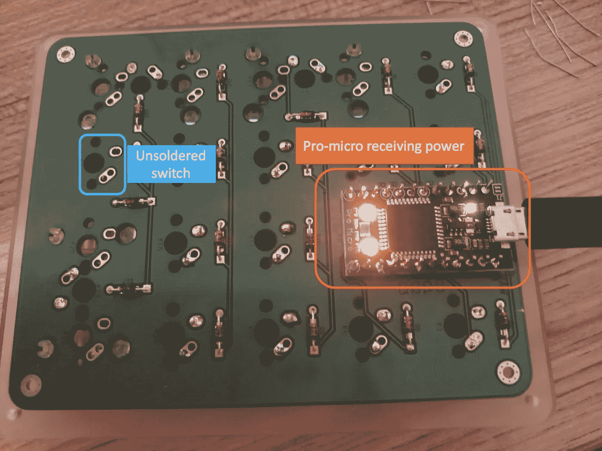

# 第一步。创建配置文件

为了创建我的数字键盘配置文件，我使用了 QMK 配置器，可以在这里找到。确保正确选择了键盘布局设置。我选择了 **snagpad** ，因为我的 PCB 是一个 **snagpad** PCB，由于我正在制作一个 numpad，所以我选择了 **LAYOUT_numpad_5x4** 。

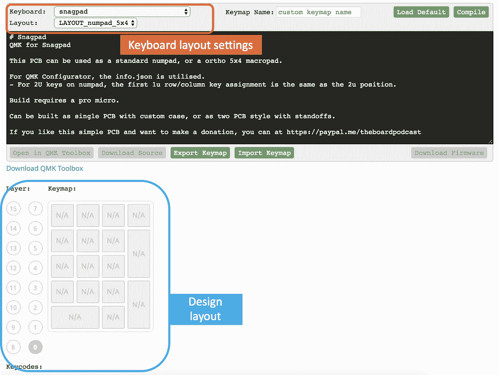

用正确的键码填充设计布局。

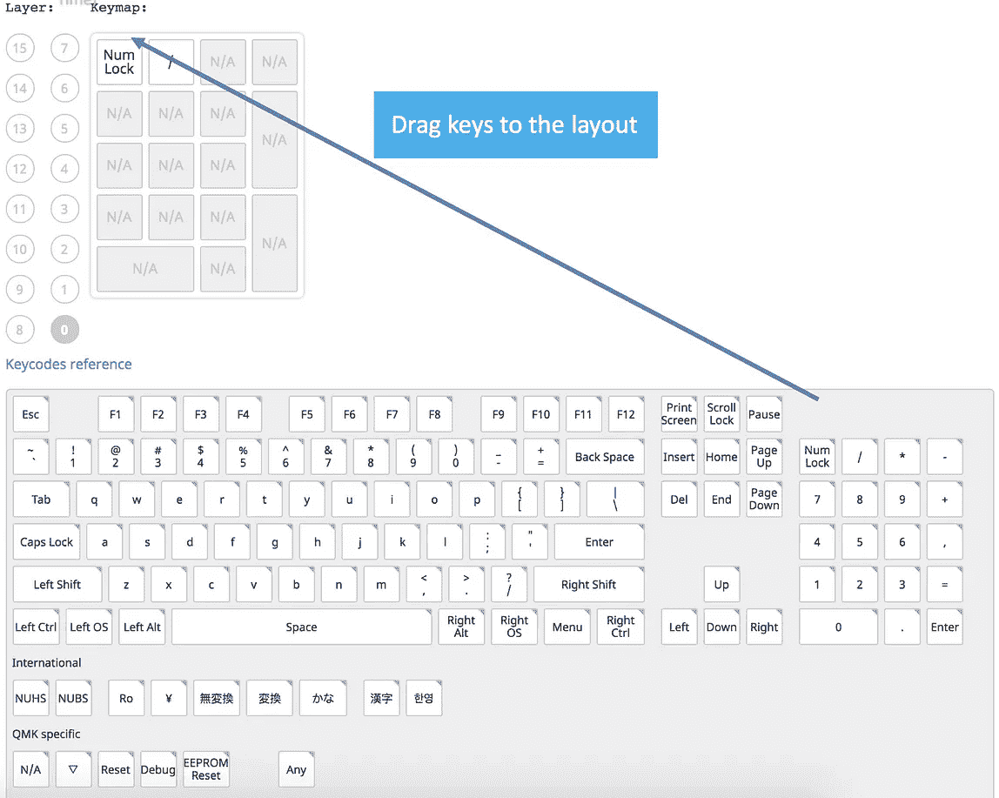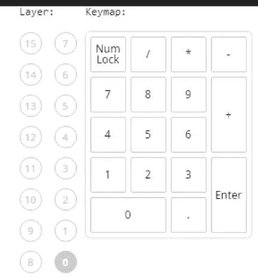

编译，然后下载配置文件。

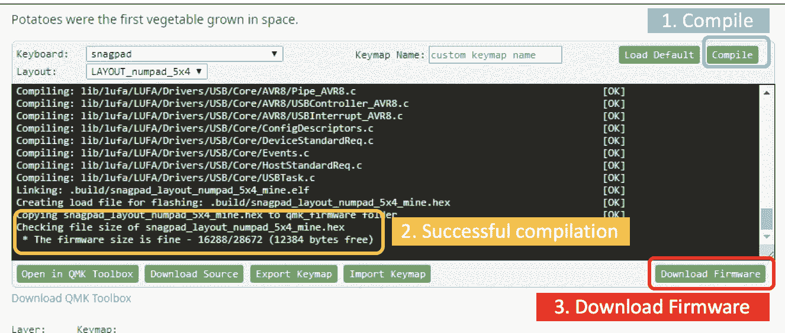

# 第二步。使用配置文件格式化键盘

对于这一步，您需要从 QMK Config [网站](https://config.qmk.fm/#/snagpad/LAYOUT_numpad_5x4)下载并安装 QMK 工具箱。

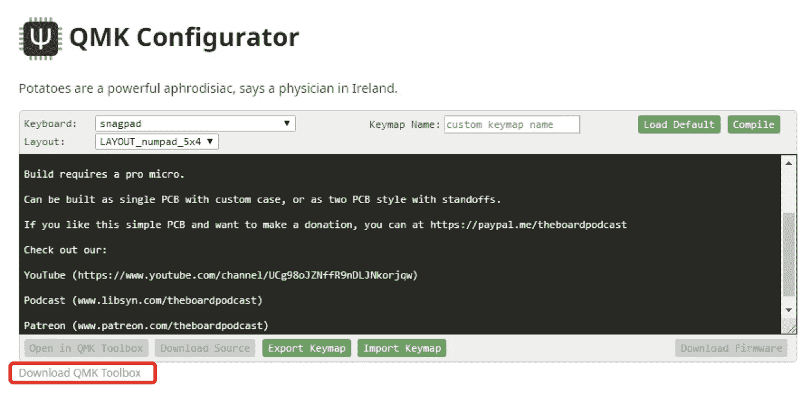

使用 QMK 工具箱打开创建的配置文件。将**自动闪光**打开，以覆盖键盘配置。并在*微控制器*设置中选择 **atmega32u4** 。

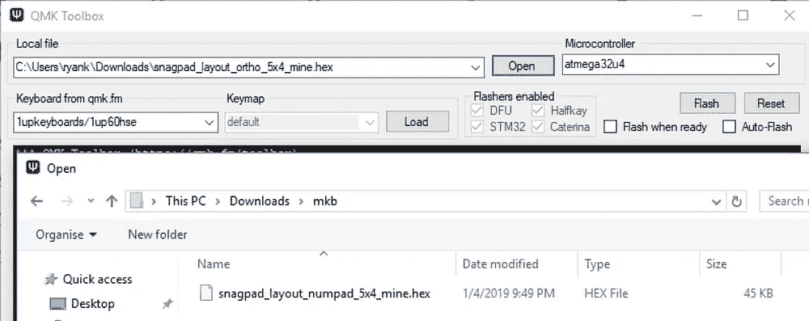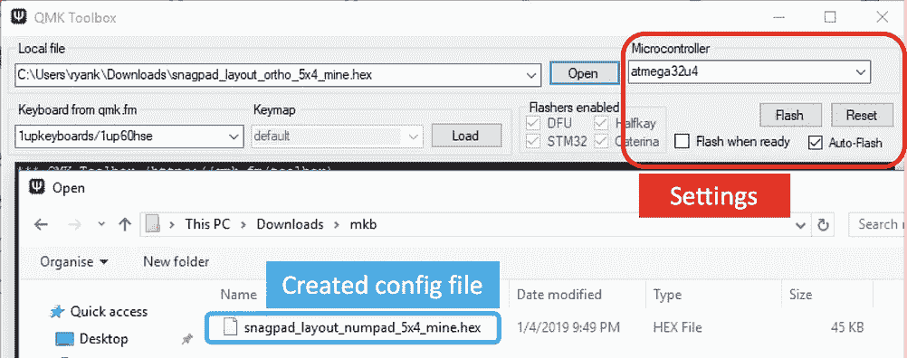

将键盘连接到 PC，然后通过连接 **GND(接地)**和 **RST(复位)**进行复位。由于我勾选了**自动刷新**，QMK 工具箱会自动覆盖检测到的键盘的配置。在此检查布局的来源[。](https://learn.sparkfun.com/tutorials/pro-micro--fio-v3-hookup-guide/hardware-overview-pro-micro)

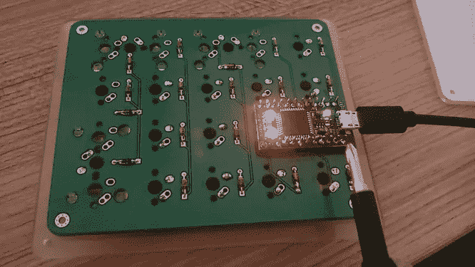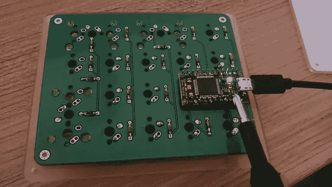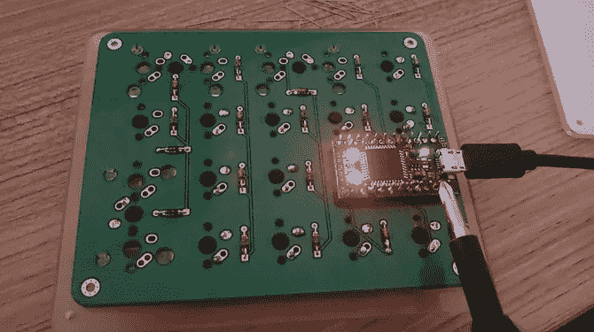

Resetting by connecting ground and reset through a metal object

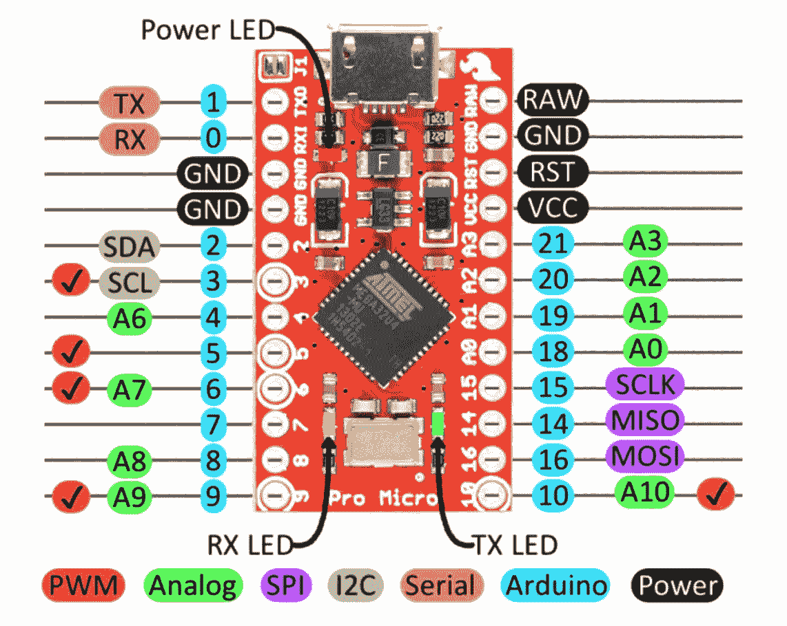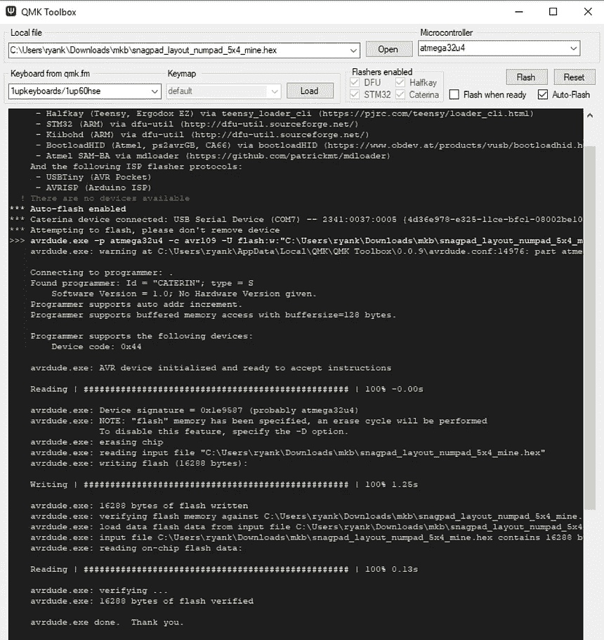

Left — PCB layout, Right — console after connecting keyboard

# 第三步。测试键盘

我使用在线键盘测试器([链接](https://www.keyboardtester.com/))来检查我的键盘是否正常工作。请随意使用记事本，或任何编辑器。

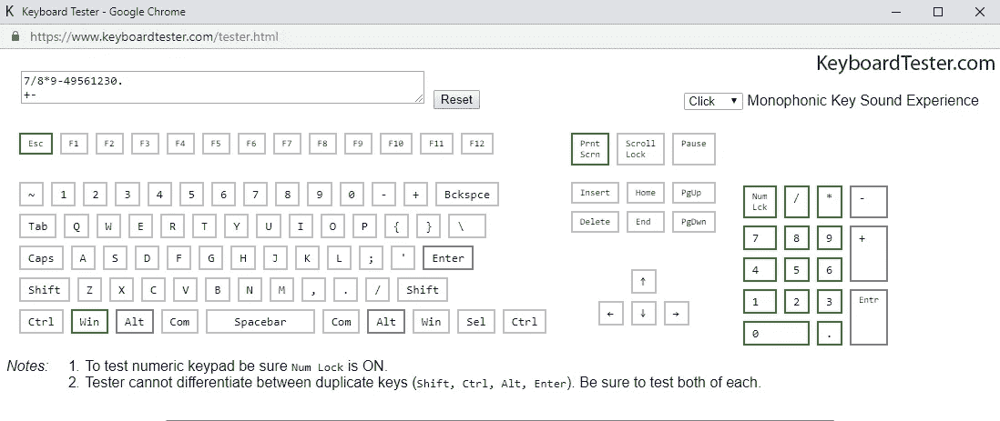

# 第四步。完成键盘的硬件部分。

断开键盘与电脑的连接，并添加剩余的部件—键帽、底座和键盘脚。

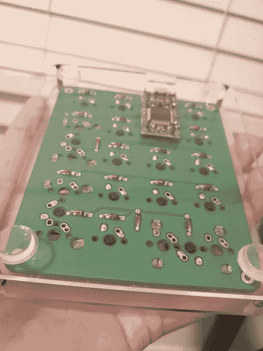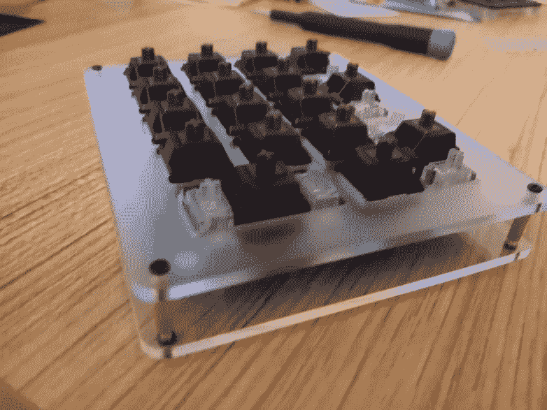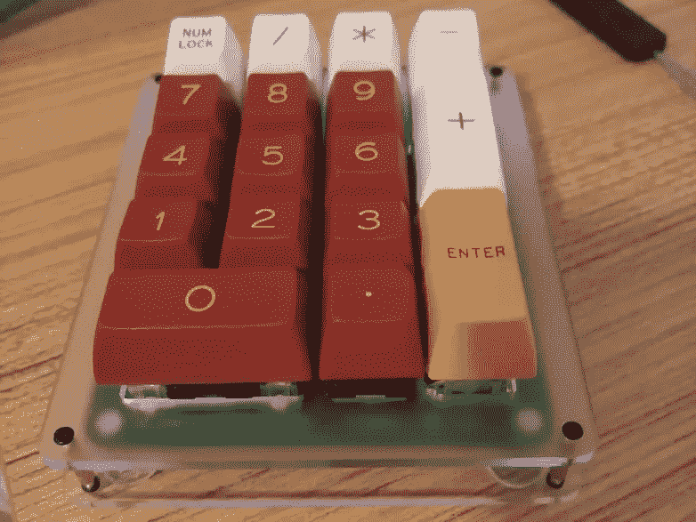

感谢您的阅读。:)

# 来源:

*   [https://theboard.libsyn.com/](https://theboard.libsyn.com/?fbclid=IwAR26VRwr-Z_HypMp1qZJYdnUk-84K6VvVFiyhuKEChwCst2AYZvpW5rElic)
*   https://www.youtube.com/watch?v=_voKcLUjwv8
*   【https://config.qmk.fm/#/snagpad/LAYOUT_numpad_5x4 
*   [https://learn.sparkfun.com/tutorials/pro-micro-fio-v3-连接-指南/硬件-概述-pro-micro](https://learn.sparkfun.com/tutorials/pro-micro--fio-v3-hookup-guide/hardware-overview-pro-micro)
*   [https://www.keyboardtester.com/](https://www.keyboardtester.com/)