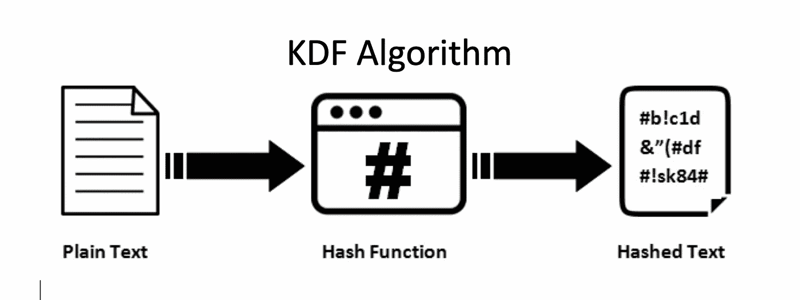
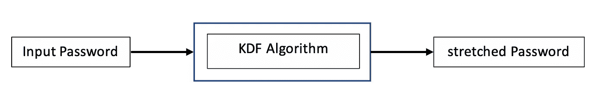

# 使用密钥派生函数的密码扩展(KDF)

> 原文：<https://medium.com/hackernoon/password-stretching-using-key-derivation-function-kdf-a5abc570f9e5>



caption : [https://www.thesslstore.com/blog/difference-sha-1-sha-2-sha-256-hash-algorithms/](https://www.thesslstore.com/blog/difference-sha-1-sha-2-sha-256-hash-algorithms/)

密钥导出函数也称为密码延伸，是区块链、匿名 p2p 应用等加密应用的主要部分，其目标是获取密码或密钥，然后根据配置中选择的字节数生成加密的非常坚固的密钥。

在加密系统中直接使用密码不是最安全的模式，KDF 算法通常用于从输入密码中创建更随机的更长的密钥。

有不同的 KDF 算法，例如 Bcrypt 对于相同的给定输入不会返回相同的输出。这意味着不可能使用 Bcrypt 从给定的密码生成相同的密钥。对于给定的输入，其他人每次都会返回相同的结果，这反过来意味着有可能从给定的密码生成相同的密钥。

KDF 算法是基于加密哈希函数，如 SHA-256，布莱克-2B 或分组密码在 AES 加密中使用，他们利用了盐和胡椒的概念。



KDF Algorithm Process

KDF 算法可以在几乎所有的编程语言中实现，但是在这篇文章中，我将使用 GoLang 编程语言。

我们将使用 GoLang 中的 pkdf 包来生成我们的密钥，包的链接是[https://godoc.org/golang.org/x/crypto/pbkdf2](https://godoc.org/golang.org/x/crypto/pbkdf2)

下面是实现我们的 KDF 算法的代码库。

Kdf-implementation codebase

基于它被很好地注释的事实，代码是自解释的，但是我将解释更多关于实现中的一些事情。

在**第 3–10 行**，我们导入了应用程序中需要使用的包。
**第 17 行**以屏蔽格式从终端获取用户的字节密码。
**第 25 行**创建一个 salt in 字节，用于 out 程序。这可以是用户选择的任意盐。
**第 28 行**打印出用户输入的原始密码。
**第 32–34 行**计算输入密码的 sha-256 哈希，并在终端上打印出来。
**第 43 行**根据输入参数获取派生密钥。

```
func Key(password, salt [][byte](https://godoc.org/builtin#byte), iter, keyLen [int](https://godoc.org/builtin#int), h func() [hash](https://godoc.org/hash).[Hash](https://godoc.org/hash#Hash)) [][byte](https://godoc.org/builtin#byte)
```

该包提供的键功能允许我们自定义输入键的强化级别。以下是提供给我们更改的参数。

**密码**:该输入密码需要被拉伸，类型必须为字节。
**盐**:盐是添加到输入密码中的额外一层，使其更加坚固。Type 必须在 byte
**iter** 中:Iteration 是在计算派生键的 hash 时迭代的次数。Type 必须是 Int
**KeyLen** :这是要返回的建议键的长度。类型必须是 Int。
**h** :这是生成密钥
时使用的散列函数，然后返回包含派生密码的输出。

**第 46 行**打印出派生的密钥，这将是一个很长的密钥，所以我们需要通过将它传递给阿沙-256 哈希函数来将其降低到 32 字节，这是在**第 49 行**中完成的。
最后，我们打印出派生密钥的散列值。

通过执行 go run main.go 运行应用程序，产生以下输出。

```
 1.) Original Password :-> mySecurePassword2.) Hashed Password :-> b6573a02de91d76cc442a6f42aa749c6eee0982c148bb7e9116ee44f93e6807a3.) KDF Key :->  cdf347254e0fb199015a2721110c0a1b1bfc4f66f718a712930173f93290ed783e08e5655c57fd608da39269a10708
fbe191b1141c6ea9d97d02f6bfbbd90580a3aed101a627e8e96d5cb5c51e24dbe1d5e2dca531c9f658de77080352a0394bb48af8636b840
358314bfea2c0eb6a411ea36212bd13bd552a29be78e59fab174.) Hashed Derived Key :-> e6e562be28fc935a2ea2e57f21b018237098aeab64c2621d11627be4e9dfe601
```

你可能认为第二个和第四个答案产生了相同的长度，尽管长度。你是对的，原因是散列函数总是返回固定长度的大小，而不管输入的大小。

你可能想问的另一个问题是，如果散列函数产生某种随机性和密钥拉伸，为什么我们不能只使用散列函数来进行密钥拉伸。对此的回答是，暴力破解散列函数的结果更容易，而暴力破解 KDF 算法是基于计算开销的。

请随意从下面的链接下载代码库，并根据您的需要进行扩展。

感谢您的阅读！

***做些支持和表示一些爱(鼓掌)***

[](https://github.com/princesegzy01/kdf-implementation/blob/master/main.go) [## princesegzy 01/KDF-实现

### 一个在 GoLang 中用于密码扩展的密钥衍生函数(KDF)算法的实现…

github.com](https://github.com/princesegzy01/kdf-implementation/blob/master/main.go)