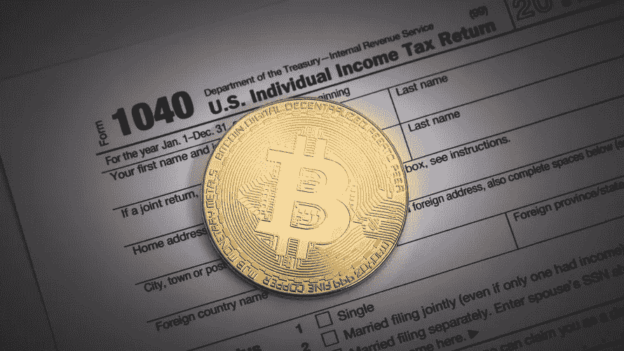

# 支付比特币税——你需要知道的一切

> 原文：<https://medium.com/hackernoon/paying-taxes-on-bitcoin-everything-you-need-to-know-afa86ade7fca>

在美国国税局于 2018 年 7 月 2 日宣布他们今年的核心活动和重点之一是对虚拟货币 征税 [**后，为**](https://www.irs.gov/businesses/irs-announces-the-identification-and-selection-of-five-large-business-and-international-compliance-campaigns)**[比特币](https://hackernoon.com/tagged/bitcoin)纳税正成为美国个人的优先事项。**

因为从法律的角度来看，比特币和其他加密货币被视为财产，它们就像股票、债券、房地产等其他形式的财产一样，受资本损益规则的约束。

本指南介绍了比特币的基本原理和纳税时需要记住的事项。

# 什么是资本收益/资本损失？

一个 [**资本收益**](https://www.investopedia.com/terms/c/capitalgain.asp) 就是资本资产价值的上升。在比特币和加密的世界里，当你以高于购买价格的价格出售或交易一枚硬币时，你会获得资本收益。就像如果你以高于买入价的价格卖出一只股票或一块房地产，你就应该为这一收益缴税。

例如，如果你在 2018 年 4 月以 1000 美元购买了 0.1 比特币，然后在两个月后以 2000 美元出售，你就有 1000 美元的资本利得。你在纳税申报单上申报这一收益，根据你所属的税级，你将为这一收益缴纳一定比例的税。税率会根据你的税收等级以及是短期收益[还是长期收益**而波动。**](https://turbotax.intuit.com/tax-tips/investments-and-taxes/guide-to-short-term-vs-long-term-capital-gains-taxes-brokerage-accounts-etc/L7KCu9etn)

加密领域令人沮丧的一点是，硬币对硬币的交易，例如用比特币交易 ETH，被视为销售，并被视为与兑现为法定货币一样的应税事件。

# 资本损失怎么办？

当你以低于购买价格的价格出售或交易比特币或另一种加密货币时，你会遭受资本损失。这种损失可以用来抵消其他形式的资本收益以及你的税收收入。如果你有很大的时间损失，你可以把这些损失归档以节省你的税单。这些类型的节税可以非常可观，这取决于你的情况。点击 阅读更多关于如何处理税务目的的 [**加密损失的信息。**](https://www.cryptotrader.tax/blog/how-to-handle-your-bitcoin-and-crypto-losses-for-tax-purposes)

# 进一步分解

所以要计算你的资本收益和损失，你用这个公式:

*公允市场价值—成本基础=资本利得/损失*

# 什么是成本基础？

[**成本基础**](https://www.investopedia.com/terms/c/costbasis.asp) 是一项资产在纳税时的原值。在加密的世界里，你的成本基础本质上是你获得硬币的成本。

# 什么是公平市场价值？

从最简单的意义上来说， [**公允市场价值**](https://www.investopedia.com/terms/f/fairmarketvalue.asp) 就是一项资产在公开市场上的售价。同样，对于加密货币，公平市场价值是指在出售时硬币的美元价值。

# 一个例子

这些术语经常会让人感到困惑，但是这个过程实际上非常简单。让我们通过一个例子来确保事情是清楚的。

假设你在 2018 年 1 月的 [**比特币基地**](https://www.coinbase.com/) 买了 5 个以太坊。你为这些 ETH 支付了 2000 美元(每枚硬币 400 美元)。在市场形势恶化后，你在 7 月份以每套 150 美元的价格卖出了 3 套 ETH。

记住，我们需要知道成本基础和公平市场价值来计算你的资本收益或损失。

在本例中，您销售的第三个 ETH 的成本基础是 1200 美元(3 * 400)。你卖了总共 450 美元的硬币。这是你的公平市场价值。

做数学计算，

450–1200 = -750.

你遭受了 750 美元的资本损失。你可以在你的税收中记录这一损失，这样可以在你的税单上省下一些钱。你不会欠你仍然持有的第二个 ETH 的税，因为你还没有交易或出售它们。

请记住，**硬币对硬币交易**也被视为纳税销售。

所以让我们说，你不是把你的 3 个 ETH 换成美元，而是把你的 3 个 ETH 换成 X 个比特币。在这种情况下，你仍然触发了应税事件，但现在你的公平市场价值有点难以计算。你必须知道 3 ETH 在交易时的美元价值，才能计算出你在交易中的损失。

# 房间里的大象

这种硬币对硬币交易的公平市场价值的计算给密码交易员带来了各种各样的问题。一些交易者已经交易密码几个月了，可能几年了，并且没有在每次交易时记录他们的密码的美元价值或公平市场价值。这是你实际上需要的信息，以准确地报税，避免国税局的问题。根据你进行的交易量，精确计算收益可能会变得非常乏味，如果你没有跟踪公平的市场价值，手工甚至用 Excel 都可能做不到。

进入 [**比特币税务软件**](https://www.cryptotrader.tax/) 。

[**密码商。Tax**](https://www.cryptotrader.tax/) 是为了帮助交易者解决这个问题而开发的比特币和加密货币税务软件。

凭借其庞大的历史加密货币价格数据库，CryptoTrader。Tax 能够自动执行整个加密纳税申报流程。作为加密货币爱好者或高交易量交易者，您只需将您在交易所交易的所有历史加密交易上传到平台，运行您的税务报告，然后将这些报告导入 [**TurboTax**](https://turbotax.intuit.com/microsite/home.htm?priorityCode=5708400000&cid=all_bitwor_aff_5708400000) 或交给您的注册会计师或税务专业人员来完成您的纳税申报。

为比特币缴税并不有趣，而且随着这一资产类别的发展，法律可能会继续改变。希望这个指南能让这个过程不那么可怕，更容易理解。

*有关如何处理加密货币税收的更多信息:*

[如何申报加密货币税](https://www.cryptotrader.tax/blog/how-to-report-cryptocurrency-on-taxes)

[我如何使用 CryptoTrader 在 20 分钟内提交我的加密税。税收](https://www.cryptotrader.tax/blog/how-i-filed-crypto-taxes-using-cryptotrader-tax)

[如何处理你的比特币和加密损失以达到税务目的](https://www.cryptotrader.tax/blog/how-to-handle-your-bitcoin-and-crypto-losses-for-tax-purposes)

—

使用我们的 [**加密货币税务专业目录**](https://www.cryptotrader.tax/crypto-tax-accountants) 寻找您身边的税务专家！

**本文仅供参考，不应被视为税务或投资建议。请向您自己的税务专家、注册会计师或税务律师咨询如何对待数字货币的征税问题。*

*最初发布于*[*www . cryptotrader . tax*](https://www.cryptotrader.tax/blog/paying-taxes-on-bitcoin)*。*