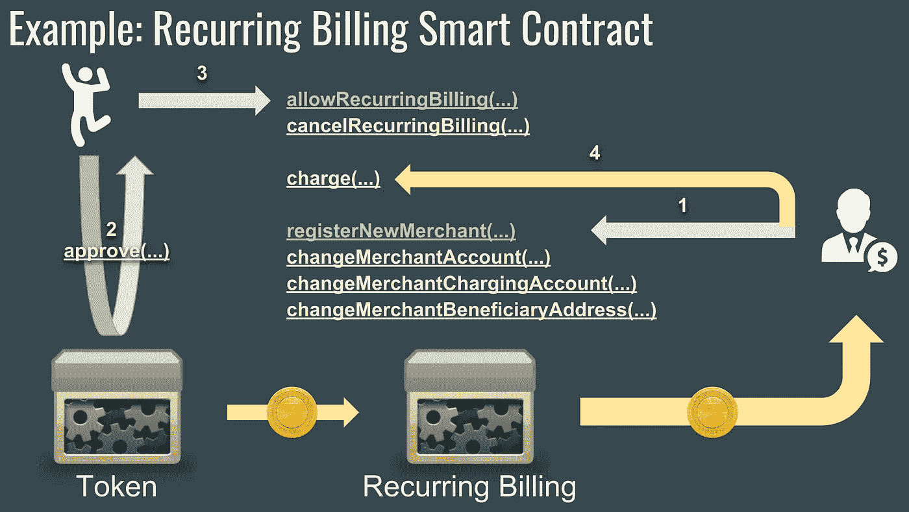
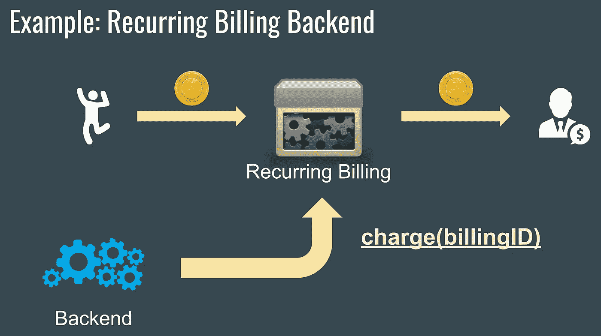

# 未来的支付:分散的循环计费

> 原文：<https://medium.com/hackernoon/payments-of-tomorrow-decentralized-recurring-billing-47d126d895fd>

提供公用设施的互联网服务会按预先确定的时间间隔(通常是每月一次)向您的银行账户收费。这是一种行之有效的做法，也是如今相当常见的商家-客户关系。然而，从技术上来说，除了道德和法律义务，没有什么可以阻止你的银行或支付提供商向你收取超过你所欠的费用。在这篇文章中，我们将揭示如何在一个分散的数据平台上建立循环计费，以便*实际上*保证和执行双方同意的计费规则。

# 区块链和分布式账本技术

尽管区块链在 2018 年面临着许多采用和监管困难，但这是一种会留在这里的技术，无论是区块链、 [hashgraph](https://en.wikipedia.org/wiki/Hashgraph) 、 [tempo](https://www.radixdlt.com/) 还是其他任何分布式账本技术，不管是什么算法。

> 区块链和其他类似技术带来的主要价值可以概括如下:它们允许人们编写和运行程序，这些程序实际上在创建后不能被更改，在执行过程中也不能被篡改。换句话说，这些程序总是按照设计运行，没有哪一方能够影响它们的行为。

如果我们把它们看作是定义硬币如何来回转移的程序，这个定义对今天存在的许多加密货币都是有效的。这也解释了为什么加密货币和许多种类的代币具有真正的价值:它们不能凭空产生，由它们定义的“底层程序”产生。

# 监管会扼杀加密货币吗？

由于各种各样的法规，人们不能简单地创建自己的合法和易于使用的加密硬币。技术上来说，他们可以。然而，一旦出现将这种加密硬币与法定货币(例如，美元或欧元)进行交换的问题，就会出现监管问题。

想象一下，如果每个企业都有权发行和兑换自己的货币，那么就有可能出现大量洗钱或逃税的行为。此外，这个世界已经习惯了信用卡，围绕你不能用信用卡购买的东西建立业务是相当复杂的。

为加密寻找适当的、常识性的规则是一个持续的过程，在它们实现之前，交换它不会变得更容易。然而，这种复杂性并不涉及整个区块链空间；有很多非金融区块链应用的例子，在这些应用中根本不需要监管。

# 区块链中的重复计费

智能合约可以帮助我们达成任何形式的协议，但仅限于令牌化的资产——一种在区块链以[令牌](https://blockchainhub.net/tokens/)或类似形式直接注册的价值。区块链无法保证你的银行会按时释放你的钱(除非你的银行是建立在它上面的)，但区块链可以保证令牌化资产的交付，因为令牌是可以编程的，不像美元。

在本文中，我将使用以太坊平台上的 [ERC20 兼容令牌](https://theethereum.wiki/w/index.php/ERC20_Token_Standard)作为例子，尽管这也适用于其他支持“智能合约”的分散式平台，或者换句话说，分散式(分布式)编程。

## 工作流和重复计费智能合同

在智能合同方面，有两种实现重复计费的方式。第一种选择是将循环计费功能直接编码到令牌智能合约(定义分散网络参与者如何共享令牌的程序)中。然而，在以太坊和许多其他“真正的”去中心化平台中，一旦你创建了一个令牌智能契约，你就不能再改变它了。这就是代币毕竟有实际价值的原因，也是区块链的全部意义所在。

为了避免对重复计费功能进行硬编码， [ERC20](https://theethereum.wiki/w/index.php/ERC20_Token_Standard) standard 带来了另一个可扩展的选项，而不会影响安全性。根据 ERC20 标准，令牌智能合约必须实现 *approve* 和 *transferFrom* 功能，这创建了一个完整的框架，允许以任意方式扩展令牌功能。例如，为了实现循环计费，我们编写第二个智能合同，然后令牌持有者*批准*该合同以对其令牌收费。因此，允许智能合同对代币收费类似于签署纸质合同，在纸质合同中，您有一份关于代币将如何使用的确切声明(智能合同代码)。

我们在 [DreamTeam](https://dreamteam.gg/) 已经为 DREAM token 开发了一个 [***循环计费智能合约，以及一个***](https://etherscan.io/address/0x9df38bdf603b36b8fe8040de760dfbb84ccefa6d#readContract) ***[***智能合约工厂***](https://etherscan.io/address/0xdcc90d21186e9c1b60439fdbf88f0f14ad3a7355#writeContract)*，您可以使用它为自己的 token*****创建相同的循环计费智能合约**！下面是令牌循环计费如何实现的算法。***

*   *它与两个实体一起工作: ***商家*** 和 ***客户*** 。商家将其自身插入智能合同中以收取和接收令牌，而客户证明特定商家被授权执行收费。*
*   *所有经批准的经常性计费都有一个 ***计费 ID*** 供商家用于向客户账户收费。一个客户账户可以同时有多个活动账单。*
*   *商户及其“商户管理”账户可以选择接收代币的特定账户(受益人账户)，以及允许向客户收费的账户。我们有意区分这些账户。*
*   *循环计费 [***智能合约工厂***](https://etherscan.io/address/0xdcc90d21186e9c1b60439fdbf88f0f14ad3a7355#writeContract) 允许为每个令牌单独创建新的循环计费智能合约。*

*在 [DreamTeam 的 GitHub](https://github.com/dreamteam-gg/smart-contracts/blob/master/contracts/token/TokenRecurringBilling.md)([smart-contracts](https://github.com/dreamteam-gg/smart-contracts)资源库)中可以找到关于循环计费智能合同工厂和子智能合同的完整文档。*

*下图展示了循环计费智能合同中的循环计费流程。*

**

*Recurring Billing Smart Contract Workflow*

*它是这样工作的:*

1.  *商家将自己插入到智能合同中，并检索商家 ID，该 ID 用于标识客户同意哪个商家。*
2.  *客户允许循环计费智能合同对其令牌进行计费。在这一步，智能合同仍然不允许商家或任何其他人从客户那里受益，也不向客户收费。*
3.  *客户告诉循环计费智能合同，它允许特定的循环计费，提供商家的 ID 和商家定义的计费属性，如*周期*和*值*。*
4.  *从这一刻起，商家可以通过对智能合约进行*收费*交易向客户账户收费，但在指定的*时间段*内不得超过一次。每次收费时，代币直接从顾客的账户转到商家的受益人账户。*

## *后端安全性*

*通过使用循环计费智能合同，客户可以确保商家不会向他们收取超过约定的费用，同时商家可以方便地从自动化后端向客户收费，而不只是定期手动执行收费交易。*

**

*How back end interacts with a smart contract*

*现在，我们将允许执行收费的帐户与商家“管理”帐户区分开来，以允许商家设置他们执行收费的自动化后端。然而，我们总是假设后端的帐户是不可靠的，随时都可能被入侵。*

*在后端运行事务发布而不暴露系统中某处的私钥是不可能的(即使它们隐藏在加密的内存/存储中)。因此，唯一真正安全的解决方案是限制智能合约对后端使用的帐户的功能，这样潜在的攻击者就无法以任何方式损害系统，除非只是窃取一些以太(发布新交易所需的以太币)。*收费(billingID)* 功能在智能合约级别上受到限制，通过损害后端帐户，攻击者将无法执行任何未经授权的收费，也无法更改令牌接收方地址。*

**为基于以太坊的解决方案开发一个安全稳定的后端是我将在下一篇文章中讨论的一个大话题。*订阅[我的博客](/@zitro)保持更新！*

## ***资源***

*   *[循环计费智能合约工厂](https://etherscan.io/address/0xdcc90d21186e9c1b60439fdbf88f0f14ad3a7355#writeContract) ( [源代码](https://github.com/dreamteam-gg/smart-contracts)，[文档](https://github.com/dreamteam-gg/smart-contracts/blob/master/contracts/token/TokenRecurringBilling.md))。*
*   *[如何在 Etherscan 上验证您的定期计费智能合同代码](https://github.com/dreamteam-gg/smart-contracts/blob/master/contracts/token/TokenRecurringBilling.md#verifying-recurring-billing-smart-contract-code-on-etherscan)。*
*   *[介绍](https://www.youtube.com/watch?v=Iv1jsJpk6Jg)区块链循环计费和后端解决方案(俄语)。*