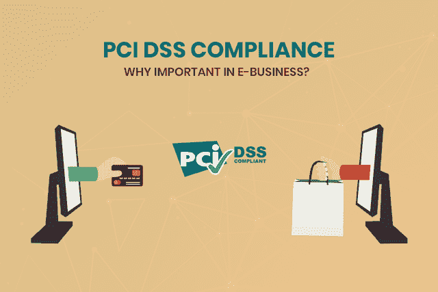
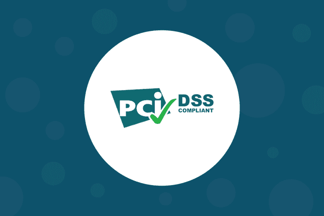
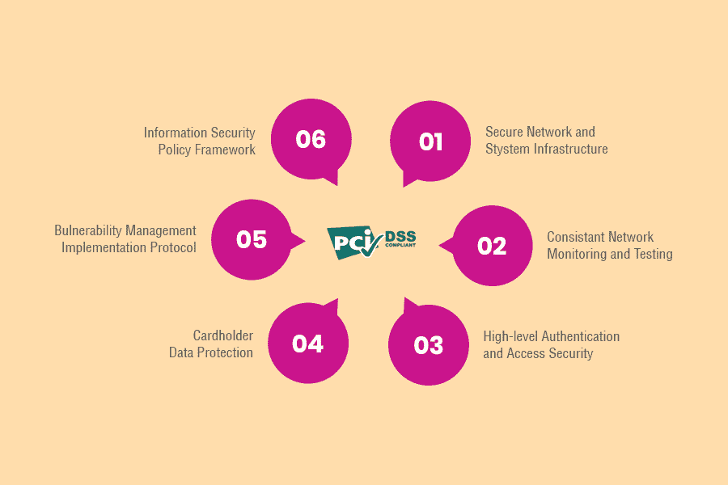
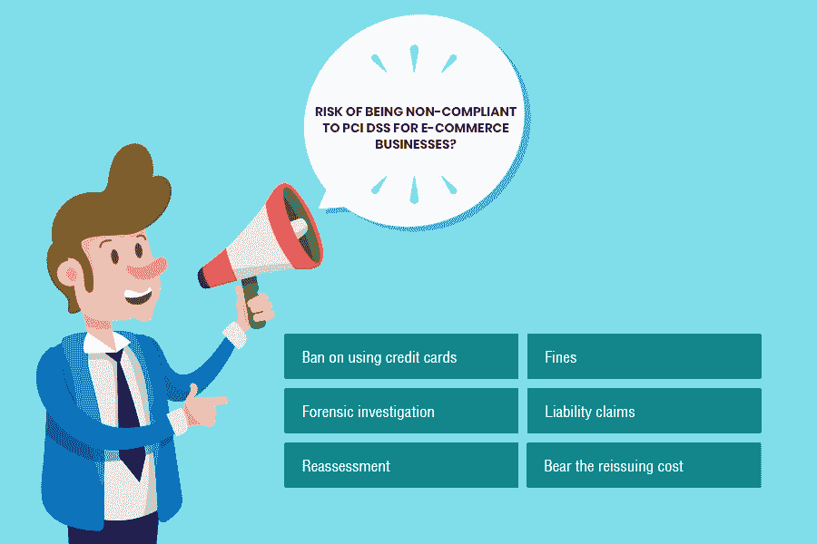
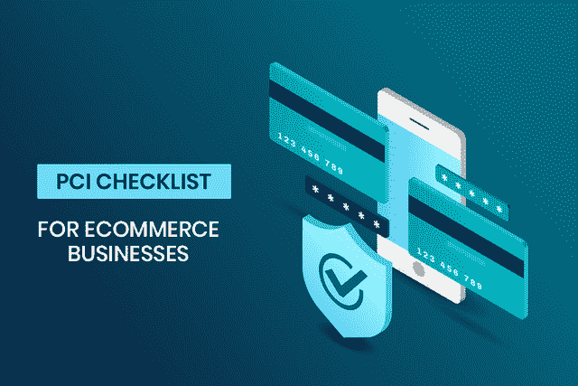
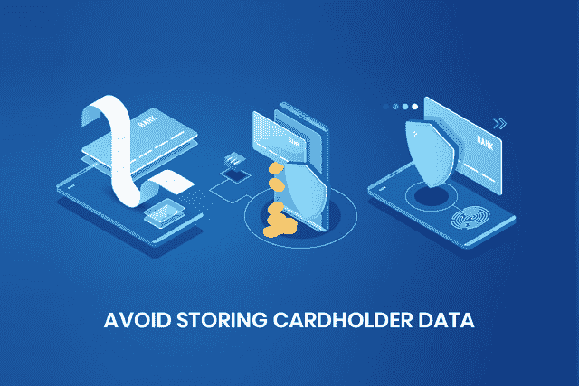
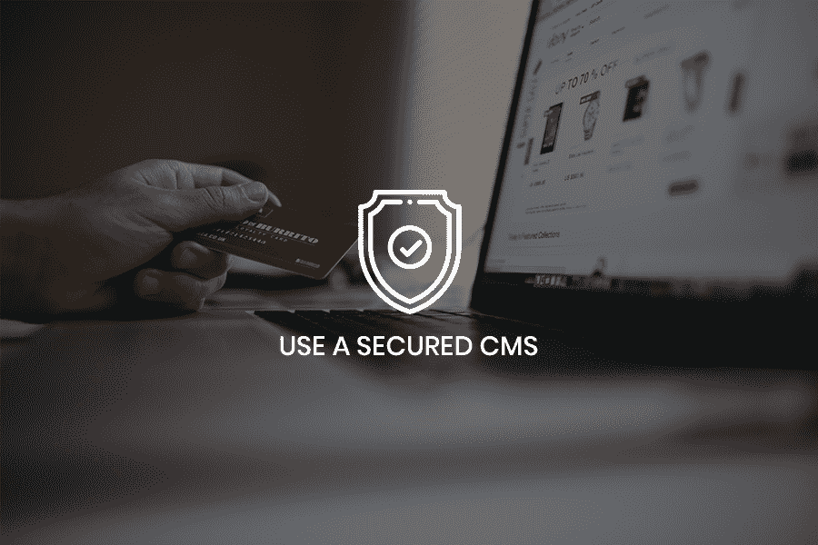
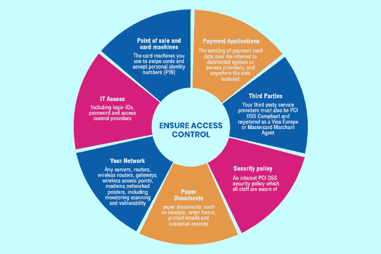

# PCI DSS 合规性:电子商务企业指南和清单

> 原文：<https://medium.com/hackernoon/pci-dss-compliance-a-guide-checklist-for-ecommerce-businesses-833c3f5d9e85>

> "***RSA 反欺诈指挥中心******【AFCC】***统计，电子商务欺诈造成的损失约为每小时 66 万美元。 ***其中主要原因是支付欺诈*** 。”

电子商务客户被盗的风险正在上升，这给我们带来了一个令人担忧的局面。随着中小型电子商务开发公司的不断疏忽，这种情况变得越来越糟糕。他们的网上零售商店的政策和制定中的一个缺点就可能让买家损失惨重。

你一定担心你的电子商务业务的安全和声誉。

**理解小企业的顾虑，我在这篇博客中试图解决以下疑问:**

*   *符合 PCI DSS 对一家电子商务公司来说有什么意义？*
*   如果我的电子商务业务规模较小，我是否需要符合 PCI DSS 标准？
*   *为什么 PCI DSS 合规性对电子商务公司很重要？*
*   *忽视 PCI DSS 有哪些风险？*
*   *成为符合 PCI DSS 标准的电子商务公司需要具备哪些条件？*
*   *PCI DSS 合规性很难获得吗？*

当涉及到网络犯罪时，电子商务网站面临着巨大的风险，因为这些是无卡支付(CNP)渠道。电子商务网站和移动应用程序的支付功能经常存在漏洞，会带来可怕的后果。

为了防止反响，建议电子商务网站遵循少数组织制定的安全标准。各大信用卡公司推荐了名为 PCI DSS 的某些要求，这些要求是 [**电子商务软件公司**](https://www.xicom.biz/offerings/ecommerce-development/?utm_source=KC02) 必须遵循的。

这些指南不是法律建议，但在保护持卡人信息方面有很大帮助。统计数据清楚地显示了对他们隐私的威胁。事实上，根据 Juniper Research 的数据，预计[在线支付欺诈](https://www.infosecurity-magazine.com/news/online-fraud-losses-set-to-hit/)将在 2019 年达到 220 亿美元，到 2023 年达到 480 亿美元。

> 因此，要想让你的客户免受此类支付欺诈，请务必雇佣印度最好的软件开发公司，他们可以创建一个完全不受欺诈者攻击的结账页面。

此外，询问他们是否可以使您的电子商务网站 PCI DSS 兼容。如果你认为这只会为客户提供一个安全的交易，那你就错了。通过遵循这些标准，您还可以获得许多其他好处。

> 在深入了解 PCI DSS 的优势和特点之前，让我们首先明确它的起源和意义。

# **什么是 PCI DSS 合规？**

> 简而言之，支付卡行业数据安全标准(PCI DSS)是任何存储、处理和传输持卡人详细信息的实体都必须遵守的要求。

这些要求是由美国运通、万事达、JCB、Discover 和 VISA 等顶级信用卡公司制定的。它们是为了保护与一家 [**电子商务开发公司**](https://www.xicom.biz/offerings/ecommerce-development/?utm_source=KC02) 共享其信用卡详细信息的客户的敏感数据而创建的。

PCI DSS 是一套涵盖所有品牌的正式标准，旨在保护包括卡品牌、客户和零售商在内的所有各方。这些标准被推荐给各种规模的企业，包括小型企业。

> 借助 PCI 指南，您可以为您的电子商务商店制定内部安全计划。从印度的电子商务开发公司获得帮助，根据您的业务目标和需求进行设计。

## **为什么遵从 PCI DSS 对电子商务公司很重要？**

你一定想知道为什么我需要 PCI 兼容？以下是您需要了解的主要优势:

> **这些要求比任何其他工业标准都更具技术性。**
> 
> **通过遵循这些指南，您可以非常熟练地管理您的电子商务业务的支付 IT 基础设施。**
> 
> **一旦电子商务公司符合 PSI DSS 标准，丢失持卡人私人数据的风险可以降低数倍。**
> 
> **这可以加强和提高您的整体信息安全计划。**
> 
> **PCI DSS 将有助于赢得客户的信任，从而为您的企业带来强大的品牌声誉。**

## **不符合电商业务 PCI DSS 的风险有多大？**

到目前为止，我们已经讨论了 PCI DSS 符合电子商务网站的各种好处。如果不符合 PCI DSS，电子商务企业可能需要面对以下后果:

*   禁止使用信用卡:这些标准是由大的信用卡公司制定的，所以一旦你的电子商务网站发生欺诈，他们会很快抓住你。不负责任的商人被禁止使用他们的信用卡。
*   **罚款:**一旦发现数据泄露，将处以 86500 美元至 400 万美元的罚款。如果发现您的客户正在进行欺诈交易，将会受到处罚。
*   **法医调查:**在几次数据泄露后，你将被要求雇佣专业人员，完成耗时的调查。对于一个小企业来说，这样的调查将花费大约 2 万到 5 万美元。
*   **责任索赔:**如果您的电子商务商店出现数据泄露，可能会通过诉讼提出索赔。这是为了让您意识到保护客户的信息是您的责任。
*   **重新评估:**将对 PCI 合规性进行全面的重新评估。外部合格的安全访问器(QSA)将执行此操作，以允许您再次接受信用卡。
*   **承担补发费用:**信用卡公司会要求电商店主支付每张卡 3 到 10 美元左右的补发费用。它涉及到激活、通信和运输的成本。

## **如何让你的电商业务 PCI DSS 合规？**

支付卡行业数据安全标准中提到了各种要求。他们被进一步划分为子类，你将不得不执行大量的行动，使您的电子商务网站符合 PCI DSS。

对于规模较小的电子商务网站来说，这似乎是一项繁忙的工作，但我已经用简单的语言解释了这些要求。如果您的基础设施有限，您可以遵循以下步骤，使您的企业 PCI DSS 兼容。

# 阅读更多:[管理 Web 开发项目的综合指南](https://hackernoon.com/a-comprehensive-guide-to-managing-web-development-projects-8364f2230eb7)

# **这是一份完整的电子商务网站 PCI DSS 清单:**

## **获得安全的网络:**

这可以通过彻底记录你的工作来实现。为此，你需要利用印度最好的 [**网络开发服务**](https://www.xicom.biz/offerings/web-development/?utm_source=KC02) 。他们能够为你提供像编写防火墙程序这样的服务。

在这里，您需要列出所有网络服务器，并确定您的卡数据环境。这将帮助您找出内部可访问的数据。在防火墙的帮助下采取措施限制访问。

**禁用默认账户:**

每个电子商务人员最常犯的一个错误是使用供应商提供的默认值。在进行网络安装的第一步之前，应该更改或禁用这些功能。

需要通过建立可靠的配置标准来最大限度地减少安全漏洞。确保你雇佣的印度软件开发人员能够用强加密技术编写代码。

此外，如果你共享主机提供商，那么确保各方保护彼此的数据。作为一个组织，您必须高效地创建和维护高度安全的策略，并遵循安全的操作程序。

## **避免存储持卡人数据**

你知道电子商务欺诈率呈上升趋势吗？根据[网络犯罪报告](https://www.threatmetrix.com/digital-identity-blog/cybercrime/cybercrime-report-reveals-surge-in-ecommerce-fraud-attacks/)，2018 年的犯罪率比 2017 年增长了 88%。在这种情况下，您怎么能拿用户数据的安全冒险呢？

持卡人数据本质上是敏感的，它包含持卡人信息、卡号和密码。您应该避免在您的网络上存储这些信息，以避免任何类型的欺诈活动，并提供在线支付的所有好处。

如果您正在存储，请使用高度加密。为此，您可以使用一种称为 SSL/TLS 的技术。它有助于加密系统之间传输的数据(持卡人信息)。

根据 PCI DSS，必须使用 SSL 证书接受付款。这将允许你的电子商务网站通过 HTTPS 而不是 HTTP 访问。有许多托管网站免费或收取一些费用提供这些证书。

> 此外，SSL 证书有助于在其庞大的客户群中赢得电子商务行业的信任。这也将有助于提高你的搜索引擎优化排名，因为谷歌已经开始给 HTTPS 网站更多的价值。

## **定期更新杀毒程序:**

你知道坏演员从不手动搜索易受攻击的网站吗？有些机器人会搜索这种不安全的、可能会被攻击的网站。您需要有效地管理这些漏洞。

这可以通过在所有计算机和服务器上安装和更新防病毒程序来实现。确保这些程序不间断地运行。根本不应该向用户授予停止这些程序的权限。

只有经过授权的人员才能禁用或更改服务器上的防病毒机制。此外，应记录这些机制，以便所有受影响的各方都清楚这些机制。

## **使用安全的 CMS:**

> 你打算开一家电子商务公司吗？确保雇佣印度最好的 [**Magento 电子商务发展公司**](https://www.xicom.biz/offerings/magento-development/?utm_source=KC02) 。不管你是刚刚开始还是已经有了很大的用户基础，CMS 的安全性总是处于危险之中。

这是因为如果你有一个易受攻击的 CMS 和它不那么强大的扩展和插件，那么你将处于一个易受攻击的状态，不管你有多少流量。这就是为什么一个值得信赖的电子商务开发公司是必不可少的。

即使你今天正在享受一个安全的工作，你也会有在未来吸引一个恶意机器人的风险。因此，你的网站的每一个组件的编码都应该非常小心和高效。

> 万一你被一个易受攻击的 CMS 卡住了，那么你可以利用防火墙。这将有助于进行虚拟修补，并保护您的服务器免受所有可能的漏洞。

## **确保访问控制:**

应该只允许极少数工作需要访问的人使用您的安全网络。此外，你应该能够监控他们的活动。通过限制访问，您可以减少欺诈的机会。

确保有与此访问权限相关的书面政策。该政策应与每一个受影响方共享，包括其个人数据需要保护的客户。

此外，您可以为每个访问您网络的人提供唯一的 id。也可以使用其他身份验证方法来确保顶级的安全网络访问。

> 攻击者通常搜索认证要求较弱的网站。为此，您可以在您的服务器环境中使用多步身份验证实践，或者遵循密码安全的最佳实践。

# **与电子商务 PCI DSS 合规性相关的 5 个最常见误区**

*   **PCI 不合理，需要付出很多努力**:这些标准的大部分要求都是安全策略，在任何情况下都应该遵循。
*   **PCI 使电子商务商店变得安全:**它确实使您变得安全，但遵循安全规定是一个持续的过程，不能以成为一家 PCI 合规公司而告终。
*   **一笔交易不需要 PCI:** 在所有接受信用卡支付的情况下，都需要 PCI 合规。你是否有任何付款或只有一笔付款并不重要。
*   **PCI 说要存储卡数据:**是最没有根据的神话。事实上，信用卡公司强烈反对在任何服务器上存储持卡人的详细信息。PCI DSS 符合性根本不要求这样做。
*   **PCI 艰难:**你可能也早就有这种想法了。但是我希望在读完这篇博客后，你已经明白这只是几个步骤的问题，PCI DSS 遵从性根本不是一项困难的任务。

# **结论:**

使您的电子商务业务符合 PCI DSS 不是应该困扰您的事情(至少在阅读了这篇博客之后)。事实上，通过为买家提供高度安全的网络，这将有助于增加客户的信任和您产品的销售。

PCI DSS 不是为了向顶级卡公司证明什么，而是为了消除您的企业在达到成功顶峰的过程中的所有障碍。PCI 法规遵从性的好处远远超过您必须投入的努力。

为了避免不符合 PCI DSS 的风险，您可以联系印度的 [**电子商务开发公司**](https://www.xicom.biz/offerings/ecommerce-development/?utm_source=KC02) 。随着 PCI DSS 版本的不断更新，在拥有专业知识的人的监督下进行这项工作是很重要的。

> **如果您认为这篇文章信息丰富且有帮助，请不要犹豫，分享您的观点。非常欢迎你在下面评论来给这篇文章补充一些东西。让我们分享观点，让我们的电子商务行业远离欺诈。**