# 感知器——深度学习基础

> 原文：<https://medium.com/hackernoon/perceptron-deep-learning-basics-3a938c5f84b6>

## 麦卡洛克-皮茨神经元的升级。

感知器是神经网络的基本单元，它接受加权输入，对其进行处理，并能够执行二元分类。在这篇文章中，我们将讨论感知器模型的工作原理。这是我之前关于[麦卡洛克-皮茨神经元](/@niranjankumarc/mcculloch-pitts-neuron-deep-learning-building-blocks-7928f4e0504d?source=friends_link&sk=4dc5ca78a789aa891d3435e9be22f153)的博文的后续博文。

1958 年，弗兰克·罗森布拉特提出了感知机，这是一种比麦卡洛克-皮茨神经元 T4 更一般化的计算模型。Rosenblatt 提出的感知器的重要特征是为输入引入了权重。20 世纪 60 年代后期，罗森布拉特的模型被明斯基和帕尔特改进和完善。Rosenblatt 的模型被称为*经典感知器*，Minsky 和 Papert 分析的模型被称为*感知器。*

*免责声明:本文的内容和结构基于四分之一实验室的深度学习讲座——*[*pad hai*](https://padhai.onefourthlabs.in)*。*

# 感知器

在 MP 神经元模型中，在计算结果时，所有输入具有相同的权重(相同的重要性),并且参数 **b** 只能取较少的值，即，用于找到最佳参数的参数空间是有限的。

所提出的感知器模型将权重的概念引入到输入中，并且还设计了一种算法来寻找这些数字参数。与 MP 神经元模型中的布尔输入不同，感知器模型中的输入可以是实数。模型的输出仍然是布尔输出{0，1}。

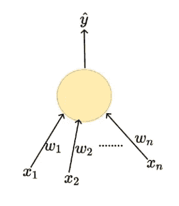

Fig 1— Perceptron Model

## 数学表示

数学表示看起来有点像 if-else 条件，如果输入的加权和大于阈值 **b** 输出将为 1，否则输出将为 0。

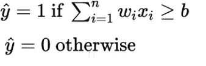

Fig 2 — Mathematical Representation

这里的函数有两个参数权重**w**和阈值 **b** 。感知器的数学表示看起来像一条线(2D)或一个平面(3D)的方程。

```
w1x1+w2x2-b = 0 (In 2D)
w1x1+w2x2+w3x3-b = 0 (In 3D)
```

为了理解重量的概念，让我们以我们之前的例子为例，根据关于电话特征的信息来购买电话。结果将是二元的{y — 0:不买手机，y — 1:买手机}。在这个模型中，我们可以用实数代替二进制值作为模型的输入。

[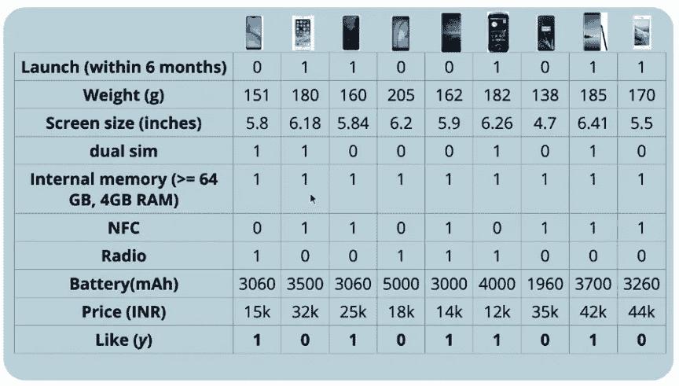](https://padhai.onefourthlabs.in)

Fig 3 — Buying a Phone or not

一般来说，手机价格和购买手机的可能性成反比(除了少数粉丝)。对于 iphone 粉丝来说，不管价格如何，他/她都更有可能购买下一代手机。但另一方面，普通消费者可能会更重视其他品牌的低价产品。这里的要点是，所有的输入在决策中并不具有同等的重要性，这些特征的权重取决于数据和手头的任务。

# 输入数据

感知器模型的输入可以是实数，因为这将面临的一个明显的挑战是特征的单位不相似，即不是所有的特征都存在于相同的单位中。从上面的输入数据中，我们可以看到*价格*以千为单位，*屏幕尺寸*以十为单位。在模型中，我们通过对所有输入执行加权聚合来做出决策。让数据中出现的所有特征都处于相同的比例是非常重要的，这样这些特征将具有相同的重要性，至少在迭代的初始阶段是如此。以便使所有的特征达到相同的比例。我们将执行[最小-最大标准化](https://scikit-learn.org/stable/modules/generated/sklearn.preprocessing.MinMaxScaler.html)以将所有值带入范围 0-1。

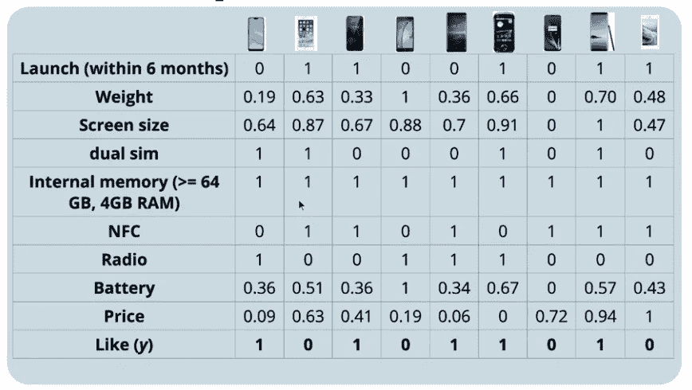

Fig 4 — Standardized data

# 损失函数

损失函数的目的是告诉模型在学习过程中需要进行一些校正。让我们考虑一下，我们只根据重量和屏幕尺寸这两个特征来做出决定。

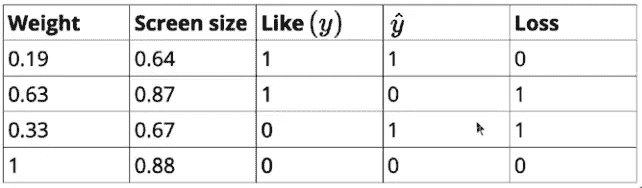

Fig 5— Smaller data set

如果 Yactual 和 Ypredicted 相等，损失函数值将为零，否则将为 1。这可以用一个指示器变量来表示，如果 Yactual 和 Ypredicted 不相等，该变量的值将为 1，否则将为 0。

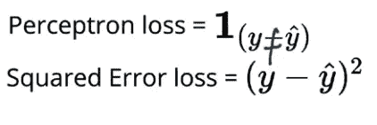

Fig 6— Perceptron Loss

# 学习算法

在我们讨论学习算法之前，让我们再一次看看感知器模型的数学形式。在两个特征的情况下，我可以将图 2 所示的等式写成:

> w2x2+w1x1-b ≥ 0
> 假设，w0 = -b 且 x0 = 1 那么，
> w2x2+w1x1+w0x0 ≥ 0。

将上述等式推广到 n 个特征，如下所示，

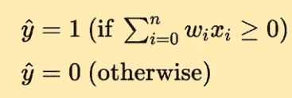

Fig 7— Modified Mathematical representation

学习算法的主要目标是找到能够绝对分离两组数据的向量。训练数据包含两组输入，P(正 y = 1)和 N(负 y = 0)。感知器学习算法是这样的，

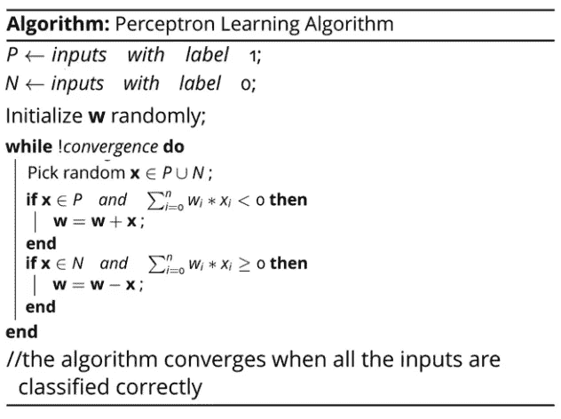

Fig 8— Perceptron Algorithm

我们随机初始化权重，然后从整个数据中选取一个随机观察值 **x** 。如果 **x** 属于正类，并且点积 **w.x < 0** ，则意味着模型正在出错(对于正类，我们需要输出为 **w.x ≥ 0** ，参见图 6)，并且需要更新权重( **w = w + x** )。类似地，如果 **x** 属于负类，并且点积 **w.x ≥ 0** (对于负类，我们需要输出为 **w.x < 0** )在这种情况下，模型再次出错，因此需要更新权重( **w = w — x** )。我们将继续这个操作，直到我们达到收敛，在我们的情况下，收敛意味着我们的模型能够正确地分类所有的输入。

## 学习算法背后的直觉

我们看到了每当出现分类失误时权重是如何更新的。现在，我们将了解为什么更新权重(增加或减少)有助于我们完美地分类积极和消极类别。

为了理解这个概念，让我们回顾一下几何和线性代数。两个向量 **w** 和 **u** 之间的余弦角由下式给出

> *w . u =∨w∨u∨cos(θ)
> 其中* θ为 x 与 w 之间的角度，其中 0≤θ≤180
> cos(θ)范围为 1 至-1，分别为θ= 0°和θ= 180°

余弦公式中需要注意的重要一点是，余弦角的符号取决于两个矢量之间的点积，因为即使矢量元素为负，L2 范数或幅度也总是正的。

> *若 w.x > 0，则θ<90 =>cos(θ)>0；锐角
> 若 w.x < 0，则θ>90 =>cos(θ)<0；钝角*

有了这个直觉，我们再回到更新规则，看看它是如何工作的。对于所有观测值来说 **x** 属于正输入空间 **P，**我们希望 **w.x ≥ 0** ，这意味着两个向量 **w** 和 **x** 之间的角度应该小于 90°。如果出现分类错误，我们将通过添加 **x** 到 **w** 来更新参数。本质上，我们正在增加 **w** 和 **x** 之间的余弦角，如果余弦角增加，这意味着向量之间的角度从钝角减小到锐角，这就是我们想要的。

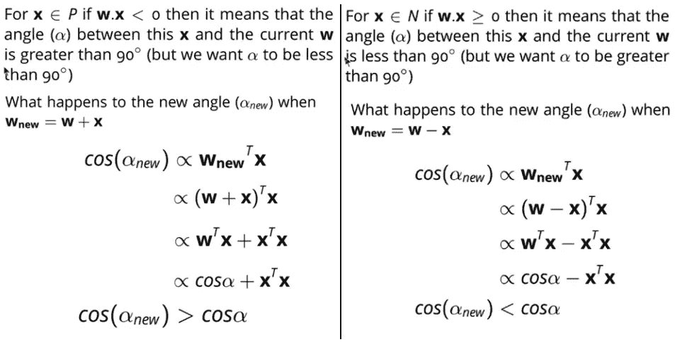

Fig 9— Update algorithm

同样，对于属于负输入空间 **N** 的观测值，我们要点积 **w.x < 0** 。如果出现分类失误，我们将减少权重，以减小新的 **W** 和 **x** 之间的余弦角。如果余弦角减小，这意味着向量之间的角度从锐角增加到钝角，这就是我们想要的。

# 模型评估

一旦我们从学习算法中获得了最佳权重 **w** ，我们就可以通过比较实际的观察类和预测的观察类来评估测试数据上的模型。

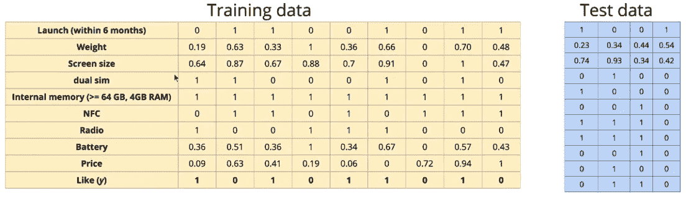

Fig 10 — Testing data

为了评估，我们将计算模型的准确度分数。

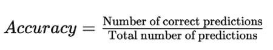

Fig 11 — Accuracy score

# 继续学习

如果你想让你的学习从感知器模型更上一层楼。查看来自 [Starttechacademy](https://courses.starttechacademy.com/full-site-access/?coupon=NKSTACAD) 的 Abhishek 和 Pukhraj 的[人工神经网络](https://courses.starttechacademy.com/full-site-access/?coupon=NKSTACAD)。还有，课程是用最新版本的 Tensorflow 2.0 (Keras 后端)讲授的。他们还有一个非常好的关于机器学习(基础+高级)的包，用 Python 和 R 语言编写。

# 结论

在这篇文章中，我们看了感知器模型，并将其与 [MP 神经元模型](/@niranjankumarc/mcculloch-pitts-neuron-deep-learning-building-blocks-7928f4e0504d)进行了比较。我们还看了感知器学习算法以及为什么更新权重算法起作用的直觉。

在下一篇的[文章中，我们将使用 python 和 sklearn 中的](https://hackernoon.com/implementing-the-perceptron-algorithm-from-scratch-in-python-48be2d07b1c0)[乳腺癌数据集](https://scikit-learn.org/stable/modules/generated/sklearn.datasets.load_breast_cancer.html)从头实现感知器模型。

*推荐阅读*

[](https://hackernoon.com/mcculloch-pitts-neuron-deep-learning-building-blocks-7928f4e0504d) [## 麦卡洛克·皮茨神经元——深度学习的构建模块

### 深度学习的基础是人工神经元

hackernoon.com](https://hackernoon.com/mcculloch-pitts-neuron-deep-learning-building-blocks-7928f4e0504d) 

[Niranjan Kumar](https://medium.com/u/3e4fb2985698?source=post_page-----3a938c5f84b6--------------------------------) 在汇丰银行分析部门实习。他对深度学习和人工智能充满热情。他是[人工智能](/tag/artificial-intelligence/top-writers)中[媒体](https://medium.com/u/504c7870fdb6?source=post_page-----3a938c5f84b6--------------------------------)的顶尖作家之一。在 LinkedIn[上与我联系，或者在 Twitter](https://www.linkedin.com/in/niranjankumar-c/)[上关注我，了解关于深度学习和人工智能的最新文章。](https://twitter.com/Nkumar_283)

**免责声明** —这篇文章中可能有一些相关资源的附属链接。你可以以尽可能低的价格购买捆绑包。如果你购买这门课程，我会收到一小笔佣金。