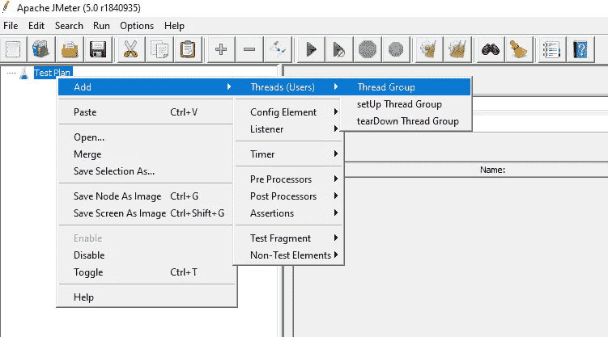
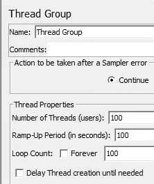
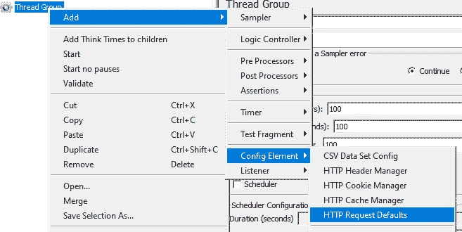
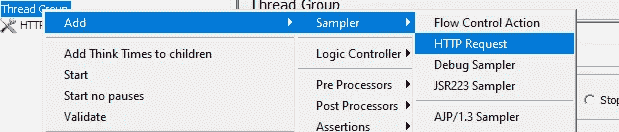
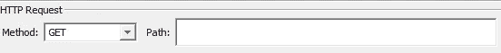
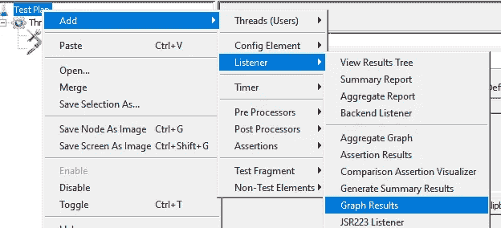
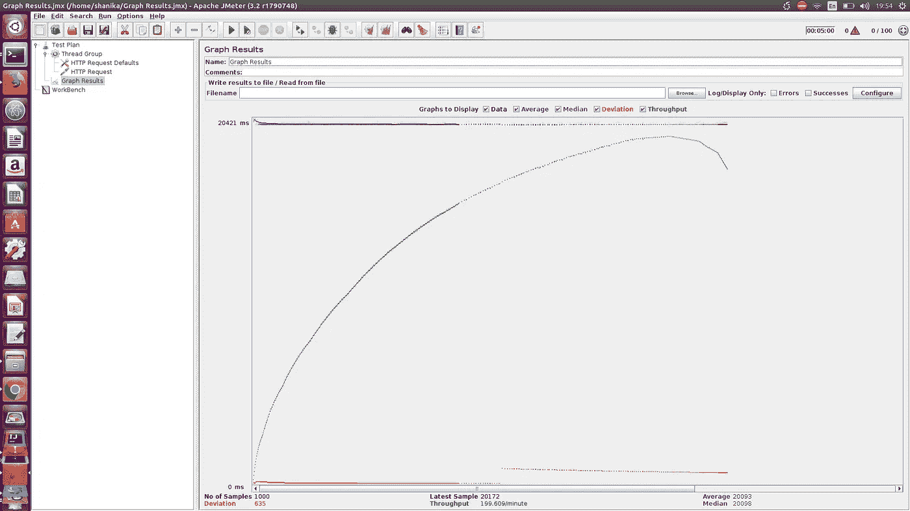
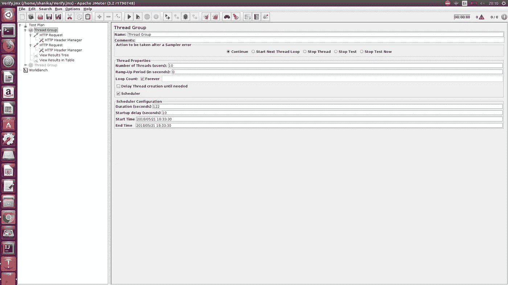
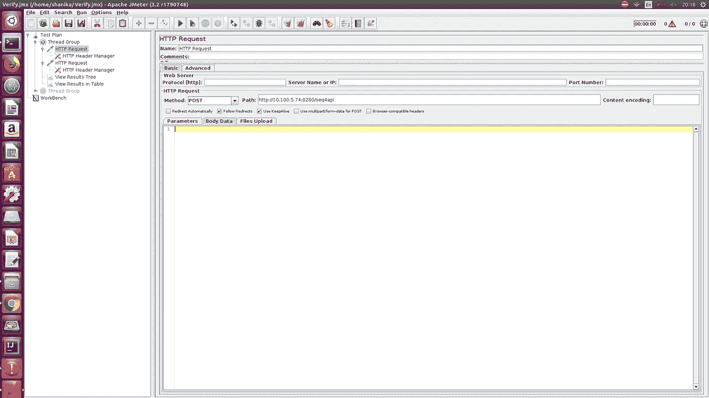

# 使用 Apache JMeter 对单节点服务器和双节点集群进行性能测试

> 原文：<https://medium.com/hackernoon/performance-testing-of-a-single-node-server-and-a-two-node-cluster-with-apache-jmeter-9d2775de22ea>

Photo by Samuel Zeller on Unsplash

**关于性能测试**

性能测试是一种识别软件(web 应用程序)是否能够处理高负载以及其他可能的性能问题的方法。因此，性能测试的最终目标是分析重负载下的整体性能。Apache JMeter 是一个开源工具，完全可以用于这个目的。

**什么是单节点服务器？**

当一个服务器只在一台机器上运行时就是这种情况。如果服务器由于某些问题而崩溃，将会有一段停机时间，直到问题得到解决。

**什么是双节点集群？**

双 **-** 节点集群是一种设置，其中两个服务器配置有高可用性。如果使用集群，就不会因为服务器崩溃而停机。将服务器放在集群环境中的好处是，如果一个服务器由于崩溃或其他故障而不可用，另一个节点将作为主节点运行，系统将在不造成用户停机的情况下运行。

**为什么 Apache JMeter 是 It 的最佳工具**

Apache JMeter 支持静态和动态资源的测试性能。静态资源包括 JavaScript、HTML 等。动态资源包括 JSP、Servlets、AJAX 等等。此外，Apache JMeter 有更多的属性使其成为性能和负载测试的合适工具:

以报告形式呈现的总体性能分析

包含不同属性分析的性能测试报告，例如响应时间、页面加载时间、吞吐量、错误率等等

报告中提供的优化建议

图形分析报告，包含每秒交易量、每秒点击数等指标。

能够识别在服务器不崩溃的情况下可以处理的最大并发用户数

能够从 HTML、JSON、XML 等多种响应类型中提取数据。

支持可扩展核心，具有可插拔采样器、可脚本化采样器、可插拔定时器和可视化插件

能够与任何第三方开源库集成，如 Maven、Gradle 和 Jenkins

支持多线程框架

性能测试可以用下面提到的两种方法中的任何一种进行:

**负载测试:**这是一种通过模拟多个并发用户访问来模拟预期使用情况的测试类型。

**压力测试:**这是一种测试类型，用于确定服务器可以处理的最大负载。当负载超过基准时，服务器可能会开始缓慢响应。

在下文中，我们将看到如何使用 Apache Jmeter，使用在 [A1QA](https://www.a1qa.com/performance-testing/) 采用的标准实践来测量服务器性能。此外，我将解释如何将它扩展到测试在双节点集群环境中并行运行的两台服务器的性能。您可以使用任何您熟悉的 web 应用程序来进行测试。为此，我将使用易贝。

这一过程将包括五个主要步骤:

1.  添加线程组
2.  添加必要的 JMeter 元素
3.  添加图表结果
4.  运行测试
5.  获取并分析结果

**1。让我们得到一个线程组**

线程组元素将是测试计划的初始步骤。线程组是将执行相同场景的一组线程。这定义了参与特定测试用例的用户池。其他采样器和控制器需要包含在线程组中。

本文假设您已经在机器上安装了 Apache JMeter。如果没有，请参考[官方指南](http://jmeter.apache.org/usermanual/get-started.html)了解更多详情。

如何添加线程组:

1.  启动 Apache JMeter
2.  参见左侧的测试计划选项
3.  右键单击测试计划选项
4.  选择添加选项
5.  选择线程(用户)选项
6.  选择“线程组”选项

添加线程组后，您将看到 Thread Properties 部分，在这里您可以控制线程组的属性。

**线程数** : 100(连接到 web app 的用户数:100)

● **循环计数** : 10(执行测试的次数)

● **上升周期**:100(JMeter 启动并运行所有线程所需的时间。此外，这被解释为下一个用户开始之前的延迟时间。)

**2。让我们添加必要的 JMeter 元素**

在这个用例中，我们将使用两个元素。它们是 HTTP 请求默认值和 HTTP 请求。

**如何添加 HTTP 请求默认值**

您可以通过以下方式添加 HTTP 请求默认采样器:

1.右键单击树节点中的线程组

2.选择添加选项

3.选择配置元素选项

4.选择 HTTP 请求默认值选项

您可以在控制面板上看到服务器 IP 和端口的输入值。在这里，您将输入与执行性能测试的 web 应用程序相关的 IP 和端口。在本教程中，我将使用易贝的 IP。

**如何添加 HTTP 请求**

您可以通过以下方式添加 HTTP 请求采样器:

1.右键单击树节点中的线程组

2.选择添加选项

3.选择采样器选项

4.选择 HTTP 请求选项

添加 HTTP 请求采样器后，您可以看到如下图所示的路径字段。您可以输入需要发送 HTTP 请求的特定路径。例如，如果您需要将请求发送到易贝的每日交易部分，您可以从网站上查看与该部分相关的路径地址，并将其输入到路径部分:

路径:/globaldeals

因此，如果您为 path 部分输入/globaldeals，JMeter 会将 HTTP 请求发送到完整的 URL[https://www.ebay.com/globaldeals](https://www.ebay.com/globaldeals)。如果 path 字段为空，它将把请求发送到 https://www.ebay.com 的。

我会将路径字段留空。所以，这个请求将被发送到 https://www.ebay.com 的

**3。让我们添加图形结果**

您可以使用图形结果监听器以下列方式观察测试结果:

1.右键单击测试计划

2.选择添加

3.选择监听器

4.选择图表结果

**4。让我们运行性能测试**

在运行测试之前，您需要保存您的测试计划，给出一个名称，比如 Perf-test.jmx。

**5。让我们获取并分析结果**

运行测试时，您可以观察测试结果，测试结果以图形的形式实时显示。您可以看到图表显示了我们尝试的样例用例所获得的性能结果，其中有 100 个用户访问了易贝服务器。

根据颜色显示在图表底部的统计数据:

●黑色显示当前发送的样本总数。

●蓝色显示发送的样本总数的平均值。

●红色表示标准差。

●绿色表示吞吐率(这是服务器每分钟处理的请求总数)

为了了解易贝服务器的性能，我们需要关注两个参数:吞吐量和偏差。

**吞吐量**是服务器处理繁重负载的能力。该值越高，服务器的性能越好。

在这个示例测试中，易贝服务器的吞吐量是 199.609/分钟。这意味着易贝服务器每分钟可以处理 199.609 个请求。与谷歌等其他网络服务器相比，这个值相当低。同样，您可以获取不同服务器的值，并将它们与其他服务器进行比较，以了解整体性能。

**偏差**表示与平均值的偏差。偏差值越小，服务器性能越好。

**将性能测试扩展到在双节点集群环境中并行运行的两台服务器**

让我们假设您的服务器部署在一个集群环境中，该集群有两个节点。让我们看看如何针对类似的设置执行性能测试:

1.  添加线程组
2.  添加必要的 JMeter 元素
3.  添加图表结果
4.  运行测试
5.  获取并分析结果

**第一步**

这和我上面解释的差不多。您可以按照相同的步骤添加线程组。添加线程组后，如下所示配置属性。

**第二步**

现在，我们需要添加两个 HTTP 请求来同时向两个节点发送请求。在那里，您可以按照我上面解释的步骤添加一个 HTTP 请求。

在“方法”部分，指定请求的方法。当我发送一个 POST 请求时，我已经将它更改为 POST 类型。然后，在路径部分指定服务器的 URL，包括 IP 地址和端口。下面是一个例子。您需要添加两个 HTTP 请求，包括除服务器 URL 之外的相同配置。当两个服务器在一个集群上运行时，这两个服务器的 URL 将会不同。因此，当您添加第二个 HTTP 请求时，请指定与第二个节点相关的 URL。

步骤 3、步骤 4、步骤 5 将类似于上面解释的步骤。因此，你可以按照同样的行动。

**总结**

在本文中，我们学习了如何对单节点 web 服务器进行性能测试，以及如何使用 Apache JMeter 将测试扩展到双节点集群。我们还讨论了如何分析结果并与其他服务器的结果进行比较。