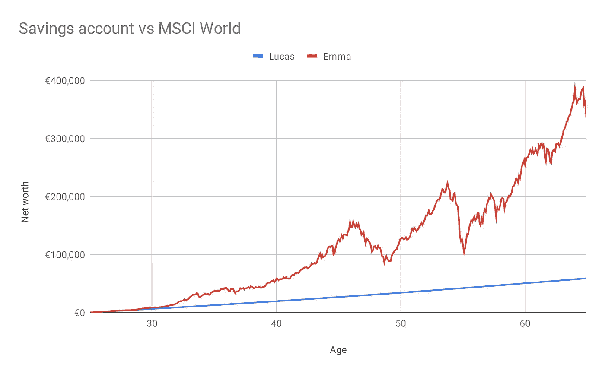

# 开发者的个人理财 101:如何改善你的财务状况

> 原文：<https://medium.com/hackernoon/personal-finance-101-for-developers-how-to-hack-your-financial-well-being-3c86001dc651>

作为一名自由网络开发者，我最近意识到我从来没有考虑过我的退休金。毕竟，三十岁了，离退休还有几十年。但我知道，作为一名自由职业者，伴随而来的是必须自己打理养老金的责任，我不想最后成为一名没有任何收入的退休人员。因此，我开始寻求改善自己的财务状况，为未来做更好的准备。

在这篇文章中，我分享了我在自己的财务生活中成功运用的最重要的原则。

# 财务规划的重要性

在我们的生活中，金钱与食物和睡觉的地方一样重要。我们每天都在使用它，我们离不开它。然而，我们大多数人从来没有学会如何管理好它。当我回顾我自己的教育时，我意识到我从来没有被教过如何管理我的钱，如何填写我的税，等等。这些是非常重要的生活技能，我很惊讶我们的学校系统没有教他们。

我们都听说过这样的故事，人们最终陷入不稳定的财务状况，通常是由意外事件引起的:他们失去了工作，他们被诊断出患有意外疾病，他们的房子需要昂贵的维修……用纳西姆·尼古拉斯·塔勒布的话来说，这种事件是“黑天鹅”:它们来得突然，产生了重大影响。你可能认为你的生活不会受到黑天鹅的影响，但这就是问题的关键所在:它们总是不期而至，可能发生在任何人身上。

因此，规划个人财务的目标很简单:**避免陷入财务困境，改善未来自己的财务状况**。这一切都始于获得正确的知识，幸运的是，对我们来说，只有几个基本原则是这一切的基础！

# 花的比赚的少

> "个人理财的终极秘诀很简单:花的比赚的少."—安迪·拉赫勒夫

**量入为出是最重要的原则。**这是常识！尽管如此，你还是会对入不敷出的人数感到惊讶。在某些情况下负债是可以的，比如买房子的时候。但除此之外，你应该只花你实际拥有的钱。

作为开发人员，我们很幸运，与其他行业的人相比，我们通常过得很好。毕竟，我们有目前需求量很大的技能组合。除非你有奢侈的生活方式或者有非常高的花费，否则你应该能够量入为出。

# 衡量然后优化你的支出

> “衡量就是认识。”—开尔文勋爵

优化你的支出有点像软件优化。类似地，就像你不应该在不知道真正的瓶颈在哪里的情况下随意提高部分代码的性能一样，你需要真正了解你的消费习惯，然后才能做出好的改变。

大约 3 个月来跟踪我所有的花费对我了解我的财务状况有很大的帮助。当你知道你每个月把钱花在了什么地方，你就有了必要的数据来**减少你的支出**。弄清楚哪些支出对你来说真正重要，尽量减少在那些不会给你的生活带来太多好处的事情上的支出。也许你会发现你在外出就餐上花费很多，所以从减少去餐馆开始。另一方面，如果你是一个美食爱好者，你可能会继续在餐馆花钱，因为这些时间对你的幸福至关重要。

为自己决定那些取舍很重要。**你是唯一知道什么能让你快乐的人。**

# 将你的储蓄投资于指数基金

一旦你优化了你的支出，你每个月都会剩下多余的钱。你用它做什么？

大多数人会把它存入储蓄账户。然而，当你进行长期储蓄时，储蓄账户远非最佳选择。在过去十年中，美国和欧盟的利率都处于极低水平。当我在 2019 年 5 月写这篇文章时，欧洲央行设定的利率正好是 0.0%。这导致储蓄账户的回报率非常低。事实上，比通货膨胀率低得多，这意味着你每年都在失去购买力，因为你的钱存在储蓄账户里。

历史表明，你可以通过投资储蓄获得更高的回报。然而，聪明的投资者不会试图通过投资个股来战胜市场。事实上，作为业余投资者，我们永远无法与整天分析公司的华尔街专业分析师竞争。你可能会在这里或那里进行一些不错的投资，但从长远来看，维持高回报是非常困难和耗时的。

相反，我们投资于指数基金。指数就像一袋股票。当你投资指数基金时，你持有指数中每家公司的一点股份。最著名的指数是标准普尔 500 指数，它由 500 家最大的美国公司组成。MSCI 世界指数是另一个众所周知的指数。它包含来自发达市场(美国、欧洲、澳大利亚、日本……)的 1，600 多家公司的股票。因此，你投资的不是少数几只股票，而是整个股市。这种投资方式被称为**被动投资**，因为你不必花时间管理你的投资组合。你就投资指数基金，顺其自然。

让我们用储蓄账户来衡量**被动投资策略的回报。想象一下卢卡斯和艾玛，他们都即将在 65 岁退休。他们在同样的年龄开始工作，40 年前，他们 25 岁。这些年来，他们每个月一直在存 100 美元。有一个不同之处:卢卡斯对投资一无所知，所以他把所有辛苦赚来的积蓄都存进了一个储蓄账户，稳定的年回报率为 1%。另一方面，艾玛很幸运，她在学生时代就已经了解了被动投资。正因为如此，她一直将每月的储蓄投入一只跟踪摩根士丹利资本国际世界指数的指数基金。**

让我们看看他们一生中储蓄的规模是如何演变的。

Investing in an index fund quickly outgrows a savings account.

到 65 岁时，卢卡斯和艾玛都会存下同样数额的€48000 英镑。加上他从储蓄账户中获得的稳定的 1%的利息，卢卡斯将把这笔钱增加到€58，989 英镑。与此同时，艾玛的存款增长到惊人的 **€335，185** ！这比卢卡斯拥有的多 5 倍，她所要做的就是将她的存款存入指数基金，而不是她的储蓄账户。

看看艾玛储蓄的演变，你会发现它有上有下。这些都是不可避免的，因为金融市场不可避免地会起起落落。例如，在 2008 年金融危机期间，股市损失了一半价值，指数也是如此。但当你将投资分散到 30 年或 40 年后，你就有时间挽回任何重大损失。这使得被动投资成为退休储蓄的理想选择。

最后，你不必仅仅相信我的话。沃伦·巴菲特本人，过去几十年最成功的投资者，说指数基金是大多数人的最佳投资。

# 结论

> "不要把消费后剩下的钱存起来，而是把储蓄后剩下的钱花掉."—沃伦·巴菲特

作为开发者，我们很幸运，与普通人相比，我们的收入普遍较高。然而，这并不意味着我们可以过上财务上不负责任的生活。本文概述的两个原则是你财务健康的基础:

1.  通过只把钱花在有助于你快乐的事情上来减少开支。
2.  将你的储蓄投资于指数基金，而不是留在储蓄账户中。

关于这个话题还有很多东西要学，尤其是投资方面。但让这成为一个开始。你如何理财，更好地为未来做准备？请在下面留下您的评论。

*约兰是* [*恩佐*](https://enzo.fund/?utm_source=hackernoon&utm_medium=blog-post&utm_campaign=personal-finance-101) *的首席技术官和联合创始人，在这里，他通过被动投资改善千禧一代的财务状况。金融界充斥着行话、复杂的金融“解决方案”、穿着西装的老人的可怕照片和笨重的应用程序。相比之下，恩佐带来了简单和透明，不需要任何金融知识就可以开始投资。*