# 人身保险:有更好的办法吗？输入 PolicyPal。

> 原文：<https://medium.com/hackernoon/personal-insurance-is-there-a-better-way-enter-policypal-8aac627c877a>

*免责声明:本文讨论的话题完全基于我自己对 app 的使用体验，对保险的了解，以及对* [*【区块链】*](https://hackernoon.com/tagged/blockchain) *技术的了解。本文也未得到 PolicyPal 和/或 PAL* [*网*](https://hackernoon.com/tagged/network) *的认可。有关保险、投资和个人理财方面的问题，请咨询您自己的理财顾问。重要提示:本人不是公司股东。然而，正如文章中所讨论的，我确实拥有一些 PAL 令牌，可以在他们的应用程序上购买计划。*

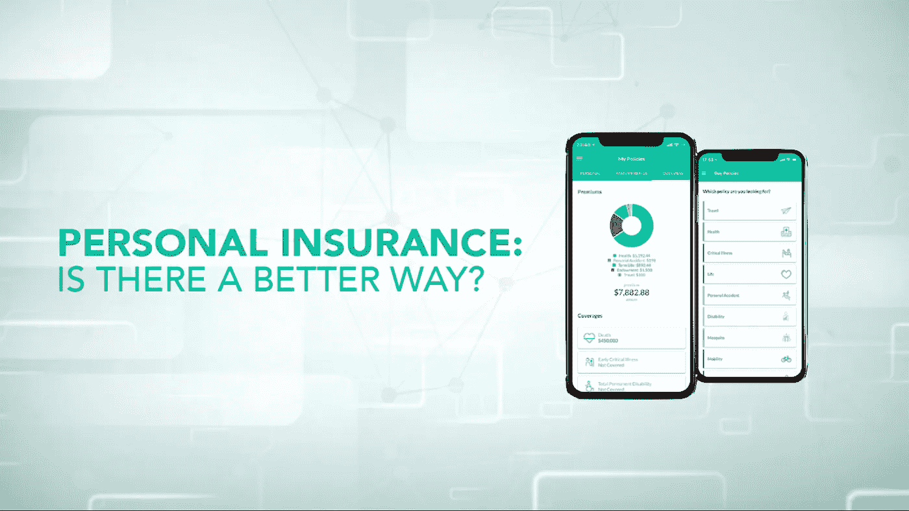

# 传统保险方法

当前的保险业格局可能需要一次大换血。当“保险”这个词被说出时，人们通常会想到保险销售商、文件、小册子和货币细节，这些对一个没有受过教育的人来说可能是令人生畏的。尽管大多数人经历了快速的技术进步，全球保险业仍然严重依赖文书工作。索赔和付款通过书面合同处理，通常通过电话或“非正式”午餐聚会的经纪人进行。

保险的复杂性加上消费者缺乏适当的教育，人为错误和欺诈的风险大大增加。

欺诈可能以两种方式发生:欺骗保险公司或对消费者收取高额保费。据估计，保险公司每年因欺诈损失 300 亿美元。这种损失将影响诚实支付的消费者，因为公司在提供适当的保险时增加了保费成本。

提出索赔可能需要几个月或几年的处理时间。理想情况下，消费者应该把保险单放在一个容易找到的地方。然而，在紧急情况下，焦点往往会转移到更紧迫的问题上，这是一个额外的压力来源，最终可能导致不成功的保险索赔。

# 更好的保险体验

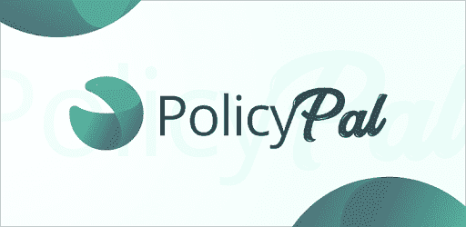

[https://www.policypal.com/](https://www.policypal.com/)

[PolicyPal](https://www.policypal.com/) 是一家保险科技初创公司，旨在通过一个简单、用户友好的应用程序来帮助管理、跟踪和理解保险单。PolicyPal 的移动应用程序在其平台上提供来自主要保险公司的产品，如英杰华、安盛、宏利、MSIG、NTUC 等。

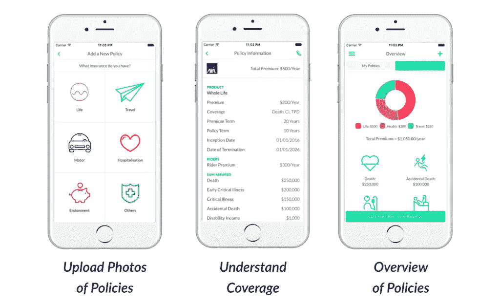

> *“把我们想象成你的保险顾问，永远在你的口袋里。”PolicyPal 首席执行官 val Yap*

这家由 PayPal 支持的初创公司目前拥有超过 5 万名活跃用户。如果用户已经购买了保险，他/她可以将信息上传到应用程序上。除了个人消费者，PolicyPal 还推出了企业保险计划。

## 通过 PolicyPal 购买和管理您的保险

在 PolicyPal 的移动应用程序上购买保单旨在实现简单明了和无缝衔接。

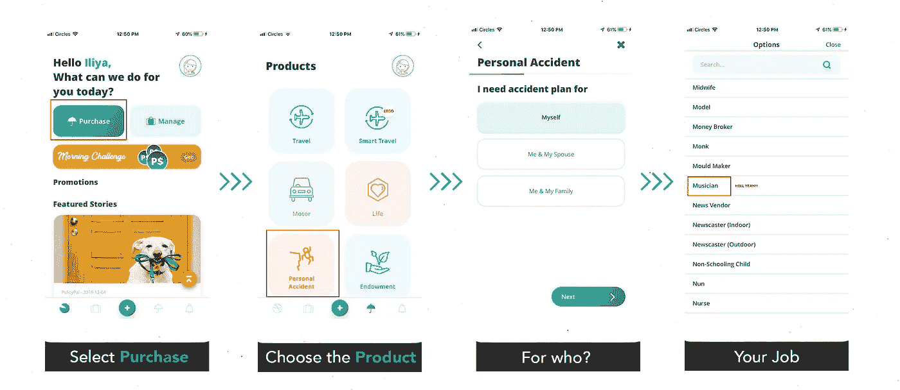

**Steps to buy Insurance #1**

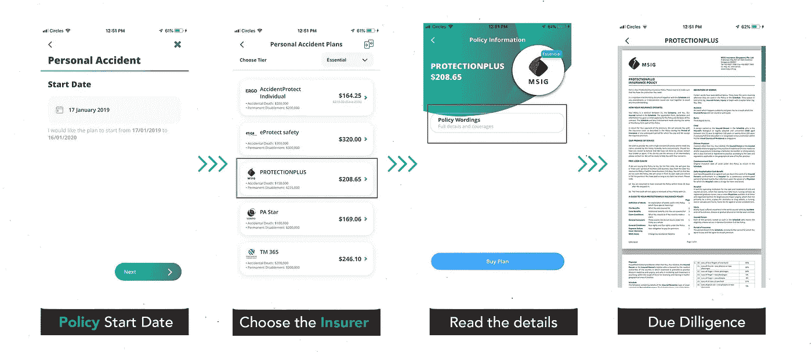

**Steps to buy Insurance #2 —** MSIG PROTECTION PLUS is used purely as an example.

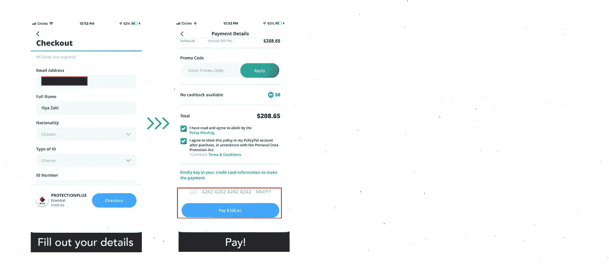

**Steps to buy Insurance #3**

尽管购买保单很容易，但重要的是要注意，如果没有人解释每个条款的意思，理解保单可能是一个挑战。强烈建议对不同的政策有不同的看法。此外，了解你的个人需求也很重要。

现在让我们开始有趣的部分…

# PolicyPal x 区块链= PAL 网络

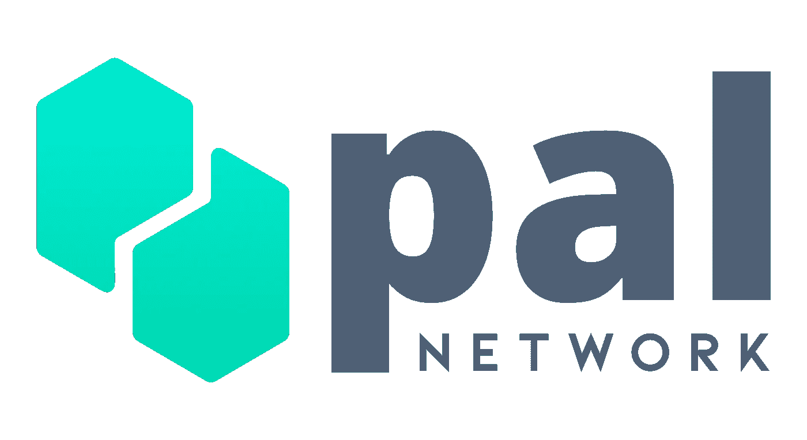

在我们进入我最喜欢的部分(区块链)之前，让我们试着理解区块链是什么，以及为什么。这里有一段视频:

现在你对区块链有了一个大致的概念，让我们看看区块链的保险是怎样的。如果你想更详细地了解它:[这里有一篇关于 Hackernoon 的精彩文章。](https://hackernoon.com/beginners-guide-to-blockchain-explaining-it-to-a-5-years-old-772caac6ae97)

# **PAL 网络**

PolicyPal 在 2018 年 3 月运营了他们的 ICO，并在以太坊筹集了相当于 2000 万美元的资金。这些资金将专门用于建设 PAL Network，这是一个位于区块链的保险生态系统。

2018 年对加密货币来说是可怕的一年，PAL Network 的 2000 万美元减少了 80%以上。不管价格如何，PAL Network 通过达到各自的里程碑和推出产品，实现了他们的承诺。此外，PolicyPal 是一个拥有实际产品的实体，通过其移动应用程序为 50，000 名客户提供服务。

**常见误解—** Policypal 和 pal 网络

**PAL 网络**
[https://www . PAL . Network/](https://www.pal.network/)

是一家*区块链技术开发公司*，专注于为保险市场带来透明度和可访问性。毫无疑问，他们的技术进步将有助于 PolicyPal 为保险相关事务提供更好的用户体验。

**保诚** [https://www.policypal.com/](https://www.policypal.com/)

如上所述*是 PAL Network* 的关联公司。它的重点是数字化和整理消费者保险单的旗舰应用程序。消费者可以轻松购买、存储和索赔的平台。

这两个实体携手合作，促进更好的保险体验。

# **目前区块链上的产品**

## **RidePal**

*雨天支付乘车费用*

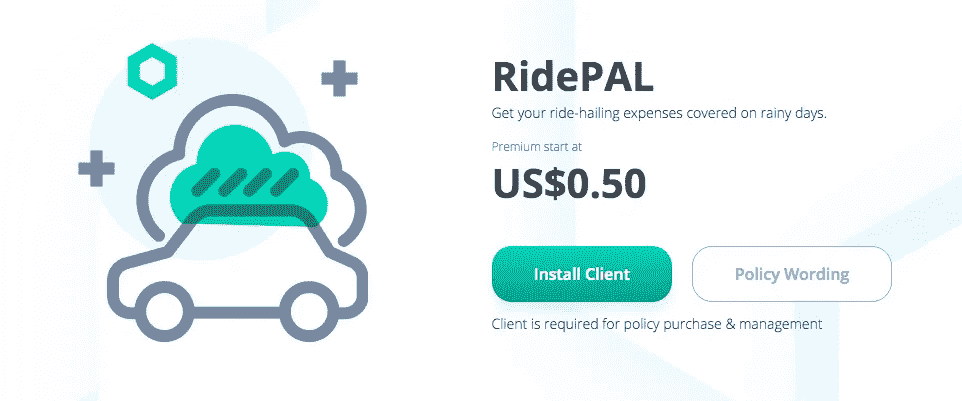

随着 Grab 和优步拼车服务的兴起，PAL Network 寻求在你的上车地点发现下雨时提供覆盖。

在雨天，预订乘车的价格可能会每趟上涨 5-7 美元。这一计划下的被保险人可以用这笔支出来支付雨季期间产生的额外费用。

受保护的城市包括曼谷、胡志明市、雅加达、吉隆坡、伦敦、纽约、新加坡和悉尼。

但是，每次索赔的最高赔付额为 5 美元。

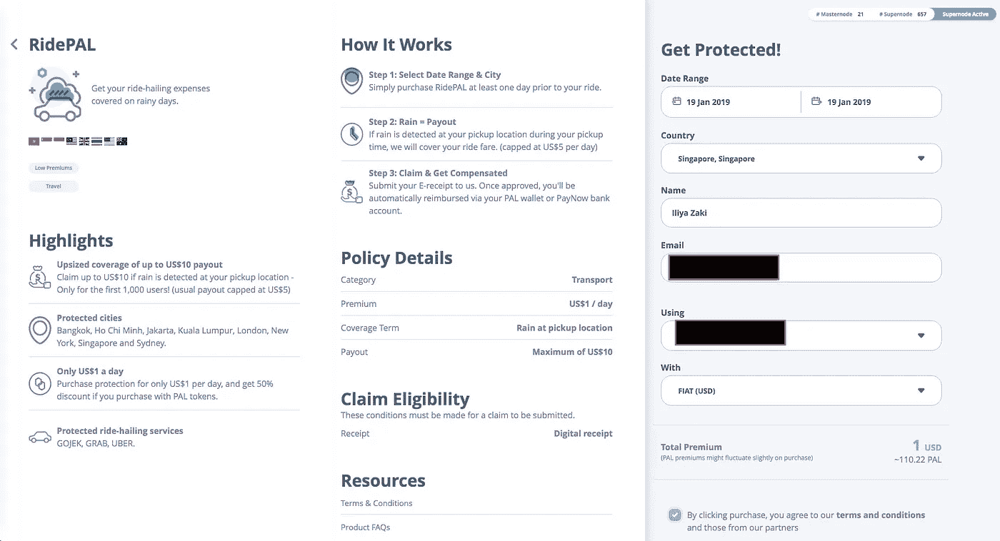

有关 RidePAL 的更多信息，请点击[此处](https://s3-ap-southeast-1.amazonaws.com/pal-network/wordings/RidePAL+-+FAQs+14122018.pdf)。

## 航班延误

*为世界各地 3 小时或以上的航班延误提供单一保障*

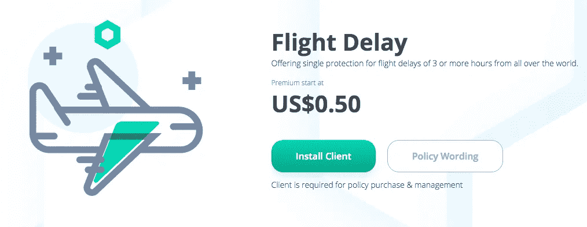

全球化为每个人到另一个国家旅行提供了机会；度假或工作。航班延误发生的频率比我们想象的要高。

这就是 Pal 的下一个产品，**航班延误**计划可以派上用场的地方。由于固定支付 100 美元，它可以帮助支付因航班延误而产生的任何“情绪痛苦”或消费品需求。

有关航班延误的更多信息，请点击[这里](https://s3-ap-southeast-1.amazonaws.com/pal-network/wordings/Flight+Delay+-+FAQs+16122018.pdf)。

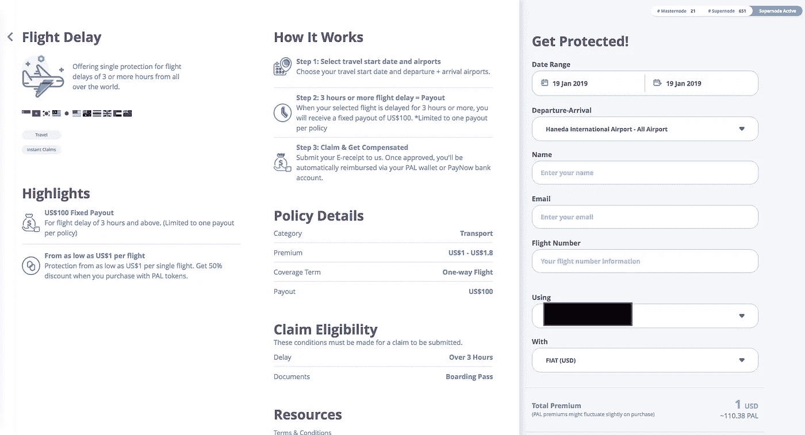

## 航班取消

*为全球航班取消提供单一保障*

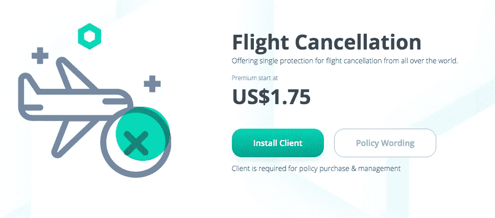

根据 FlightStats 的数据，每天有近 1000 个航班被取消，超过 5000 个航班被延误。PolicyPal 试图通过其第三款产品来解决这一问题。

如果您的航班因恐怖主义、自然灾害、抗议活动而被取消，您将获得**200**美元的赔付。

有关航班延误的更多信息，请点击[此处](https://s3-ap-southeast-1.amazonaws.com/pal-network/wordings/Flight+Cancellation+-+FAQs+16122018.pdf)。

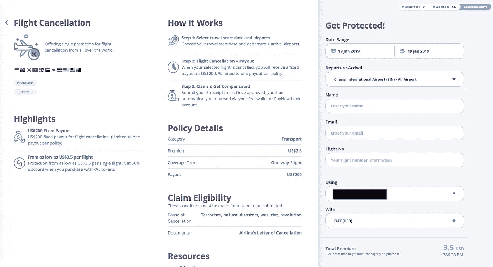

这些产品只能通过 **PAL Network 的桌面钱包购买。**

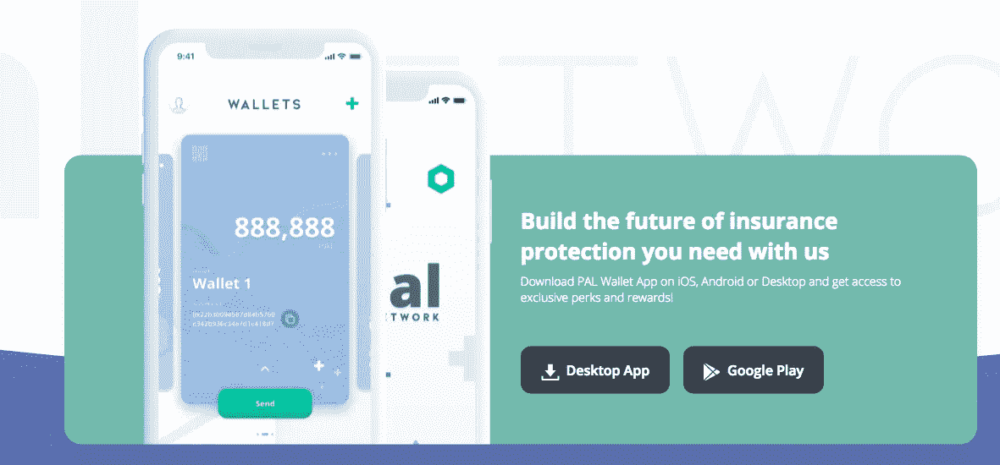

[https://www.pal.network/technology](https://www.pal.network/technology)

你可以在这里下载[。](https://www.pal.network/technology)

## 更多产品即将推出

PAL Network 暗示未来几周还将发布三款产品。

1.  **地震保护**
2.  **屏幕裂纹保险**
3.  **癌症保险**

**来自 PAL 网络的最新消息**

 [## PAL Network 将为丰田通商和马来西亚安联开发保险技术产品

### 总部位于新加坡的 insurtech 初创公司 PAL Network 与丰田签署了两份谅解备忘录(MOU)协议…

www.businesstimes.com.sg](https://www.businesstimes.com.sg/banking-finance/pal-network-to-develop-insurtech-products-for-toyota-tsusho-and-allianz-malaysia) 

PAL Network 已经证明了自己是消费者的朋友，它提供了几种选择，有助于减轻我们日常生活中面临的压力。但他们也迎合商业层面，与丰田通商公司和马来西亚安联保险公司签署了谅解备忘录(MOU)协议。

通过与丰田通商公司合作，PAL Network 将在智能合同上开发新的保险产品，这些产品将在东南亚的当地市场提供服务。

其次，PAL Network 将根据与 Allianz Malaysia 的协议，负责为马来西亚市场实施自动索赔的新保障范围的概念验证。

**PAL 网络 Mainnet 启动**

PAL Network 在 2018 年底推出了他们的区块链协议。mainnet 对 PAL 网络团队来说是一个巨大的里程碑，因为他们从 ICO 阶段开始就将它包含在他们的路线图中。毫无疑问，PAL 网络已经随着协议的推出，建议拥有 PAL 令牌的用户将他们的 ERC-20 令牌与 PAL 的本地令牌交换。

 [## 新版本:PAL 钱包现已准备好下载+代币交换指南！

### 所有人都在等待的时刻。PAL 钱包已正式推出，并可免费安装在台式机和…

medium.com](/pal-network/new-release-pal-wallet-is-now-ready-for-download-token-swap-guide-ef3f4453e5f3) 

请注意，未能交换代币可能会导致您的投资和/或购买的损失。

# PolicyPal & PAL 网络:让保险更简单

PolicyPal 和 PAL Network 的出现无疑给了消费者希望，保险不再是复杂和昂贵的事情。

借助区块链技术和深度学习训练的人工智能，insurtech 初创公司现在有可能成为最古老的金融业务之一的游戏规则改变者，这一业务一直青睐那些在市场上拥有更雄厚资金和经验的人。

来自监管机构和大型保险公司的支持令人耳目一新，因为它们一起寻求清除多年来形成的坏名声。

和我们的工作一样重要，保险在提供更充实的生活方面也能发挥重要作用。有一种更好的方式来处理保险。这只是时间问题。:)

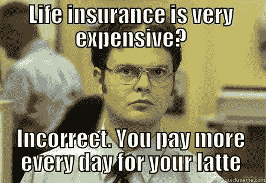

希望你喜欢这篇文章！如果你有任何意见，请在下面留下。

# 关于作者

**伊利亚扎基是** [**月鲸投资**](https://moonwhale.io) **的营销和业务发展主管。**

Moonwhale Ventures 是一家 [STO 金融咨询公司](https://moonwhale.io/investment-platform/#third)，为公司提供关于 STO 进程&结构的战略建议，以及代币发行，包括其项目的生命周期管理和二级市场参与。Moonwhale 还在建立一个端到端证券令牌(STO)投资平台，该平台将迎合寻求投资 STO 项目的投资者，以及寻求通过 STO 筹集资金以资助业务扩张或新企业的公司。

更多信息，请访问:[月鲸 STO 解决方案](https://moonwhale.io/investment-platform/#third)

[推特](https://twitter.com/MoonwhaleBV) | [领英](https://www.linkedin.com/company/moonwhalebv) | [脸书](https://www.facebook.com/MoonwhaleBV/) |

