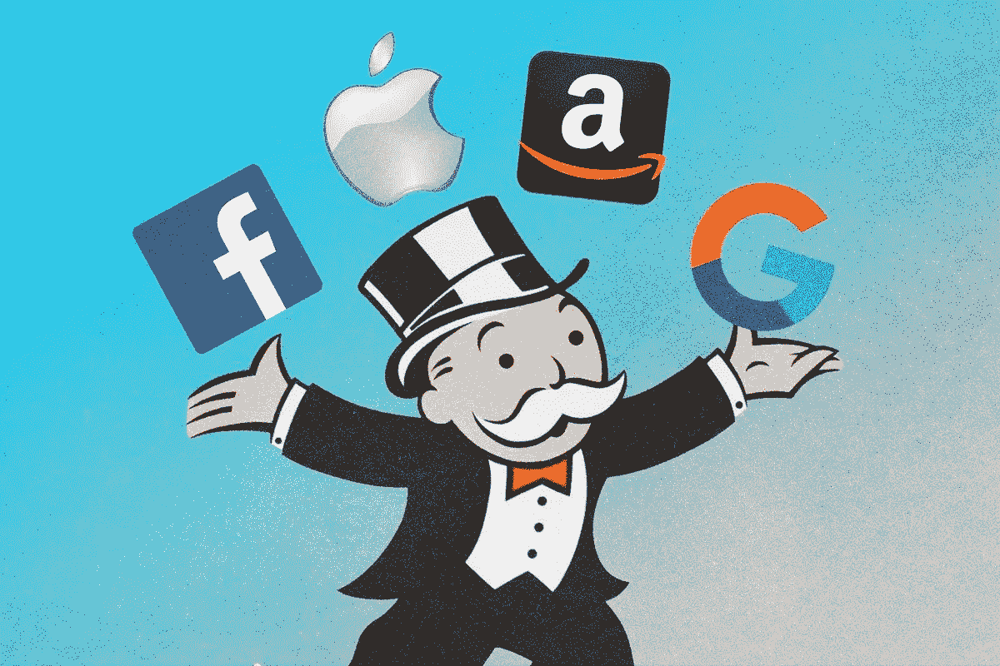
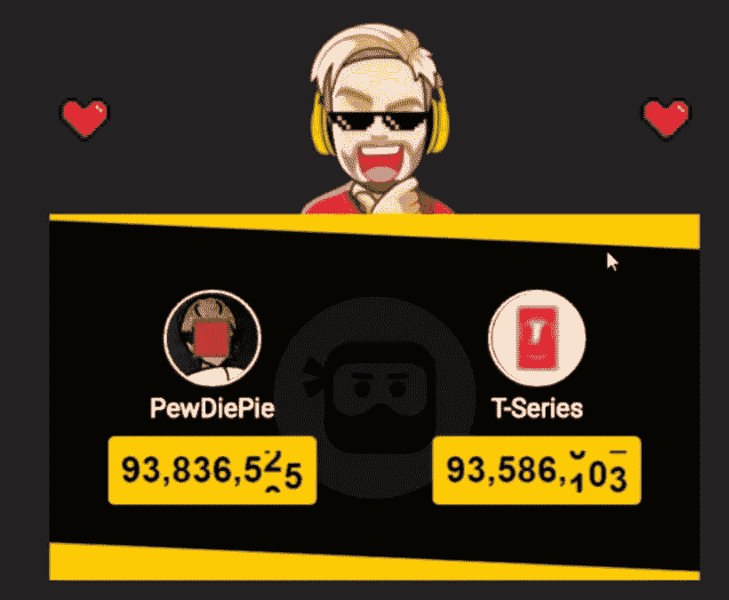
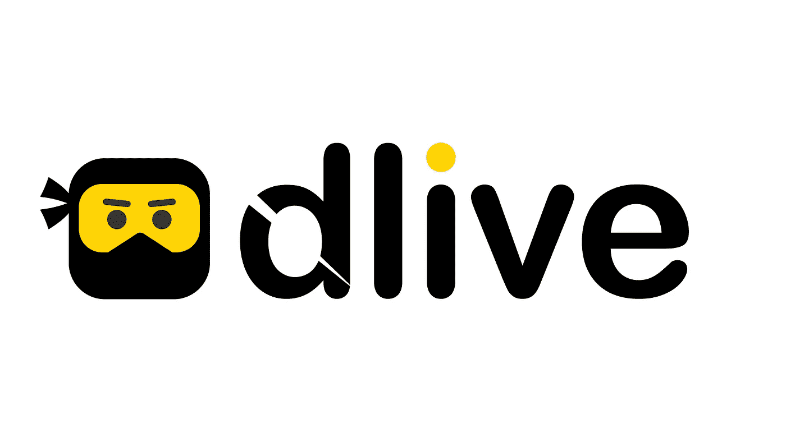
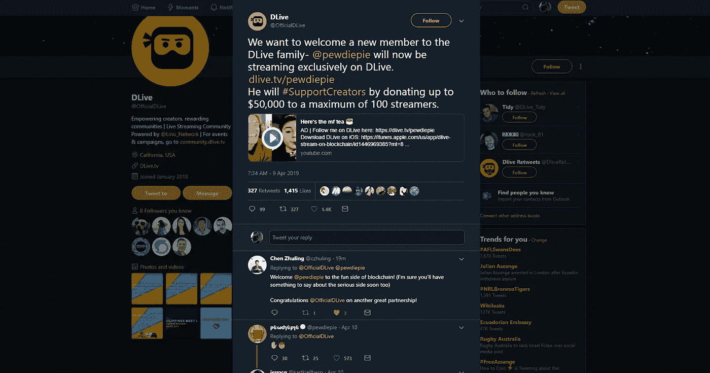

# Pewdiepie 离开 Youtube，专门在区块链上进行流媒体播放

> 原文：<https://medium.com/hackernoon/pewdiepie-leaves-youtube-to-stream-exclusively-on-blockchain-352cc707dda8>

拥有最多用户的 youtuber 网站 Pewdiepie 宣布，他将在区块链的视频流媒体网站 Dlive 上独家直播。4 月 9 日，他和 Dlive 通过[***YouTube***](https://www.youtube.com/watch?v=bRG6sy3VaWU)***和***[***Twitter***](https://twitter.com/OfficialDLive/status/1115623988607119360)***宣布合作将从 4 月 14 日的第一批开始。***

Youtube 开始意识到他们不再是房间里唯一的人了。多年来，他们垄断了在线视频分享行业。2006 年 11 月，youtube 成为谷歌的[子公司，进一步巩固了互联网巨头的据点。我们一次又一次地看到，任何获得成功并可能被视为竞争对手的人要么被关闭，要么被谷歌和亚马逊这样的集团收购。这种情况将不会再发生，不会造成如此严重的后果。](https://techcrunch.com/2006/11/13/google-closes-youtube-acquisition/)

随着区块链的引入，像 Dlive 这样的视频流媒体网站已经发展起来，挑战这些互联网巨头所代表的一切。它们是分散的、透明的和公平的。不能用公司议程来调节或推动内容。中间那个人获得高达 50%的削减已经成为过去。看起来世界开始注意到了。

## 谁是 Pewdiepie

Pewdiepie 在 2010 年开始了他的 youtube 职业生涯，专注于成为游戏行业的人物。他最出名的是他的《让我们玩吧》评论。多年来，他已经成长为 youtube 上订阅量第一的[频道](http://www.tubefilter.com/2013/08/15/its-official-pewdiepie-becomes-most-subscribed-channel-on-youtube/)和 2016 年 youtube 上收入最高的[频道](http://mashable.com/2016/12/05/forbes-highest-paid-youtube-stars-2016/)，在[福布斯](http://mashable.com/2016/12/05/forbes-highest-paid-youtube-stars-2016/)中提到了 1500 万美元。

现在，他有将近 9400 万用户，而他 11 天前发布的一个在 T2 很受欢迎的视频已经有超过 7000 万的点击量。也就是说，连续 11 天平均每分钟超过 4400 次浏览。现在这个人不仅支持区块链，而且还在区块链。

在最近的过去，Pewdiepie 公开批评 youtube 的算法，称质量差甚至不合适的内容正在被推广到真正创作者的原创内容之上。他也卷入了许多有争议的冲突，最近的一次是[与印度领先音乐发行商的订户之争](https://en.wikipedia.org/wiki/PewDiePie_vs_T-Series)。

## 谁是 Dlive

DLive 通过由 Lino 支持的区块链技术将平台所有权交到用户手中，从而改变了整个游戏。随着平台的发展，DLive 的用户因其贡献而获得回报。内容创作者和观众都受到重视。与传统平台不同，DLive 从用户的捐赠和订阅中绝对零平台提成。相反，经济体系的设计是通过奖励社区而不是公司的贡献来彻底改变收入分配。

## **公告**

在 4 月 9 日发布的 youtube 视频中，Pewdiepie 以放弃宣布他加入 Dlive 开始了视频。这很容易被忽略，可以被看作是一个相当平静的声明，除了这个视频已经获得了 540 万次观看。

同一天，Dlive 还在 [twitter](https://twitter.com/OfficialDLive/status/1115623988607119360) 上宣布了合作关系，Pewdiepie 很快对此进行了评论，公开确认了合作关系。

## **这对区块链意味着什么**

对于任何参与区块链行业的人来说，经常会看到大公司被指定为区块链勘探和研究的合作伙伴。但是收养仍然是一项进行中的工作。在过去的 24 个月里，随着最近加密货币的繁荣，有一股强大的推动力将分布式账本技术(DLT)或区块链技术转移到世界各地的真实用例中。有许多挑战阻碍了这项任务，最显著的是缺乏明确的法规以及 T2 区块链三难困境。因此，主流行业的许多人在公开表示支持这一新兴行业时通常持保留态度。

但是，当 youtube 的最大创造者背弃这个巨人，公开支持区块链时，可以肯定地说，事情正在发生变化。对未知的恐惧正被加入开创性运动的兴奋所取代。不再是大众眼中的 ***【区块链:加密货币骗局】*** ，而是 [***【区块链:将改变世界的技术】*** 。](https://hackernoon.com/cryptocurrencies-will-die-in-2019-but-blockchain-wont-a389daf3f5f7)

现在，听说银行以某种方式雇佣区块链理工大学是很常见的；听说[大型科技公司与区块链公司合作](https://hackernoon.com/samsung-to-join-the-cryptocurrency-craze-3b56ecb6163c)将他们的应用转移到 DLT。看到政府与组织合作在世界范围内加强区块链的使用是很正常的。

现在，在网上看到一些名人公开支持区块链并采纳它是很正常的。人们一直在问我，我们是否正处于区块链的新时代。我会说是的！我们正在进入区块链应用的时代。所以，准备好吧，世界，我们会留下来，我们会一起做出积极的改变。

***一定要关注我上*** [***这里***](/@mappopk) ***和上*** [***推特***](https://twitter.com/mappopk_crypto) ***获取更多精彩区块链新闻！***