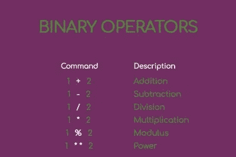
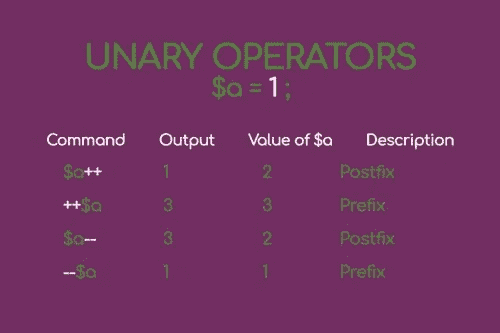
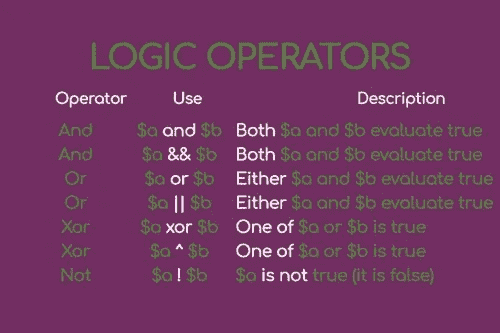
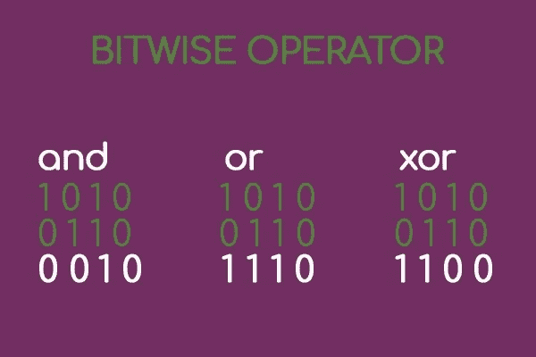

# PHP 操作符(第 1 部分)

> 原文：<https://medium.com/hackernoon/php-operators-part-1-e65e02bd1545>


因此，在本系列的前几部分中，您已经看到了 [PHP](https://hackernoon.com/tagged/php) 的基础知识，

你已经看到这种语言给你的基本结构是什么，

你已经看到有几种类型的变量(分为简单变量和复合变量)。

现在我们已经玩够了，我们开始认真做事了！

今天的博文要回答的问题是:

*“既然我知道了如何创建变量，我该如何将它们插入到我的代码流中呢？”*。

答案是:通过运营商，

**PHP 操作符允许你浏览代码，更新变量，将你的 web 应用程序的访问者引向一个或另一个方向(通过使用控制结构)。**

有不同类型的运算符，

有些你每天都会用很多次，有些你很少用，但是一旦你理解了它们是如何工作的，它们将会使你成为一个远高于平均水平的 web 开发人员，如果不是你同事中的前 10%的话。

# 面向专业开发人员的 PHP 基础知识

这篇博客文章是名为“面向专家开发者的 PHP 基础知识”系列文章的一部分。

在这个系列中，你将学习 PHP 的基础知识，但是你也将会看到许多只有在书本和高级教程中才能找到的小技巧和特性。

根据你的水平，你可能只是想偶尔阅读或者干脆跳过它们。

你不必记住这里写的所有东西！

只需阅读，找出某些功能或技术的存在，并返回到这些网页时，你觉得已经准备好进入下一个层次。

[面向 web 开发专家的 PHP 基础知识(1 '部分)](http://anastasionico.uk/blog/php-basics-for-web-developer)
[PHP 7 的构造和注释](http://anastasionico.uk/blog/php-construct-comments)
[如何使用变量(PHP 7)](http://anastasionico.uk/blog/php-variables)
[PHP 中的复合变量(数组、对象和更多)](http://anastasionico.uk/blog/composite-variable-in-php)
[PHP 操作符(1 部分)](http://anastasionico.uk/blog/php-operators)

此外，这篇博客分为几个主要部分

[算术运算符](http://anastasionico.uk/blog/php-operators#arithmetic)
[逻辑运算符](http://anastasionico.uk/blog/php-operators#logic)
[三元运算符](http://anastasionico.uk/blog/php-operators#ternany)
[零合并运算符](http://anastasionico.uk/blog/php-operators#coalescing)
[宇宙飞船运算符](http://anastasionico.uk/blog/php-operators#spaceship)
[按位运算符](http://anastasionico.uk/blog/php-operators#bitwise)
[结论](http://anastasionico.uk/blog/php-operators#conclusion)

# 经营者

在 PHP 中有不同类型的操作符。

它们包括算术运算符、逻辑运算符、赋值运算符、引用运算符、空格符和按位运算符。

他们中的每一个都有自己明确的目的，你马上就会看到。

# 算术运算符

算术运算符与你在小学时老师教你的相同。

它们是**加、减、除、乘，**然后你就得到了用符号**表示的**幂**和用符号%表示的**模数**。



有两种类型的算术运算符，一种考虑两个自变量**(称为二元)**，另一种运算符只考虑一个自变量**(称为一元)**。

反过来，

一元运算符分为两种:**前缀和**后缀。

这些类型根据运算符是出现在要更改的变量之前还是之后而变化。

如果操作符出现在变量(前缀)之前，那么解释器、PHP 解析器将评估该操作，改变后的变量将返回。

如果相反，

操作符出现在变量之后(在这种情况下是后缀),解释器将返回变量，就像语句从未被执行过一样，并且只在对变量执行了所请求的操作之后。



# 逻辑运算符

为了理解什么是逻辑运算符，可以把它们想象成语法中的变形。

在 PHP 等编程语言中使用逻辑运算符的目的是为了执行更复杂的条件，因为事实上它可以将不同的条件连接在一起。

这些新的条件使得操作者更加精确和容易操作。

PHP 中有七种不同类型的逻辑运算符。

他们被分成两人一组。

有两个*和*，两个*或*，两个*异或*，一个*非*。

它们是成对的，因为 PHP 同时使用符号和单词来表示逻辑操作符，因此，在一个条件中，您可以既写字面单词“and”也可以写&&符号。

这同样适用于单词“或”或符号||以及单词“异或”或^.



**逻辑运算符一般用于两个条件之间，**

创建一个更大的条件，根据逻辑运算符和两个使用条件之间的关系，判断该条件是真还是假。

如果主条件的运算符为“and”或&，则两个条件都必须评估为真。

如果是 for 语句之间的“或”或||运算符，则第一个和第二个条件之间要被评估为真的主条件必须被评估为真，

在“异或”或^的情况下，两个条件中的一个必须被评估为真，而不是两个都为真。

“not”运算符是最简单的一种，用符号“！”表示条件干脆反转到现在的情况。

与其他逻辑运算符不同的是，**“not”这个词不能用在条件**中，这意味着创建 not 语句的唯一方法是在条件前面加上符号“！”

# 三元运算符

三元运算符的使用由来已久。

**PHP 使用与 C 语言相同的格式，C 语言是由丹尼斯·里奇在 1969 年至 1973 年间开发的一种编程语言。**

它由一个条件后跟一个问号，然后是两个用冒号分隔的表达式组成。

**如果条件为真，则将考虑第一个表达式，否则将考虑第二个表达式。**

将三元运算符视为简单的 if-else，但用于赋值或日期回显之类的简单操作，或者至少在这里我发现它更有用。

这里有一个例子:

```
echo (isset($var)) ? "the variable is set" : " the variable is not set ";
```

如您所见，示例中的语法与 if-else 语句相同。

一旦你做了一些练习，这行代码将更容易编写。

这个声明还有一个更短的版本，它使用了符号？: .

这个版本叫做 Elvis (不要问我为什么)，只写第二个表达。

在这种情况下，如果条件为真，三元运算符必须为一个变量赋值，则该变量将被赋值为 1。

这个版本不适合测试，事实上 PHP 在这种情况下会抛出一个错误

```
$var = true; $result = (isset($var)) ?: " the variable is not set " ; echo $result; // $result will be 1
```

[下面是维基百科](https://en.wikipedia.org/wiki/Ternary_operation)对三元运算符的简要说明。

# 零合并算子

还有另一个版本的三元运算符，叫做零合并运算符或双问号运算符。

你会根据符号认出它？？。

它允许通过使用两个问号，用更清晰的语法来验证条件。

如果所讨论的变量之前已经被设置并且不为空，则可以给该变量赋值。

因为使用 null 合并操作符时不会报告错误，所以最好使用它，而不是使用 Elvis 操作符

```
$result = $var ?? "Hello";
```

正如您在前面的示例中看到的，如果第一个表达式中的变量已经设置，那么$result 变量将采用该值，否则，PHP 将在运算符空合并的右边给出该值，在本例中是字符串“Hello”。

**该函数也适用于多个零合并运算符，**

它可以被**一个接一个的**链接起来，赋予一系列条件以生命，至于单个的，在 PHP 中解析器会跟随右边的表达式，直到找到一个有效值。

```
$result = $var ?? $var2 ?? "Hello";
```

# 宇宙飞船操作员

这是 PHP 程序员最喜欢的操作符之一，如果没有别的原因的话，是因为它的形状。

**space ship 运算符用于分析和比较两个不同的值，例如在必须对数据进行排序时非常有用。**

飞船操作符可以返回三个不同的值。

这些是-1，0 和 1。

这些值取决于操作数。

如果左边的操作数小于右边的操作数，那么宇宙飞船操作符将返回-1。如果两个值相等，它将返回 0。如果第二个操作数(右边的那个)大于第一个操作数(左边的)，那么从宇宙飞船操作符返回的值将是 1。

如果你想对字符串进行操作，飞船操作符也是有用的，事实上，它对单词和字母的排序非常有用。

请记住，对于相同的字母，较小格式的字母**将被视为主要字母**，而大写字母**将被视为次要字母**。

参见下面的例子。

```
1 ⇔ 0 
// it will result in 1 
1 ⇔ 1 
// it will result in 0 
1 ⇔ 2 
// it will result in -1 
"variable" ⇔ "Variable" 
// it will result in 1
```

[看看官方手册，了解更多关于 PHP 中的飞船操作符](http://php.net/manual/en/migration70.new-features.php)

# 按位运算符

按位运算符处理整数位。

它们以二进制形式表示。

有三种按位运算符，

**第一个是 AND 运算符，如果两个操作数都设置了位，那么我们有按位 or 运算符，如果一个或两个操作数都设置了位，它将得到结果集。**

最后，

**我们有按位运算符 XOR** ,仅当其中一个操作数设置了结果位，而不是两个操作数都设置了结果位



这个操作的结果就是我们在实现这些规则后获得的值。

我知道这看起来是一个非常复杂的概念。

为了使这个概念更简单，你可以把这些操作想象成代表几个十进制数。

你可以简单地通过从右到左的比较来计算数字的二进制表示，然后在完成后转换成十进制。

为了让这个概念更加清晰，下面我将举例说明作者 Andrew Beak 给出的一个例子。

考虑到两个数字 50 和 25，

对于这两个数字，我们实现了运算符按位 AND。

如你所见，

遵循优先显示的规则，结果，我们获得值 16，

当我们检查数字时，结果显示为一个整数。


现在我将展示整个 PHP 程序中最奇怪的操作符之一。

你会读到移位！

**比特移位允许你按值移位比特模式，你可以选择从右边或者从左边做。**

为了理解移位是如何工作的，可以把一个数想象成二进制形式。

如果参考向右，则操作符被称为“右移”,并且从右侧移动一位，

如果相反，

我们使用“左移”操作将在所讨论的数字的二进制表示的右边部分添加一个零。

```
50 
// Result in Binary 00110010 50 >> 1 
// Result in binary: 0011001 
// Result in decimal 25 50 << 1 
// Result in binary: 01100100 
// Result in decimal 100
```

最终，我们有了*位非运算符*。

**这反而很容易理解，要找到这个按位运算符的结果，只需找到一个数字的二进制值，并将 1 反转为 0，反之亦然。**

您会发现 base_convert()函数对输出十进制数的二进制表示很有帮助

为了帮助你更好地理解按位和按位运算符的概念，我在下面附上了一个由 EpicFactFind 制作的精彩视频。我希望你喜欢

# 结论

多么有趣的话题，不是吗？

我个人认为 PHP 操作符是每一种编程语言的基础。

它们是不可或缺的，正如您将在本系列的下一章中看到的(订阅我的时事通讯以便在发布时得到通知)，您将在控制结构和其他操作中广泛使用它们。

**正如您所看到的，其中一些非常简单(我敢肯定您在计算两个变量之间的加法时没有遇到任何困难)，但是其他如“Elvis”操作符或位运算即使对于有经验的程序员来说也会产生问题，**

尽管如此，

它们是 PHP Zend 证书等重要考试中的必考题目。

如你所知，这一系列博客文章的主要目的，就像我网站上的其他文章一样，是为了给你额外的刺激，让你的技能扶摇直上，并随之提升你的职业生涯。

一如既往，

如果你有什么不清楚的地方，想要澄清这篇文章中的内容，请随时给我发电子邮件，或者更好的是，利用脸书的社区来寻求帮助。下面的链接。

[](http://eepurl.com/dIZqjf)

…

*现在你知道了基础知识，是时候开始练习了，*

[*利用蓝色主机的能力和速度，创建一个帐户，在那里你可以锻炼，并以每月低于星巴克咖啡摩卡的价格在直播服务器上看到你的进步。*](https://www.bluehost.com/track/anastasionico/)


(这是一个附属链接，价格对你来说保持不变，它帮助我改进这个内容。)

*最初发表于*[*anastasionico . uk*](http://anastasionico.uk/blog/php-operators)*。*