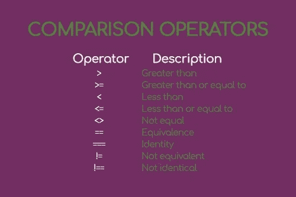

# -PHP 操作符(第 2 部分)

> 原文：<https://medium.com/hackernoon/php-operators-part-2-85f39530994b>


# 介绍

PHP 中的运算符是一个庞大的主题，并不总是能被完全理解。

所有这些误解的原因之一是，有些操作符非常简单，在阅读它们之后，几秒钟之内就可以在代码中实现，

其他人则相反，

几乎是未知的，一旦研究过，还是少用为妙。

虽然运算符属于“语言基础”范畴，但是误用它们或者在使用它们时出现拼写错误**是很难识别的**。

你可能会浪费半个多小时的时间去调试一些代码，然后发现插入了平等的符号，而不是不平等的符号。

亲身经历(感叹)。

在我之前的博客文章中，你已经发现了 PHP 操作符[的主要类型。](http://anastasionico.uk/blog/php-operators)

下面你会看到引用操作符、赋值操作符和一些好东西，你可以用它们来打动你的同事。

# 面向专业开发人员的 PHP 基础知识

这篇博客文章是名为“面向专家开发者的 PHP 基础知识”系列文章的一部分。

在这个系列中，你将学习 PHP 的基础知识，但是你也将会看到许多只有在书本和高级教程中才能找到的小技巧和特性。

根据你的水平，你可能只是想偶尔阅读或者干脆跳过它们。

你不必记住这里写的所有东西！

只需阅读，找出某些功能或技术的存在，并返回到这些网页时，你觉得已经准备好进入下一个层次。

[面向 web 开发专家的 PHP 基础知识(1 '部分)](http://anastasionico.uk/blog/php-basics-for-web-developer)
[PHP 7 的构造和注释](http://anastasionico.uk/blog/php-construct-comments)
[如何使用变量(PHP 7)](http://anastasionico.uk/blog/php-variables)
[PHP 中的复合变量(数组、对象和更多)](http://anastasionico.uk/blog/composite-variable-in-php)
[PHP 运算符(1 部分)](http://anastasionico.uk/blog/php-operators)
[PHP 运算符(2)](http://anastasionico.uk/blog/php-assignment-reference-comparison)

此外，这篇博客分为几个主要部分

[赋值运算符](http://anastasionico.uk/blog/php-assignment-reference-comparison#assign)
[参考运算符](http://anastasionico.uk/blog/php-assignment-reference-comparison#reference)
[比较运算符](http://anastasionico.uk/blog/php-assignment-reference-comparison#comparison)
[误差控制运算符](http://anastasionico.uk/blog/php-assignment-reference-comparison#error)
[反斜杠运算符](http://anastasionico.uk/blog/php-assignment-reference-comparison#backtick)
[结论](http://anastasionico.uk/blog/php-assignment-reference-comparison#conclusion)

# 分配运算符

正如你在上一章看到的，

除非你需要空的或者 null 变量，**每个变量都应该有一个值。**

但是我们如何给变量赋值呢？

为了给一个变量赋值，PHP 为 web 开发人员提供了许多称为赋值操作符的操作符。

他们以等号*“=”*为基础。

语法由三个因素组成:

**第一个是由名字表示的变量，中间是赋值运算符，语句的第三个元素是值，可以是不同的类型。**

这里有一个例子:

*$variable = "这是一个字符串"；*

赋值运算符可以与任何其他二进制和算术运算符结合使用，这为程序员提供了一种使代码更快编写和更易于阅读的方法。

以下是复合赋值运算符的一些示例:

```
$sum = 1 + 1; $sum += 100; 
// this is equal to $sum = $sum + 100; 
// $sum is equal to 102; 
$string = "My name is:"; 
$string .= "Nico"; 
// this is equal to $string = $string . "Nico"; 
// $string is equal to "My name is Nico
```

一个常见的错误，也是即使是有经验的程序员也必须时刻注意的事情，就是当赋值操作符指的是等号操作符 *"== "的时候，要写赋值操作符。*

想象一下后者在共识中的不正确使用，比如 if 语句，

```
$var = "Hello"; 
if ($var = "Goodbye") {}
```

虽然使用等式运算符时，该条件的结果会是 false，但是在这种情况下，变量$var 被正确地赋予了新值“Goodbye ”,因此 PHP 解析器将该条件评估为 true。

一些专家使用的避免这种错误的技术是所谓的尤达条件，


这种约定利用了 PHP 不允许更改常量值的事实，

如果你把一个常量放在条件的左边，当你写代码时出错，PHP 会抛出一个警告。

虽然这种技术已经被证明是可行的，但是它是否值得在可读性和个人风格的条件下使用，还是要由你来决定。

# 参考运算符

这里有一个我在走向掌握语言的道路上遇到的最奇怪、最难理解的符号(离到达还很远)。

在 PHP 中，对变量赋值有两种不同的方式，

**按值或按引用。**

默认情况下，**所有标量值都被赋值，**

如果你想通过引用分配一个标量值，可以使用符号 *= &*

```
$firstPerson = "Nico"; 
$secondPerson =& $firstPerson; 
$secondPerson = "John"; 
echo $firstPerson; 
// The value echoed out will be "John" instead of "Nico"
```

对于对象，

恰恰相反的情况发生了，

**所有对象总是通过引用分配，**

如果你试图使用 PHP 对象的 *= &* 符号，它将抛出一个错误。

迷茫？

以下是解释，

出现这种差异是因为经过多年的开发和改进，PHP 已经优化了这个过程，使得变量的赋值越快越好。

这可以通过使用名为 *zval* 的容器来实现，

***Zval* 由四部分组成:**

**值，类型，Is_ref 和 Refcout。**

这个容器包含了变量的所有信息，比如长度，大小，在内存中的确切位置。

当我们通过引用调用一个值时，我们指出了包含它的值的确切元素。

[以下是这些容器的详细说明](http://www.phpinternalsbook.com/zvals.html)

# 比较运算符

该做作业了…

一等于一吗？

停下来，用 PHP 写下最后一句话，

完成了吗？

让我们看看结果。

为了完成前面的操作，您需要名为比较运算符的 PHP 特性。

准确地说，这一类别有 9 个元素，它们都非常容易学习。

事实上，

你已经从小学学过很多了。

要进行比较，您需要一个符号和两个元素来比较符号旁边的每个元素:



以下是运算符:

**大于:符号>**
对于为真的条件，左边的元素必须大于右边的元素，(这不仅适用于数字，也适用于考虑字母位置的字符串，大写字母比小写字母少)。

**大于等于:符号> =**
足够说明问题了吧？

**小于:符号<**
正好与大于相反

**小于或等于:符号< =**
大于或等于的反义词

**不相等:符号< >**
为真，两个值必须不同

**等价:symbol ==**
为真，两个值不能不同

**Identity: symbol ===**

```
$int = 123; 
$str = "123"; 
($int === $str) 
// the result of this condition is false because although the values ​​are equal the two types of variable are different
```

**不等价:符号！**=
见< >

**不相同:符号！==**
在某种意义上，这个可以等同于同一个运算符 *===* ，

如果我们比较的两个元素不具有相同的值并且不属于同一类型，则该语句的结果为真。

请注意，如果两个元素具有相同的值，但它们属于两种不同的类型，则它们不相同。

如果两个值属于同一类型，但没有两个相等的值，也会发生同样的情况。

# 额外运算符

这里有两个不常见的操作符，这也是为什么这个系列被称为“面向 web 开发专家的 PHP 基础知识”的原因。

# 误差控制算子

你见过@运算符吗？

这被称为错误控制操作符，用于抑制 PHP 中的错误。

[在这里你会找到更多关于错误控制操作符](http://php.net/manual/en/language.operators.errorcontrol.php)的信息

现在，

正如您可以想象的那样，**隐藏错误并不被认为是一种好的实践，而且会使调试过程更加困难。**

那为什么要用这个运算符呢？

举个例子吧，

不久前，我发表了几篇文章，描述了 PHP 7.3 的[新特性和弃用之处。](http://anastasionico.uk/blog/php-73)

这种[编程](https://hackernoon.com/tagged/programming)语言的上一个版本和前一个版本之间的区别之一涉及到 *preg_match()* 函数和该函数需要作为参数之一的正则表达式。

**如果你已经在应用程序中大量使用了这个函数，并且仍然想把代码更新到 PHP7.3，而不是处理所有可能出现的错误，你可以简单地禁用这些错误，**

将服务器更新到 PHP 的新版本，并逐一修复错误。

注意，只有当函数使用的库使用 PHP 标准错误报告时，这个操作符才起作用。

当然，

我不建议这样做，但我在这里让你知道这个选项是存在的。

这是 Xdebug 的作者吴镇男·雷瑟斯写的一篇关于这个主题的文章，很老了，但仍然很热门。

是否使用以及如何使用由你决定。

下面是一个语法示例:

```
$db = @mysqli_connect(); 
// Even if there will be an error with the connection no errors will be displayed
```

# 反斜杠运算符

另一个很少使用的运算符是称为“反勾符”的运算符。

使用这个操作符相当于使用 *shell_exec()* 命令，

它通过 shell 执行作为参数的字符串所需的命令，如果成功执行，则返回字符串本身。

```
echo `touch index.php`; 
// this command is equal to shell_exec('touch index.php');
```

我可以给你一个建议，谨慎使用这两个命令，

既然我们在谈论文件系统上的操作，理解这些命令的破坏力并不需要天才。

小心使用它们，

净化文本，最重要的是，不要使用外部输入，比如用户输入的字符串作为参数。

# **结论**

我打赌你感到不知所措？你不是吗？

这很正常。

**太多的信息加在一起会有这种效果。**

正如我在本系列文章中多次提到的，不要认为有必要一次就学会你所阅读的所有内容。

实际上，

我认为一旦你读了这个话题，你应该花时间去消化它。

不要误解我，

其中一些操作符一点都不难，我认为在你读完这篇文章后尽快使用它们是很重要的。

替别人取而代之，哼。

您很少会使用它们，相反，根据最佳实践，最好根本不要使用它们。

我认为给你的一个重要建议是记下这篇文章(如果你愿意，可以把它标上书签)，然后再读一遍，并在几周后回顾文章中所写的内容。

**分析一下哪些运算符你用得最多，哪些根本不用。**

然后检查您最近几周使用的脚本是否可以使用这些页面中描述的一些操作符进行简化。

给你！

你已经发现了学习和正确实现 PHP 的每一个新旧特性的秘密。

[](http://eepurl.com/dIZqjf)

…

*现在你知道了基础知识，是时候开始练习了，*

利用 Blue Host 的能力和速度，创建一个帐户，在那里你可以锻炼，并以每月不到一杯星巴克咖啡的价格在实时服务器上看到你的进步。

(这是一个附属链接，价格对你来说保持不变，它帮助我改进这个内容。)

*最初发表于*[*anastasionico . uk*](http://anastasionico.uk/blog/php-assignment-reference-comparison)*。*