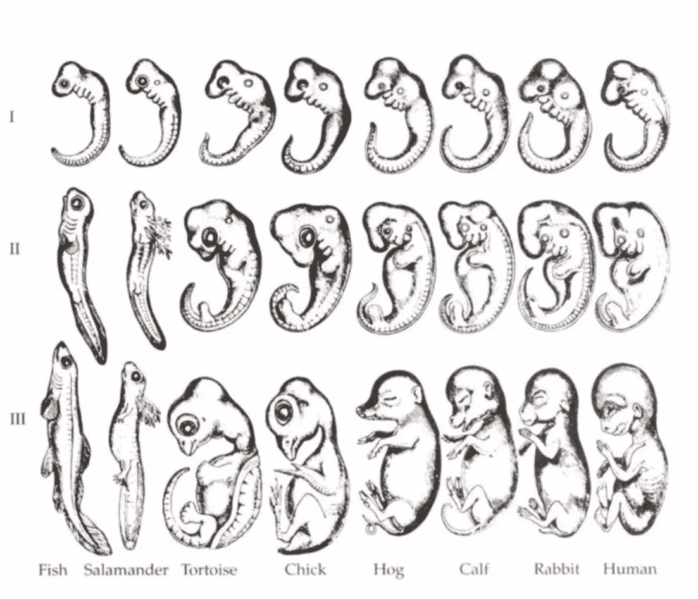

# 系统发育、个体发育和区块链

> 原文：<https://medium.com/hackernoon/phylogeny-ontogeny-and-blockchain-34147540cbfc>

Ernst Haeckel’s famous (and now debunked) embryology image.

在密歇根大学读大二的时候，我需要再上一门“荣誉”课才能获得额外的学位证书，但是我想要的课程不符合我的时间表。我已经选了“伟大的书籍”和“伟大的书籍 II”，我考虑的另一门课在周五早上有强制性讨论，这立即取消了资格。

这让我只有一个选择:一个名为“想象力”的 20 人研讨会。第一天，我对真正学习的前景抱有很低的期望，但对这门课程能给我的 GPA 带来什么抱有很高的期望——但随着课程开始，我的教授很快就纠正了我的这两种想法。在介绍完自己并凭记忆叫出班上每个人的名字后，他走到黑板前，写下了我所见过的最吓人的一句话:

> "个体发育概括了系统发育."

我的教授解释说，这个十三个音节三个单词的公式是基于生物学家艾伦斯特·赫克尔的研究成果，并将成为我们这门课的基本理念。你可能听说过海克尔著名的动物胚胎插图，在更进化的高级物种继续通过额外的阶段之前，它们开始发育看起来相似(见上文)。

**这幅画背后的概念是，个体创造的过程(“个体发育”)反映了物种创造的过程(“系统发育”)。**我从未意识到这与想象力有什么关系，但我找到了一种方法，将这个短语翻译成对明尼苏达人友好的英语: ***在大字体中发现的模式也经常在小字体中发现*** *。这意味着，例如，我们期望个体儿童的学习遵循全人类学习世界的方法。*

几年后，我现在已经忘记了大学里学的大部分东西。我不能告诉你太多关于人类进化解剖学的知识，我的西班牙语已经生疏了，尽管我记得我的微观经济学，但我总是要花很长时间才能记起 P 和 Q 位于哪个轴上。但尽管困难重重，海克尔的重演理论还是让我难以忘怀。

这是一个强有力的想法，我最近意识到它非常适用于我目前在区块链世界的工作。

2017 年，突然冒出了许多骗局初始硬币发行。大多数都是从一份白皮书和一个. io 域名开始的；甚至这个团队也是可有可无的，因为一些创始人[宁愿根本不存在](https://www.nytimes.com/2017/10/27/technology/how-floyd-mayweather-helped-two-young-guys-from-miami-get-rich.html)。许多人迅速抓住公众的想象力，宣称未来是田园式的、分散的，然后将这种关注武器化，通过 ICO 积累大量资本(T2 证券交易委员会刚刚宣布这种策略违反了证券法)。

这些团队获得的现金宝藏——通常为数千万美元——给这些项目带来了实现承诺的压力，但大多数项目都失败了。团队要么犹豫不决，不愿将这么多资金置于风险之中，要么陷入围绕这种重大财务决策的政治辩论，要么干脆带着通过欺诈获得的财富跑路。无论如何，不管是因为欺诈、黑客、骗局还是单纯的无能，这些大繁荣通常都以近乎彻底的崩溃而告终。

一个想法打动了我——我希望当你阅读上面的描述时也能打动你——那就是个人 ICO 的推出是区块链科技第一个十年更广阔旅程的缩影。在这两种情况下，总的趋势是从崇高的承诺到高期望再到崩溃。继 2017 年的 ICO 热潮——以及围绕它的所有粗略行为——之后，随着区块链泡沫的破裂，出现了大规模的崩盘。对交易员来说，在漫长而艰难的一年中，超过 7000 亿美元的加密货币总市值被摧毁，对许多人来说，那些去中心化的田园式未来的梦想也随之破灭。

当然，希望是区块链能重新抓住公众的想象力——系统发育可以偏离个体发育，区块链今天发现自己的墨守成规只是通往荣耀的路上的一个障碍，而不是最终埋葬的地方。我们最近看到了地平线上的“加密春天”，但从首次公开失败中完全恢复并不容易。当企业家试图利用区块链技术创造人们需要的产品时，他们将面临另一个挑战:在公众中挥之不去的不信任的余味。

*更多关于区块链和信托即将推出！我正在写一本名为《信任(少)》的书，将于今年晚些时候发行。在 Twitter 上关注我(* [*@cdkeil*](https://twitter.com/cdkeil) *)保持联系。*