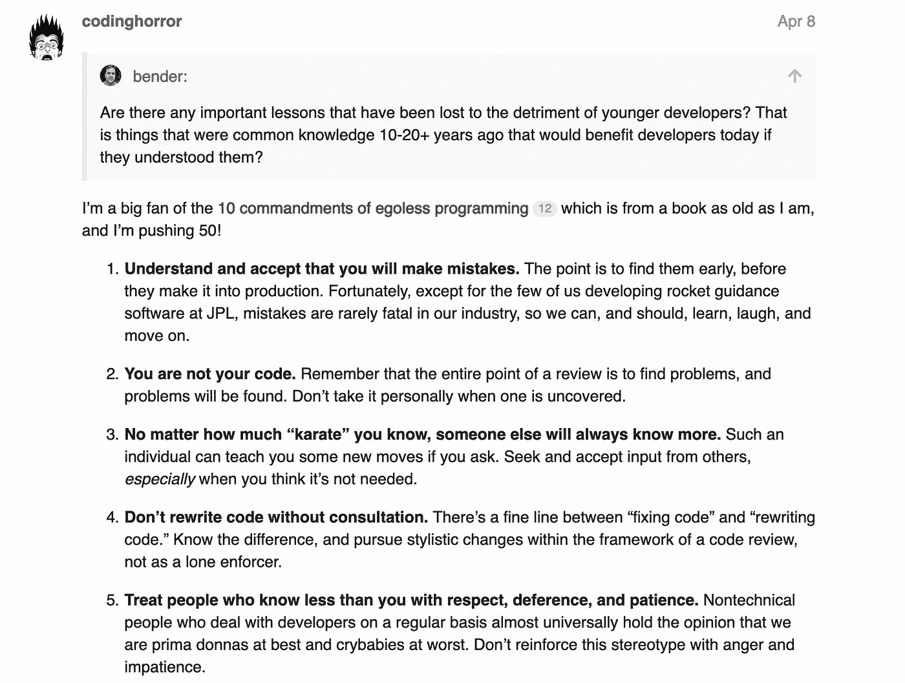
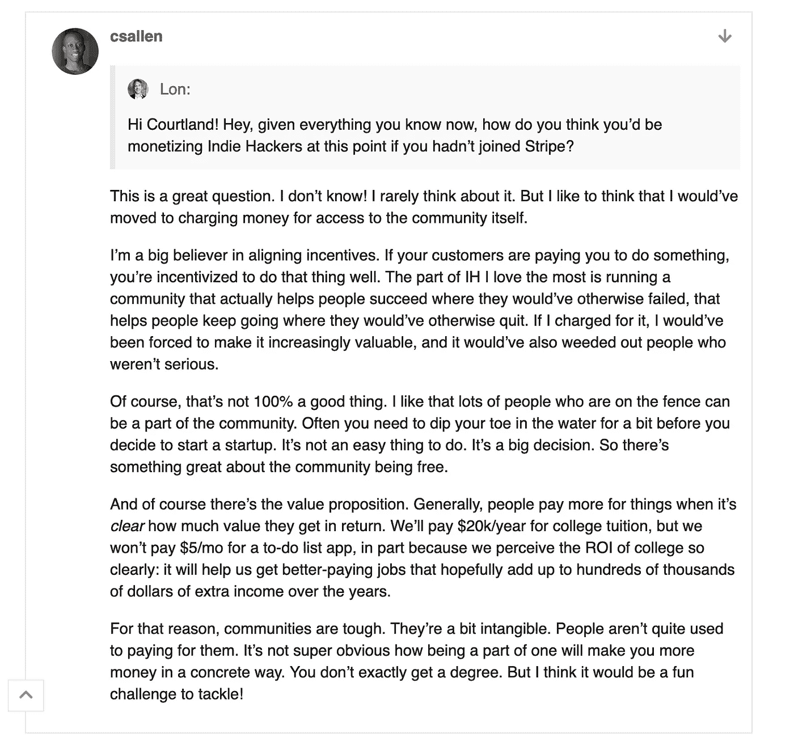
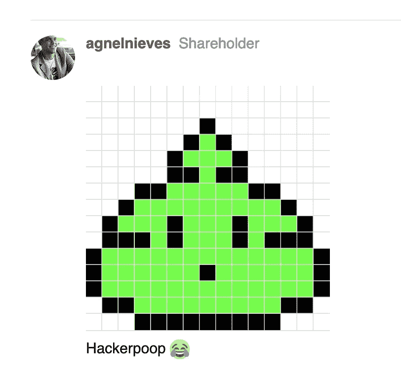
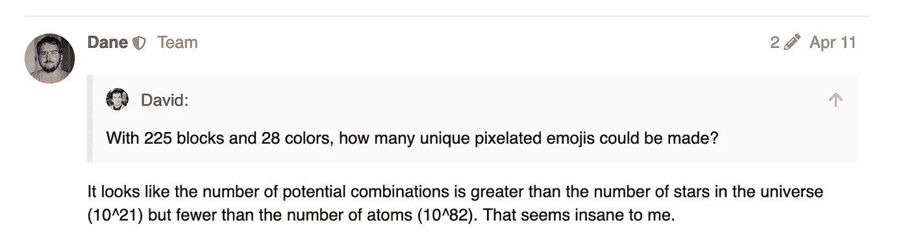
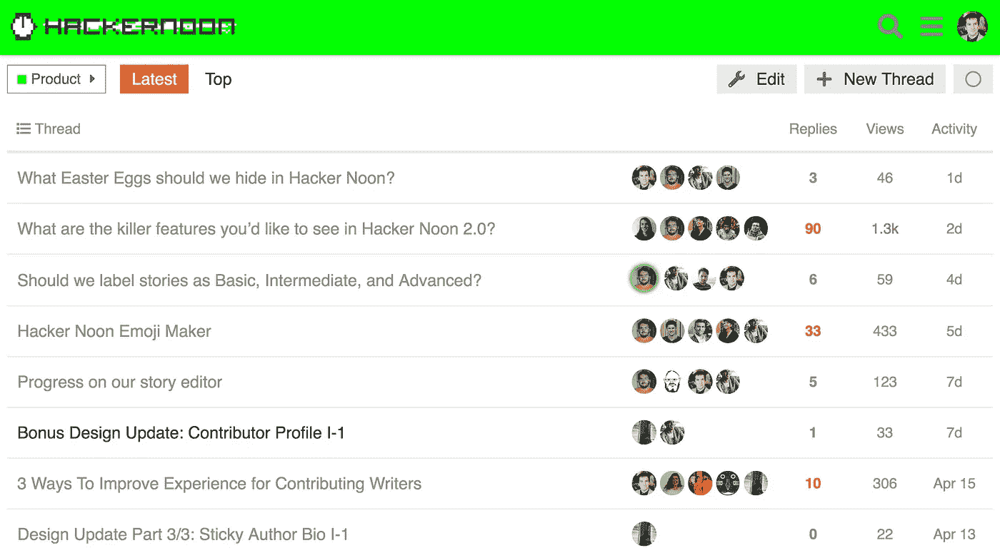
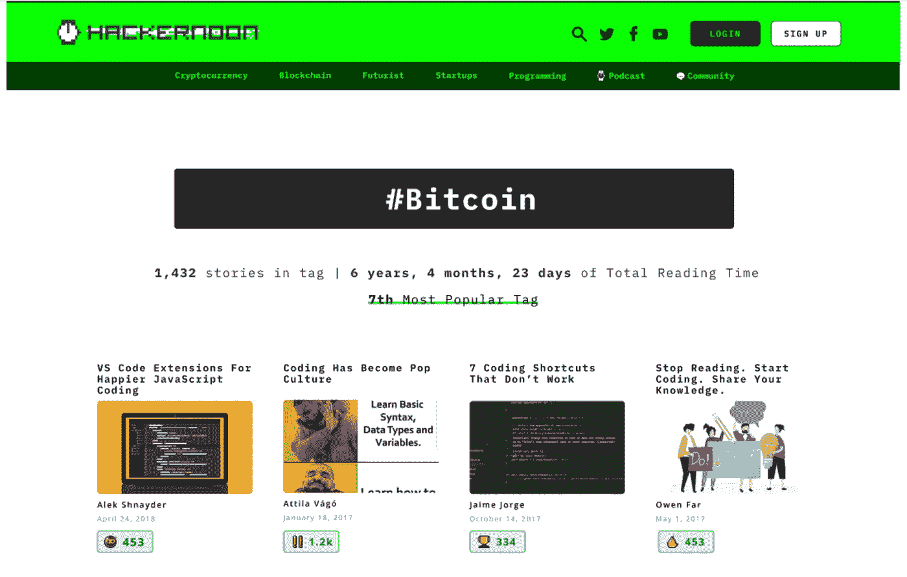
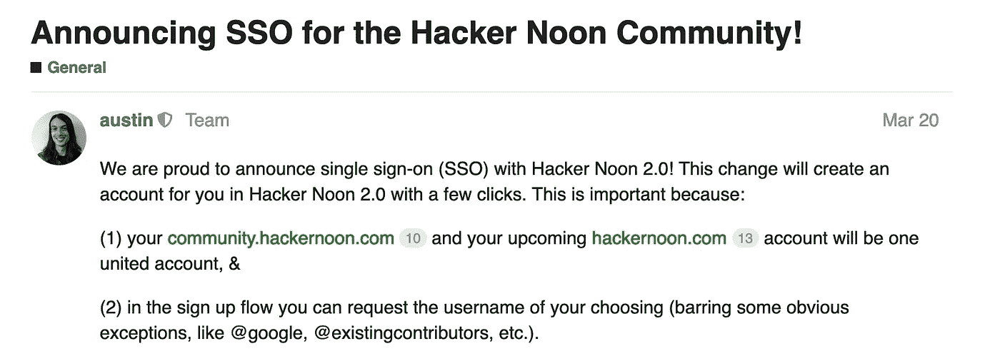

# 今天就像素化你自己的复古便便表情符号

> 原文：<https://medium.com/hackernoon/pixelate-your-own-retro-poop-emoji-today-44f45b36f57b>

## 以及本周[黑客正午社区](https://community.hackernoon.com/)带给你的其他不容错过的机会。

[Join community.hackernoon.com today](https://community.hackernoon.com)

我们推出[黑客正午社区](https://community.hackernoon.com)的公测版已经有一个月了。

总的来说，到目前为止:我们分享了彼此的[90 年代怀旧](https://community.hackernoon.com/t/what-relic-of-the-oldish-internet-tech-world-do-you-miss/2035)(神秘万岁！);试图宣布[世界上最好的全栈开发者](https://community.hackernoon.com/t/who-is-the-best-full-stack-developer/1562)(评审团还没有出来)；就社交媒体的非人性化效应展开了辩论(当然，这个社区并不如此)；问了对方一些涉及瑞克、莫蒂和生命意义的大问题。

ICYMI，这里有几个亮点，它正迅速成为黑客们最感兴趣的地方。

## 就职 [AMAs](https://community.hackernoon.com/t/i-am-jeff-atwood-codinghorror-co-founder-of-stack-overflow-and-discourse-ask-me-anything-4-8-noon-pst/1800) :杰夫·阿特伍德(Stack Overflow and Discourse 联合创始人)；考特兰·艾伦(独立黑客的创造者)

## 补看杰夫·阿特伍德的《AMA》:

## [查看完整的考特兰·艾伦·AMA 线程](https://community.hackernoon.com/t/im-courtland-allen-creator-of-indie-hackers-ask-me-anything-thu-apr-18-noon-pst/1945/14):

## 下一个我们应该让谁上场？ [**到这里来提名你今天梦寐以求的 AMA 嘉宾。**](https://community.hackernoon.com/t/ama-signup-nomination-thread/1101/3)

# 制作你自己的复古便便表情符号

我们正在为社区设计和贡献复古图标的工具。

从字面上看，可能性是无穷无尽的(点击[hackerpoop.com](http://hackerpoop.com)了解更多信息):

## [亲自尝试一下](https://ywq107vywv.codesandbox.io/)并将你的母校表情截图上传到[这个帖子](https://community.hackernoon.com/t/hacker-noon-emoji-maker/536)进行社区评论。

## 我们需要你的意见:[黑客正午 2.0 产品开发](https://community.hackernoon.com/c/product)

## 此外，看看这个策划的标签页 MVP 设计:

## [访问此主题，了解如何立即预订 Hacker Noon 2.0 手柄](https://community.hackernoon.com/t/announcing-sso-for-the-hacker-noon-community/1225):

您可以通过[发起一个主题或在对话中加入您的声音来为构建 Hacker Noon 2.0 做出贡献，就在这里。](https://community.hackernoon.com/c/product)

## 有点情绪化？我们已经有了一条线索。

## 黑客正午社区[想听听你洗澡时的技术想法](https://community.hackernoon.com/t/about-the-random-category/89)。

加入话语@[community.hackernoon.com](http://community.hackernoon.com)。

直到下一次，

黑客正午团队