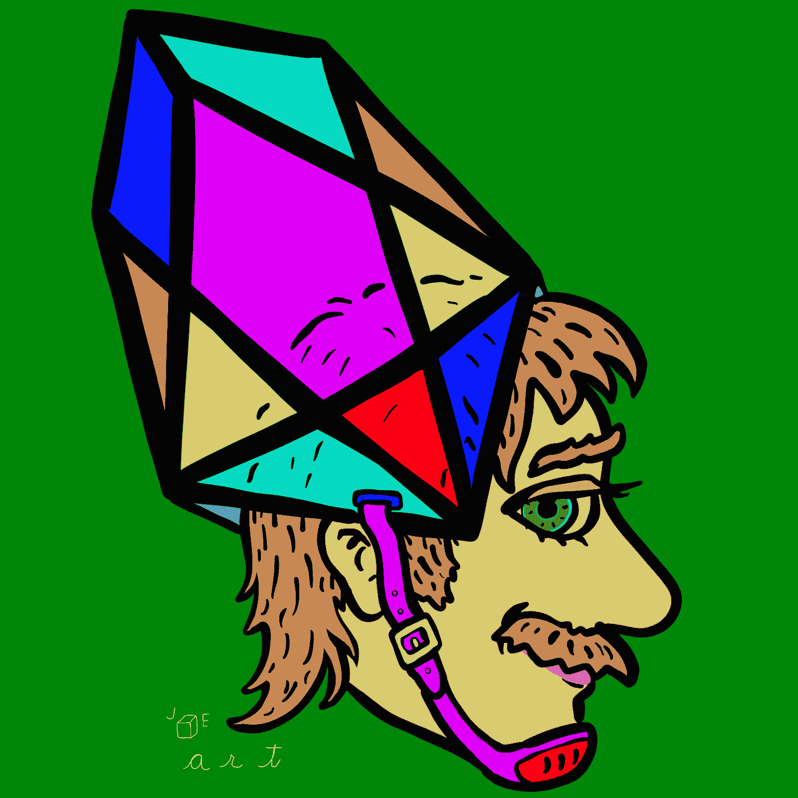

# 为数字时代重新定义艺术功能

> 原文：<https://medium.com/hackernoon/pixeos-redefines-art-functionality-for-the-digital-age-da6c83828c44>

[**The pixEOS hub.**](http://hub.pixeos.one)

## 随着技术的不断进步，艺术如何适应日益动态和数字化的环境？

当谈话中提到区块链技术时，话题往往会转向各种加密货币的市场势头。波动性可能会成为头条新闻或闲聊，但是再深入一点，就会有一个更广泛的用例列表，不仅仅是价格行为。

对于这个领域的一家初创公司来说，扩大加密货币的使用案例已经成为通往更大使命的道路上的一个主要焦点。艺术集体和游戏化的智能经济 pixEOS 一直在努力为艺术家、游戏玩家和收藏家创造一个平台，以从参与他们的生态系统中获得多重利益。他们正在最近开发的名为 EOS 的区块链上做这项工作。它类似于比特币，但具有更灵活的可编程性、更高的交易吞吐量，并免除用户交易费用。

为了最好地实现他们的目标，pixEOS 团队一直在与 EOS 社区中的许多合作伙伴一起为分散式应用程序开发一个通用协议。初创公司、风险资本家、艺术家、技术专家和志同道合的区块链公司之间的合作有可能彻底改变数字商品的世界。事实上，他们的集体成就已经改变了世界与一种叫做“稀有数字艺术”的新艺术形式的互动和价值。

# **数字时代的数字解决方案**

在数字时代，艺术的未来在于数字创新。一旦这种解决方案涉及到由基于区块链的系统驱动的艺术品销售，就可以在不需要中介的情况下从艺术家到收藏家之间即时传递。区块链上罕见的数字艺术使得这种交易成为可能。数字艺术现在可以加密绑定到一个基于区块链的分类账上的令牌和艺术元数据。通过这项技术，艺术家可以管理他们艺术的稀有性。他们可以发行独一无二的作品或限量版作品。有了区块链技术，数字稀缺现在可以被公开验证。这是艺术家和收藏家都想要的功能；现在它来了！

对于艺术爱好者来说，真实性就是一切。确定艺术品的出处通常是一项成本高昂的工作，因为这实质上是一件特定艺术品的指纹和所有权历史。在一个充斥着肉眼通常无法识别的赝品的市场中，一个围绕鉴定稀有艺术品的行业已经建立起来。控制这个行业价格的公司相对集中，而且，即使是专家也可能被愚弄。2018 年的一个最近的案例证明，通过现代应用的老化过程，一个 [**假杰森·布拉克可以卖到 1700 万美元**](https://www.cnbc.com/2018/08/16/think-you-can-spot-a-fraud-this-80-million-art-scam-fooled-experts.html) 。诸如此类的事件提醒我们，认证艺术品的传统方法还有许多不足之处。

# **象征性的智能经济**

帮助促进 pixEOS 艺术和游戏生态系统各个方面的是该平台的原生货币 PIXEOS Tokens。在拥有利用 pixEOs 代币的身份验证系统的艺术家入职后，他们将能够使用 PIXEOS 代币发行稀有的数字艺术，在大 PIXEOS 美术馆举办展览，以及用 PIXEOS 代币为他们的作品定价。收藏家将可以使用 pixEOS 代币在 PIXEOS 拍卖行对稀有的数字艺术进行投标，该拍卖行也将接受 PIXEOS 代币的上市费。

除了艺术，pixEOS 还看到了基于区块链资产的更广阔的游戏世界的潜力。在这个平台上推出的第一款游戏是 pixEOS paint。当你现在在数字画布上作画时，你可以赢得 PIXEOS 代币，或者击中价值 EOS 奖的 [**幸运像素**](https://trybe.one/lucky-pixels-launches-today-you-could-win-eos/) 。在不久的将来，您将能够在 PIXEOS 游戏中心玩许多不同的游戏，所有这些游戏都使用 pixEOS 代币并提供奖励。pixEOS 计划继续发布受社区最受欢迎的复古游戏启发的新原创游戏，为加密游戏玩家提供一个享受经典街机体验的地方。

如果您对被动加密收入感兴趣，通过赌注系统，PIXEOS 代币持有者可以下注代币，以获得额外 PIXEOS 代币和 EOS 的每日和每周奖励。这些奖励取决于平台的整体销量。很快，您将能够在我们合作伙伴的多个网络中交换 PIXEOS 代币，因此保持代币赌注的奖励可能会随着时间的推移而增值。然而，请始终记住，加密货币是相对较新的技术，价格可能会波动。

# **在繁荣的生态系统中合作**

pixEOS 已经用区块链支持的资产为各种应用程序之间的互操作性奠定了基础。我们的 [**pixEOS 头像制作者**](https://avatar.pixeos.art) 将数据点与 EOS 账户相关联，并将其存储在 EOS 区块链上，其他网站可以参考这些数据点，以便在他们的平台上显示该账户的头像。pixEOS 头像制作者是 [**，已经集成了**](https://trybe.one/pixeos-avatar-maker-implemented-in-eos-dapps/ref/5220) 和一些 EOS 应用，包括 [**骰子**](http://dice.one) 、 [**bloks.io**](http://bloks.io) 和[**EOS 支出**](http://eospayout.com) 。

区块链技术有许多令人兴奋的、创造性的和有用的应用。pixEOS 只触及了区块链支持的资产的表面，这个团队才刚刚起步。要了解更多关于 pixEOS 项目的信息，参与其中，或询问成为合作伙伴的事宜，请通过[**info @ pixEOS . io**](http://info@pixeos.io)与我们联系。

**pixEOS 官方链接:**

[**网站**](http://pixeos.io) **|** [**推特**](https://twitter.com/eos_pix) **|** [**电报**](https://t.me/PIXEOS)**|**[**Trybe**](https://trybe.one/members/pixeos/wall/)