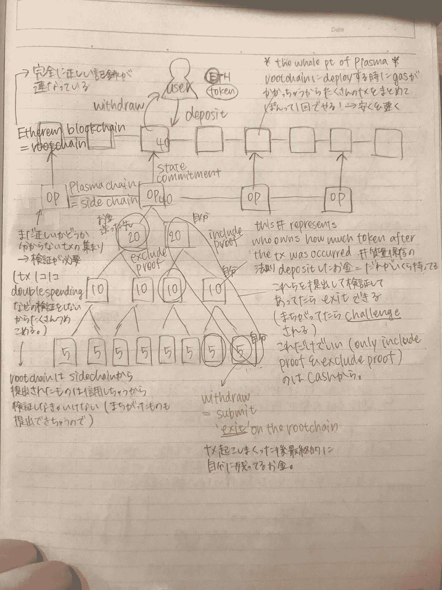

# 区块链可扩展性研究实验室实习生指导的血浆研究

> 原文：<https://medium.com/hackernoon/plasma-study-guide-by-an-intern-at-a-blockchain-scalability-research-lab-a200c3cc9b3c>

## 初看可伸缩性问题

区块链的可扩展性和一整套解决问题的方案——这是你应该在这个领域重点学习的最基本的方面之一，但对于新手来说，要掌握所有这些似乎不太容易。这就是我所看到的所有扩展解决方案。

当我第一次了解区块链科技(更确切地说是以太坊区块链)时，我真的被所有的去中心化应用及其背后的哲学迷住了，梦想着以太坊创造的 Web3.0。尽管我知道可伸缩性是运行项目时要考虑的最重要的标准之一(现在，我将跳过对它的解释，但您可以参考一篇文章[这里](https://hackernoon.com/blockchains-dont-scale-not-today-at-least-but-there-s-hope-2cb43946551a)来了解这个问题的来源和重要性)，我一直在远离这个主题，因为对于只关注应用层的人来说，要完全理解它似乎太难了。

## 得到了专业研究人员的建议

然而，自从我开始自己阅读关于等离子体的在线资源后，我周围来自 [**密码经济实验室**](https://www.cryptoeconomicslab.com/) 的专业等离子体研究人员向我提出了一个非常平易近人的方法，让完全的初学者从零开始学习等离子体。他们给我提供了一大堆文章参考资料，并给出了正确的阅读顺序。他们甚至从初学者的角度全面了解这个主题，因为他们目前正在努力实现一个名为“等离子体室”的离线交易验证协议，以指导任何工程师在等离子体基础上轻松开发自己的 Dapp。他们正在开发的源代码可以通过他们的 [Github 页面](https://github.com/cryptoeconomicslab)找到。

我想在这里与所有区块链的中间用户分享他们的全面指导，他们对应用层了解很多，但又想深入了解协议层的情况。所以让我们开始吧！

## 血浆研究指南框架

首先，你要知道等离子体的整体结构，以及文章所谈论的部分。作者在文章中集中讨论了各种特定的主题，但是本质上你可以把它们分成几个类别，所以让我们把整个系统分解成如下 3 个部分；

**1。以太坊作为根链- >基于 UTXO 的带有 Merkle 树的子链**

要点:您可以通过将所有事务放在一个 Merkle 树中而不验证它们，并且只将它的 Merkle 散列提交到根链(以太坊链)上来降低 gas 成本。Merkle 散列必须在每个块生成后提交给根链，以便子链(您的部分余额)上的 UTXO 属于某个块高度。

**2。Merkle 树- >退出程序**

重要的一点:因为你只需要在退出 childchain 时验证每笔交易(这样你就可以减少汽油费用！)，除非您能以有效的方式检查这些交易，否则 childchain PoA 单一操作员组可能会发布不正确的交易信息。已经有许多研究讨论如何降低其检测成本。

**3。退出程序- >可用性/用户体验；旨在采用等离子(作为其最终目标！)**

要点:考虑退出程序，需要准备多长时间的挑战期？

除了获得整个画面并理解其中的每个类别，你还应该知道，在阅读文章时，绘图将真正帮助你清楚地可视化整个系统是如何工作的。相信我，这肯定比想象你头脑中错综复杂的系统要好，它会防止你迷失方向。

my handwritten notes while struggling to gain more insight

## 有用的学习工具

第二，你应该记住，有许多不同类型的方法，等离子体研究项目正在使用；有一张地图列出了目前正在研究的所有不同种类的等离子体项目，并按照分支对每个项目进行了分类，如它们是如何从以前的提议演变而来的利弊以及每个项目实施的具体目的。你可以在这里查阅一篇文章了解更多信息； [**等离子世界地图**](/onther-tech/plasma-world-map-ba8810276bf2)

这是众多研究中两个主要类别的良好起点；本文强调的简单转移和一般状态&计算。

您还应该注意到，每个项目都在不断发展，因此该图可能无法完美地反映每个项目的当前状态，但它肯定会帮助您了解每个项目是如何从以前的解决方案的弱点(缺点)发展而来的，以及在下一个建议的解决方案中对其的缓解。

第三，你应该有一本“字典”,你可以随时在可信的来源中查找你不知道的术语； [**掌握以太坊**](https://github.com/ethereumbook/ethereumbook)

## 可信的消息来源

现在，在开始研究血浆之前，您已经做好了一切准备。以下是你应该用来研究血浆的所有可靠来源

*   **学习等离子**:它将让你学习两个主要的基于 UTXO 的解决方案，追求简单的传送。https://www.learnplasma.org/en/learn/
*   **以太坊研究**:在“等离子体”类别下，有一大堆被提议的等离子体方案，它们的标题是由研究团队的核心成员编辑的“等离子体 xx”。[https://ethresear.ch/c/plasma](https://ethresear.ch/c/plasma)
*   Ethererum 基金会的核心开发人员在等离子 Youtube 频道上发布的一系列视频，'**等离子实施者称之为**。[https://www.youtube.com/channel/UCG2MeKuKDJRK4gFNk-dQuZQ](https://www.youtube.com/channel/UCG2MeKuKDJRK4gFNk-dQuZQ)

我自己仍然在对血浆的完全理解的漫长旅程中，所以如果你对如何继续学习有任何建议/更好的想法，请留下任何评论。谢谢大家！

 [## 百合子(@yuriks_official) |推特

### 百合子的最新推文(@yuriks_official)。东京的区块链社区建设者；实习生@CELjapan，联合创始人…

twitter.com](https://twitter.com/yuriks_official)