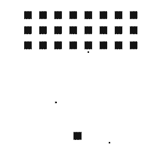

# 用自己的声音玩太空入侵者

> 原文：<https://medium.com/hackernoon/playing-space-invaders-with-your-own-voice-f0bc7581e9bc>

[Photo by Andre Hunter](https://unsplash.com/photos/ndyfVMhl8qI)

在我的 Alexa 设备上测试语音游戏一段时间后，我想到了一个问题…

> 为什么不试着把经典的游戏控制系统转换成语音用户界面呢？

所以让我们用 Javascript 编写的太空入侵者做一个简单的实验。

Final result (Kind of)

走了一圈之后，为了达到目标，我列出了一个需求清单:

*   [语音识别](https://cloud.google.com/speech-to-text/)
*   [语音合成](https://www.ibm.com/watson/services/text-to-speech/)
*   一个 [NLU](https://dialogflow.com) 或者一套硬编码规则来匹配我的话语和意图
*   实现网络对这些意图的反应

好吧，一旦我或多或少地清楚了我在找什么，我就用第二个工程师的教训:不要重新发明轮子。所以，我再一次对谷歌耳语了一些东西，它把我带到了一个叫做 [Woice](https://www.woice.live/) 的地方。

当我浏览了创建一个新应用程序的教程后，我在 HTML 上加载了 SDK 脚本，并在太空入侵者控制系统上画了几行代码。

这几行可以用三个概念来解释:**处理程序**、**实例**和**语音识别触发器。**

第一个概念是**句柄**，它由两个函数组成: **canHandle** ，它决定是否应该执行第二个函数**句柄**的代码。

我知道，如果我们有一些有形的东西会更容易些:

Handler Definition

上面的代码非常简单:当我们在 Dialogflow 代理(这是 Woice 支持的 NLU)中匹配意图“moveRight”时，我们触发 GlobalActionState。右=真。

第二个概念是**实例**，一旦我们定义了我们的处理程序，我们将使用它们构建一个 Woice 实例。

Instantiation

而最后一个，我们要附加一个**语音识别触发器。**在本例中，我们将此事件与 control+B 键盘组合相关联。

Recognition Binding

最终可编辑的结果是:

 [## 太空入侵者

### 编辑描述

woice-invaders.glitch.me](https://woice-invaders.glitch.me) 

这肯定不是最好的用例(游戏需要实时动作，所以它不太适合语音)，但是，从另一方面来说，我花了更多的时间，我愿意承认。

如果您有任何问题、评论或简单的项目想与我分享，我很高兴收到您的来信:)。