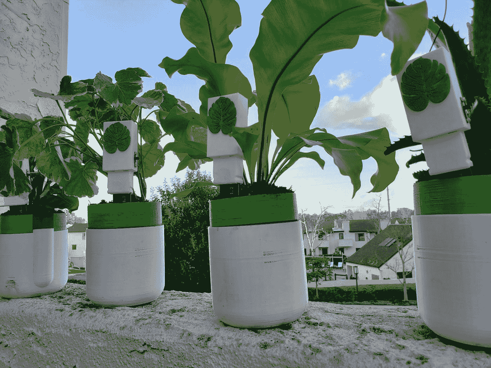
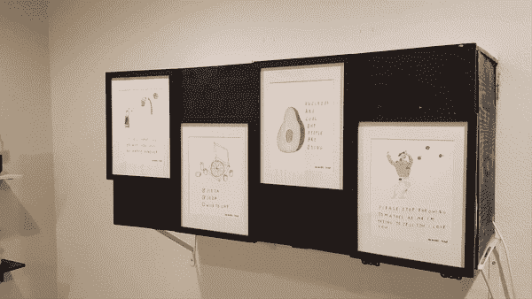
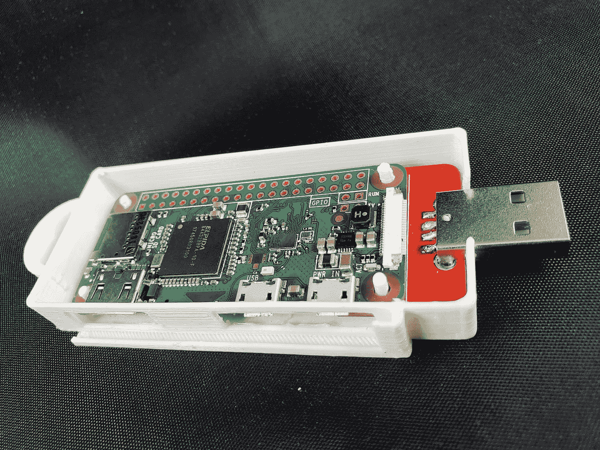

# 与自己玩耍:个人项目的力量

> 原文：<https://medium.com/hackernoon/playing-with-yourself-the-power-of-personal-projects-206047344121>

7 Node Raspberry Pi SkyMiner — [https://www.hackster.io/nick-engmann/56f3cb](https://www.hackster.io/nick-engmann/56f3cb)

“请为我的儿子祈祷，”这是我母亲每次来我在圣地亚哥的公寓时的口头禅。我的家庭实验室由音频、视频和电源线组成。飘忽的眼神会发现自己穿越了电阻、烙铁、微控制器、无人机、机器人宠物，甚至更多[机器人宠物](https://www.youtube.com/watch?v=iG9weWqeXtQ)。她有点担心，这当然不足为奇。撇开我母亲的意见不谈；在开发人员社区中，个人项目可以被视为强化不良实践以及时间和金钱的不良投资的方式。甚至我也注意到我在网上组织的 [Instagram 帖子可能会被误解为危险信号。但是我相信我所做的个人项目已经帮助我成为一个更好、更有创造力、更足智多谋的工程师。](https://www.instagram.com/p/BYojB0yBAGD/)

In-Plant Plant Monitor — [https://www.hackster.io/nick-engmann/1a17f6](https://www.hackster.io/nick-engmann/in-plants-plant-soil-monitor-powered-by-particle-mesh-1a17f6)

个人项目是你在工作之外投入时间和精力去创造的东西。这个项目的目的可以是任何事情——完成或自动完成一项任务，证明一个政治观点，提高你的技能集，或产生艺术。例如，为了停止杀害我美丽的室内植物，我建立了一个网状网络设备来监控它们的水位，称为[室内植物](https://www.hackster.io/nick-engmann/in-plants-plant-soil-monitor-powered-by-particle-mesh-1a17f6)。在我的职业生涯中还有一个阶段，我想提高我的软件开发技能，所以我帮助开发了面向开发人员的[抽认卡](https://flashcardsfordevelopers.com)——一个免费的网络应用程序，帮助开发人员使用抽认卡准备面试。然而，在我的收藏中有很多不光彩的个人项目，包括我的[火绒自动刷](https://www.youtube.com/watch?v=kr481yiGu38)、 [cosplay 项目](https://www.instagram.com/p/BpdfrgjDF6j/)，当然还有我的 [Nerf 炮塔](https://www.youtube.com/watch?v=nAbe4CN_NfY&list=PLm2pid0RY5dEpCS_2eUWyErOQre9ZqB6Z)。如果有的话，在我的公寓里有一个完全自主可部署的 nerf 炮塔是我妈妈为虚弱和行动缓慢的家庭入侵者祈祷的原因，而不是我。

Nerf Turret Defense System — [https://www.hackster.io/quodcertamine/a50dd1](https://www.hackster.io/quodcertamine/nerf-alexa-home-defense-turret-a50dd1)

我的实际项目和完全不切实际的项目都是由同一个动机推动的:这很有趣。思考酷的、独特的问题，并设计一个解决方案在几周内解决它们，就像跑一场马拉松，而你要设计赛道。你开始时新鲜而天真，不知道你的创造力和足智多谋的极限会在第一次冲刺结束时耗尽。你所面临的经验或技能差距会成为障碍，在做了必要的研究之后，你会学会迅速避开它们。通常，当你展示你所学到的或创造的东西时，在途中和终点都有一个支持你的社区。最重要的是，你总是会赢，因为你会带着独一无二的奖杯——你的个人项目——离开。即便如此，真正的回报也不是你最终得到的东西，而是你在过程中获得的技能提升。许多人已经在工作中获得了这种成长、自由和创造力，但个人项目提供了一种很难复制的独特体验。

在过去的 3 年里，我从事过各种全职工程工作，这些工作帮助我发展了一些技能，我利用这些技能完成了我创建的一些项目。但是工作，尤其是工程工作，是非常二维的。有你必须坚持的时间表，有你不能突破的预算，很多时候你受限于你能为一个项目增加的个人创造力的数量。我目前在一个研发团队工作，该团队的任务是构思和创造独特的网络安全工具。但是到了最后，如果我的团队的想法对大众有帮助，但是没有销路，公司可以阻止我们去实现它们。个人项目把权力还给个人。你为你的千变万化的杰作设定的目标，你想花多长时间就花多长时间，想花多少钱就花多少钱。

Flashcards for Developers — [https://flashcardsfordevelopers.com](https://flashcardsfordevelopers.com)

我从朋友那里得到的最常见的问题之一是“我如何开始？”。这里列出了一些有用的资源，其中大部分都给了我很大的帮助:

***为硬件项目思路:***

*   [Adafruit](http://adafruit.com) —一个绝佳的网站，不仅可以购买硬件，还可以找到专业制作的项目教程。
*   Hackster——一个伟大的网站，充满了关于如何复制有趣的个人项目的社区来源的教程。
*   [Instructables](http://instructables.com/tag/type-id/category-technology/) —另一个寻找如何复制个人项目的工具。
*   [Hackaday](https://hackaday.com) —关于硬件项目的每日博文。从网络安全到街机。

***硬件项目 Youtube 频道:***

*   [Greatscottlab](https://www.youtube.com/channel/UC6mIxFTvXkWQVEHPsEdflzQ)
*   西蒙·吉尔兹
*   [Eevblog](https://www.youtube.com/channel/UC2DjFE7Xf11URZqWBigcVOQ)
*   [电动吊杆](https://www.youtube.com/channel/UCJ0-OtVpF0wOKEqT2Z1HEtA)
*   迈克尔·里维斯
*   威廉·奥斯曼
*   [新精神科技](https://www.youtube.com/channel/UCrjKdwxaQMSV_NDywgKXVmw)
*   黑客攻击

***硬件知识的指导性文献***

*   Mims III，电子入门
*   普拉特，制造:电子
*   Geier，如何诊断和修理所有电子设备
*   凯贝特&博伊森，全新电子自学指南

***对于软件项目的思路:***

*   [http://producthunt.com/](http://producthunt.com/)—让用户发现并分享新项目。
*   [https://hackr.io](https://hackr.io) —一个众包的学习语言和库的教程集合(忽略赞助的东西，看看 upvotes)。

***软件项目 YouTube 频道:***

*   [新波士顿](https://www.youtube.com/user/thenewboston)**——他的视频有点过时，但在解决问题时，它们提供了坚实的基础思维。**
*   **【https://www.youtube.com/watch?v=UnTQVlqmDQ0[—对 2019 年 Web 开发的深刻理解。](https://www.youtube.com/watch?v=UnTQVlqmDQ0)**

*****软件项目的指导性文献:*****

*   **[Awesome 列表](https://github.com/sindresorhus/awesome)——所有你想了解的软件资源**
*   **https://developer.mozilla.org/en-US/docs/Learn[——HTML/CSS/JS 和 Node.js 或 Django 的好入门。](https://developer.mozilla.org/en-US/docs/Learn)**
*   **【https://www.freecodecamp.org——课程包括 HTML/CSS/JS、React、Node.js、Express 和 MongoDB。**
*   **https://javascript.info —为 javascript 提供坚实基础的课程**
*   **[https://learnxinyminutes.com](https://learnxinyminutes.com)——许多不同语言语法的快速参考表(通常它们本身不足以学习某些东西，但非常有帮助)。**
*   **[https://pastebin.com/gfBPg24A](https://pastebin.com/gfBPg24A)—一切 PHP。**

*****公共学习环境:*****

*   **[大联盟黑客](http://mlh.io):如果你是高中生或者大学生，这些[黑客马拉松](https://en.wikipedia.org/wiki/Hackathon)就是为你量身定做的！**
*   **网络聚会:黑客马拉松。在大联盟黑客之外还有很多组织黑客马拉松，Meetup 是找到它们的一个很好的资源。**
*   **美国旅的代号倡议。许多人不愿意投资一个没有实际实现的项目。Code For America 是一个由开发者、设计师和创意者组成的全国性组织，他们希望聚在一起创建项目来帮助当地社区。**

****

**Raspberry Pi Zero W Network Access Storage Device — [https://www.hackster.io/135000/3f47be](https://www.hackster.io/135000/subzero-a-simple-network-attached-storage-device-3f47be)**

**我上面列出的这些资源和社区都帮助了我。在过去的三年里，我遇到了令人难以置信的人，学到了很多东西，并能够完成 30 多个个人项目。虽然我承认我最初的几个项目是只有母亲才会喜欢的，但我相信我创造的越多，我就会成为一名更好的工程师。所以我鼓励你迈出第一步，开始创造，不管你想做什么。要知道，如果你爱的人开始为你和你的机器宠物军团祈祷，你并不孤单。**